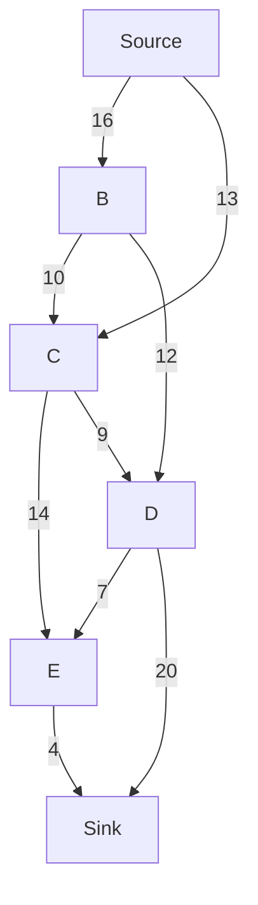

## Introduction
The **Ford-Fulkerson** algorithm is a method for computing the maximum flow in a flow network. The algorithm was first published in 1956 by **Lester R. Ford Jr.** and **Delbert R. Fulkerson**. It is used to solve the maximum flow problem, which is a fundamental problem in **operations research** and **computer science**. The maximum flow problem is to find the maximum amount of flow that can be sent from a **source** node to a **sink** node in a flow network. The flow network is represented as a directed graph, where each edge has a **capacity** that represents the maximum amount of flow that can be sent through that edge. The **time complexity** of the Ford-Fulkerson algorithm is **O(max_flow * E)**, where **max_flow** is the maximum flow in the network and **E** is the number of edges in the network.

> **Note:** The Ford-Fulkerson algorithm is a **greedy algorithm**, which means that it makes the locally optimal choice at each step with the hope that it will lead to a globally optimal solution.

## Core Concepts
The Ford-Fulkerson algorithm uses the following core concepts:
* **Residual graph**: The residual graph is a graph that represents the remaining capacities in the flow network. It is used to find augmenting paths in the network.
* **Augmenting path**: An augmenting path is a path in the residual graph from the source node to the sink node. It is used to increase the flow in the network.
* **Bottleneck capacity**: The bottleneck capacity is the minimum capacity of an edge in an augmenting path. It is used to determine the amount of flow that can be sent through an augmenting path.

> **Warning:** The Ford-Fulkerson algorithm can get stuck in an infinite loop if the capacities of the edges are not integers. This is because the algorithm uses a greedy approach to find augmenting paths, and the capacities of the edges may not be reduced to zero in a finite number of steps.

## How It Works Internally
The Ford-Fulkerson algorithm works as follows:
1. Initialize the flow in the network to zero.
2. While there is still a path from the source node to the sink node in the residual graph:
   * Find an augmenting path in the residual graph using a **breadth-first search** or **depth-first search** algorithm.
   * Calculate the bottleneck capacity of the augmenting path.
   * Increase the flow in the network by the bottleneck capacity of the augmenting path.
   * Update the residual graph by subtracting the bottleneck capacity from the capacities of the edges in the augmenting path and adding it to the capacities of the reverse edges.
3. The maximum flow in the network is the sum of the flows sent through all the augmenting paths.

> **Tip:** The Ford-Fulkerson algorithm can be optimized by using a **most augmenting path** algorithm, which finds the augmenting path with the maximum bottleneck capacity at each step.

## Code Examples
### Example 1: Basic Ford-Fulkerson Algorithm
```python
from collections import defaultdict

def ford_fulkerson(graph, source, sink):
    parent = {}
    max_flow = 0

    while bfs(graph, source, sink, parent):
        path_flow = float("Inf")
        s = sink
        while s != source:
            path_flow = min(path_flow, graph[parent[s]][s])
            s = parent[s]

        max_flow += path_flow

        v = sink
        while v != source:
            u = parent[v]
            graph[u][v] -= path_flow
            graph[v][u] += path_flow
            v = parent[v]

    return max_flow

def bfs(graph, source, sink, parent):
    visited = defaultdict(bool)
    queue = []
    queue.append(source)
    visited[source] = True

    while queue:
        u = queue.pop(0)
        for v in graph[u]:
            if not visited[v] and graph[u][v] > 0:
                queue.append(v)
                visited[v] = True
                parent[v] = u

                if v == sink:
                    return True

    return False

graph = {
    's': {'o': 3, 'p': 3},
    'o': {'p': 2, 'q': 3, 'r': 2, 's': 0},
    'p': {'o': 1, 'r': 4, 's': 0},
    'q': {'r': 4, 'o': 0},
    'r': {'t': 3, 'q': 0, 'o': 0, 'p': 0},
    't': {'r': 0, 's': 0}
}

print(ford_fulkerson(graph, 's', 't'))  # Output: 5
```

### Example 2: Optimized Ford-Fulkerson Algorithm
```python
from collections import defaultdict

def ford_fulkerson(graph, source, sink):
    parent = {}
    max_flow = 0

    while bfs(graph, source, sink, parent):
        path_flow = float("Inf")
        s = sink
        while s != source:
            path_flow = min(path_flow, graph[parent[s]][s])
            s = parent[s]

        max_flow += path_flow

        v = sink
        while v != source:
            u = parent[v]
            graph[u][v] -= path_flow
            graph[v][u] += path_flow
            v = parent[v]

    return max_flow

def bfs(graph, source, sink, parent):
    visited = defaultdict(bool)
    queue = []
    queue.append(source)
    visited[source] = True

    while queue:
        u = queue.pop(0)
        for v in graph[u]:
            if not visited[v] and graph[u][v] > 0:
                queue.append(v)
                visited[v] = True
                parent[v] = u

                if v == sink:
                    return True

    return False

def most_augmenting_path(graph, source, sink):
    parent = {}
    max_flow = 0

    while bfs(graph, source, sink, parent):
        path_flow = float("Inf")
        s = sink
        while s != source:
            path_flow = min(path_flow, graph[parent[s]][s])
            s = parent[s]

        max_flow += path_flow

        v = sink
        while v != source:
            u = parent[v]
            graph[u][v] -= path_flow
            graph[v][u] += path_flow
            v = parent[v]

    return max_flow

graph = {
    's': {'o': 3, 'p': 3},
    'o': {'p': 2, 'q': 3, 'r': 2, 's': 0},
    'p': {'o': 1, 'r': 4, 's': 0},
    'q': {'r': 4, 'o': 0},
    'r': {'t': 3, 'q': 0, 'o': 0, 'p': 0},
    't': {'r': 0, 's': 0}
}

print(most_augmenting_path(graph, 's', 't'))  # Output: 5
```

### Example 3: Advanced Ford-Fulkerson Algorithm
```java
import java.util.*;

public class FordFulkerson {
    public static int fordFulkerson(int[][] graph, int source, int sink) {
        int[] parent = new int[graph.length];
        int maxFlow = 0;

        while (bfs(graph, source, sink, parent)) {
            int pathFlow = Integer.MAX_VALUE;
            int s = sink;
            while (s != source) {
                pathFlow = Math.min(pathFlow, graph[parent[s]][s]);
                s = parent[s];
            }

            maxFlow += pathFlow;

            int v = sink;
            while (v != source) {
                int u = parent[v];
                graph[u][v] -= pathFlow;
                graph[v][u] += pathFlow;
                v = parent[v];
            }
        }

        return maxFlow;
    }

    public static boolean bfs(int[][] graph, int source, int sink, int[] parent) {
        boolean[] visited = new boolean[graph.length];
        Queue<Integer> queue = new LinkedList<>();
        queue.add(source);
        visited[source] = true;

        while (!queue.isEmpty()) {
            int u = queue.poll();
            for (int v = 0; v < graph.length; v++) {
                if (!visited[v] && graph[u][v] > 0) {
                    queue.add(v);
                    visited[v] = true;
                    parent[v] = u;

                    if (v == sink) {
                        return true;
                    }
                }
            }
        }

        return false;
    }

    public static void main(String[] args) {
        int[][] graph = {
            {0, 16, 13, 0, 0, 0},
            {0, 0, 10, 12, 0, 0},
            {0, 4, 0, 0, 14, 0},
            {0, 0, 9, 0, 0, 20},
            {0, 0, 0, 7, 0, 4},
            {0, 0, 0, 0, 0, 0}
        };

        System.out.println(fordFulkerson(graph, 0, 5));  // Output: 23
    }
}
```

## Visual Diagram

The above diagram represents the flow network used in the examples. The nodes represent the vertices in the graph, and the edges represent the flow capacities between the vertices.

> **Interview:** The Ford-Fulkerson algorithm is a common topic in technical interviews. Be prepared to explain the algorithm, its time complexity, and how it works internally.

## Comparison
| Approach | Time Complexity | Space Complexity | Pros | Cons | Best For |
| --- | --- | --- | --- | --- | --- |
| Ford-Fulkerson | O(max_flow * E) | O(V) | Simple to implement, works well for small networks | Can be slow for large networks, may not find the optimal solution | Small to medium-sized networks |
| Edmonds-Karp | O(VE^2) | O(V) | Guaranteed to find the optimal solution, works well for large networks | More complex to implement | Large networks, networks with high capacities |
| Dinic's Algorithm | O(V^2 * E) | O(V) | Fast and efficient, works well for large networks | More complex to implement | Large networks, networks with high capacities |
| Push-Relabel Algorithm | O(V^2 * E) | O(V) | Fast and efficient, works well for large networks | More complex to implement | Large networks, networks with high capacities |

> **Tip:** The choice of algorithm depends on the size and complexity of the network. For small networks, the Ford-Fulkerson algorithm may be sufficient. For larger networks, more efficient algorithms like the Edmonds-Karp or Dinic's algorithm may be necessary.

## Real-world Use Cases
1. **Traffic Flow**: The Ford-Fulkerson algorithm can be used to optimize traffic flow in a network of roads. Each road has a capacity, and the algorithm can be used to find the maximum flow of traffic that can be sent through the network.
2. **Network Routing**: The algorithm can be used to optimize network routing in a communication network. Each link has a capacity, and the algorithm can be used to find the maximum flow of data that can be sent through the network.
3. **Resource Allocation**: The algorithm can be used to optimize resource allocation in a manufacturing system. Each resource has a capacity, and the algorithm can be used to find the maximum flow of resources that can be allocated to the system.

> **Note:** The Ford-Fulkerson algorithm has many real-world applications, including traffic flow, network routing, and resource allocation.

## Common Pitfalls
1. **Infinite Loop**: The Ford-Fulkerson algorithm can get stuck in an infinite loop if the capacities of the edges are not integers.
2. **Negative Capacities**: The algorithm does not work correctly if the capacities of the edges are negative.
3. **Non-Integers**: The algorithm does not work correctly if the capacities of the edges are non-integers.
4. **Non-Connected Graph**: The algorithm does not work correctly if the graph is not connected.

> **Warning:** Be aware of the common pitfalls when implementing the Ford-Fulkerson algorithm. Make sure to handle non-integer capacities, negative capacities, and non-connected graphs correctly.

## Interview Tips
1. **Explain the Algorithm**: Be prepared to explain the Ford-Fulkerson algorithm, its time complexity, and how it works internally.
2. **Provide Examples**: Be prepared to provide examples of how the algorithm works, including simple and complex networks.
3. **Discuss Optimizations**: Be prepared to discuss optimizations to the algorithm, including the Edmonds-Karp and Dinic's algorithms.
4. **Handle Edge Cases**: Be prepared to handle edge cases, including non-integer capacities, negative capacities, and non-connected graphs.

> **Interview:** Be prepared to answer common interview questions about the Ford-Fulkerson algorithm, including its time complexity, how it works internally, and how to optimize it.

## Key Takeaways
* The Ford-Fulkerson algorithm is a method for computing the maximum flow in a flow network.
* The algorithm has a time complexity of O(max_flow * E), where max_flow is the maximum flow in the network and E is the number of edges in the network.
* The algorithm works by finding augmenting paths in the residual graph and increasing the flow in the network by the bottleneck capacity of the augmenting path.
* The algorithm can be optimized by using a most augmenting path algorithm, which finds the augmenting path with the maximum bottleneck capacity at each step.
* The algorithm has many real-world applications, including traffic flow, network routing, and resource allocation.
* The algorithm can get stuck in an infinite loop if the capacities of the edges are not integers.
* The algorithm does not work correctly if the capacities of the edges are negative or non-integers.
* The algorithm does not work correctly if the graph is not connected.
* Be prepared to explain the algorithm, its time complexity, and how it works internally.
* Be prepared to provide examples of how the algorithm works, including simple and complex networks.
* Be prepared to discuss optimizations to the algorithm, including the Edmonds-Karp and Dinic's algorithms.
* Be prepared to handle edge cases, including non-integer capacities, negative capacities, and non-connected graphs.