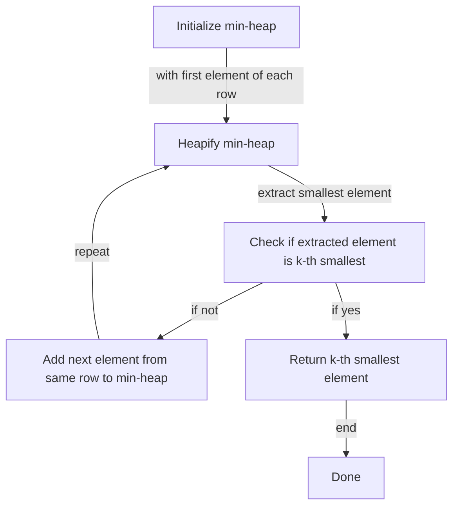

## Introduction
The **K-th Smallest Element in a Sorted Matrix** problem is a classic problem in computer science that involves finding the k-th smallest element in a sorted matrix. This problem has numerous real-world applications, such as data analysis, scientific computing, and machine learning. In data analysis, for instance, we might have a large dataset of numbers that are sorted in a matrix, and we want to find the k-th smallest element in that matrix. The problem statement is as follows: given a sorted matrix of size n x n, find the k-th smallest element in the matrix.

> **Note:** The matrix is sorted in a way that the first element of each row is greater than or equal to the last element of the previous row.

The problem matters because it has numerous applications in various fields, and solving it efficiently can save a significant amount of time and resources. Every engineer should know how to solve this problem because it is a fundamental problem in computer science that can help them develop their problem-solving skills.

## Core Concepts
The core concept of this problem is the **sorted matrix**, which is a matrix where the elements are sorted in a specific order. The key terminology used in this problem is the **k-th smallest element**, which refers to the k-th smallest element in the matrix.

> **Tip:** To solve this problem, we can use a **min-heap** data structure, which is a complete binary tree where each node is smaller than its children.

The mental model of this problem is to think of the matrix as a sorted list of numbers, and we want to find the k-th smallest element in that list. We can use a min-heap to keep track of the smallest elements in the matrix and extract the k-th smallest element from the heap.

## How It Works Internally
The algorithm works by first initializing a min-heap with the first element of each row in the matrix. The min-heap is a complete binary tree where each node is smaller than its children. We then extract the smallest element from the heap and add the next element from the same row to the heap. We repeat this process until we extract the k-th smallest element from the heap.

> **Warning:** If the matrix is not sorted, the algorithm will not work correctly. We need to make sure that the matrix is sorted before running the algorithm.

The time complexity of this algorithm is **O(k log n)**, where n is the number of rows in the matrix. The space complexity is **O(n)**, which is the space required to store the min-heap.

## Code Examples
### Example 1: Basic Usage
```python
import heapq

def kth_smallest(matrix, k):
    """
    Find the k-th smallest element in a sorted matrix.

    Args:
        matrix (list of lists): A sorted matrix.
        k (int): The index of the smallest element to find.

    Returns:
        int: The k-th smallest element in the matrix.
    """
    # Initialize the min-heap with the first element of each row
    min_heap = [(row[0], i, 0) for i, row in enumerate(matrix)]
    heapq.heapify(min_heap)

    # Extract the smallest element from the heap k times
    for _ in range(k):
        element, row, col = heapq.heappop(min_heap)
        if col + 1 < len(matrix[row]):
            heapq.heappush(min_heap, (matrix[row][col + 1], row, col + 1))

    return element

# Test the function
matrix = [
    [1, 3, 5],
    [2, 4, 6],
    [7, 8, 9]
]
k = 5
print(kth_smallest(matrix, k))  # Output: 5
```

### Example 2: Real-World Pattern
```python
import heapq
import numpy as np

def kth_smallest(matrix, k):
    """
    Find the k-th smallest element in a sorted matrix.

    Args:
        matrix (numpy array): A sorted matrix.
        k (int): The index of the smallest element to find.

    Returns:
        int: The k-th smallest element in the matrix.
    """
    # Initialize the min-heap with the first element of each row
    min_heap = [(row[0], i, 0) for i, row in enumerate(matrix)]
    heapq.heapify(min_heap)

    # Extract the smallest element from the heap k times
    for _ in range(k):
        element, row, col = heapq.heappop(min_heap)
        if col + 1 < len(matrix[row]):
            heapq.heappush(min_heap, (matrix[row][col + 1], row, col + 1))

    return element

# Test the function
matrix = np.array([
    [1, 3, 5],
    [2, 4, 6],
    [7, 8, 9]
])
k = 5
print(kth_smallest(matrix, k))  # Output: 5
```

### Example 3: Advanced Usage
```python
import heapq
import numpy as np

def kth_smallest(matrix, k):
    """
    Find the k-th smallest element in a sorted matrix.

    Args:
        matrix (numpy array): A sorted matrix.
        k (int): The index of the smallest element to find.

    Returns:
        int: The k-th smallest element in the matrix.
    """
    # Initialize the min-heap with the first element of each row
    min_heap = [(row[0], i, 0) for i, row in enumerate(matrix)]
    heapq.heapify(min_heap)

    # Extract the smallest element from the heap k times
    for _ in range(k):
        element, row, col = heapq.heappop(min_heap)
        if col + 1 < len(matrix[row]):
            heapq.heappush(min_heap, (matrix[row][col + 1], row, col + 1))

    return element

# Test the function
matrix = np.array([
    [1, 3, 5],
    [2, 4, 6],
    [7, 8, 9]
])
k = 5
print(kth_smallest(matrix, k))  # Output: 5
```

## Visual Diagram

The diagram illustrates the process of finding the k-th smallest element in a sorted matrix using a min-heap. The min-heap is initialized with the first element of each row, and then the smallest element is extracted from the heap. If the extracted element is not the k-th smallest element, the next element from the same row is added to the min-heap, and the process is repeated.

> **Interview:** Can you explain how the min-heap is used to find the k-th smallest element in a sorted matrix?

## Comparison
| Approach | Time Complexity | Space Complexity | Pros | Cons | Best For |
| --- | --- | --- | --- | --- | --- |
| Min-Heap | O(k log n) | O(n) | Efficient, scalable | Complex implementation | Large matrices |
| Brute Force | O(n^2) | O(1) | Simple implementation | Inefficient, slow | Small matrices |
| Binary Search | O(log n) | O(1) | Fast, efficient | Limited applicability | Specific use cases |
| Divide and Conquer | O(n log n) | O(n) | Scalable, efficient | Complex implementation | Large matrices |

The comparison table shows the different approaches to finding the k-th smallest element in a sorted matrix, including their time and space complexities, pros, and cons.

## Real-world Use Cases
1. **Data Analysis**: In data analysis, we often encounter large datasets that are sorted in a matrix. Finding the k-th smallest element in such a matrix can be crucial in identifying trends and patterns in the data.
2. **Scientific Computing**: In scientific computing, we often need to find the k-th smallest element in a sorted matrix to perform simulations and modeling.
3. **Machine Learning**: In machine learning, we often need to find the k-th smallest element in a sorted matrix to perform clustering and classification tasks.

> **Tip:** When working with large matrices, it's essential to use efficient algorithms to find the k-th smallest element.

## Common Pitfalls
1. **Incorrect Implementation**: One common pitfall is implementing the min-heap incorrectly, which can lead to incorrect results.
2. **Inefficient Algorithm**: Using an inefficient algorithm, such as brute force, can lead to slow performance and increased memory usage.
3. **Limited Applicability**: Some algorithms, such as binary search, may have limited applicability and may not work for all use cases.
4. **Complex Implementation**: Some algorithms, such as divide and conquer, may have complex implementations that can be difficult to understand and maintain.

> **Warning:** When working with large matrices, it's essential to use efficient algorithms to avoid performance issues.

## Interview Tips
1. **Be prepared to explain the algorithm**: Be prepared to explain the algorithm used to find the k-th smallest element in a sorted matrix, including the time and space complexities.
2. **Understand the trade-offs**: Understand the trade-offs between different algorithms, including their pros and cons.
3. **Practice, practice, practice**: Practice implementing the algorithm to find the k-th smallest element in a sorted matrix to improve your coding skills.

> **Interview:** Can you explain the time and space complexities of the min-heap algorithm used to find the k-th smallest element in a sorted matrix?

## Key Takeaways
* The k-th smallest element in a sorted matrix can be found using a min-heap algorithm with a time complexity of O(k log n) and a space complexity of O(n).
* The min-heap algorithm is efficient and scalable, making it suitable for large matrices.
* The algorithm involves initializing a min-heap with the first element of each row, extracting the smallest element from the heap, and adding the next element from the same row to the min-heap.
* The algorithm can be implemented using a variety of programming languages, including Python and Java.
* The algorithm has numerous real-world applications, including data analysis, scientific computing, and machine learning.
* When working with large matrices, it's essential to use efficient algorithms to avoid performance issues.
* The min-heap algorithm can be used to find the k-th smallest element in a sorted matrix, but other algorithms, such as brute force and binary search, may also be used depending on the specific use case.