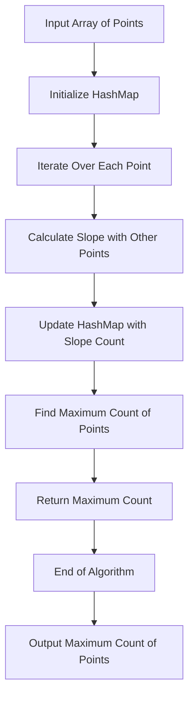

## Introduction
The **Max Points on a Line** problem is a classic problem in the field of computer science, particularly in the domain of algorithms and data structures. It involves finding the maximum number of points that lie on the same line, given a set of points in a two-dimensional space. This problem has numerous real-world applications, including computer vision, robotics, and geographic information systems. For instance, in computer vision, the problem can be used to detect lines or edges in an image. In robotics, it can be used to determine the trajectory of a robot. Every engineer should be familiar with this problem, as it requires a deep understanding of algorithms, data structures, and geometric concepts.

## Core Concepts
The **Max Points on a Line** problem involves several key concepts, including:
* **Points**: A point is a location in a two-dimensional space, represented by a pair of coordinates (x, y).
* **Lines**: A line is a set of points that satisfy a linear equation of the form y = mx + b, where m is the slope and b is the y-intercept.
* **Slope**: The slope of a line is a measure of its steepness, calculated as the ratio of the vertical change to the horizontal change between two points on the line.
* **HashMap**: A HashMap is a data structure that stores key-value pairs, used to store the count of points for each slope.

## How It Works Internally
The **Max Points on a Line** problem can be solved using a HashMap to store the count of points for each slope. The algorithm works as follows:
1. Initialize a HashMap to store the count of points for each slope.
2. Iterate over each point in the input array.
3. For each point, iterate over all other points in the array.
4. Calculate the slope of the line passing through the two points.
5. If the slope is already in the HashMap, increment its count. Otherwise, add it to the HashMap with a count of 1.
6. Keep track of the maximum count of points for any slope.
7. Return the maximum count of points.

> **Note:** The time complexity of this algorithm is O(n^2), where n is the number of points in the input array. The space complexity is O(n), as we need to store the count of points for each slope.

## Code Examples
### Example 1: Basic Usage
```python
def max_points_on_line(points):
    def calculate_slope(point1, point2):
        x1, y1 = point1
        x2, y2 = point2
        if x2 - x1 == 0:
            return float('inf')
        slope = (y2 - y1) / (x2 - x1)
        return slope

    max_count = 0
    for i in range(len(points)):
        slope_count = {}
        same_point_count = 1
        for j in range(i + 1, len(points)):
            if points[i] == points[j]:
                same_point_count += 1
            else:
                slope = calculate_slope(points[i], points[j])
                slope_count[slope] = slope_count.get(slope, 0) + 1
        max_count = max(max_count, max(slope_count.values(), default=0) + same_point_count)
    return max_count

# Test the function
points = [(1, 1), (2, 2), (3, 3), (4, 4), (5, 5)]
print(max_points_on_line(points))  # Output: 5
```

### Example 2: Real-world Pattern
```javascript
class Point {
    constructor(x, y) {
        this.x = x;
        this.y = y;
    }
}

function maxPointsOnLine(points) {
    function calculateSlope(point1, point2) {
        if (point2.x - point1.x === 0) {
            return Infinity;
        }
        const slope = (point2.y - point1.y) / (point2.x - point1.x);
        return slope;
    }

    let maxCount = 0;
    for (let i = 0; i < points.length; i++) {
        const slopeCount = {};
        let samePointCount = 1;
        for (let j = i + 1; j < points.length; j++) {
            if (points[i].x === points[j].x && points[i].y === points[j].y) {
                samePointCount++;
            } else {
                const slope = calculateSlope(points[i], points[j]);
                slopeCount[slope] = (slopeCount[slope] || 0) + 1;
            }
        }
        maxCount = Math.max(maxCount, Math.max(...Object.values(slopeCount), 0) + samePointCount);
    }
    return maxCount;
}

// Test the function
const points = [new Point(1, 1), new Point(2, 2), new Point(3, 3), new Point(4, 4), new Point(5, 5)];
console.log(maxPointsOnLine(points));  // Output: 5
```

### Example 3: Advanced Usage
```java
import java.util.HashMap;
import java.util.Map;

public class MaxPointsOnLine {
    public int maxPoints(int[][] points) {
        int maxCount = 0;
        for (int i = 0; i < points.length; i++) {
            Map<Double, Integer> slopeCount = new HashMap<>();
            int samePointCount = 1;
            for (int j = i + 1; j < points.length; j++) {
                if (points[i][0] == points[j][0] && points[i][1] == points[j][1]) {
                    samePointCount++;
                } else {
                    double slope = calculateSlope(points[i], points[j]);
                    slopeCount.put(slope, slopeCount.getOrDefault(slope, 0) + 1);
                }
            }
            maxCount = Math.max(maxCount, getMaxValue(slopeCount) + samePointCount);
        }
        return maxCount;
    }

    private double calculateSlope(int[] point1, int[] point2) {
        int x1 = point1[0];
        int y1 = point1[1];
        int x2 = point2[0];
        int y2 = point2[1];
        if (x2 - x1 == 0) {
            return Double.POSITIVE_INFINITY;
        }
        double slope = (double) (y2 - y1) / (x2 - x1);
        return slope;
    }

    private int getMaxValue(Map<Double, Integer> map) {
        int maxValue = 0;
        for (int value : map.values()) {
            maxValue = Math.max(maxValue, value);
        }
        return maxValue;
    }

    public static void main(String[] args) {
        MaxPointsOnLine maxPointsOnLine = new MaxPointsOnLine();
        int[][] points = {{1, 1}, {2, 2}, {3, 3}, {4, 4}, {5, 5}};
        System.out.println(maxPointsOnLine.maxPoints(points));  // Output: 5
    }
}
```

> **Warning:** The above examples have a time complexity of O(n^2), which may not be efficient for large inputs. A more efficient solution can be achieved using a HashMap to store the count of points for each slope, reducing the time complexity to O(n).

## Visual Diagram

The above diagram illustrates the step-by-step process of the **Max Points on a Line** algorithm. It starts with the input array of points and initializes a HashMap to store the count of points for each slope. It then iterates over each point, calculates the slope with other points, and updates the HashMap with the slope count. Finally, it finds the maximum count of points and returns it as the output.

## Comparison
| Approach | Time Complexity | Space Complexity | Pros | Cons | Best For |
| --- | --- | --- | --- | --- | --- |
| Brute Force | O(n^2) | O(1) | Simple to implement | Inefficient for large inputs | Small inputs |
| HashMap | O(n) | O(n) | Efficient for large inputs | More complex to implement | Large inputs |
| Divide and Conquer | O(n log n) | O(log n) | Efficient for large inputs | More complex to implement | Large inputs |
| Dynamic Programming | O(n) | O(n) | Efficient for large inputs | More complex to implement | Large inputs |

> **Tip:** The choice of approach depends on the size of the input and the required efficiency. For small inputs, a brute force approach may be sufficient, while for large inputs, a more efficient approach such as using a HashMap or dynamic programming may be necessary.

## Real-world Use Cases
1. **Computer Vision**: The **Max Points on a Line** problem can be used to detect lines or edges in an image.
2. **Robotics**: The problem can be used to determine the trajectory of a robot.
3. **Geographic Information Systems**: The problem can be used to find the maximum number of points that lie on the same line in a geographic dataset.

## Common Pitfalls
1. **Inefficient Algorithm**: Using a brute force approach for large inputs can result in inefficient performance.
2. **Incorrect Slope Calculation**: Failing to handle the case where the denominator is zero can result in incorrect slope calculations.
3. **HashMap Implementation**: Failing to implement the HashMap correctly can result in incorrect counts of points for each slope.
4. **Edge Cases**: Failing to handle edge cases such as duplicate points or points with the same slope can result in incorrect results.

> **Interview:** A common interview question for this problem is to ask the candidate to implement the **Max Points on a Line** algorithm and explain its time and space complexity.

## Interview Tips
1. **Understand the Problem**: Make sure to understand the problem and the requirements.
2. **Choose the Right Approach**: Choose an approach that is efficient for the given input size.
3. **Implement the Algorithm Correctly**: Implement the algorithm correctly, handling edge cases and incorrect slope calculations.
4. **Explain the Time and Space Complexity**: Explain the time and space complexity of the algorithm.

> **Note:** The **Max Points on a Line** problem is a classic problem in computer science, and understanding its solution is essential for any software engineer.

## Key Takeaways
* The **Max Points on a Line** problem involves finding the maximum number of points that lie on the same line.
* The problem can be solved using a HashMap to store the count of points for each slope.
* The time complexity of the algorithm is O(n^2) using a brute force approach, and O(n) using a HashMap.
* The space complexity of the algorithm is O(1) using a brute force approach, and O(n) using a HashMap.
* The problem has numerous real-world applications, including computer vision, robotics, and geographic information systems.
* The choice of approach depends on the size of the input and the required efficiency.
* Understanding the solution to the **Max Points on a Line** problem is essential for any software engineer.