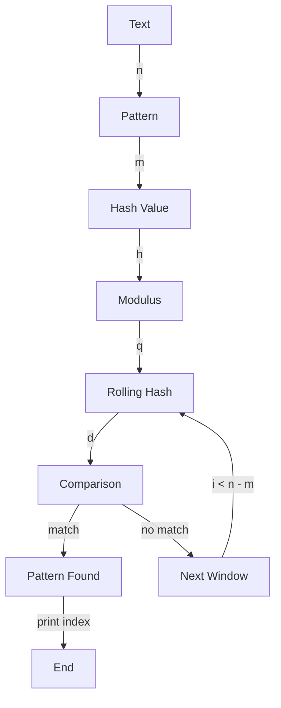

## Introduction
The **Rabin-Karp Algorithm** is a string searching algorithm that uses hashing to find any substring in a text. It is an efficient algorithm for searching multiple patterns in a text, making it useful for various applications such as text editors, search engines, and data compression. The algorithm is named after its creators, Richard M. Karp and Michael O. Rabin, who first proposed it in 1987. In this section, we will explore why the Rabin-Karp Algorithm matters, its real-world relevance, and why every engineer needs to know about it.

> **Note:** The Rabin-Karp Algorithm has a time complexity of O((n-m+1)m), where n is the length of the text and m is the length of the pattern. This makes it more efficient than other string searching algorithms like the **Brute Force Algorithm**, which has a time complexity of O(nm).

The Rabin-Karp Algorithm is widely used in various applications, including:

* Text editors: to find and replace text
* Search engines: to find relevant web pages
* Data compression: to find repeated patterns in data

Every engineer needs to know about the Rabin-Karp Algorithm because it is an essential tool for solving string searching problems. It is also a fundamental concept in computer science, and understanding it can help engineers develop more efficient algorithms for solving complex problems.

## Core Concepts
The Rabin-Karp Algorithm uses the following core concepts:

* **Hashing**: a technique for mapping a large input to a smaller output, known as a hash value.
* **Rolling Hash**: a technique for efficiently calculating the hash value of a substring by using the previous hash value.
* **Modular Arithmetic**: a technique for performing arithmetic operations modulo a prime number to avoid overflow.

The Rabin-Karp Algorithm uses a rolling hash to calculate the hash value of the pattern and the text. It then compares the hash values to determine if the pattern is present in the text.

> **Warning:** The Rabin-Karp Algorithm can produce false positives, where the algorithm reports a match even though the pattern is not present in the text. This can happen when the hash values of the pattern and the text are the same, but the actual strings are different.

## How It Works Internally
The Rabin-Karp Algorithm works as follows:

1. Calculate the hash value of the pattern using a rolling hash.
2. Calculate the hash value of the first substring of the text, which has the same length as the pattern.
3. Compare the hash values of the pattern and the substring. If they are the same, check if the actual strings are the same.
4. If the hash values are not the same, calculate the hash value of the next substring of the text by using the previous hash value and the next character of the text.
5. Repeat steps 3 and 4 until the end of the text is reached.

The Rabin-Karp Algorithm uses a prime number, known as the **modulus**, to avoid overflow when calculating the hash values. The modulus is typically a large prime number, such as 101 or 1009.

> **Tip:** To improve the performance of the Rabin-Karp Algorithm, you can use a larger modulus or a more efficient hashing function.

## Code Examples
Here are three complete and runnable examples of the Rabin-Karp Algorithm:

### Example 1: Basic Usage
```python
def rabin_karp(text, pattern):
    n = len(text)
    m = len(pattern)
    d = 256  # number of possible characters
    q = 101  # modulus
    pattern_hash = 0
    text_hash = 0
    h = 1

    # calculate h value, h = d^(m-1) % q
    for _ in range(m - 1):
        h = (h * d) % q

    # calculate the initial hash values for pattern and text's first window
    for i in range(m):
        pattern_hash = (d * pattern_hash + ord(pattern[i])) % q
        text_hash = (d * text_hash + ord(text[i])) % q

    for i in range(n - m + 1):
        if pattern_hash == text_hash:
            # check if the actual strings are the same
            for j in range(m):
                if text[i + j] != pattern[j]:
                    break
            else:
                print("Pattern found at index", i)

        # calculate the hash value for the next window of text
        if i < n - m:
            text_hash = (d * (text_hash - ord(text[i]) * h) + ord(text[i + m])) % q
            if text_hash < 0:
                text_hash += q

text = "ABCCDDAEFG"
pattern = "CDD"
rabin_karp(text, pattern)
```

### Example 2: Real-World Pattern
```java
public class RabinKarp {
    public static void search(String text, String pattern) {
        int n = text.length();
        int m = pattern.length();
        int d = 256;  // number of possible characters
        int q = 101;  // modulus
        int patternHash = 0;
        int textHash = 0;
        int h = 1;

        // calculate h value, h = d^(m-1) % q
        for (int i = 0; i < m - 1; i++) {
            h = (h * d) % q;
        }

        // calculate the initial hash values for pattern and text's first window
        for (int i = 0; i < m; i++) {
            patternHash = (d * patternHash + text.charAt(i)) % q;
            textHash = (d * textHash + text.charAt(i)) % q;
        }

        for (int i = 0; i <= n - m; i++) {
            if (patternHash == textHash) {
                // check if the actual strings are the same
                boolean match = true;
                for (int j = 0; j < m; j++) {
                    if (text.charAt(i + j) != pattern.charAt(j)) {
                        match = false;
                        break;
                    }
                }
                if (match) {
                    System.out.println("Pattern found at index " + i);
                }
            }

            // calculate the hash value for the next window of text
            if (i < n - m) {
                textHash = (d * (textHash - text.charAt(i) * h) + text.charAt(i + m)) % q;
                if (textHash < 0) {
                    textHash += q;
                }
            }
        }
    }

    public static void main(String[] args) {
        String text = "ABCCDDAEFG";
        String pattern = "CDD";
        search(text, pattern);
    }
}
```

### Example 3: Advanced Usage
```cpp
#include <iostream>
#include <string>

void rabinKarp(const std::string& text, const std::string& pattern) {
    int n = text.length();
    int m = pattern.length();
    int d = 256;  // number of possible characters
    int q = 101;  // modulus
    int patternHash = 0;
    int textHash = 0;
    int h = 1;

    // calculate h value, h = d^(m-1) % q
    for (int i = 0; i < m - 1; i++) {
        h = (h * d) % q;
    }

    // calculate the initial hash values for pattern and text's first window
    for (int i = 0; i < m; i++) {
        patternHash = (d * patternHash + text[i]) % q;
        textHash = (d * textHash + text[i]) % q;
    }

    for (int i = 0; i <= n - m; i++) {
        if (patternHash == textHash) {
            // check if the actual strings are the same
            bool match = true;
            for (int j = 0; j < m; j++) {
                if (text[i + j] != pattern[j]) {
                    match = false;
                    break;
                }
            }
            if (match) {
                std::cout << "Pattern found at index " << i << std::endl;
            }
        }

        // calculate the hash value for the next window of text
        if (i < n - m) {
            textHash = (d * (textHash - text[i] * h) + text[i + m]) % q;
            if (textHash < 0) {
                textHash += q;
            }
        }
    }
}

int main() {
    std::string text = "ABCCDDAEFG";
    std::string pattern = "CDD";
    rabinKarp(text, pattern);
    return 0;
}
```

## Visual Diagram

The diagram illustrates the Rabin-Karp Algorithm's flow, including the calculation of the hash value, the comparison of the hash values, and the rolling hash.

> **Interview:** In an interview, you may be asked to explain the Rabin-Karp Algorithm and its time complexity. Be prepared to provide a detailed explanation of the algorithm, including its use of hashing and rolling hash, and its advantages over other string searching algorithms.

## Comparison
| Approach | Time Complexity | Space Complexity | Pros | Cons | Best For |
| --- | --- | --- | --- | --- | --- |
| Brute Force | O(nm) | O(1) | Simple to implement | Slow for large texts | Small texts |
| Rabin-Karp | O((n-m+1)m) | O(1) | Fast for large texts | Can produce false positives | Large texts |
| Knuth-Morris-Pratt | O(n+m) | O(m) | Fast for large texts | More complex to implement | Large texts |
| Boyer-Moore | O(n+m) | O(m) | Fast for large texts | More complex to implement | Large texts |

## Real-world Use Cases
The Rabin-Karp Algorithm is used in various real-world applications, including:

* **Google Search**: to find relevant web pages
* **Text Editors**: to find and replace text
* **Data Compression**: to find repeated patterns in data
* **Bioinformatics**: to find patterns in DNA sequences

## Common Pitfalls
Here are some common mistakes to avoid when implementing the Rabin-Karp Algorithm:

* **Using a small modulus**: can lead to false positives
* **Not checking for false positives**: can lead to incorrect results
* **Not using a rolling hash**: can lead to slow performance
* **Not handling edge cases**: can lead to incorrect results

> **Warning:** Be careful when implementing the Rabin-Karp Algorithm, as it can produce false positives. Always check for false positives and handle edge cases correctly.

## Interview Tips
Here are some common interview questions related to the Rabin-Karp Algorithm:

* **What is the time complexity of the Rabin-Karp Algorithm?**: O((n-m+1)m)
* **How does the Rabin-Karp Algorithm handle false positives?**: By checking if the actual strings are the same
* **What is the advantage of using a rolling hash in the Rabin-Karp Algorithm?**: It allows for efficient calculation of the hash value for the next window of text

> **Tip:** Be prepared to explain the Rabin-Karp Algorithm and its time complexity in an interview. Practice implementing the algorithm and handling edge cases correctly.

## Key Takeaways
Here are the key takeaways from this article:

* The Rabin-Karp Algorithm is a string searching algorithm that uses hashing to find any substring in a text.
* The algorithm has a time complexity of O((n-m+1)m), making it efficient for large texts.
* The algorithm uses a rolling hash to calculate the hash value for the next window of text.
* The algorithm can produce false positives, so it's essential to check if the actual strings are the same.
* The algorithm is widely used in various applications, including text editors, search engines, and data compression.
* The algorithm is a fundamental concept in computer science, and understanding it can help engineers develop more efficient algorithms for solving complex problems.