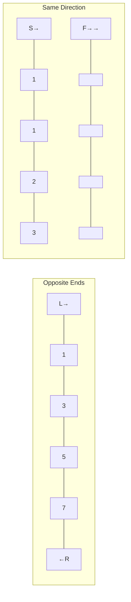

## Introduction

The Two Pointer technique is one of the most powerful and frequently tested patterns in coding interviews. It uses two index variables that traverse a data structure — typically an array or string — to solve problems in **O(n)** time that would otherwise require **O(n²)** with brute force. The key insight is that by moving pointers intelligently based on conditions, you avoid redundant comparisons.

> **Note:** Two Pointer is not a single algorithm — it's a pattern with several variants: opposite ends, same direction (fast/slow), and sliding window (a specialization).

## Core Concepts

### Variant 1: Opposite Ends (Converging Pointers)

Start one pointer at the beginning and one at the end. Move them toward each other based on a condition.

**When to use:** Sorted arrays, palindrome checks, pair sum problems.

### Variant 2: Same Direction (Fast/Slow)

Both pointers start at the beginning but move at different speeds or under different conditions.

**When to use:** Removing duplicates, cycle detection in linked lists, partitioning.

### Variant 3: Sliding Window

A fixed or variable-size window defined by two pointers moving in the same direction.

**When to use:** Subarray/substring problems with a constraint (max sum, unique chars, etc.).

## Pointer Movement Visualization



## Code Examples

### Example 1: Two Sum in Sorted Array (Opposite Ends)

```java
// Given a sorted array, find two numbers that sum to target
// Time: O(n), Space: O(1)
public int[] twoSum(int[] nums, int target) {
    int left = 0, right = nums.length - 1;

    while (left < right) {
        int sum = nums[left] + nums[right];

        if (sum == target) {
            return new int[]{left + 1, right + 1}; // 1-indexed
        } else if (sum < target) {
            left++;  // need larger sum → move left pointer right
        } else {
            right--; // need smaller sum → move right pointer left
        }
    }
    return new int[]{-1, -1}; // no solution
}
```

### Example 2: Remove Duplicates from Sorted Array (Same Direction)

```java
// Modify array in-place, return count of unique elements
// Time: O(n), Space: O(1)
public int removeDuplicates(int[] nums) {
    if (nums.length == 0) return 0;

    int slow = 0; // points to last unique element

    for (int fast = 1; fast < nums.length; fast++) {
        if (nums[fast] != nums[slow]) {
            slow++;
            nums[slow] = nums[fast]; // place next unique element
        }
        // if duplicate, fast advances but slow stays
    }
    return slow + 1; // count of unique elements
}
```

### Example 3: Container With Most Water (Opposite Ends)

```java
// Find two lines that form a container holding the most water
// Time: O(n), Space: O(1)
public int maxArea(int[] height) {
    int left = 0, right = height.length - 1;
    int maxWater = 0;

    while (left < right) {
        int width = right - left;
        int h = Math.min(height[left], height[right]);
        maxWater = Math.max(maxWater, width * h);

        // Move the shorter wall — moving the taller one can only decrease area
        if (height[left] < height[right]) {
            left++;
        } else {
            right--;
        }
    }
    return maxWater;
}
```

### Example 4: 3Sum (Sort + Two Pointers)

```java
// Find all unique triplets that sum to zero
// Time: O(n²), Space: O(1) excluding output
public List<List<Integer>> threeSum(int[] nums) {
    Arrays.sort(nums); // sort first!
    List<List<Integer>> result = new ArrayList<>();

    for (int i = 0; i < nums.length - 2; i++) {
        // Skip duplicates for the first element
        if (i > 0 && nums[i] == nums[i - 1]) continue;

        int left = i + 1, right = nums.length - 1;

        while (left < right) {
            int sum = nums[i] + nums[left] + nums[right];

            if (sum == 0) {
                result.add(Arrays.asList(nums[i], nums[left], nums[right]));
                // Skip duplicates for second and third elements
                while (left < right && nums[left] == nums[left + 1]) left++;
                while (left < right && nums[right] == nums[right - 1]) right--;
                left++;
                right--;
            } else if (sum < 0) {
                left++;
            } else {
                right--;
            }
        }
    }
    return result;
}
```

## Complexity Analysis

| Problem | Brute Force | Two Pointer | Space |
|---------|-------------|-------------|-------|
| Two Sum (sorted) | O(n²) | O(n) | O(1) |
| Remove Duplicates | O(n²) | O(n) | O(1) |
| Container With Most Water | O(n²) | O(n) | O(1) |
| 3Sum | O(n³) | O(n²) | O(1) |
| Valid Palindrome | O(n) | O(n) | O(1) |

## Real-world Use Cases

- **Database query optimization** — merge-join uses two pointers on sorted result sets
- **Network packet analysis** — sliding window for rate limiting
- **Text editors** — gap buffer uses two pointers for efficient insertion
- **Streaming data** — fixed-size window for moving averages

## Common Pitfalls & How to Avoid Them

- **Forgetting to sort** — most opposite-ends problems require a sorted array first
- **Off-by-one errors** — use `left < right` (not `<=`) for opposite ends to avoid processing the same element twice
- **Infinite loops** — ensure at least one pointer moves in every iteration
- **Duplicate handling** — in problems like 3Sum, explicitly skip duplicates after finding a valid pair

## Summary / Key Takeaways

- Two Pointer reduces O(n²) brute force to O(n) by eliminating redundant comparisons
- **Opposite ends**: sorted arrays, pair sums, palindromes — converge toward the middle
- **Same direction**: in-place modifications, fast/slow for cycle detection
- **Sliding window**: subarray/substring problems with a constraint
- Always sort first when using opposite-end pointers on unsorted input

> **Tip:** In interviews, whenever you see a sorted array and a target sum/condition, immediately think Two Pointer. It's almost always the optimal approach and interviewers expect you to recognize the pattern quickly.
