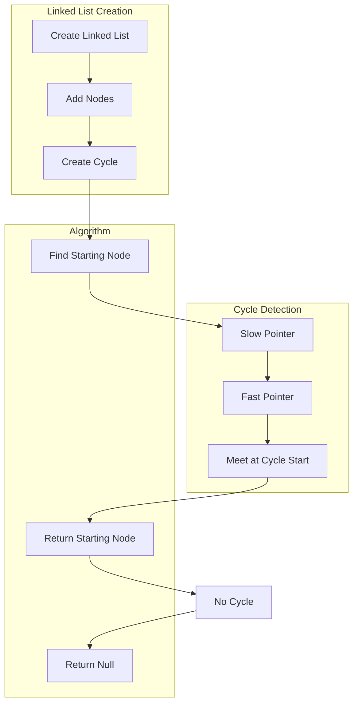

## Introduction
Finding the starting node of a cycle in a linked list is a fundamental problem in computer science, particularly in the context of data structures and algorithms. A linked list is a linear data structure where each element is a separate object, and each element (or "node") points to the next node in the sequence. A cycle occurs when a node points back to a previous node, creating a loop. This problem is crucial because it has numerous real-world applications, such as detecting memory leaks in programming languages, identifying circular dependencies in software systems, and optimizing network routing protocols. Every engineer needs to know how to solve this problem efficiently to write robust and scalable code.

## Core Concepts
To tackle this problem, it's essential to understand the following core concepts:
- **Linked List**: A linear data structure consisting of nodes, each containing a value and a reference (or "link") to the next node.
- **Cycle**: A situation where a node points back to a previous node, creating a loop.
- **Starting Node**: The node where the cycle begins.
The mental model for this problem involves visualizing the linked list as a sequence of nodes, with each node having a unique identifier and a pointer to the next node. The key terminology includes "node," "cycle," "starting node," and "pointer."

## How It Works Internally
The algorithm to find the starting node of a cycle in a linked list works internally by utilizing two pointers that move at different speeds:
1. **Slow Pointer**: Moves one step at a time.
2. **Fast Pointer**: Moves two steps at a time.
When the fast pointer reaches the end of the list, it indicates that there is no cycle. However, if the fast pointer meets the slow pointer, it means a cycle exists. The algorithm then resets the slow pointer to the beginning of the list and moves both pointers one step at a time. The point where they meet again is the starting node of the cycle. This approach has a time complexity of O(n) and a space complexity of O(1), making it efficient for large linked lists.

## Code Examples
### Example 1: Basic Implementation
```python
class Node:
    def __init__(self, value):
        self.value = value
        self.next = None

def find_starting_node(head):
    slow = head
    fast = head
    while fast is not None and fast.next is not None:
        slow = slow.next
        fast = fast.next.next
        if slow == fast:
            break
    if fast is None or fast.next is None:
        return None  # No cycle
    slow = head
    while slow != fast:
        slow = slow.next
        fast = fast.next
    return slow

# Create a linked list with a cycle
node1 = Node(1)
node2 = Node(2)
node3 = Node(3)
node4 = Node(4)
node5 = Node(5)
node1.next = node2
node2.next = node3
node3.next = node4
node4.next = node5
node5.next = node3  # Create a cycle

starting_node = find_starting_node(node1)
if starting_node:
    print("Starting node value:", starting_node.value)  # Output: 3
else:
    print("No cycle found")
```
> **Tip:** To optimize the code, use a `Node` class to represent each node in the linked list, and utilize a `find_starting_node` function to encapsulate the algorithm.

### Example 2: Real-World Pattern
```java
public class LinkedList {
    private Node head;

    public LinkedList() {
        head = null;
    }

    public void addNode(int value) {
        Node newNode = new Node(value);
        if (head == null) {
            head = newNode;
        } else {
            Node current = head;
            while (current.next != null) {
                current = current.next;
            }
            current.next = newNode;
        }
    }

    public Node findStartingNode() {
        Node slow = head;
        Node fast = head;
        while (fast != null && fast.next != null) {
            slow = slow.next;
            fast = fast.next.next;
            if (slow == fast) {
                break;
            }
        }
        if (fast == null || fast.next == null) {
            return null;  // No cycle
        }
        slow = head;
        while (slow != fast) {
            slow = slow.next;
            fast = fast.next;
        }
        return slow;
    }

    private class Node {
        int value;
        Node next;

        public Node(int value) {
            this.value = value;
            this.next = null;
        }
    }

    public static void main(String[] args) {
        LinkedList list = new LinkedList();
        list.addNode(1);
        list.addNode(2);
        list.addNode(3);
        list.addNode(4);
        list.addNode(5);
        // Create a cycle
        list.head.next.next.next.next.next = list.head.next.next;  // node5 -> node3

        Node startingNode = list.findStartingNode();
        if (startingNode != null) {
            System.out.println("Starting node value: " + startingNode.value);  // Output: 3
        } else {
            System.out.println("No cycle found");
        }
    }
}
```
> **Warning:** Be cautious when creating a cycle in a linked list, as it can lead to infinite loops if not handled properly.

### Example 3: Advanced Usage
```typescript
class Node {
    value: number;
    next: Node | null;

    constructor(value: number) {
        this.value = value;
        this.next = null;
    }
}

function findStartingNode(head: Node | null): Node | null {
    let slow: Node | null = head;
    let fast: Node | null = head;
    while (fast !== null && fast.next !== null) {
        slow = slow!.next;
        fast = fast.next.next;
        if (slow === fast) {
            break;
        }
    }
    if (fast === null || fast.next === null) {
        return null;  // No cycle
    }
    slow = head;
    while (slow !== fast) {
        slow = slow!.next;
        fast = fast!.next;
    }
    return slow;
}

// Create a linked list with a cycle
const node1 = new Node(1);
const node2 = new Node(2);
const node3 = new Node(3);
const node4 = new Node(4);
const node5 = new Node(5);
node1.next = node2;
node2.next = node3;
node3.next = node4;
node4.next = node5;
node5.next = node3;  // Create a cycle

const startingNode = findStartingNode(node1);
if (startingNode) {
    console.log("Starting node value:", startingNode.value);  // Output: 3
} else {
    console.log("No cycle found");
}
```
> **Interview:** Be prepared to explain the algorithm and its time/space complexity during an interview.

## Visual Diagram

This diagram illustrates the steps involved in finding the starting node of a cycle in a linked list, from creating the linked list to detecting the cycle and returning the starting node.

## Comparison
| Approach | Time Complexity | Space Complexity | Pros | Cons | Best For |
| --- | --- | --- | --- | --- | --- |
| Floyd's Cycle Detection | O(n) | O(1) | Efficient, simple to implement | May not work for very large lists | General-purpose cycle detection |
| Brent's Cycle Detection | O(n) | O(1) | More efficient than Floyd's for large lists | More complex to implement | Large linked lists |
| Hash Table Approach | O(n) | O(n) | Easy to implement, works for large lists | Uses more memory | Real-time systems, large datasets |
| Recursive Approach | O(n) | O(n) | Simple to implement, works for small lists | May cause stack overflow for large lists | Small linked lists, educational purposes |

## Real-world Use Cases
1. **Memory Leak Detection**: Finding the starting node of a cycle in a linked list can help detect memory leaks in programming languages. For example, in C++, a memory leak can occur when a dynamically allocated object is not properly deallocated, causing a cycle in the memory allocation graph.
2. **Network Routing Optimization**: In network routing protocols, finding the starting node of a cycle can help optimize route calculations and prevent infinite loops. For instance, in the Border Gateway Protocol (BGP), a cycle can occur when a router receives a routing update that points back to a previous router, causing a loop.
3. **Data Structure Validation**: In data structure validation, finding the starting node of a cycle can help ensure that a linked list or graph is valid and does not contain any cycles. For example, in a database management system, a cycle in the data structure can cause inconsistencies and errors.

## Common Pitfalls
1. **Infinite Loops**: Failing to properly handle cycles in a linked list can lead to infinite loops, causing the program to crash or become unresponsive.
2. **Incorrect Cycle Detection**: Using an incorrect algorithm or implementation can result in false positives or false negatives, leading to incorrect cycle detection.
3. **Memory Leaks**: Failing to properly deallocate memory in a linked list can cause memory leaks, leading to performance issues and crashes.
4. **Null Pointer Exceptions**: Failing to check for null pointers can result in null pointer exceptions, causing the program to crash.

## Interview Tips
1. **Floyd's Cycle Detection**: Be prepared to explain the Floyd's cycle detection algorithm, including its time and space complexity.
2. **Brent's Cycle Detection**: Be prepared to explain the Brent's cycle detection algorithm, including its time and space complexity.
3. **Hash Table Approach**: Be prepared to explain the hash table approach, including its time and space complexity.
> **Tip:** Practice implementing the algorithms and explaining their trade-offs to improve your interview performance.

## Key Takeaways
* **Floyd's Cycle Detection**: O(n) time complexity, O(1) space complexity, efficient for general-purpose cycle detection.
* **Brent's Cycle Detection**: O(n) time complexity, O(1) space complexity, more efficient than Floyd's for large lists.
* **Hash Table Approach**: O(n) time complexity, O(n) space complexity, easy to implement, works for large lists.
* **Recursive Approach**: O(n) time complexity, O(n) space complexity, simple to implement, works for small lists.
* **Cycle Detection**: Essential for memory leak detection, network routing optimization, and data structure validation.
* **Infinite Loops**: Can occur if cycles are not properly handled, leading to program crashes or unresponsiveness.
* **Memory Leaks**: Can occur if memory is not properly deallocated, leading to performance issues and crashes.
* **Null Pointer Exceptions**: Can occur if null pointers are not checked, leading to program crashes.