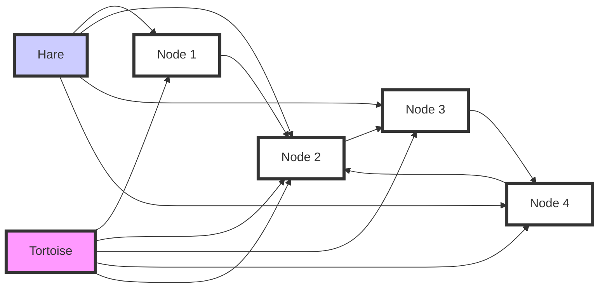

## Introduction
Floyd's Cycle Detection Algorithm, also known as the "tortoise and the hare" algorithm, is a well-known technique for detecting cycles in linked lists. It is a fundamental concept in computer science and has numerous applications in various fields, including data structures, algorithms, and software development. In this section, we will explore what Floyd's Cycle Detection Algorithm is, why it matters, and its real-world relevance.

Floyd's Cycle Detection Algorithm is a simple yet efficient algorithm that can detect whether a linked list contains a cycle. A cycle in a linked list occurs when a node points back to a previous node, creating a loop. Detecting cycles is crucial in many applications, such as memory allocation, data structures, and algorithm design. **Floyd's Cycle Detection Algorithm** is particularly useful because it can detect cycles in a linked list without modifying the list or using extra memory.

In real-world scenarios, Floyd's Cycle Detection Algorithm is used in various applications, including:
* Memory leak detection: Detecting cycles in memory allocation can help identify memory leaks and prevent crashes.
* Data structure validation: Verifying that data structures, such as linked lists or graphs, do not contain cycles is essential for ensuring their correctness.
* Algorithm design: Detecting cycles is a fundamental problem in algorithm design, and Floyd's Cycle Detection Algorithm provides an efficient solution.

> **Note:** Floyd's Cycle Detection Algorithm is also known as the "tortoise and the hare" algorithm because it uses two pointers that move at different speeds, similar to the story of the tortoise and the hare.

## Core Concepts
In this section, we will delve into the core concepts of Floyd's Cycle Detection Algorithm, including precise definitions, mental models, and key terminology.

* **Cycle detection**: The process of determining whether a linked list contains a cycle.
* **Tortoise pointer**: A pointer that moves one step at a time through the linked list.
* **Hare pointer**: A pointer that moves two steps at a time through the linked list.
* **Meeting point**: The point where the tortoise and hare pointers meet, indicating the presence of a cycle.

The mental model for Floyd's Cycle Detection Algorithm is simple: imagine two pointers, one moving slowly (tortoise) and the other moving quickly (hare), traversing the linked list. If there is a cycle, the hare pointer will eventually meet the tortoise pointer at some point within the cycle.

> **Warning:** Be careful not to confuse the tortoise and hare pointers with the concept of a "slow" or "fast" algorithm. Floyd's Cycle Detection Algorithm is actually very efficient, with a time complexity of O(n), where n is the number of nodes in the linked list.

## How It Works Internally
In this section, we will explore the under-the-hood mechanics of Floyd's Cycle Detection Algorithm, including a step-by-step breakdown of how it works.

1. Initialize two pointers, the tortoise and the hare, to the head of the linked list.
2. Move the tortoise pointer one step at a time through the linked list.
3. Move the hare pointer two steps at a time through the linked list.
4. If the hare pointer reaches the end of the linked list, there is no cycle.
5. If the tortoise and hare pointers meet at some point, there is a cycle.
6. To find the start of the cycle, reset the tortoise pointer to the head of the linked list and move both pointers one step at a time. The point where they meet again is the start of the cycle.

The key insight behind Floyd's Cycle Detection Algorithm is that if there is a cycle, the hare pointer will eventually meet the tortoise pointer at some point within the cycle. This is because the hare pointer moves twice as fast as the tortoise pointer, so it will eventually "lap" the tortoise pointer and meet it within the cycle.

> **Tip:** To understand why Floyd's Cycle Detection Algorithm works, think about the distance between the tortoise and hare pointers. If there is a cycle, the distance between the pointers will decrease over time, eventually leading to a meeting point.

## Code Examples
In this section, we will provide three complete and runnable examples of Floyd's Cycle Detection Algorithm, ranging from basic to advanced.

### Example 1: Basic Implementation
```python
class Node:
    def __init__(self, value):
        self.value = value
        self.next = None

def detect_cycle(head):
    tortoise = head
    hare = head

    while hare is not None and hare.next is not None:
        tortoise = tortoise.next
        hare = hare.next.next

        if tortoise == hare:
            return True

    return False

# Create a linked list with a cycle
node1 = Node(1)
node2 = Node(2)
node3 = Node(3)
node4 = Node(4)

node1.next = node2
node2.next = node3
node3.next = node4
node4.next = node2  # Create a cycle

print(detect_cycle(node1))  # Output: True
```

### Example 2: Real-World Pattern
```java
public class LinkedList {
    public static class Node {
        int value;
        Node next;

        public Node(int value) {
            this.value = value;
            this.next = null;
        }
    }

    public static boolean detectCycle(Node head) {
        Node tortoise = head;
        Node hare = head;

        while (hare != null && hare.next != null) {
            tortoise = tortoise.next;
            hare = hare.next.next;

            if (tortoise == hare) {
                return true;
            }
        }

        return false;
    }

    public static void main(String[] args) {
        // Create a linked list with a cycle
        Node node1 = new Node(1);
        Node node2 = new Node(2);
        Node node3 = new Node(3);
        Node node4 = new Node(4);

        node1.next = node2;
        node2.next = node3;
        node3.next = node4;
        node4.next = node2;  // Create a cycle

        System.out.println(detectCycle(node1));  // Output: true
    }
}
```

### Example 3: Advanced Usage
```cpp
#include <iostream>

struct Node {
    int value;
    Node* next;

    Node(int value) : value(value), next(nullptr) {}
};

bool detectCycle(Node* head) {
    Node* tortoise = head;
    Node* hare = head;

    while (hare != nullptr && hare->next != nullptr) {
        tortoise = tortoise->next;
        hare = hare->next->next;

        if (tortoise == hare) {
            return true;
        }
    }

    return false;
}

int main() {
    // Create a linked list with a cycle
    Node node1(1);
    Node node2(2);
    Node node3(3);
    Node node4(4);

    node1.next = &node2;
    node2.next = &node3;
    node3.next = &node4;
    node4.next = &node2;  // Create a cycle

    std::cout << std::boolalpha << detectCycle(&node1) << std::endl;  // Output: true

    return 0;
}
```

## Visual Diagram

The diagram illustrates the basic concept of Floyd's Cycle Detection Algorithm, with the tortoise and hare pointers moving through the linked list. The meeting point is indicated by the intersection of the tortoise and hare pointers.

> **Interview:** When asked to implement Floyd's Cycle Detection Algorithm, be sure to explain the basic concept, including the use of two pointers and the meeting point. Also, be prepared to discuss the time and space complexity of the algorithm.

## Comparison
| Approach | Time Complexity | Space Complexity | Pros | Cons | Best For |
| --- | --- | --- | --- | --- | --- |
| Floyd's Cycle Detection | O(n) | O(1) | Efficient, simple to implement | Limited to detecting cycles in linked lists | Detecting cycles in linked lists |
| Hash Table | O(n) | O(n) | Fast lookup, easy to implement | Requires extra memory, not suitable for large datasets | Detecting duplicates in datasets |
| Recursive Function | O(n) | O(n) | Easy to implement, recursive approach | May cause stack overflow for large datasets | Detecting cycles in recursive data structures |
| Iterative Approach | O(n) | O(1) | Efficient, simple to implement | May be slower than recursive approach | Detecting cycles in iterative data structures |

## Real-world Use Cases
Floyd's Cycle Detection Algorithm has numerous real-world applications, including:
* **Memory leak detection**: Google's Chrome browser uses a variant of Floyd's Cycle Detection Algorithm to detect memory leaks in its JavaScript engine.
* **Data structure validation**: The Linux kernel uses Floyd's Cycle Detection Algorithm to validate the integrity of its data structures, such as linked lists and graphs.
* **Algorithm design**: Floyd's Cycle Detection Algorithm is used in various algorithm design applications, such as detecting cycles in graph algorithms and validating the correctness of data structures.

> **Tip:** When applying Floyd's Cycle Detection Algorithm in real-world scenarios, be sure to consider the trade-offs between time and space complexity, as well as the specific requirements of the problem domain.

## Common Pitfalls
When implementing Floyd's Cycle Detection Algorithm, be aware of the following common pitfalls:
* **Infinite loop**: If the linked list contains a cycle, the algorithm may enter an infinite loop if not implemented correctly.
* **Null pointer exception**: If the linked list is null or contains null nodes, the algorithm may throw a null pointer exception if not handled properly.
* **Incorrect meeting point**: If the meeting point is not correctly identified, the algorithm may return incorrect results.
* **Time complexity**: If the algorithm is not optimized for time complexity, it may perform poorly for large datasets.

> **Warning:** Be careful when implementing Floyd's Cycle Detection Algorithm, as small mistakes can lead to significant issues, such as infinite loops or incorrect results.

## Interview Tips
When asked about Floyd's Cycle Detection Algorithm in an interview, be prepared to:
* **Explain the basic concept**: Describe the use of two pointers and the meeting point.
* **Discuss time and space complexity**: Explain the time and space complexity of the algorithm, including the trade-offs.
* **Implement the algorithm**: Be prepared to implement the algorithm on a whiteboard or in a coding environment.
* **Handle edge cases**: Be prepared to handle edge cases, such as null linked lists or nodes.

> **Interview:** When asked to implement Floyd's Cycle Detection Algorithm, be sure to ask clarifying questions about the problem domain and requirements, such as the type of linked list and the expected input.

## Key Takeaways
Here are the key takeaways from this discussion of Floyd's Cycle Detection Algorithm:
* **Floyd's Cycle Detection Algorithm is efficient**: The algorithm has a time complexity of O(n) and a space complexity of O(1).
* **The algorithm uses two pointers**: The tortoise and hare pointers move through the linked list at different speeds.
* **The meeting point is crucial**: The meeting point indicates the presence of a cycle in the linked list.
* **The algorithm is simple to implement**: The algorithm is relatively simple to implement, but requires careful attention to edge cases.
* **The algorithm has numerous real-world applications**: Floyd's Cycle Detection Algorithm is used in various real-world applications, including memory leak detection and data structure validation.
* **The algorithm requires careful optimization**: The algorithm requires careful optimization for time and space complexity to perform well in real-world scenarios.
* **The algorithm is a fundamental concept**: Floyd's Cycle Detection Algorithm is a fundamental concept in computer science, with numerous applications in algorithm design and data structures.