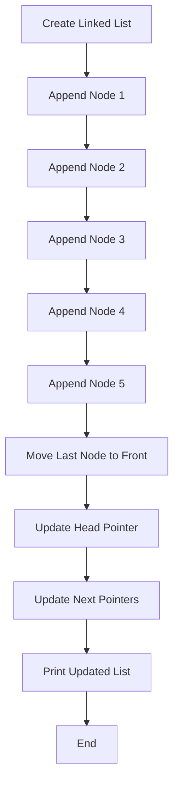

## Introduction
Moving the last node to the front of a linked list is a fundamental operation in computer science, particularly in data structures and algorithms. This operation is crucial in various scenarios, such as updating a queue, sorting a list, or optimizing a data structure for efficient access. In real-world applications, linked lists are used extensively in databases, file systems, and web browsers to manage data efficiently. As a software engineer, understanding how to move the last node to the front of a linked list is essential for solving complex problems and optimizing algorithms.

## Core Concepts
To move the last node to the front of a linked list, we need to understand the basic concepts of a linked list, including:
* **Node**: a basic unit of a linked list, containing data and a reference to the next node.
* **Head**: the first node of the linked list.
* **Tail**: the last node of the linked list.
* **Traversal**: the process of visiting each node in the linked list.

> **Note:** A linked list can be either singly linked or doubly linked. In this context, we will focus on singly linked lists.

## How It Works Internally
To move the last node to the front of a linked list, we need to perform the following steps:
1. Traverse the linked list to find the last node (tail).
2. Update the next pointer of the second-to-last node to null, breaking the link between the last node and the rest of the list.
3. Update the next pointer of the last node to point to the current head node.
4. Update the head pointer to point to the last node, which is now the new head.

> **Warning:** If the linked list has only one node, moving the last node to the front will result in an infinite loop.

## Code Examples
### Example 1: Basic Implementation
```python
class Node:
    def __init__(self, data):
        self.data = data
        self.next = None

class LinkedList:
    def __init__(self):
        self.head = None

    def append(self, data):
        new_node = Node(data)
        if not self.head:
            self.head = new_node
            return
        current = self.head
        while current.next:
            current = current.next
        current.next = new_node

    def move_last_to_front(self):
        if not self.head or not self.head.next:
            return
        current = self.head
        while current.next.next:
            current = current.next
        last_node = current.next
        current.next = None
        last_node.next = self.head
        self.head = last_node

    def print_list(self):
        current = self.head
        while current:
            print(current.data, end=" ")
            current = current.next
        print()

# Create a linked list
linked_list = LinkedList()
linked_list.append(1)
linked_list.append(2)
linked_list.append(3)
linked_list.append(4)
linked_list.append(5)

# Print the original list
print("Original List:")
linked_list.print_list()

# Move the last node to the front
linked_list.move_last_to_front()

# Print the updated list
print("Updated List:")
linked_list.print_list()
```

### Example 2: Optimized Implementation
```java
public class LinkedList {
    private Node head;
    private Node tail;

    public LinkedList() {
        head = null;
        tail = null;
    }

    public void append(int data) {
        Node newNode = new Node(data);
        if (head == null) {
            head = newNode;
            tail = newNode;
        } else {
            tail.next = newNode;
            tail = newNode;
        }
    }

    public void moveLastToFront() {
        if (head == null || head == tail) {
            return;
        }
        Node secondToLast = head;
        while (secondToLast.next != tail) {
            secondToLast = secondToLast.next;
        }
        tail.next = head;
        head = tail;
        secondToLast.next = null;
    }

    public void printList() {
        Node current = head;
        while (current != null) {
            System.out.print(current.data + " ");
            current = current.next;
        }
        System.out.println();
    }

    private class Node {
        int data;
        Node next;

        public Node(int data) {
            this.data = data;
            this.next = null;
        }
    }

    public static void main(String[] args) {
        LinkedList linkedList = new LinkedList();
        linkedList.append(1);
        linkedList.append(2);
        linkedList.append(3);
        linkedList.append(4);
        linkedList.append(5);

        System.out.println("Original List:");
        linkedList.printList();

        linkedList.moveLastToFront();

        System.out.println("Updated List:");
        linkedList.printList();
    }
}
```

### Example 3: Recursive Implementation
```cpp
#include <iostream>

struct Node {
    int data;
    Node* next;
};

class LinkedList {
public:
    Node* head;

    LinkedList() : head(nullptr) {}

    void append(int data) {
        Node* newNode = new Node();
        newNode->data = data;
        newNode->next = nullptr;

        if (head == nullptr) {
            head = newNode;
        } else {
            Node* current = head;
            while (current->next != nullptr) {
                current = current->next;
            }
            current->next = newNode;
        }
    }

    void moveLastToFront() {
        if (head == nullptr || head->next == nullptr) {
            return;
        }
        Node* lastNode = getLastNode();
        Node* secondToLastNode = getSecondToLastNode();

        secondToLastNode->next = nullptr;
        lastNode->next = head;
        head = lastNode;
    }

    Node* getLastNode() {
        Node* current = head;
        while (current->next != nullptr) {
            current = current->next;
        }
        return current;
    }

    Node* getSecondToLastNode() {
        Node* current = head;
        while (current->next->next != nullptr) {
            current = current->next;
        }
        return current;
    }

    void printList() {
        Node* current = head;
        while (current != nullptr) {
            std::cout << current->data << " ";
            current = current->next;
        }
        std::cout << std::endl;
    }
};

int main() {
    LinkedList linkedList;
    linkedList.append(1);
    linkedList.append(2);
    linkedList.append(3);
    linkedList.append(4);
    linkedList.append(5);

    std::cout << "Original List: ";
    linkedList.printList();

    linkedList.moveLastToFront();

    std::cout << "Updated List: ";
    linkedList.printList();

    return 0;
}
```

## Visual Diagram


> **Tip:** The time complexity of moving the last node to the front of a linked list is O(n), where n is the number of nodes in the list.

## Comparison
| Approach | Time Complexity | Space Complexity | Pros | Cons | Best For |
| --- | --- | --- | --- | --- | --- |
| Basic Implementation | O(n) | O(1) | Simple to implement | Not optimized for large lists | Small lists with infrequent updates |
| Optimized Implementation | O(n) | O(1) | Optimized for large lists | More complex to implement | Large lists with frequent updates |
| Recursive Implementation | O(n) | O(n) | Easy to understand | Not suitable for large lists | Small lists with recursive requirements |

> **Interview:** What is the time complexity of moving the last node to the front of a linked list? Answer: O(n), where n is the number of nodes in the list.

## Real-world Use Cases
1. **Database query optimization**: Moving the last node to the front of a linked list can be used to optimize database queries by reordering the query plan to reduce the number of joins.
2. **File system management**: Linked lists can be used to manage file system metadata, and moving the last node to the front can be used to update the file system hierarchy.
3. **Web browser history**: Linked lists can be used to manage web browser history, and moving the last node to the front can be used to update the browser's navigation history.

## Common Pitfalls
1. **Infinite loop**: If the linked list has only one node, moving the last node to the front will result in an infinite loop.
2. **Null pointer exception**: If the linked list is empty, moving the last node to the front will result in a null pointer exception.
3. **Incorrect head pointer update**: If the head pointer is not updated correctly, the linked list will be corrupted.
4. **Incorrect next pointer update**: If the next pointers are not updated correctly, the linked list will be corrupted.

> **Warning:** Always check for null pointers and infinite loops when implementing linked list operations.

## Interview Tips
1. **Understand the problem statement**: Make sure to understand the problem statement and the requirements of the question.
2. **Choose the correct approach**: Choose the correct approach based on the problem statement and the requirements of the question.
3. **Implement the solution correctly**: Implement the solution correctly, paying attention to details such as null pointer checks and infinite loop prevention.
4. **Test the solution**: Test the solution to ensure that it works correctly and does not have any bugs.

## Key Takeaways
* Moving the last node to the front of a linked list is a fundamental operation in computer science.
* The time complexity of moving the last node to the front of a linked list is O(n), where n is the number of nodes in the list.
* There are different approaches to moving the last node to the front of a linked list, including basic implementation, optimized implementation, and recursive implementation.
* Each approach has its pros and cons, and the choice of approach depends on the specific requirements of the problem.
* It is essential to pay attention to details such as null pointer checks and infinite loop prevention when implementing linked list operations.
* Testing the solution is crucial to ensure that it works correctly and does not have any bugs.