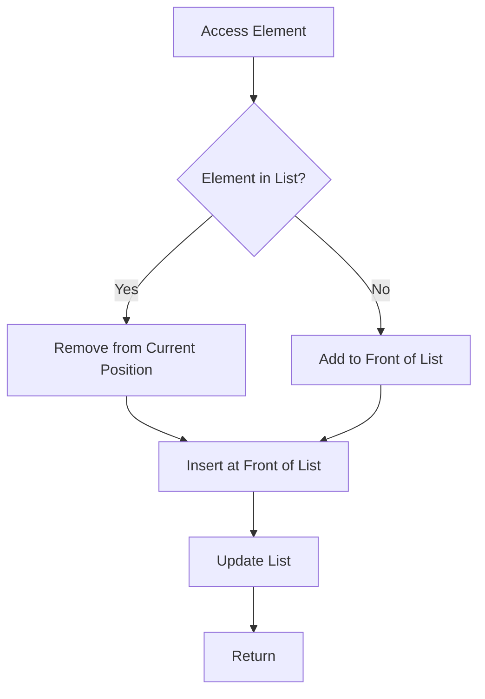

## Introduction
Self-organizing lists are a type of data structure that rearranges its elements based on access patterns. The move-to-front heuristic is a popular strategy used in self-organizing lists, where the most recently accessed element is moved to the front of the list. This approach is useful in scenarios where the access pattern is not random, and the most frequently accessed elements are likely to be accessed again in the near future. **Self-organizing lists** are particularly useful in applications such as web browsers, file systems, and database query optimization, where the access pattern is often skewed towards recently accessed elements.

## Core Concepts
The core concept of self-organizing lists is to minimize the average access time by rearranging the elements based on access patterns. The **move-to-front heuristic** is a simple and effective strategy that achieves this goal. The key terminology associated with self-organizing lists includes:
* **Access pattern**: The sequence of elements accessed by the application.
* **Move-to-front heuristic**: The strategy of moving the most recently accessed element to the front of the list.
* **Self-organizing list**: A data structure that rearranges its elements based on access patterns.

> **Note:** The move-to-front heuristic is a simple and effective strategy, but it can be sensitive to the initial order of the elements.

## How It Works Internally
The move-to-front heuristic works by maintaining a linked list of elements. When an element is accessed, it is moved to the front of the list. The internal mechanics of the move-to-front heuristic can be broken down into the following steps:
1. Initialize an empty linked list.
2. When an element is accessed, check if it is already in the list.
3. If the element is already in the list, remove it from its current position and insert it at the front of the list.
4. If the element is not in the list, add it to the front of the list.

The time complexity of the move-to-front heuristic is O(1) for accessing an element that is already in the list, and O(n) for adding a new element to the list, where n is the number of elements in the list. The space complexity is O(n), where n is the number of elements in the list.

## Code Examples
### Example 1: Basic Move-to-Front Heuristic
```python
class Node:
    def __init__(self, data):
        self.data = data
        self.next = None

class SelfOrganizingList:
    def __init__(self):
        self.head = None

    def access(self, data):
        # Check if the element is already in the list
        current = self.head
        previous = None
        while current is not None:
            if current.data == data:
                # Remove the element from its current position
                if previous is not None:
                    previous.next = current.next
                else:
                    self.head = current.next
                # Insert the element at the front of the list
                current.next = self.head
                self.head = current
                return
            previous = current
            current = current.next
        # If the element is not in the list, add it to the front of the list
        new_node = Node(data)
        new_node.next = self.head
        self.head = new_node

    def print_list(self):
        current = self.head
        while current is not None:
            print(current.data, end=" ")
            current = current.next
        print()

# Create a self-organizing list
list = SelfOrganizingList()
list.access(1)
list.access(2)
list.access(3)
list.access(1)
list.print_list()  # Output: 1 2 3
```
### Example 2: Real-World Pattern
```python
class WebBrowser:
    def __init__(self):
        self.history = SelfOrganizingList()

    def visit(self, url):
        self.history.access(url)

    def print_history(self):
        self.history.print_list()

# Create a web browser
browser = WebBrowser()
browser.visit("https://www.google.com")
browser.visit("https://www.facebook.com")
browser.visit("https://www.google.com")
browser.print_history()  # Output: https://www.google.com https://www.facebook.com
```
### Example 3: Advanced Usage
```python
class Database:
    def __init__(self):
        self.query_cache = SelfOrganizingList()

    def execute_query(self, query):
        self.query_cache.access(query)

    def print_query_cache(self):
        self.query_cache.print_list()

# Create a database
db = Database()
db.execute_query("SELECT * FROM users")
db.execute_query("SELECT * FROM orders")
db.execute_query("SELECT * FROM users")
db.print_query_cache()  # Output: SELECT * FROM users SELECT * FROM orders
```
> **Tip:** The move-to-front heuristic can be used in conjunction with other caching strategies, such as LRU or LFU, to improve the overall performance of the system.

## Visual Diagram

The diagram illustrates the move-to-front heuristic, where an element is accessed and moved to the front of the list if it is already in the list, or added to the front of the list if it is not.

## Comparison
| Approach | Time Complexity | Space Complexity | Pros | Cons | Best For |
| --- | --- | --- | --- | --- | --- |
| Move-to-Front Heuristic | O(1) | O(n) | Simple to implement, effective for skewed access patterns | Sensitive to initial order, may not perform well for random access patterns | Web browsers, file systems, database query optimization |
| LRU Cache | O(1) | O(n) | Effective for random access patterns, easy to implement | May not perform well for skewed access patterns | Web applications, database query optimization |
| LFU Cache | O(1) | O(n) | Effective for both skewed and random access patterns | More complex to implement | Web applications, database query optimization |
| Random Replacement | O(1) | O(n) | Simple to implement, effective for random access patterns | May not perform well for skewed access patterns | Web applications, database query optimization |

> **Warning:** The move-to-front heuristic can be sensitive to the initial order of the elements, and may not perform well for random access patterns.

## Real-world Use Cases
1. **Web Browsers**: Web browsers use self-organizing lists to manage the browsing history. The most recently accessed web pages are moved to the front of the list, making it easier to access them again.
2. **File Systems**: File systems use self-organizing lists to manage the file access patterns. The most recently accessed files are moved to the front of the list, making it easier to access them again.
3. **Database Query Optimization**: Database query optimization uses self-organizing lists to manage the query access patterns. The most recently accessed queries are moved to the front of the list, making it easier to access them again.

## Common Pitfalls
1. **Incorrect Implementation**: An incorrect implementation of the move-to-front heuristic can lead to poor performance and incorrect results.
```python
# Incorrect implementation
class SelfOrganizingList:
    def __init__(self):
        self.head = None

    def access(self, data):
        # Incorrectly implemented access method
        self.head = Node(data)
```
2. **Not Handling Edge Cases**: Not handling edge cases, such as an empty list, can lead to errors and poor performance.
```python
# Incorrect implementation
class SelfOrganizingList:
    def __init__(self):
        self.head = None

    def access(self, data):
        # Not handling edge case where list is empty
        current = self.head
        while current is not None:
            if current.data == data:
                # Remove the element from its current position
                previous.next = current.next
                # Insert the element at the front of the list
                current.next = self.head
                self.head = current
                return
            previous = current
            current = current.next
```
3. **Not Updating the List**: Not updating the list after accessing an element can lead to incorrect results and poor performance.
```python
# Incorrect implementation
class SelfOrganizingList:
    def __init__(self):
        self.head = None

    def access(self, data):
        # Not updating the list after accessing an element
        current = self.head
        while current is not None:
            if current.data == data:
                return
            current = current.next
```
4. **Not Handling Duplicate Elements**: Not handling duplicate elements can lead to incorrect results and poor performance.
```python
# Incorrect implementation
class SelfOrganizingList:
    def __init__(self):
        self.head = None

    def access(self, data):
        # Not handling duplicate elements
        current = self.head
        while current is not None:
            if current.data == data:
                # Remove the element from its current position
                previous.next = current.next
                # Insert the element at the front of the list
                current.next = self.head
                self.head = current
                return
            previous = current
            current = current.next
        # Add the element to the front of the list
        new_node = Node(data)
        new_node.next = self.head
        self.head = new_node
```
> **Interview:** Can you explain the difference between the move-to-front heuristic and the LRU cache?

## Interview Tips
1. **Understand the Basics**: Make sure to understand the basics of self-organizing lists and the move-to-front heuristic.
2. **Be Prepared to Implement**: Be prepared to implement the move-to-front heuristic from scratch.
3. **Know the Time and Space Complexity**: Know the time and space complexity of the move-to-front heuristic.
4. **Be Aware of Edge Cases**: Be aware of edge cases, such as an empty list, and know how to handle them.
5. **Practice, Practice, Practice**: Practice implementing the move-to-front heuristic and handling edge cases.

## Key Takeaways
* The move-to-front heuristic is a simple and effective strategy for self-organizing lists.
* The time complexity of the move-to-front heuristic is O(1) for accessing an element that is already in the list, and O(n) for adding a new element to the list.
* The space complexity of the move-to-front heuristic is O(n), where n is the number of elements in the list.
* The move-to-front heuristic can be used in conjunction with other caching strategies, such as LRU or LFU, to improve the overall performance of the system.
* The move-to-front heuristic is sensitive to the initial order of the elements, and may not perform well for random access patterns.
* The move-to-front heuristic is effective for skewed access patterns, and can be used in applications such as web browsers, file systems, and database query optimization.
* It is important to handle edge cases, such as an empty list, and to update the list after accessing an element.
* It is also important to be aware of duplicate elements and to handle them correctly.