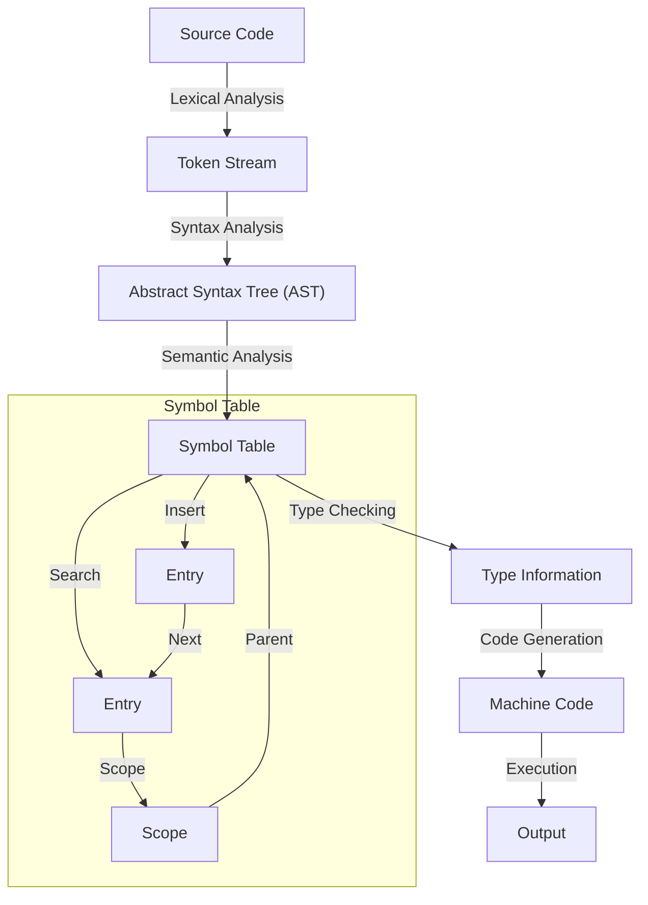

## Introduction
A **symbol table** is a data structure used in compilers to store information about the symbols (e.g., variables, functions, labels) in the source code. It plays a crucial role in the compilation process, as it allows the compiler to keep track of the symbols' declarations, definitions, and usage. In this section, we will explore the importance of symbol tables, their real-world relevance, and why every engineer should understand how they work.

> **Note:** Symbol tables are not limited to compilers; they are also used in other areas, such as interpreters, debuggers, and IDEs.

Symbol tables are essential in compilers because they enable the compiler to:

*   Check for errors, such as duplicate declarations or undefined references
*   Resolve symbol references, such as function calls or variable accesses
*   Optimize code, such as by eliminating unnecessary variables or functions
*   Generate debug information, such as line numbers and file names

## Core Concepts
A symbol table is a data structure that maps symbols to their corresponding information. The key concepts in a symbol table are:

*   **Symbol**: a string that represents a variable, function, label, or other entity in the source code
*   **Scope**: the region of the source code where a symbol is defined and can be accessed
*   **Declaration**: the statement that introduces a symbol and specifies its type and attributes
*   **Definition**: the statement that provides the implementation or value of a symbol
*   **Reference**: the statement that uses a symbol, such as a function call or variable access

> **Warning:** A symbol table is not a simple hash table; it requires careful management of scopes, declarations, and definitions to ensure correct compilation.

The key terminology in symbol tables includes:

*   **Entry**: a single record in the symbol table that contains information about a symbol
*   **Table**: the symbol table itself, which is a collection of entries
*   **Scope stack**: a data structure that keeps track of the current scope and its nesting

## How It Works Internally
A symbol table using a **linked list** works as follows:

1.  The compiler creates a new entry for each symbol it encounters in the source code.
2.  The entry is added to the symbol table, which is implemented as a linked list.
3.  When a symbol is referenced, the compiler searches the symbol table to find the corresponding entry.
4.  If the entry is found, the compiler checks the scope and attributes of the symbol to ensure correct usage.
5.  If the entry is not found, the compiler reports an error, such as an undefined reference.

The under-the-hood mechanics of a symbol table using a linked list involve:

*   **Insertion**: adding a new entry to the symbol table
*   **Search**: finding an existing entry in the symbol table
*   **Deletion**: removing an entry from the symbol table
*   **Traversal**: iterating over the entries in the symbol table

> **Tip:** Using a linked list to implement a symbol table allows for efficient insertion and deletion of entries, which is essential for compilers that need to handle large source code files.

## Code Examples
Here are three complete and runnable examples of symbol tables using linked lists:

### Example 1: Basic Symbol Table
```python
class SymbolTable:
    class Entry:
        def __init__(self, symbol, scope):
            self.symbol = symbol
            self.scope = scope
            self.next = None

    def __init__(self):
        self.head = None

    def insert(self, symbol, scope):
        entry = self.Entry(symbol, scope)
        entry.next = self.head
        self.head = entry

    def search(self, symbol):
        current = self.head
        while current:
            if current.symbol == symbol:
                return current
            current = current.next
        return None

# Create a symbol table
table = SymbolTable()

# Insert some entries
table.insert("x", "global")
table.insert("y", "local")

# Search for an entry
entry = table.search("x")
if entry:
    print(f"Found symbol '{entry.symbol}' in scope '{entry.scope}'")
else:
    print("Symbol not found")
```

### Example 2: Symbol Table with Scopes
```java
public class SymbolTable {
    private static class Entry {
        String symbol;
        String scope;
        Entry next;

        public Entry(String symbol, String scope) {
            this.symbol = symbol;
            this.scope = scope;
        }
    }

    private Entry head;

    public void insert(String symbol, String scope) {
        Entry entry = new Entry(symbol, scope);
        entry.next = head;
        head = entry;
    }

    public Entry search(String symbol) {
        Entry current = head;
        while (current != null) {
            if (current.symbol.equals(symbol)) {
                return current;
            }
            current = current.next;
        }
        return null;
    }

    public static void main(String[] args) {
        SymbolTable table = new SymbolTable();

        // Insert some entries
        table.insert("x", "global");
        table.insert("y", "local");

        // Search for an entry
        SymbolTable.Entry entry = table.search("x");
        if (entry != null) {
            System.out.println("Found symbol '" + entry.symbol + "' in scope '" + entry.scope + "'");
        } else {
            System.out.println("Symbol not found");
        }
    }
}
```

### Example 3: Advanced Symbol Table with Error Handling
```cpp
#include <iostream>
#include <string>

class SymbolTable {
public:
    struct Entry {
        std::string symbol;
        std::string scope;
        Entry* next;
    };

    SymbolTable() : head(nullptr) {}

    void insert(const std::string& symbol, const std::string& scope) {
        Entry* entry = new Entry();
        entry->symbol = symbol;
        entry->scope = scope;
        entry->next = head;
        head = entry;
    }

    Entry* search(const std::string& symbol) {
        Entry* current = head;
        while (current != nullptr) {
            if (current->symbol == symbol) {
                return current;
            }
            current = current->next;
        }
        return nullptr;
    }

    void printError(const std::string& message) {
        std::cerr << "Error: " << message << std::endl;
    }

    ~SymbolTable() {
        while (head != nullptr) {
            Entry* temp = head;
            head = head->next;
            delete temp;
        }
    }

private:
    Entry* head;
};

int main() {
    SymbolTable table;

    // Insert some entries
    table.insert("x", "global");
    table.insert("y", "local");

    // Search for an entry
    SymbolTable::Entry* entry = table.search("x");
    if (entry != nullptr) {
        std::cout << "Found symbol '" << entry->symbol << "' in scope '" << entry->scope << "'" << std::endl;
    } else {
        table.printError("Symbol not found");
    }

    return 0;
}
```

## Visual Diagram

The diagram illustrates the symbol table's role in the compilation process. It shows how the symbol table is created and used during semantic analysis, type checking, and code generation.

> **Interview:** Can you explain how a symbol table is used in a compiler? What are the key components of a symbol table, and how do they interact with each other?

## Comparison
| Approach | Time Complexity | Space Complexity | Pros | Cons | Best For |
| --- | --- | --- | --- | --- | --- |
| Hash Table | O(1) average | O(n) | Fast lookup and insertion, suitable for large symbol tables | Collision handling can be complex, not suitable for small symbol tables | Compilers with large source code files |
| Linked List | O(n) | O(n) | Simple implementation, suitable for small symbol tables | Slow lookup and insertion, not suitable for large symbol tables | Compilers with small source code files |
| Binary Search Tree | O(log n) | O(n) | Fast lookup and insertion, suitable for medium-sized symbol tables | Implementation can be complex, not suitable for very large symbol tables | Compilers with medium-sized source code files |
| Trie | O(m) | O(n) | Fast lookup and insertion, suitable for symbol tables with common prefixes | Implementation can be complex, not suitable for symbol tables with few common prefixes | Compilers with symbol tables that have many common prefixes |

## Real-world Use Cases
Here are three real-world use cases of symbol tables in compilers:

*   **GCC**: The GNU Compiler Collection (GCC) uses a symbol table to manage the symbols in the source code. The symbol table is implemented as a hash table, which allows for fast lookup and insertion.
*   **LLVM**: The LLVM compiler infrastructure uses a symbol table to manage the symbols in the source code. The symbol table is implemented as a combination of a hash table and a binary search tree, which allows for fast lookup and insertion.
*   **Java Compiler**: The Java compiler uses a symbol table to manage the symbols in the source code. The symbol table is implemented as a hash table, which allows for fast lookup and insertion.

> **Tip:** When implementing a symbol table, consider using a combination of data structures, such as a hash table and a binary search tree, to achieve fast lookup and insertion.

## Common Pitfalls
Here are four common pitfalls to avoid when implementing a symbol table:

*   **Not handling scope correctly**: Failing to handle scope correctly can lead to incorrect symbol resolution and errors.
*   **Not handling duplicate declarations**: Failing to handle duplicate declarations can lead to errors and incorrect symbol resolution.
*   **Not handling undefined references**: Failing to handle undefined references can lead to errors and incorrect symbol resolution.
*   **Not optimizing the symbol table**: Failing to optimize the symbol table can lead to slow lookup and insertion times.

> **Warning:** When implementing a symbol table, be sure to handle errors and exceptions correctly to avoid crashes and incorrect behavior.

## Interview Tips
Here are three common interview questions related to symbol tables, along with sample answers:

*   **What is a symbol table, and how is it used in a compiler?**
    *   A symbol table is a data structure that maps symbols to their corresponding information, such as their type and scope. It is used in a compiler to manage the symbols in the source code and to resolve references to symbols.
*   **How do you implement a symbol table using a linked list?**
    *   To implement a symbol table using a linked list, you would create a node for each symbol and link the nodes together. You would also need to implement functions to insert, search, and delete nodes from the linked list.
*   **What are the advantages and disadvantages of using a hash table versus a linked list to implement a symbol table?**
    *   A hash table has the advantage of fast lookup and insertion times, but it can be complex to implement and may have collision handling issues. A linked list has the advantage of simple implementation, but it can have slow lookup and insertion times.

> **Interview:** Can you explain the difference between a symbol table and a hash table? How would you implement a symbol table using a hash table?

## Key Takeaways
Here are ten key takeaways to remember about symbol tables:

*   A symbol table is a data structure that maps symbols to their corresponding information.
*   A symbol table is used in a compiler to manage the symbols in the source code and to resolve references to symbols.
*   A symbol table can be implemented using a variety of data structures, such as a hash table, linked list, or binary search tree.
*   The choice of data structure depends on the specific requirements of the compiler and the characteristics of the symbol table.
*   A symbol table should be optimized for fast lookup and insertion times.
*   A symbol table should handle scope correctly to avoid errors and incorrect symbol resolution.
*   A symbol table should handle duplicate declarations and undefined references correctly to avoid errors and incorrect symbol resolution.
*   A symbol table should be designed to handle a large number of symbols and to scale well with the size of the source code.
*   A symbol table should be implemented using a combination of data structures, such as a hash table and a binary search tree, to achieve fast lookup and insertion times.
*   A symbol table should be tested thoroughly to ensure correct behavior and to catch any errors or bugs.