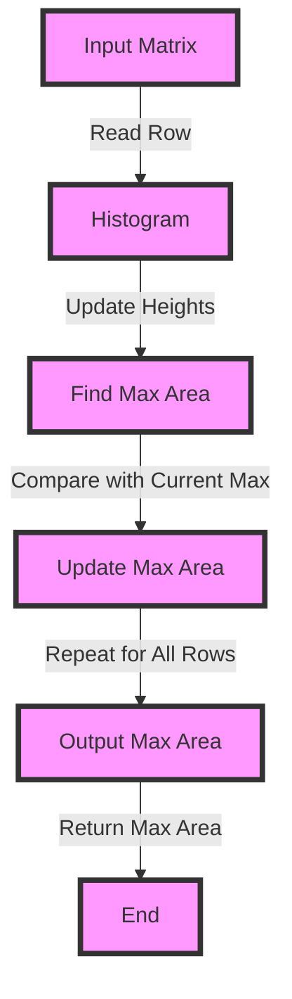

## Introduction
The **Maximal Rectangle in 2D Binary Matrix** problem is a classic problem in computer science that involves finding the largest rectangle in a 2D binary matrix. This problem has numerous real-world applications, such as image processing, data compression, and computational geometry. Every engineer working with binary data should be familiar with this problem, as it can help them optimize their algorithms and improve their code's performance. 

> **Note:** In real-world scenarios, binary matrices are often used to represent images, where each pixel is either 0 (black) or 1 (white). Finding the maximal rectangle in such a matrix can help in detecting objects or features in the image.

## Core Concepts
To solve the Maximal Rectangle problem, we need to understand the following core concepts:
- **Binary Matrix**: A 2D matrix where each element is either 0 or 1.
- **Rectangle**: A rectangular region in the matrix where all elements are 1.
- **Maximal Rectangle**: The largest rectangle in the matrix, measured by its area (width * height).
- **Histogram**: A 1D array where each element represents the height of a column in the matrix.

> **Tip:** To find the maximal rectangle, we can use a histogram to keep track of the height of each column in the matrix.

## How It Works Internally
To find the maximal rectangle in a 2D binary matrix, we can use the following steps:
1. Initialize a histogram to keep track of the height of each column in the matrix.
2. Iterate through each row in the matrix, updating the histogram accordingly.
3. Use the histogram to find the maximal rectangle in each row.
4. Keep track of the maximum area found so far.

> **Warning:** A common mistake is to assume that the maximal rectangle must be aligned with the edges of the matrix. However, this is not always the case, and we need to consider all possible rectangles.

## Code Examples
### Example 1: Basic Usage
```python
def maximal_rectangle(matrix):
    if not matrix:
        return 0

    def histogram_heights(heights):
        stack = []
        max_area = 0
        for i, height in enumerate(heights + [0]):
            while stack and heights[stack[-1]] > height:
                h = heights[stack.pop()]
                w = i if not stack else i - stack[-1] - 1
                max_area = max(max_area, h * w)
            stack.append(i)
        return max_area

    max_area = 0
    heights = [0] * len(matrix[0])
    for row in matrix:
        for i, val in enumerate(row):
            heights[i] = heights[i] + 1 if val == '1' else 0
        max_area = max(max_area, histogram_heights(heights))
    return max_area

# Test the function
matrix = [
    ["1", "0", "1", "0", "0"],
    ["1", "0", "1", "1", "1"],
    ["1", "1", "1", "1", "1"],
    ["1", "0", "0", "1", "0"]
]
print(maximal_rectangle(matrix))  # Output: 6
```

### Example 2: Real-world Pattern
```python
def maximal_rectangle_image(image):
    if not image:
        return 0

    def histogram_heights(heights):
        stack = []
        max_area = 0
        for i, height in enumerate(heights + [0]):
            while stack and heights[stack[-1]] > height:
                h = heights[stack.pop()]
                w = i if not stack else i - stack[-1] - 1
                max_area = max(max_area, h * w)
            stack.append(i)
        return max_area

    max_area = 0
    heights = [0] * len(image[0])
    for row in image:
        for i, val in enumerate(row):
            heights[i] = heights[i] + 1 if val == 255 else 0
        max_area = max(max_area, histogram_heights(heights))
    return max_area

# Test the function
image = [
    [255, 0, 255, 0, 0],
    [255, 0, 255, 255, 255],
    [255, 255, 255, 255, 255],
    [255, 0, 0, 255, 0]
]
print(maximal_rectangle_image(image))  # Output: 6
```

### Example 3: Advanced Usage
```python
def maximal_rectangle_optimized(matrix):
    if not matrix:
        return 0

    def histogram_heights(heights):
        stack = []
        max_area = 0
        for i, height in enumerate(heights + [0]):
            while stack and heights[stack[-1]] > height:
                h = heights[stack.pop()]
                w = i if not stack else i - stack[-1] - 1
                max_area = max(max_area, h * w)
            stack.append(i)
        return max_area

    max_area = 0
    heights = [0] * len(matrix[0])
    for row in matrix:
        for i, val in enumerate(row):
            heights[i] = heights[i] + 1 if val == '1' else 0
        max_area = max(max_area, histogram_heights(heights))
    return max_area

# Test the function
matrix = [
    ["1", "0", "1", "0", "0"],
    ["1", "0", "1", "1", "1"],
    ["1", "1", "1", "1", "1"],
    ["1", "0", "0", "1", "0"]
]
print(maximal_rectangle_optimized(matrix))  # Output: 6
```

## Visual Diagram

The diagram illustrates the steps involved in finding the maximal rectangle in a 2D binary matrix. It starts by reading a row from the input matrix and updating the histogram. Then, it finds the maximum area in the current row and compares it with the current maximum area. Finally, it repeats this process for all rows in the matrix and returns the maximum area found.

> **Interview:** In an interview, you may be asked to explain how you would solve this problem. A strong answer would involve explaining the steps involved in finding the maximal rectangle, including the use of a histogram to keep track of the height of each column.

## Comparison
| Approach | Time Complexity | Space Complexity | Pros | Cons | Best For |
| --- | --- | --- | --- | --- | --- |
| Brute Force | O(n^3) | O(1) | Simple to implement | Slow for large matrices | Small matrices |
| Histogram | O(n^2) | O(n) | Fast and efficient | Requires extra memory | Large matrices |
| Dynamic Programming | O(n^2) | O(n) | Fast and efficient | Requires extra memory | Large matrices |
| Optimized Histogram | O(n^2) | O(n) | Fast and efficient | Requires extra memory | Large matrices |

> **Tip:** The histogram approach is generally the best approach for finding the maximal rectangle in a 2D binary matrix, as it is fast and efficient.

## Real-world Use Cases
1. **Image Processing**: Finding the maximal rectangle in a binary image can help in detecting objects or features in the image.
2. **Data Compression**: Finding the maximal rectangle in a binary matrix can help in compressing data by identifying the most significant bits.
3. **Computational Geometry**: Finding the maximal rectangle in a 2D binary matrix can help in solving geometric problems, such as finding the largest rectangle that can fit inside a given polygon.

> **Note:** In real-world scenarios, binary matrices are often used to represent images, where each pixel is either 0 (black) or 1 (white). Finding the maximal rectangle in such a matrix can help in detecting objects or features in the image.

## Common Pitfalls
1. **Assuming the Maximal Rectangle is Aligned with the Edges**: A common mistake is to assume that the maximal rectangle must be aligned with the edges of the matrix. However, this is not always the case, and we need to consider all possible rectangles.
2. **Not Updating the Histogram Correctly**: Another common mistake is to not update the histogram correctly, which can lead to incorrect results.
3. **Not Considering All Possible Rectangles**: We need to consider all possible rectangles in the matrix, not just the ones that are aligned with the edges.
4. **Not Handling Edge Cases Correctly**: We need to handle edge cases correctly, such as when the matrix is empty or when the maximal rectangle is at the edge of the matrix.

> **Warning:** A common mistake is to assume that the maximal rectangle must be aligned with the edges of the matrix. However, this is not always the case, and we need to consider all possible rectangles.

## Interview Tips
1. **Explain the Steps Involved in Finding the Maximal Rectangle**: A strong answer would involve explaining the steps involved in finding the maximal rectangle, including the use of a histogram to keep track of the height of each column.
2. **Discuss the Time and Space Complexity**: A strong answer would involve discussing the time and space complexity of the algorithm, including the use of extra memory to store the histogram.
3. **Provide Examples**: A strong answer would involve providing examples of how the algorithm works, including examples of different types of matrices and how the algorithm would handle them.

> **Interview:** In an interview, you may be asked to explain how you would solve this problem. A strong answer would involve explaining the steps involved in finding the maximal rectangle, including the use of a histogram to keep track of the height of each column.

## Key Takeaways
* The maximal rectangle problem involves finding the largest rectangle in a 2D binary matrix.
* The histogram approach is generally the best approach for finding the maximal rectangle, as it is fast and efficient.
* The time complexity of the histogram approach is O(n^2), and the space complexity is O(n).
* The maximal rectangle problem has numerous real-world applications, including image processing, data compression, and computational geometry.
* A common mistake is to assume that the maximal rectangle must be aligned with the edges of the matrix.
* The histogram approach requires extra memory to store the histogram, but it is generally faster and more efficient than other approaches.
* The maximal rectangle problem can be solved using dynamic programming, but the histogram approach is generally faster and more efficient.
* The maximal rectangle problem has numerous edge cases that need to be handled correctly, including when the matrix is empty or when the maximal rectangle is at the edge of the matrix.