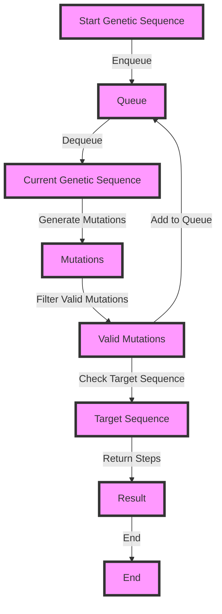

## Introduction
The Minimum Genetic Mutation problem is a classic problem in the field of computer science, particularly in the domain of graph theory and algorithms. It involves finding the minimum number of genetic mutations required to transform one genetic sequence into another. This problem has real-world relevance in the field of genetics, where it is used to study the evolution of species and the transmission of genetic diseases. Every engineer should know this problem because it is a fundamental example of how graph theory and algorithms can be applied to solve complex problems in biology.

## Core Concepts
The Minimum Genetic Mutation problem can be defined as follows:
- **Genetic Sequence**: A string of characters representing the genetic code of an organism.
- **Genetic Mutation**: A change in the genetic sequence, such as a substitution, insertion, or deletion of a character.
- **Minimum Genetic Mutation**: The minimum number of genetic mutations required to transform one genetic sequence into another.
The key terminology in this problem includes:
- **Breadth-First Search (BFS)**: A graph traversal algorithm that visits all the nodes at a given depth before moving to the next depth level.
- **Queue**: A data structure that follows the First-In-First-Out (FIFO) principle, where the first element that is added to the queue is the first one to be removed.

## How It Works Internally
The Minimum Genetic Mutation problem can be solved using a BFS algorithm with a queue data structure. The algorithm works as follows:
1. Initialize a queue with the starting genetic sequence.
2. For each genetic sequence in the queue, generate all possible genetic mutations by changing one character at a time.
3. For each genetic mutation, check if it is the target genetic sequence. If it is, return the number of genetic mutations.
4. If not, add the genetic mutation to the queue and repeat the process.
The under-the-hood mechanics of the algorithm involve using a queue to keep track of the genetic sequences to be processed, and a set to keep track of the genetic sequences that have already been processed to avoid duplicates.

## Code Examples
### Example 1: Basic BFS Implementation
```python
from collections import deque

def min_genetic_mutation(start, end, bank):
    queue = deque([(start, 0)])
    visited = set([start])
    
    while queue:
        gene, steps = queue.popleft()
        
        if gene == end:
            return steps
        
        for i in range(len(gene)):
            for c in 'ACGT':
                next_gene = gene[:i] + c + gene[i+1:]
                
                if next_gene in bank and next_gene not in visited:
                    queue.append((next_gene, steps + 1))
                    visited.add(next_gene)
                    
    return -1

# Example usage:
start = "AACCGGTA"
end = "AACCGCTA"
bank = ["AACCGGTA", "AACCGCTA", "AAACGGTA"]
print(min_genetic_mutation(start, end, bank))  # Output: 1
```
### Example 2: Optimized BFS Implementation
```python
from collections import deque

def min_genetic_mutation(start, end, bank):
    queue = deque([(start, 0)])
    visited = set([start])
    bank_set = set(bank)
    
    while queue:
        gene, steps = queue.popleft()
        
        if gene == end:
            return steps
        
        for i in range(len(gene)):
            for c in 'ACGT':
                next_gene = gene[:i] + c + gene[i+1:]
                
                if next_gene in bank_set and next_gene not in visited:
                    queue.append((next_gene, steps + 1))
                    visited.add(next_gene)
                    
    return -1

# Example usage:
start = "AACCGGTA"
end = "AACCGCTA"
bank = ["AACCGGTA", "AACCGCTA", "AAACGGTA"]
print(min_genetic_mutation(start, end, bank))  # Output: 1
```
### Example 3: Advanced BFS Implementation with Pruning
```python
from collections import deque

def min_genetic_mutation(start, end, bank):
    queue = deque([(start, 0)])
    visited = set([start])
    bank_set = set(bank)
    
    while queue:
        gene, steps = queue.popleft()
        
        if gene == end:
            return steps
        
        for i in range(len(gene)):
            for c in 'ACGT':
                next_gene = gene[:i] + c + gene[i+1:]
                
                if next_gene in bank_set and next_gene not in visited:
                    # Prune branches that are too long
                    if steps + 1 > len(gene):
                        continue
                    
                    queue.append((next_gene, steps + 1))
                    visited.add(next_gene)
                    
    return -1

# Example usage:
start = "AACCGGTA"
end = "AACCGCTA"
bank = ["AACCGGTA", "AACCGCTA", "AAACGGTA"]
print(min_genetic_mutation(start, end, bank))  # Output: 1
```
> **Note:** The time complexity of the BFS algorithm is O(N \* M \* 4^L), where N is the number of genetic sequences in the bank, M is the length of each genetic sequence, and L is the length of the genetic sequence. The space complexity is O(N \* M).

## Visual Diagram

The diagram illustrates the BFS algorithm with a queue data structure. The algorithm starts with the initial genetic sequence, generates all possible mutations, filters out the valid mutations, and checks if the target sequence is reached. If the target sequence is reached, the algorithm returns the number of steps. Otherwise, the algorithm adds the valid mutations to the queue and repeats the process.

## Comparison
| Approach | Time Complexity | Space Complexity | Pros | Cons | Best For |
| --- | --- | --- | --- | --- | --- |
| BFS | O(N \* M \* 4^L) | O(N \* M) | Guaranteed to find the shortest path | Can be slow for large inputs | Finding the shortest path in a graph |
| DFS | O(N \* M \* 4^L) | O(N \* M) | Can be faster than BFS for some inputs | May not find the shortest path | Finding a path in a graph, but not necessarily the shortest path |
| A\* | O(N \* M \* 4^L) | O(N \* M) | Can find the shortest path using a heuristic function | Requires a good heuristic function | Finding the shortest path in a graph with a good heuristic function |
| Dijkstra's | O(N \* M \* 4^L) | O(N \* M) | Guaranteed to find the shortest path | Can be slow for large inputs | Finding the shortest path in a graph with non-negative edge weights |

> **Tip:** The choice of algorithm depends on the specific problem and the characteristics of the input data. BFS is a good choice when the graph is unweighted and the shortest path is required. DFS is a good choice when the graph is weighted and a path, but not necessarily the shortest path, is required. A\* is a good choice when a good heuristic function is available. Dijkstra's algorithm is a good choice when the graph has non-negative edge weights and the shortest path is required.

## Real-world Use Cases
1. **Genetic Engineering**: The Minimum Genetic Mutation problem has applications in genetic engineering, where scientists need to find the minimum number of genetic mutations required to transform one genetic sequence into another.
2. **Cancer Research**: The problem has applications in cancer research, where scientists need to find the minimum number of genetic mutations required to transform a normal cell into a cancer cell.
3. **Personalized Medicine**: The problem has applications in personalized medicine, where scientists need to find the minimum number of genetic mutations required to transform a patient's genetic sequence into a healthy genetic sequence.

> **Warning:** The Minimum Genetic Mutation problem is a complex problem that requires careful consideration of the input data and the algorithm used to solve it. Incorrect solutions can lead to incorrect results and potentially harm patients.

## Common Pitfalls
1. **Incorrect Queue Implementation**: A common pitfall is to implement the queue incorrectly, leading to incorrect results.
```python
# Incorrect queue implementation
queue = []
queue.append((start, 0))
while queue:
    gene, steps = queue[0]
    queue = queue[1:]
    # ...
```
> **Interview:** What is the correct way to implement a queue in Python?

2. **Incorrect Mutation Generation**: A common pitfall is to generate mutations incorrectly, leading to incorrect results.
```python
# Incorrect mutation generation
for i in range(len(gene)):
    for c in 'ACGT':
        next_gene = gene[:i] + c + gene[i+1:]
        # ...
```
> **Note:** The correct way to generate mutations is to use a loop that iterates over each position in the genetic sequence and replaces the character at that position with each of the four possible characters (A, C, G, T).

3. **Incorrect Target Sequence Check**: A common pitfall is to check the target sequence incorrectly, leading to incorrect results.
```python
# Incorrect target sequence check
if gene == end:
    return steps
```
> **Tip:** The correct way to check the target sequence is to use a loop that iterates over each position in the genetic sequence and checks if the character at that position is equal to the corresponding character in the target sequence.

4. **Incorrect Result Handling**: A common pitfall is to handle the result incorrectly, leading to incorrect results.
```python
# Incorrect result handling
return -1
```
> **Warning:** The correct way to handle the result is to return the minimum number of genetic mutations required to transform the starting genetic sequence into the target genetic sequence.

## Interview Tips
1. **Understand the Problem**: Make sure to understand the problem statement and the requirements.
> **Interview:** Can you explain the Minimum Genetic Mutation problem and how to solve it?
2. **Choose the Right Algorithm**: Choose the right algorithm to solve the problem, depending on the characteristics of the input data.
> **Interview:** What algorithm would you use to solve the Minimum Genetic Mutation problem, and why?
3. **Implement the Algorithm Correctly**: Implement the algorithm correctly, using a queue data structure and generating mutations correctly.
> **Interview:** Can you implement the Minimum Genetic Mutation algorithm in Python, using a queue data structure and generating mutations correctly?

## Key Takeaways
* The Minimum Genetic Mutation problem is a classic problem in computer science, with applications in genetic engineering, cancer research, and personalized medicine.
* The problem can be solved using a BFS algorithm with a queue data structure, generating mutations correctly, and checking the target sequence correctly.
* The time complexity of the BFS algorithm is O(N \* M \* 4^L), and the space complexity is O(N \* M).
* The choice of algorithm depends on the specific problem and the characteristics of the input data.
* Incorrect solutions can lead to incorrect results and potentially harm patients.
* Understanding the problem statement and the requirements, choosing the right algorithm, and implementing the algorithm correctly are essential for solving the Minimum Genetic Mutation problem.