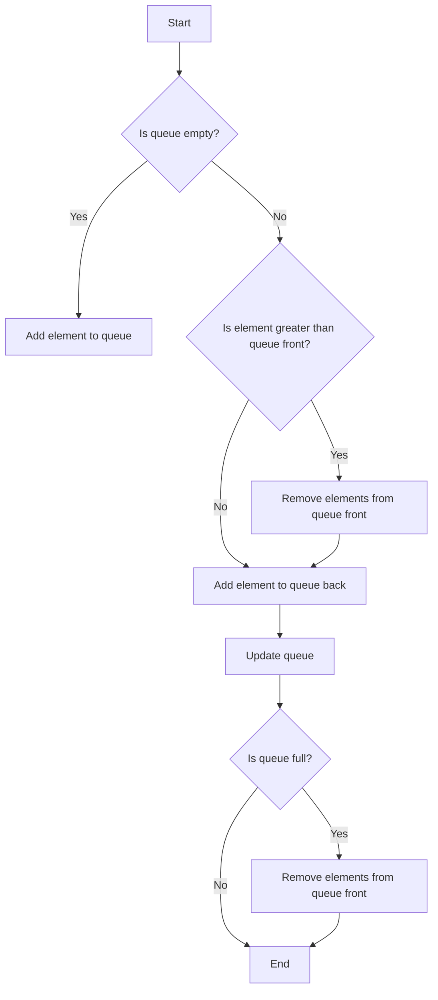

## Introduction
The **Monotonic Queue Pattern** is a design pattern used in algorithmic problems to solve problems that involve maintaining a queue of elements in a specific order, typically monotonic. This pattern is essential in solving problems that require finding the maximum or minimum element in a subarray or sliding window. The monotonic queue pattern is widely used in real-world applications, such as financial analysis, data processing, and scientific computing. Every engineer should be familiar with this pattern, as it provides an efficient solution to complex problems.

## Core Concepts
The core concept of the monotonic queue pattern is to maintain a queue of elements in a specific order, typically monotonic. This is achieved by using a data structure, such as a deque or a stack, to store the elements. The queue is updated by removing elements that are no longer relevant and adding new elements that meet the monotonic condition. The key terminology used in this pattern includes:
* **Monotonic**: a sequence of elements that is either increasing or decreasing.
* **Queue**: a data structure that follows the First-In-First-Out (FIFO) principle.
* **Deque**: a data structure that follows the Double-Ended Queue principle, allowing elements to be added or removed from both ends.

> **Note:** The monotonic queue pattern is not limited to solving problems with a single queue. It can be extended to solve problems with multiple queues or complex data structures.

## How It Works Internally
The monotonic queue pattern works internally by maintaining a queue of elements in a specific order. The queue is updated by iterating through the elements and removing those that are no longer relevant. The following steps outline the internal mechanics of the monotonic queue pattern:
1. Initialize an empty queue.
2. Iterate through the elements, and for each element:
	* Remove elements from the front of the queue that are no longer relevant.
	* Add the current element to the back of the queue if it meets the monotonic condition.
3. Repeat step 2 until all elements have been processed.
4. The final queue contains the elements in the desired monotonic order.

> **Warning:** If the queue is not updated correctly, it can lead to incorrect results or inefficient performance.

## Code Examples
### Example 1: Basic Monotonic Queue
```java
import java.util.Deque;
import java.util.LinkedList;

public class MonotonicQueue {
    public static void main(String[] args) {
        int[] arr = {1, 2, 3, 4, 5};
        Deque<Integer> queue = new LinkedList<>();
        for (int num : arr) {
            // Remove elements from the front of the queue that are no longer relevant
            while (!queue.isEmpty() && queue.peekLast() < num) {
                queue.removeLast();
            }
            // Add the current element to the back of the queue
            queue.addLast(num);
        }
        System.out.println(queue); // [5]
    }
}
```
### Example 2: Real-World Pattern
```python
from collections import deque

def max_sliding_window(arr, k):
    """
    Find the maximum element in a sliding window of size k.
    """
    queue = deque()
    for i, num in enumerate(arr):
        # Remove elements from the front of the queue that are no longer relevant
        while queue and queue[0] < i - k + 1:
            queue.popleft()
        # Remove elements from the back of the queue that are smaller than the current element
        while queue and arr[queue[-1]] < num:
            queue.pop()
        # Add the current element to the back of the queue
        queue.append(i)
        # Print the maximum element in the current window
        if i >= k - 1:
            print(arr[queue[0]])
```
### Example 3: Advanced Monotonic Queue
```cpp
#include <iostream>
#include <deque>

class MonotonicQueue {
public:
    void push(int num) {
        // Remove elements from the front of the queue that are no longer relevant
        while (!queue_.empty() && queue_.back() < num) {
            queue_.pop_back();
        }
        // Add the current element to the back of the queue
        queue_.push_back(num);
    }

    int getMax() {
        return queue_.front();
    }

private:
    std::deque<int> queue_;
};

int main() {
    MonotonicQueue queue;
    queue.push(1);
    queue.push(2);
    queue.push(3);
    std::cout << queue.getMax() << std::endl; // 3
    return 0;
}
```
> **Tip:** The monotonic queue pattern can be optimized by using a data structure that supports efficient insertion and removal of elements, such as a deque.

## Visual Diagram

The above diagram illustrates the monotonic queue pattern, where elements are added to the queue based on their value and the queue is updated by removing elements that are no longer relevant.

## Comparison
| Approach | Time Complexity | Space Complexity | Pros | Cons | Best For |
| --- | --- | --- | --- | --- | --- |
| Monotonic Queue | O(n) | O(n) | Efficient, scalable | Limited to monotonic sequences | Finding maximum/minimum element in a subarray or sliding window |
| Sliding Window | O(n) | O(1) | Simple, efficient | Limited to fixed-size windows | Finding maximum/minimum element in a fixed-size window |
| Dynamic Programming | O(n^2) | O(n) | Flexible, powerful | Computationally expensive | Solving complex optimization problems |
| Brute Force | O(n^3) | O(1) | Simple, easy to implement | Computationally expensive | Solving small-scale problems |

> **Interview:** Can you explain the time complexity of the monotonic queue pattern? How does it compare to other approaches?

## Real-world Use Cases
1. **Financial Analysis**: The monotonic queue pattern is used in financial analysis to find the maximum or minimum value of a stock or portfolio over a given time period.
2. **Data Processing**: The monotonic queue pattern is used in data processing to find the maximum or minimum value of a dataset over a given window size.
3. **Scientific Computing**: The monotonic queue pattern is used in scientific computing to find the maximum or minimum value of a simulation or experiment over a given time period.

## Common Pitfalls
1. **Incorrect Queue Update**: Failing to update the queue correctly can lead to incorrect results or inefficient performance.
```java
// Incorrect queue update
while (!queue.isEmpty() && queue.peekLast() > num) {
    queue.removeLast();
}
```
2. **Insufficient Queue Size**: Using a queue that is too small can lead to incorrect results or inefficient performance.
```java
// Insufficient queue size
Deque<Integer> queue = new LinkedList<>(10);
```
3. **Incorrect Element Removal**: Failing to remove elements from the queue correctly can lead to incorrect results or inefficient performance.
```java
// Incorrect element removal
while (!queue.isEmpty() && queue.peekFirst() < num) {
    queue.removeFirst();
}
```
4. **Incorrect Queue Initialization**: Failing to initialize the queue correctly can lead to incorrect results or inefficient performance.
```java
// Incorrect queue initialization
Deque<Integer> queue = new LinkedList<>();
queue.add(null);
```
> **Warning:** The monotonic queue pattern requires careful attention to queue update, size, and element removal to ensure correct and efficient performance.

## Interview Tips
1. **Be prepared to explain the time complexity**: The interviewer may ask you to explain the time complexity of the monotonic queue pattern. Be prepared to provide a clear and concise explanation.
2. **Be prepared to write code**: The interviewer may ask you to write code to implement the monotonic queue pattern. Be prepared to write clean, efficient, and well-documented code.
3. **Be prepared to discuss trade-offs**: The interviewer may ask you to discuss the trade-offs between different approaches, such as the monotonic queue pattern and the sliding window approach. Be prepared to provide a thoughtful and well-reasoned discussion.

## Key Takeaways
* The monotonic queue pattern is a design pattern used to solve problems that involve maintaining a queue of elements in a specific order.
* The monotonic queue pattern has a time complexity of O(n) and a space complexity of O(n).
* The monotonic queue pattern is efficient and scalable, but limited to monotonic sequences.
* The monotonic queue pattern is used in real-world applications, such as financial analysis, data processing, and scientific computing.
* The monotonic queue pattern requires careful attention to queue update, size, and element removal to ensure correct and efficient performance.
* The monotonic queue pattern can be optimized by using a data structure that supports efficient insertion and removal of elements, such as a deque.
* The monotonic queue pattern can be used to solve complex optimization problems, but may require additional techniques, such as dynamic programming.