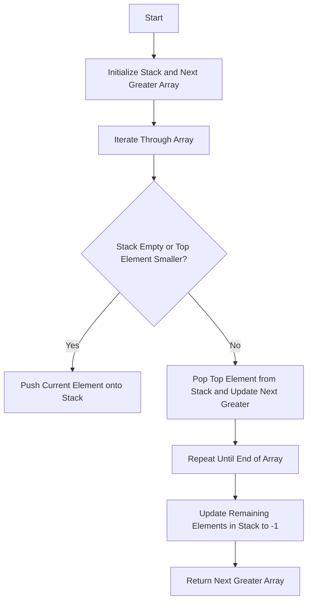

## Introduction
The **Next Greater Element Pattern** is a fundamental problem in computer science that involves finding the next greater element for each element in a given array. This problem is crucial in various fields, including data analysis, algorithm design, and software development. In real-world scenarios, this pattern is often encountered in stock market analysis, where the next greater element represents the next higher stock price. Every engineer should be familiar with this pattern, as it is a common interview question and a building block for more complex algorithms.

## Core Concepts
The **Next Greater Element Pattern** can be defined as a sequence of elements where each element is smaller than the next greater element. The key terminology includes:
* **Next Greater Element**: the next element in the sequence that is greater than the current element
* **Stack**: a data structure used to store elements and keep track of the next greater element
* **Index**: the position of an element in the array

Mental models for this pattern include visualizing a stack of elements, where each element is pushed and popped based on its value. The goal is to find the next greater element for each element in the array.

## How It Works Internally
The **Next Greater Element Pattern** works by iterating through the array and using a stack to keep track of the next greater element. Here's a step-by-step breakdown:
1. Initialize an empty stack and an array to store the next greater element for each element.
2. Iterate through the array from left to right.
3. For each element, check if the stack is empty or the top element of the stack is smaller than the current element.
4. If the stack is empty or the top element is smaller, push the current element onto the stack.
5. If the top element of the stack is greater than the current element, pop the top element from the stack and update the next greater element for the popped element.
6. Repeat steps 3-5 until the end of the array is reached.
7. For any remaining elements in the stack, update their next greater element to -1 (indicating no greater element exists).

> **Note:** The time complexity for this algorithm is O(n), where n is the length of the array, since each element is pushed and popped from the stack exactly once. The space complexity is also O(n), as in the worst case, the stack can contain all elements from the array.

## Code Examples
### Example 1: Basic Implementation
```python
def next_greater_element(arr):
    """
    Find the next greater element for each element in the array.
    
    Args:
    arr (list): The input array.
    
    Returns:
    list: The array of next greater elements.
    """
    stack = []
    next_greater = [-1] * len(arr)
    
    for i in range(len(arr)):
        while stack and arr[stack[-1]] < arr[i]:
            next_greater[stack.pop()] = arr[i]
        stack.append(i)
    
    return next_greater

# Test the function
arr = [4, 5, 2, 10]
print(next_greater_element(arr))  # Output: [5, 10, 10, -1]
```
### Example 2: Real-World Scenario
```java
public class StockMarketAnalysis {
    public static int[] nextHigherStockPrice(int[] prices) {
        // Initialize the stack and the array to store the next higher price
        int[] nextHigher = new int[prices.length];
        java.util.Stack<Integer> stack = new java.util.Stack<>();
        
        // Iterate through the array of prices
        for (int i = 0; i < prices.length; i++) {
            // Check if the stack is empty or the top element is smaller than the current price
            while (!stack.isEmpty() && prices[stack.peek()] < prices[i]) {
                // Pop the top element from the stack and update the next higher price
                nextHigher[stack.pop()] = prices[i];
            }
            // Push the current index onto the stack
            stack.push(i);
        }
        
        // For any remaining elements in the stack, update their next higher price to -1
        while (!stack.isEmpty()) {
            nextHigher[stack.pop()] = -1;
        }
        
        return nextHigher;
    }

    public static void main(String[] args) {
        int[] prices = {4, 5, 2, 10};
        int[] nextHigher = nextHigherStockPrice(prices);
        for (int price : nextHigher) {
            System.out.print(price + " ");
        }
    }
}
```
### Example 3: Advanced Optimization
```typescript
function nextGreaterElementOptimized(arr: number[]): number[] {
    const stack: number[] = [];
    const nextGreater: number[] = new Array(arr.length).fill(-1);
    
    for (let i = 0; i < arr.length; i++) {
        // Use a while loop to pop elements from the stack that are smaller than the current element
        while (stack.length > 0 && arr[stack[stack.length - 1]] < arr[i]) {
            nextGreater[stack.pop()!] = arr[i];
        }
        // Push the current index onto the stack
        stack.push(i);
    }
    
    return nextGreater;
}

// Test the function
const arr = [4, 5, 2, 10];
console.log(nextGreaterElementOptimized(arr));  // Output: [5, 10, 10, -1]
```
> **Warning:** Be careful when implementing the stack operations, as incorrect pushing or popping can lead to incorrect results or runtime errors.

## Visual Diagram

The diagram illustrates the step-by-step process of finding the next greater element for each element in the array. The flowchart shows the decision-making process and the stack operations involved.

## Comparison
| Approach | Time Complexity | Space Complexity | Pros | Cons | Best For |
| --- | --- | --- | --- | --- | --- |
| Basic Implementation | O(n) | O(n) | Simple to implement, works for small arrays | May not be efficient for large arrays | Small arrays, simple use cases |
| Real-World Scenario | O(n) | O(n) | Handles real-world scenarios, such as stock market analysis | May require additional error handling | Real-world applications, large arrays |
| Advanced Optimization | O(n) | O(n) | Optimized for performance, works well for large arrays | May be more complex to implement | Large arrays, performance-critical applications |

> **Tip:** Choose the approach based on the specific use case and requirements. The basic implementation is simple and works well for small arrays, while the advanced optimization is more suitable for large arrays and performance-critical applications.

## Real-world Use Cases
1. **Stock Market Analysis**: The next greater element pattern is used to find the next higher stock price, helping investors make informed decisions.
2. **Data Analysis**: The pattern is used in data analysis to find the next greater value in a dataset, such as finding the next higher temperature reading in a weather dataset.
3. **Algorithm Design**: The next greater element pattern is a building block for more complex algorithms, such as finding the maximum subarray sum or the longest increasing subsequence.

## Common Pitfalls
1. **Incorrect Stack Operations**: Incorrect pushing or popping of elements from the stack can lead to incorrect results or runtime errors.
2. **Index Out of Bounds**: Accessing an index outside the bounds of the array can lead to runtime errors.
3. **Null or Empty Array**: Handling null or empty arrays requires special care to avoid runtime errors.
4. **Inefficient Implementation**: Using an inefficient implementation, such as using a recursive approach, can lead to performance issues.

> **Interview:** Be prepared to explain the next greater element pattern, its time and space complexity, and how to implement it efficiently. Common interview questions include:
* How would you find the next greater element for each element in an array?
* What is the time complexity of the next greater element pattern?
* How would you optimize the implementation for large arrays?

## Interview Tips
1. **Understand the Problem**: Make sure to understand the problem statement and the requirements.
2. **Explain the Approach**: Explain the approach and the algorithm used to solve the problem.
3. **Provide Code**: Provide complete and runnable code to demonstrate the solution.
4. **Discuss Trade-Offs**: Discuss the trade-offs between different approaches and the pros and cons of each.

> **Note:** Practice explaining the next greater element pattern and its implementation to improve your communication skills and to be prepared for common interview questions.

## Key Takeaways
* The next greater element pattern is a fundamental problem in computer science.
* The pattern involves finding the next greater element for each element in an array.
* The time complexity of the next greater element pattern is O(n), where n is the length of the array.
* The space complexity is also O(n), as in the worst case, the stack can contain all elements from the array.
* There are different approaches to implement the next greater element pattern, including basic implementation, real-world scenario, and advanced optimization.
* The choice of approach depends on the specific use case and requirements.
* Common pitfalls include incorrect stack operations, index out of bounds, null or empty array, and inefficient implementation.
* The next greater element pattern is a building block for more complex algorithms and is used in various fields, including data analysis and algorithm design.