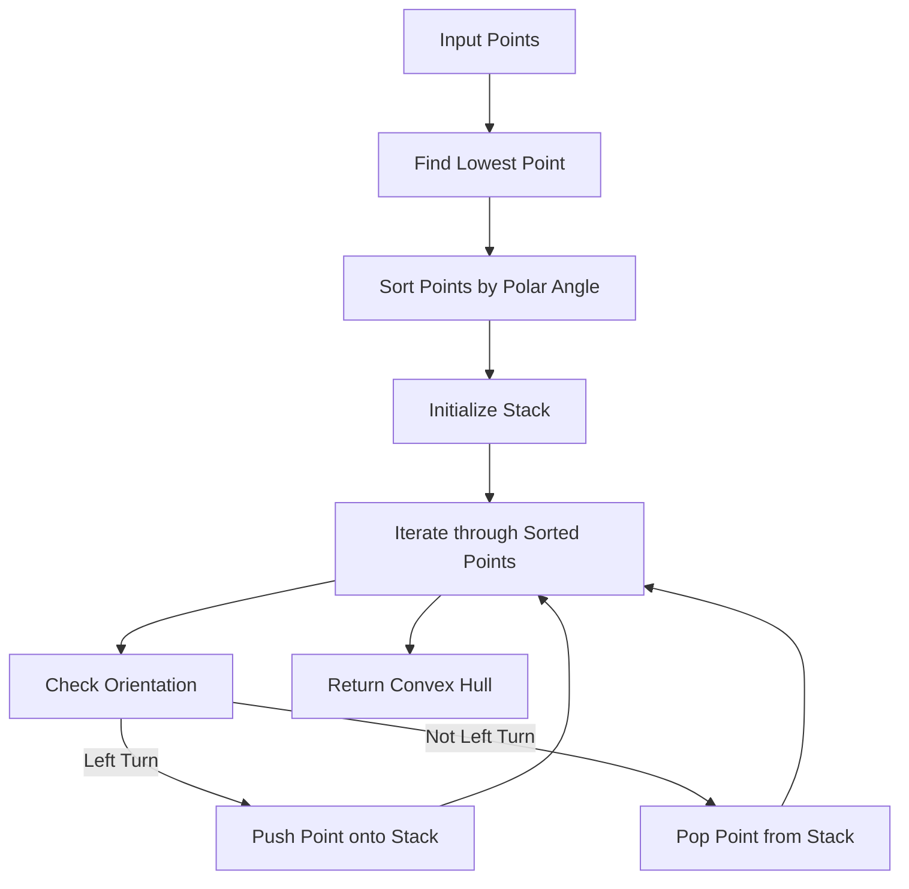

## Introduction
The **Convex Hull** problem is a classic problem in computational geometry, where we are given a set of points in a 2D plane and asked to find the smallest convex polygon that encloses all the points. This problem has numerous real-world applications, such as **computer vision**, **robotics**, and **geographic information systems**. One of the most efficient algorithms to solve this problem is the **Graham Scan** algorithm, which uses a **stack** data structure to find the convex hull in O(n log n) time complexity. In this article, we will delve into the details of the Graham Scan algorithm and explore how stacks are used to solve the convex hull problem.

## Core Concepts
To understand the Graham Scan algorithm, we need to define some key concepts:
* **Convex Hull**: The smallest convex polygon that encloses all the points in a given set.
* **Convex Polygon**: A polygon where all interior angles are less than 180 degrees.
* **Polar Angle**: The angle between a point and the origin, measured in a counterclockwise direction.
* **Stack**: A LIFO (Last-In-First-Out) data structure that allows us to push and pop elements efficiently.
The Graham Scan algorithm works by first finding the **lowest point** (the point with the smallest y-coordinate) and then sorting the remaining points by their **polar angle** with respect to the lowest point.

## How It Works Internally
The Graham Scan algorithm can be broken down into the following steps:
1. Find the **lowest point** (the point with the smallest y-coordinate).
2. Sort the remaining points by their **polar angle** with respect to the lowest point.
3. Initialize an empty **stack** to store the points that make up the convex hull.
4. Iterate through the sorted points, pushing each point onto the stack.
5. If the top two points on the stack and the current point do not make a **left turn** (i.e., they are not in counterclockwise order), pop the top point off the stack.
6. Repeat steps 4 and 5 until all points have been processed.
The Graham Scan algorithm has a time complexity of O(n log n) due to the sorting step, and a space complexity of O(n) for the stack.

## Code Examples
### Example 1: Basic Graham Scan Implementation
```python
import math

def orientation(p, q, r):
    """Calculate the orientation of three points."""
    val = (q[1] - p[1]) * (r[0] - q[0]) - (q[0] - p[0]) * (r[1] - q[1])
    if val == 0:  # Collinear
        return 0
    elif val > 0:  # Clockwise
        return 1
    else:  # Counterclockwise
        return 2

def convex_hull(points):
    """Find the convex hull of a set of points using the Graham Scan algorithm."""
    n = len(points)
    if n < 3:
        raise ValueError("Convex hull not possible")

    # Find the lowest point
    lowest_point = min(points, key=lambda x: (x[1], x[0]))

    # Sort points by polar angle with respect to the lowest point
    sorted_points = sorted([point for point in points if point != lowest_point],
                             key=lambda p: math.atan2(p[1] - lowest_point[1], p[0] - lowest_point[0]))

    # Initialize the stack with the lowest point and the first two sorted points
    stack = [lowest_point, sorted_points[0], sorted_points[1]]

    # Iterate through the remaining sorted points
    for i in range(2, n - 1):
        while len(stack) > 1 and orientation(stack[-2], stack[-1], sorted_points[i]) != 2:
            stack.pop()
        stack.append(sorted_points[i])

    return stack

points = [(0, 3), (1, 1), (2, 2), (4, 4), (0, 0), (1, 2), (3, 1), (3, 3)]
hull = convex_hull(points)
print(hull)
```
> **Note:** This implementation assumes that the input points are distinct and that the convex hull is not empty.

### Example 2: Real-World Graham Scan Implementation
```python
import numpy as np

class Point:
    def __init__(self, x, y):
        self.x = x
        self.y = y

def orientation(p, q, r):
    """Calculate the orientation of three points."""
    val = (q.y - p.y) * (r.x - q.x) - (q.x - p.x) * (r.y - q.y)
    if val == 0:  # Collinear
        return 0
    elif val > 0:  # Clockwise
        return 1
    else:  # Counterclockwise
        return 2

def convex_hull(points):
    """Find the convex hull of a set of points using the Graham Scan algorithm."""
    n = len(points)
    if n < 3:
        raise ValueError("Convex hull not possible")

    # Find the lowest point
    lowest_point = min(points, key=lambda x: (x.y, x.x))

    # Sort points by polar angle with respect to the lowest point
    sorted_points = sorted([point for point in points if point != lowest_point],
                             key=lambda p: np.arctan2(p.y - lowest_point.y, p.x - lowest_point.x))

    # Initialize the stack with the lowest point and the first two sorted points
    stack = [lowest_point, sorted_points[0], sorted_points[1]]

    # Iterate through the remaining sorted points
    for i in range(2, n - 1):
        while len(stack) > 1 and orientation(stack[-2], stack[-1], sorted_points[i]) != 2:
            stack.pop()
        stack.append(sorted_points[i])

    return stack

points = [Point(0, 3), Point(1, 1), Point(2, 2), Point(4, 4), Point(0, 0), Point(1, 2), Point(3, 1), Point(3, 3)]
hull = convex_hull(points)
print([f"({point.x}, {point.y})" for point in hull])
```
> **Tip:** To improve the performance of the Graham Scan algorithm, you can use a more efficient sorting algorithm, such as **quicksort** or **mergesort**, to sort the points by their polar angle.

### Example 3: Advanced Graham Scan Implementation with Error Handling
```python
import numpy as np

class Point:
    def __init__(self, x, y):
        self.x = x
        self.y = y

def orientation(p, q, r):
    """Calculate the orientation of three points."""
    val = (q.y - p.y) * (r.x - q.x) - (q.x - p.x) * (r.y - q.y)
    if val == 0:  # Collinear
        return 0
    elif val > 0:  # Clockwise
        return 1
    else:  # Counterclockwise
        return 2

def convex_hull(points):
    """Find the convex hull of a set of points using the Graham Scan algorithm."""
    if not points:
        raise ValueError("Input points are empty")

    n = len(points)
    if n < 3:
        raise ValueError("Convex hull not possible")

    # Find the lowest point
    try:
        lowest_point = min(points, key=lambda x: (x.y, x.x))
    except TypeError:
        raise ValueError("Input points must be instances of Point")

    # Sort points by polar angle with respect to the lowest point
    try:
        sorted_points = sorted([point for point in points if point != lowest_point],
                                 key=lambda p: np.arctan2(p.y - lowest_point.y, p.x - lowest_point.x))
    except TypeError:
        raise ValueError("Input points must have x and y attributes")

    # Initialize the stack with the lowest point and the first two sorted points
    stack = [lowest_point, sorted_points[0], sorted_points[1]]

    # Iterate through the remaining sorted points
    for i in range(2, n - 1):
        while len(stack) > 1 and orientation(stack[-2], stack[-1], sorted_points[i]) != 2:
            stack.pop()
        stack.append(sorted_points[i])

    return stack

points = [Point(0, 3), Point(1, 1), Point(2, 2), Point(4, 4), Point(0, 0), Point(1, 2), Point(3, 1), Point(3, 3)]
hull = convex_hull(points)
print([f"({point.x}, {point.y})" for point in hull])
```
> **Warning:** The Graham Scan algorithm assumes that the input points are distinct. If the input points are not distinct, the algorithm may not produce the correct convex hull.

## Visual Diagram

The diagram illustrates the main steps of the Graham Scan algorithm. The algorithm starts by finding the **lowest point**, then sorts the remaining points by their **polar angle** with respect to the lowest point. The algorithm then initializes a **stack** with the lowest point and the first two sorted points. The algorithm iterates through the remaining sorted points, checking the **orientation** of each point with respect to the top two points on the stack. If the point makes a **left turn**, it is pushed onto the stack. If not, the top point is popped from the stack.

## Comparison
| Algorithm | Time Complexity | Space Complexity | Pros | Cons | Best For |
| --- | --- | --- | --- | --- | --- |
| Graham Scan | O(n log n) | O(n) | Efficient, simple to implement | Assume distinct points, sensitive to input order | General-purpose convex hull computation |
| Jarvis March | O(nh) | O(n) | Simple to understand, works for non-convex polygons | Slow for large inputs, sensitive to input order | Small to medium-sized inputs, non-convex polygons |
| Quickhull | O(n log n) | O(n) | Fast, robust | Complex to implement, sensitive to input order | Large inputs, robust convex hull computation |
| Chan's Algorithm | O(n) | O(n) | Fast, simple to implement | Limited to 2D convex hulls, assume distinct points | 2D convex hull computation, small to medium-sized inputs |

## Real-world Use Cases
1. **Computer Vision**: The convex hull algorithm is used in computer vision to detect objects and track their movement.
2. **Robotics**: The convex hull algorithm is used in robotics to detect obstacles and plan motion paths.
3. **Geographic Information Systems**: The convex hull algorithm is used in GIS to detect the boundary of a set of geographic points.

## Common Pitfalls
1. **Assuming distinct points**: The Graham Scan algorithm assumes that the input points are distinct. If the input points are not distinct, the algorithm may not produce the correct convex hull.
2. **Sensitive to input order**: The Graham Scan algorithm is sensitive to the input order of the points. If the input order is not correct, the algorithm may not produce the correct convex hull.
3. **Limited to 2D convex hulls**: The Graham Scan algorithm is limited to 2D convex hulls. If you need to compute the convex hull of a 3D set of points, you will need to use a different algorithm.
4. **Slow for large inputs**: The Graham Scan algorithm can be slow for large inputs. If you need to compute the convex hull of a large set of points, you may need to use a more efficient algorithm.

## Interview Tips
1. **Be prepared to explain the Graham Scan algorithm**: The Graham Scan algorithm is a common topic in technical interviews. Be prepared to explain how the algorithm works and how to implement it.
2. **Practice implementing the Graham Scan algorithm**: Practice implementing the Graham Scan algorithm on a whiteboard or in a coding environment. This will help you to understand the algorithm better and to be able to implement it correctly.
3. **Be prepared to answer questions about the time and space complexity**: Be prepared to answer questions about the time and space complexity of the Graham Scan algorithm.
4. **Be prepared to answer questions about the limitations of the Graham Scan algorithm**: Be prepared to answer questions about the limitations of the Graham Scan algorithm, such as its sensitivity to input order and its limitation to 2D convex hulls.

## Key Takeaways
* The Graham Scan algorithm is an efficient algorithm for computing the convex hull of a set of points.
* The algorithm has a time complexity of O(n log n) and a space complexity of O(n).
* The algorithm assumes that the input points are distinct and is sensitive to the input order of the points.
* The algorithm is limited to 2D convex hulls.
* The algorithm can be slow for large inputs.
* The algorithm is commonly used in computer vision, robotics, and geographic information systems.
* The algorithm is a common topic in technical interviews, and it is important to be prepared to explain how it works and how to implement it.