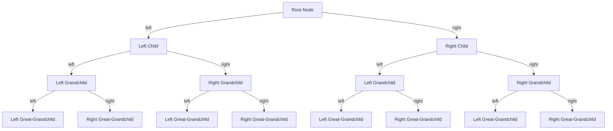

## Introduction
Infinite binary trees are a fundamental data structure in computer science, specifically in the realm of tree data structures. They are used to represent hierarchical relationships between elements, where each node has at most two children, referred to as the left child and the right child. Infinite binary trees are essential in many real-world applications, such as file systems, database indexing, and compiler design. **Understanding infinite binary trees is crucial for any aspiring software engineer**, as they are a building block for more complex data structures and algorithms.

> **Note:** Infinite binary trees are also known as binary trees or btrees. However, it's essential to distinguish between infinite binary trees and finite binary trees, as the former can have an unbounded number of nodes.

## Core Concepts
To grasp infinite binary trees, it's essential to understand the following key concepts:
* **Node:** A node represents a single element in the tree, which can have a value and references to its left and right children.
* **Edge:** An edge represents the connection between two nodes, where a node can have at most two edges, one to its left child and one to its right child.
* **Root:** The root node is the topmost node in the tree, which serves as the entry point for traversals and other operations.
* **Leaf:** A leaf node is a node with no children, which represents the end of a branch in the tree.
* **Height:** The height of a tree is the number of edges between the root node and the furthest leaf node.

> **Warning:** Infinite binary trees can lead to **stack overflow errors** if not implemented correctly, especially when using recursive functions to traverse the tree.

## How It Works Internally
Infinite binary trees work by using a combination of node allocation and deallocation to manage the tree's structure. When a new node is added to the tree, it is allocated memory, and its child pointers are set to null. When a node is removed from the tree, its child pointers are updated to point to the removed node's children, and the node's memory is deallocated.

Here's a step-by-step breakdown of how infinite binary trees work:
1. **Node allocation:** When a new node is added to the tree, memory is allocated for the node, and its child pointers are set to null.
2. **Node insertion:** The new node is inserted into the tree by updating the child pointers of the parent node.
3. **Node removal:** When a node is removed from the tree, its child pointers are updated to point to the removed node's children.
4. **Tree traversal:** Infinite binary trees can be traversed using various algorithms, such as depth-first search (DFS) or breadth-first search (BFS).

> **Tip:** To optimize the performance of infinite binary trees, it's essential to use **self-balancing** techniques, such as AVL trees or red-black trees, to maintain a balanced tree structure.

## Code Examples
Here are three complete and runnable code examples to demonstrate infinite binary trees:
### Example 1: Basic Node Implementation
```python
class Node:
    def __init__(self, value):
        self.value = value
        self.left = None
        self.right = None

# Create a sample tree
root = Node(1)
root.left = Node(2)
root.right = Node(3)
```
### Example 2: Tree Traversal using DFS
```python
class Node:
    def __init__(self, value):
        self.value = value
        self.left = None
        self.right = None

def dfs(node):
    if node is None:
        return
    print(node.value)
    dfs(node.left)
    dfs(node.right)

# Create a sample tree
root = Node(1)
root.left = Node(2)
root.right = Node(3)
dfs(root)  # Output: 1, 2, 3
```
### Example 3: Tree Insertion and Removal
```python
class Node:
    def __init__(self, value):
        self.value = value
        self.left = None
        self.right = None

def insert(node, value):
    if node is None:
        return Node(value)
    if value < node.value:
        node.left = insert(node.left, value)
    else:
        node.right = insert(node.right, value)
    return node

def remove(node, value):
    if node is None:
        return node
    if value < node.value:
        node.left = remove(node.left, value)
    elif value > node.value:
        node.right = remove(node.right, value)
    else:
        if node.left is None:
            return node.right
        elif node.right is None:
            return node.left
        else:
            # Find the minimum value in the right subtree
            min_node = node.right
            while min_node.left is not None:
                min_node = min_node.left
            node.value = min_node.value
            node.right = remove(node.right, min_node.value)
    return node

# Create a sample tree
root = Node(5)
root = insert(root, 3)
root = insert(root, 7)
root = remove(root, 3)
```
## Visual Diagram

The diagram illustrates the structure of an infinite binary tree, where each node has at most two children.

> **Note:** The diagram only shows a portion of the tree, as infinite binary trees can have an unbounded number of nodes.

## Comparison
| Approach | Time Complexity | Space Complexity | Pros | Cons | Best For |
| --- | --- | --- | --- | --- | --- |
| Depth-First Search (DFS) | O(n) | O(h) | Simple to implement, efficient for searching | Can get stuck in infinite loops | Searching, traversing |
| Breadth-First Search (BFS) | O(n) | O(n) | Guaranteed to find the shortest path | More complex to implement, higher memory usage | Finding shortest paths, web crawlers |
| AVL Trees | O(log n) | O(log n) | Self-balancing, efficient for insertion and deletion | More complex to implement | Database indexing, file systems |
| Red-Black Trees | O(log n) | O(log n) | Self-balancing, efficient for insertion and deletion | More complex to implement | Database indexing, file systems |

## Real-world Use Cases
1. **File Systems:** Infinite binary trees are used in file systems to represent the hierarchical structure of files and directories.
2. **Database Indexing:** Infinite binary trees are used in database indexing to efficiently store and retrieve data.
3. **Compiler Design:** Infinite binary trees are used in compiler design to represent the parse tree of a programming language.

> **Interview:** Can you explain the difference between a binary tree and a binary search tree? What are the trade-offs between using a binary tree versus a binary search tree?

## Common Pitfalls
1. **Infinite Loops:** Infinite binary trees can lead to infinite loops if not implemented correctly, especially when using recursive functions to traverse the tree.
2. **Memory Leaks:** Infinite binary trees can lead to memory leaks if not implemented correctly, especially when using dynamic memory allocation.
3. **Unbalanced Trees:** Infinite binary trees can become unbalanced if not implemented correctly, leading to poor performance.
4. **Null Pointer Exceptions:** Infinite binary trees can lead to null pointer exceptions if not implemented correctly, especially when accessing child nodes.

> **Warning:** Infinite binary trees can be challenging to debug, especially when dealing with large datasets.

## Interview Tips
1. **Binary Tree Traversal:** Be prepared to explain the different types of binary tree traversal, including DFS and BFS.
2. **Tree Balancing:** Be prepared to explain the different techniques for balancing binary trees, including AVL trees and red-black trees.
3. **Tree Construction:** Be prepared to explain how to construct a binary tree from a given dataset.

> **Tip:** Practice implementing binary trees and tree traversal algorithms to improve your coding skills and prepare for technical interviews.

## Key Takeaways
* Infinite binary trees are a fundamental data structure in computer science.
* Infinite binary trees can have an unbounded number of nodes.
* Depth-first search (DFS) and breadth-first search (BFS) are common algorithms for traversing infinite binary trees.
* AVL trees and red-black trees are self-balancing techniques for maintaining a balanced tree structure.
* Infinite binary trees can lead to infinite loops, memory leaks, and unbalanced trees if not implemented correctly.
* Practice implementing binary trees and tree traversal algorithms to improve your coding skills and prepare for technical interviews.