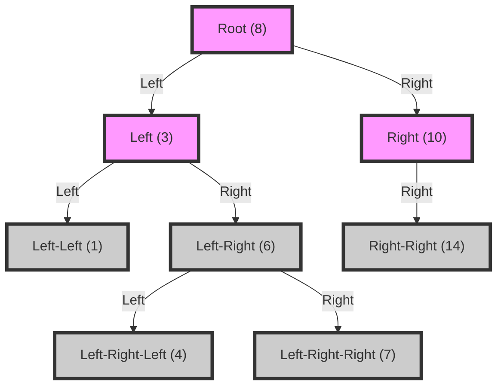

## Introduction
The **Inorder Successor** problem in a **Binary Search Tree (BST)** is a fundamental concept in computer science, particularly in the realm of data structures and algorithms. It involves finding the next node in an inorder traversal of the tree, given a specific node. This problem is essential in understanding the properties of BSTs and has numerous real-world applications, such as database querying and file systems. Every engineer should be familiar with this concept, as it is a crucial building block for more complex algorithms and data structures.

## Core Concepts
To tackle the Inorder Successor problem, it's vital to understand the basic concepts of a **Binary Search Tree**. A BST is a tree-like data structure where each node has at most two children (i.e., left child and right child) and each node represents a value. For any given node, all elements in its left subtree are less than the node, and all elements in its right subtree are greater than the node. The **Inorder Traversal** of a BST visits nodes in ascending order, which is achieved by traversing the left subtree, the current node, and then the right subtree.

## How It Works Internally
The Inorder Successor problem can be solved by understanding how the BST is structured and how the inorder traversal works. Given a node, we need to find the next node in the inorder traversal. If the node has a right child, the successor is the smallest node in the right subtree. If the node does not have a right child, we need to find the smallest ancestor that is greater than the node. This can be done by traversing up the tree until we find a node that is greater than the given node.

## Code Examples
### Example 1: Basic Inorder Successor
```python
class Node:
    def __init__(self, value):
        self.value = value
        self.left = None
        self.right = None

def inorder_successor(root, node):
    # If the node has a right child, the successor is the smallest node in the right subtree
    if node.right:
        current = node.right
        while current.left:
            current = current.left
        return current

    # If the node does not have a right child, we need to find the smallest ancestor that is greater than the node
    current = root
    successor = None
    while current:
        if current.value > node.value:
            successor = current
            current = current.left
        elif current.value < node.value:
            current = current.right
        else:
            break

    return successor

# Create a sample BST
root = Node(8)
root.left = Node(3)
root.right = Node(10)
root.left.left = Node(1)
root.left.right = Node(6)
root.right.right = Node(14)
root.left.right.left = Node(4)
root.left.right.right = Node(7)

node = root.left.right  # Node with value 6
successor = inorder_successor(root, node)
print(successor.value)  # Output: 7
```

### Example 2: Inorder Successor with Iterative Approach
```python
class Node:
    def __init__(self, value):
        self.value = value
        self.left = None
        self.right = None

def inorder_successor(root, node):
    successor = None
    current = root
    stack = []

    while True:
        if current:
            stack.append(current)
            current = current.left
        elif stack:
            current = stack.pop()
            if current == node:
                if current.right:
                    successor = current.right
                    while successor.left:
                        successor = successor.left
                    return successor
                else:
                    return successor
            elif current.value > node.value:
                successor = current
            current = current.right
        else:
            break

    return successor

# Create a sample BST
root = Node(8)
root.left = Node(3)
root.right = Node(10)
root.left.left = Node(1)
root.left.right = Node(6)
root.right.right = Node(14)
root.left.right.left = Node(4)
root.left.right.right = Node(7)

node = root.left.right  # Node with value 6
successor = inorder_successor(root, node)
print(successor.value)  # Output: 7
```

### Example 3: Inorder Successor with Recursive Approach
```python
class Node:
    def __init__(self, value):
        self.value = value
        self.left = None
        self.right = None

def inorder_successor(root, node):
    def recursive_inorder_successor(current):
        if not current:
            return None
        if current.value == node.value:
            if current.right:
                successor = current.right
                while successor.left:
                    successor = successor.left
                return successor
            else:
                return None
        elif current.value > node.value:
            return current
        else:
            return recursive_inorder_successor(current.right)

    return recursive_inorder_successor(root)

# Create a sample BST
root = Node(8)
root.left = Node(3)
root.right = Node(10)
root.left.left = Node(1)
root.left.right = Node(6)
root.right.right = Node(14)
root.left.right.left = Node(4)
root.left.right.right = Node(7)

node = root.left.right  # Node with value 6
successor = inorder_successor(root, node)
print(successor.value)  # Output: 7
```

## Visual Diagram

The above diagram represents a sample BST with the node values. The inorder successor of a node is the next node in the inorder traversal.

## Comparison
| Approach | Time Complexity | Space Complexity | Pros | Cons | Best For |
| --- | --- | --- | --- | --- | --- |
| Recursive | O(h) | O(h) | Easy to implement | Can lead to stack overflow for large trees | Small to medium-sized trees |
| Iterative | O(h) | O(1) | Does not lead to stack overflow | More complex to implement | Large trees or systems with limited stack size |
| Inorder Traversal | O(n) | O(n) | Finds all nodes in ascending order | Can be slow for large trees | Finding all nodes in a tree or performing operations on all nodes |

> **Note:** The time complexity of the Inorder Successor problem is O(h), where h is the height of the tree. The space complexity is O(1) for the iterative approach and O(h) for the recursive approach.

## Real-world Use Cases
1. **Database Querying**: The Inorder Successor problem is used in database querying to find the next record in a sorted list of records.
2. **File Systems**: The Inorder Successor problem is used in file systems to find the next file or directory in a sorted list of files and directories.
3. **Web Search Engines**: The Inorder Successor problem is used in web search engines to find the next search result in a sorted list of search results.

> **Tip:** The Inorder Successor problem can be used in any application that requires finding the next item in a sorted list.

## Common Pitfalls
1. **Not Handling Empty Trees**: Not handling empty trees can lead to null pointer exceptions.
2. **Not Handling Nodes with No Right Child**: Not handling nodes with no right child can lead to incorrect results.
3. **Not Handling Nodes with No Left Child**: Not handling nodes with no left child can lead to incorrect results.
4. **Using Recursion without Base Case**: Using recursion without a base case can lead to stack overflow.

> **Warning:** Not handling edge cases can lead to bugs and incorrect results.

## Interview Tips
1. **Understand the Problem Statement**: Understand the problem statement and the requirements.
2. **Use a Whiteboard**: Use a whiteboard to draw the tree and explain the solution.
3. **Explain the Solution**: Explain the solution and the time and space complexity.

> **Interview:** The most common interview question for the Inorder Successor problem is to find the Inorder Successor of a given node in a BST.

## Key Takeaways
* The Inorder Successor problem is used to find the next node in an inorder traversal of a BST.
* The time complexity of the Inorder Successor problem is O(h), where h is the height of the tree.
* The space complexity of the Inorder Successor problem is O(1) for the iterative approach and O(h) for the recursive approach.
* The Inorder Successor problem can be solved using a recursive or iterative approach.
* The Inorder Successor problem is used in database querying, file systems, and web search engines.
* Not handling edge cases can lead to bugs and incorrect results.
* Using recursion without a base case can lead to stack overflow.