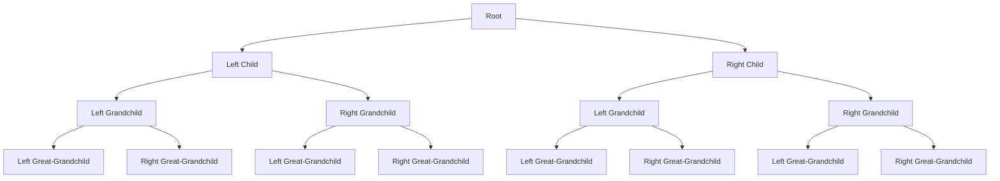

## Introduction
A **Splay Tree** is a type of self-adjusting binary search tree with a unique property: recently accessed elements are quick to access again. This is achieved through a simple and efficient splaying algorithm that moves frequently accessed nodes to the root of the tree. The splay tree was first introduced by Daniel Sleator and Robert Tarjan in 1983 as a way to improve the performance of binary search trees in certain scenarios. In this article, we will delve into the world of splay trees and self-adjusting trees, exploring their core concepts, internal mechanics, and practical applications.

> **Note:** Splay trees are particularly useful in scenarios where the access pattern is non-uniform, such as in databases or file systems, where certain elements are accessed more frequently than others.

## Core Concepts
To understand splay trees, we need to grasp a few key concepts:

* **Self-adjusting**: The tree adjusts its structure dynamically in response to access patterns.
* **Splaying**: The process of moving a node to the root of the tree after it is accessed.
* **Access**: The operation of searching for a node in the tree.
* **Node**: A single element in the tree, containing a key and potentially other data.

The mental model for a splay tree is that of a tree that "remembers" recently accessed nodes and moves them to the root for faster future access.

## How It Works Internally
When a node is accessed in a splay tree, the following steps occur:

1. **Search**: The tree is searched for the desired node.
2. **Splaying**: If the node is found, it is moved to the root using a splaying algorithm.
3. **Rotation**: The tree is rotated to maintain the binary search tree property.

The splaying algorithm involves a series of rotations that move the accessed node to the root. There are several types of rotations, including:

* **Zig**: A single rotation to the left or right.
* **Zig-Zig**: Two consecutive rotations in the same direction.
* **Zig-Zag**: Two rotations in opposite directions.

The time complexity of splaying is O(log n) in the worst case, where n is the number of nodes in the tree.

## Code Examples
Here are three examples of splay tree implementations:

### Example 1: Basic Splay Tree
```python
class Node:
    def __init__(self, key):
        self.key = key
        self.left = None
        self.right = None

class SplayTree:
    def __init__(self):
        self.root = None

    def splay(self, node):
        # Splaying algorithm implementation
        while node != self.root:
            if node.parent.left == node:
                # Zig rotation
                self.zig(node)
            elif node.parent.right == node:
                # Zag rotation
                self.zag(node)
            else:
                # Zig-Zig or Zag-Zag rotation
                self.zig_zig(node) if node.parent.left == node else self.zag_zag(node)

    def search(self, key):
        node = self.root
        while node:
            if node.key == key:
                self.splay(node)
                return node
            elif node.key < key:
                node = node.right
            else:
                node = node.left
        return None

    def insert(self, key):
        node = Node(key)
        if not self.root:
            self.root = node
        else:
            self.insert_node(node, self.root)

    def insert_node(self, node, parent):
        if node.key < parent.key:
            if parent.left:
                self.insert_node(node, parent.left)
            else:
                parent.left = node
                node.parent = parent
        else:
            if parent.right:
                self.insert_node(node, parent.right)
            else:
                parent.right = node
                node.parent = parent

# Create a splay tree and insert some nodes
tree = SplayTree()
tree.insert(5)
tree.insert(3)
tree.insert(7)
tree.insert(2)
tree.insert(4)
tree.insert(6)
tree.insert(8)

# Search for a node
node = tree.search(4)
print(node.key)  # Output: 4
```

### Example 2: Real-World Pattern
```java
public class SplayTreeMap<K, V> {
    private Node<K, V> root;

    private static class Node<K, V> {
        K key;
        V value;
        Node<K, V> left;
        Node<K, V> right;

        Node(K key, V value) {
            this.key = key;
            this.value = value;
        }
    }

    public void put(K key, V value) {
        Node<K, V> node = root;
        if (node == null) {
            root = new Node<>(key, value);
        } else {
            node = putNode(node, key, value);
        }
    }

    private Node<K, V> putNode(Node<K, V> node, K key, V value) {
        if (key.equals(node.key)) {
            node.value = value;
            return node;
        } else if (key.compareTo(node.key) < 0) {
            if (node.left == null) {
                node.left = new Node<>(key, value);
            } else {
                node.left = putNode(node.left, key, value);
            }
        } else {
            if (node.right == null) {
                node.right = new Node<>(key, value);
            } else {
                node.right = putNode(node.right, key, value);
            }
        }
        return node;
    }

    public V get(K key) {
        Node<K, V> node = root;
        while (node != null) {
            if (key.equals(node.key)) {
                // Splaying
                splay(node);
                return node.value;
            } else if (key.compareTo(node.key) < 0) {
                node = node.left;
            } else {
                node = node.right;
            }
        }
        return null;
    }

    private void splay(Node<K, V> node) {
        // Splaying algorithm implementation
    }
}
```

### Example 3: Advanced Usage
```cpp
template <typename T>
class SplayTreeSet {
public:
    void insert(T value) {
        Node* node = new Node(value);
        if (!root) {
            root = node;
        } else {
            insertNode(node, root);
        }
    }

    void insertNode(Node* node, Node* parent) {
        if (node->value < parent->value) {
            if (parent->left) {
                insertNode(node, parent->left);
            } else {
                parent->left = node;
                node->parent = parent;
            }
        } else {
            if (parent->right) {
                insertNode(node, parent->right);
            } else {
                parent->right = node;
                node->parent = parent;
            }
        }
    }

    bool contains(T value) {
        Node* node = root;
        while (node) {
            if (node->value == value) {
                // Splaying
                splay(node);
                return true;
            } else if (node->value < value) {
                node = node->right;
            } else {
                node = node->left;
            }
        }
        return false;
    }

    void splay(Node* node) {
        // Splaying algorithm implementation
    }

private:
    struct Node {
        T value;
        Node* left;
        Node* right;
        Node* parent;

        Node(T value) : value(value), left(nullptr), right(nullptr), parent(nullptr) {}
    };

    Node* root;
};
```

## Visual Diagram

The diagram shows a splay tree with multiple levels of nodes. The root node is at the top, and the left and right child nodes are below it. Each node has its own left and right child nodes, and so on. The splaying algorithm moves nodes up the tree by rotating them, which changes the structure of the tree.

> **Tip:** The splay tree is a self-adjusting data structure, which means it adapts to the access pattern of the data. This makes it suitable for applications where the data is accessed in a non-uniform manner.

## Comparison
| Data Structure | Time Complexity | Space Complexity | Pros | Cons |
| --- | --- | --- | --- | --- |
| Splay Tree | O(log n) | O(n) | Self-adjusting, efficient search and insertion | Can be slow for deletion |
| AVL Tree | O(log n) | O(n) | Balanced, efficient search and insertion | Can be slow for deletion |
| Red-Black Tree | O(log n) | O(n) | Balanced, efficient search and insertion | Can be slow for deletion |
| Binary Search Tree | O(log n) | O(n) | Simple to implement, efficient search | Can be slow for insertion and deletion |

## Real-world Use Cases
1. **Database indexing**: Splay trees can be used to index large datasets in databases, allowing for efficient search and retrieval of data.
2. **File systems**: Splay trees can be used to manage file systems, allowing for efficient search and retrieval of files.
3. **Web browsers**: Splay trees can be used to manage web browser history, allowing for efficient search and retrieval of previously visited pages.

> **Warning:** Splay trees can be slow for deletion operations, which can lead to performance issues in certain applications.

## Common Pitfalls
1. **Incorrect splaying**: If the splaying algorithm is not implemented correctly, the tree can become unbalanced, leading to poor performance.
2. **Insufficient node rotation**: If nodes are not rotated correctly, the tree can become unbalanced, leading to poor performance.
3. **Incorrect node insertion**: If nodes are not inserted correctly, the tree can become unbalanced, leading to poor performance.
4. **Incorrect node deletion**: If nodes are not deleted correctly, the tree can become unbalanced, leading to poor performance.

## Interview Tips
1. **Understand the splaying algorithm**: Be able to explain the splaying algorithm and how it works.
2. **Understand the time and space complexity**: Be able to explain the time and space complexity of splay trees.
3. **Be prepared to implement a splay tree**: Be prepared to implement a splay tree from scratch, including the splaying algorithm.

> **Interview:** Can you explain the difference between a splay tree and a binary search tree?

## Key Takeaways
* Splay trees are self-adjusting data structures that adapt to the access pattern of the data.
* Splay trees have a time complexity of O(log n) for search and insertion operations.
* Splay trees have a space complexity of O(n) for storing the tree.
* Splay trees are suitable for applications where the data is accessed in a non-uniform manner.
* Splay trees can be slow for deletion operations.
* Splay trees require careful implementation to ensure correct splaying and node rotation.
* Splay trees are used in various applications, including database indexing, file systems, and web browsers.