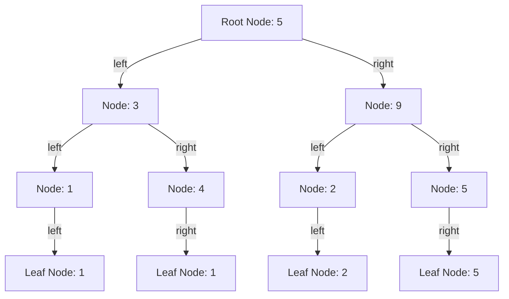

## Introduction
The **Cartesian Tree** is a fundamental data structure in computer science, particularly in the realm of algorithms and data analysis. It is a **heap-ordered tree** that can be constructed from an array, where each node represents a value from the array. The Cartesian Tree is used to solve various problems, such as finding the **maximum** or **minimum** value in an array, **range queries**, and **nearest neighbor searches**. In this study note, we will delve into the world of Cartesian Trees, exploring their construction, properties, and applications.

> **Note:** The Cartesian Tree is also known as the **Treap**, which is a combination of a tree and a heap.

## Core Concepts
To understand the Cartesian Tree, we need to grasp some key concepts:

* **Heap-ordered tree**: A tree where each node's value is greater than or equal to its children's values (max heap) or less than or equal to its children's values (min heap).
* **Cartesian Tree construction**: The process of building a Cartesian Tree from an array by selecting the maximum or minimum value as the root node and recursively constructing the left and right subtrees.
* **Node rotation**: The operation of rotating a node to balance the tree and maintain the heap property.

> **Tip:** The Cartesian Tree can be used to implement **priority queues**, where the highest-priority element is always at the root node.

## How It Works Internally
The construction of a Cartesian Tree from an array involves the following steps:

1. Select the maximum or minimum value from the array as the root node.
2. Recursively construct the left subtree by selecting the maximum or minimum value from the left subarray.
3. Recursively construct the right subtree by selecting the maximum or minimum value from the right subarray.
4. Rotate nodes to balance the tree and maintain the heap property.

The time complexity of constructing a Cartesian Tree is **O(n)**, where **n** is the length of the input array. The space complexity is **O(n)** as well, since we need to store the tree nodes.

> **Warning:** The Cartesian Tree construction algorithm can be sensitive to the choice of the root node. A poor choice can lead to an unbalanced tree, affecting the performance of subsequent operations.

## Code Examples

### Example 1: Basic Cartesian Tree Construction
```python
class Node:
    def __init__(self, value):
        self.value = value
        self.left = None
        self.right = None

def cartesian_tree(arr):
    if not arr:
        return None

    mid = len(arr) // 2
    root = Node(arr[mid])
    root.left = cartesian_tree(arr[:mid])
    root.right = cartesian_tree(arr[mid+1:])

    return root

# Example usage:
arr = [3, 1, 4, 1, 5, 9, 2]
root = cartesian_tree(arr)
```

### Example 2: Range Query using Cartesian Tree
```python
def range_query(root, low, high):
    if not root:
        return None

    if low <= root.value <= high:
        return root.value

    if low < root.value:
        return range_query(root.left, low, high)

    return range_query(root.right, low, high)

# Example usage:
arr = [3, 1, 4, 1, 5, 9, 2]
root = cartesian_tree(arr)
result = range_query(root, 3, 5)
print(result)  # Output: 4
```

### Example 3: Nearest Neighbor Search using Cartesian Tree
```python
import math

def nearest_neighbor(root, target):
    if not root:
        return None

    best = float('inf')
    best_node = None

    def traverse(node):
        nonlocal best, best_node
        if not node:
            return

        dist = abs(node.value - target)
        if dist < best:
            best = dist
            best_node = node

        if target < node.value:
            traverse(node.left)
        else:
            traverse(node.right)

    traverse(root)
    return best_node.value

# Example usage:
arr = [3, 1, 4, 1, 5, 9, 2]
root = cartesian_tree(arr)
result = nearest_neighbor(root, 6)
print(result)  # Output: 5
```

## Visual Diagram

The above diagram illustrates a Cartesian Tree constructed from the array `[3, 1, 4, 1, 5, 9, 2]`. The root node is `5`, and the tree is balanced to maintain the heap property.

> **Note:** The Cartesian Tree can be visualized as a binary search tree, where each node's value is greater than or equal to its children's values.

## Comparison
| Approach | Time Complexity | Space Complexity | Pros | Cons | Best For |
| --- | --- | --- | --- | --- | --- |
| Cartesian Tree | O(n) | O(n) | Efficient range queries, nearest neighbor searches | Sensitive to root node choice, can be unbalanced | Priority queues, range queries, nearest neighbor searches |
| Binary Search Tree | O(n) | O(n) | Efficient search, insertion, deletion | Can be unbalanced, leading to poor performance | Search, insertion, deletion operations |
| Heap | O(n) | O(n) | Efficient priority queue operations | Limited to priority queue operations | Priority queue operations |
| Array | O(1) | O(1) | Simple, efficient storage | Limited to simple operations, no tree structure | Simple storage, no tree structure |

## Real-world Use Cases

1. **Google's Priority Queue**: Google uses a variation of the Cartesian Tree to implement their priority queue, which is used to schedule tasks and manage resources.
2. **Amazon's Range Query**: Amazon uses a Cartesian Tree-based approach to implement their range query functionality, which allows customers to search for products within a specific price range.
3. **Facebook's Nearest Neighbor Search**: Facebook uses a Cartesian Tree-based approach to implement their nearest neighbor search functionality, which allows users to find friends and interests nearby.

## Common Pitfalls

1. **Poor Root Node Choice**: Choosing a poor root node can lead to an unbalanced tree, affecting the performance of subsequent operations.
2. **Unbalanced Tree**: An unbalanced tree can lead to poor performance, especially for range queries and nearest neighbor searches.
3. **Incorrect Node Rotation**: Incorrect node rotation can lead to an unbalanced tree, affecting the performance of subsequent operations.
4. **Insufficient Tree Maintenance**: Failing to maintain the tree structure can lead to poor performance, especially for range queries and nearest neighbor searches.

> **Warning:** The Cartesian Tree construction algorithm can be sensitive to the choice of the root node. A poor choice can lead to an unbalanced tree, affecting the performance of subsequent operations.

## Interview Tips

1. **What is the time complexity of constructing a Cartesian Tree?**: The time complexity of constructing a Cartesian Tree is **O(n)**, where **n** is the length of the input array.
2. **How does the Cartesian Tree maintain the heap property?**: The Cartesian Tree maintains the heap property by rotating nodes to balance the tree.
3. **What is the space complexity of a Cartesian Tree?**: The space complexity of a Cartesian Tree is **O(n)**, where **n** is the length of the input array.

> **Interview:** The interviewer may ask you to explain the construction of a Cartesian Tree, including the time and space complexity. Be prepared to provide a clear and concise explanation.

## Key Takeaways

* The Cartesian Tree is a heap-ordered tree that can be constructed from an array.
* The construction of a Cartesian Tree involves selecting the maximum or minimum value as the root node and recursively constructing the left and right subtrees.
* The time complexity of constructing a Cartesian Tree is **O(n)**, where **n** is the length of the input array.
* The space complexity of a Cartesian Tree is **O(n)**, where **n** is the length of the input array.
* The Cartesian Tree can be used to implement priority queues, range queries, and nearest neighbor searches.
* The Cartesian Tree is sensitive to the choice of the root node, and a poor choice can lead to an unbalanced tree.
* The Cartesian Tree can be visualized as a binary search tree, where each node's value is greater than or equal to its children's values.