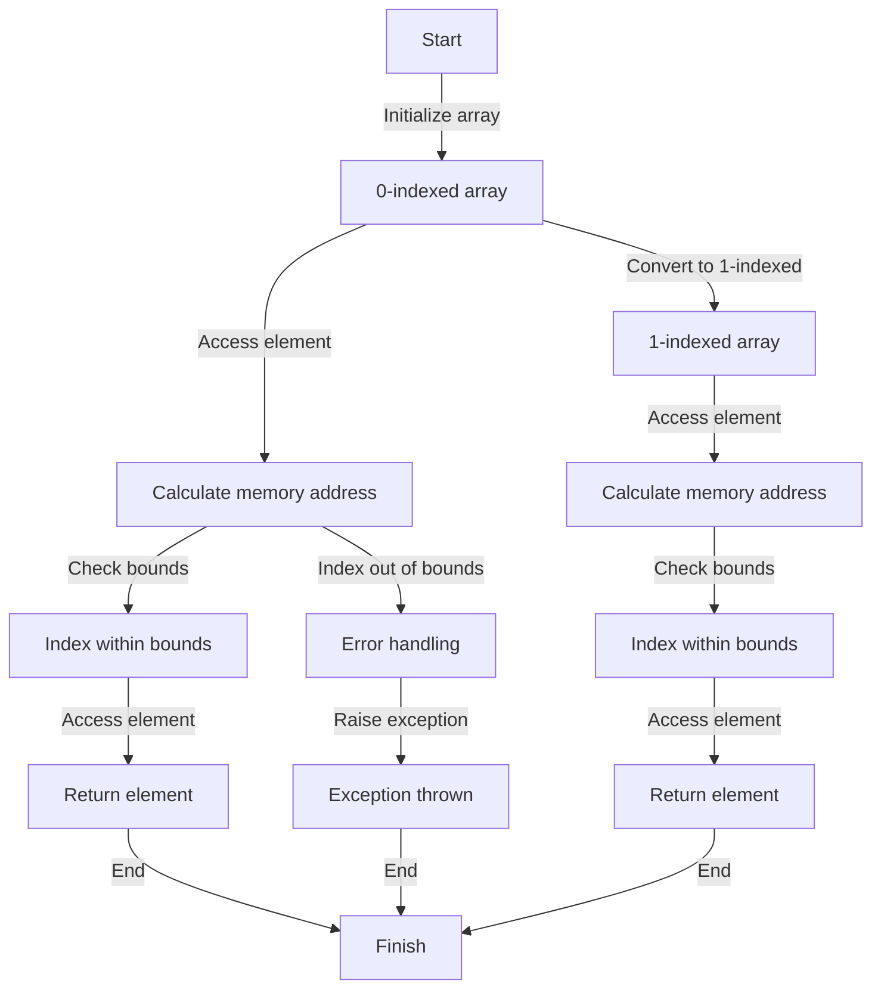

## Introduction
Off-by-one errors are a common pitfall in programming, particularly when working with arrays. These errors occur when an index is either one more or one less than the intended value, resulting in incorrect data access or manipulation. In this section, we will explore the importance of understanding off-by-one errors, their real-world relevance, and why every engineer needs to know about them.
> **Tip:** Off-by-one errors can be avoided by carefully considering the indexing scheme used in the programming language, whether it is 0-indexed or 1-indexed.

## Core Concepts
To understand off-by-one errors, it is essential to grasp the concept of indexing schemes. In programming, arrays can be indexed using either a 0-indexed or 1-indexed scheme.
- **0-indexed arrays**: In this scheme, the first element of the array is at index 0, and the last element is at index `length - 1`.
- **1-indexed arrays**: In this scheme, the first element of the array is at index 1, and the last element is at index `length`.
> **Note:** The choice of indexing scheme depends on the programming language and the problem being solved. Some languages, like Java and C++, use 0-indexed arrays, while others, like MATLAB and R, use 1-indexed arrays.

## How It Works Internally
When working with arrays, the indexing scheme is used to calculate the memory address of the element being accessed. In a 0-indexed array, the memory address of the `i-th` element is calculated as `base_address + i * element_size`, where `base_address` is the memory address of the first element, and `element_size` is the size of each element in bytes.
> **Warning:** Off-by-one errors can occur when the indexing scheme is not correctly accounted for, resulting in incorrect memory addresses being calculated.

## Code Examples
### Example 1: Basic 0-indexed array access
```python
def access_array(array, index):
    # Check if the index is within bounds
    if index < 0 or index >= len(array):
        raise IndexError("Index out of bounds")
    return array[index]

# Create a sample array
array = [1, 2, 3, 4, 5]

# Access the first element (0-indexed)
print(access_array(array, 0))  # Output: 1
```
### Example 2: Real-world pattern - iterating over a 1-indexed array
```java
public class Main {
    public static void main(String[] args) {
        // Create a sample array
        int[] array = {1, 2, 3, 4, 5};

        // Iterate over the array using a 1-indexed scheme
        for (int i = 1; i <= array.length; i++) {
            System.out.println("Element at index " + i + ": " + array[i - 1]);
        }
    }
}
```
### Example 3: Advanced - handling off-by-one errors in a 0-indexed array
```cpp
#include <iostream>
#include <vector>

int main() {
    // Create a sample vector
    std::vector<int> vector = {1, 2, 3, 4, 5};

    // Access the last element (0-indexed)
    int last_index = vector.size() - 1;
    std::cout << "Last element: " << vector[last_index] << std::endl;

    return 0;
}
```
> **Interview:** Can you explain the difference between 0-indexed and 1-indexed arrays, and how to avoid off-by-one errors when working with them?

## Visual Diagram

The diagram illustrates the process of accessing an element in a 0-indexed array and a 1-indexed array, including the calculation of the memory address and bounds checking.

## Comparison
| Approach | Time Complexity | Space Complexity | Pros | Cons | Best For |
|----------|----------------|-----------------|------|------|----------|
| 0-indexed array | O(1) | O(n) | Efficient memory access, simple implementation | Can be confusing for beginners | Systems programming, performance-critical code |
| 1-indexed array | O(1) | O(n) | Easier to understand for beginners, more intuitive | Less efficient memory access, more complex implementation | High-level programming, scripting languages |
| Hybrid approach | O(1) | O(n) | Combines benefits of both approaches, flexible | More complex implementation, potential for errors | Embedded systems, real-time systems |

## Real-world Use Cases
1. **Google's PageRank algorithm**: Uses a 0-indexed array to store the page ranks of web pages, allowing for efficient calculation of the page rank scores.
2. **MATLAB's array indexing**: Uses a 1-indexed array, making it easier for users to access and manipulate array elements.
3. **Linux kernel's memory management**: Uses a hybrid approach, combining the benefits of both 0-indexed and 1-indexed arrays to manage memory allocation and deallocation.

## Common Pitfalls
1. **Incorrect indexing**: Using the wrong indexing scheme can result in off-by-one errors, leading to incorrect data access or manipulation.
2. **Bounds checking**: Failing to check the bounds of the array can result in index out-of-bounds errors, leading to crashes or unexpected behavior.
3. **Array initialization**: Failing to initialize the array correctly can result in undefined behavior or errors.
4. **Type mismatch**: Using the wrong data type for the array elements can result in type mismatch errors or unexpected behavior.

## Interview Tips
1. **Explain the difference between 0-indexed and 1-indexed arrays**: Be prepared to explain the benefits and drawbacks of each approach, and how to avoid off-by-one errors.
2. **Write a function to access an element in a 0-indexed array**: Show how to calculate the memory address and perform bounds checking.
3. **Describe a real-world scenario where a hybrid approach is used**: Explain how the hybrid approach is used in a real-world system, and the benefits and drawbacks of this approach.

## Key Takeaways
* Off-by-one errors can occur when the indexing scheme is not correctly accounted for.
* 0-indexed arrays are efficient for systems programming and performance-critical code.
* 1-indexed arrays are easier to understand for beginners and more intuitive.
* Hybrid approaches can combine the benefits of both 0-indexed and 1-indexed arrays.
* Bounds checking is essential to prevent index out-of-bounds errors.
* Type mismatch can result in type mismatch errors or unexpected behavior.
* Array initialization is crucial to prevent undefined behavior or errors.
* Calculating the memory address correctly is essential for efficient memory access.