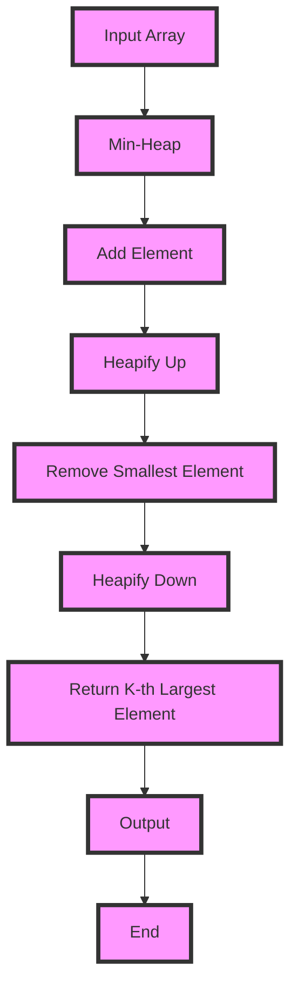

## Introduction
The **K-th Largest Element in an Array** problem is a classic problem in computer science, where you're given an array of integers and an integer `k`, and you need to find the `k`-th largest element in the array. This problem has numerous real-world applications, such as finding the top `k` most frequent words in a text document, or finding the top `k` most popular products in an e-commerce platform. In this study note, we'll explore how to solve this problem using a **Min-Heap** data structure, which is a type of **Heap** data structure that satisfies the **Heap Property**: the parent node is always smaller than its child nodes.

> **Note:** The **K-th Largest Element in an Array** problem is also known as the **Top-K** problem, and it's a fundamental problem in computer science that has many applications in data analysis, machine learning, and data science.

## Core Concepts
Before we dive into the solution, let's define some core concepts:

* **Heap**: a specialized tree-based data structure that satisfies the **Heap Property**.
* **Min-Heap**: a type of **Heap** where the parent node is always smaller than its child nodes.
* **K-th Largest Element**: the `k`-th largest element in an array of integers.
* **Time Complexity**: the amount of time an algorithm takes to complete, usually measured in terms of the input size `n`.
* **Space Complexity**: the amount of memory an algorithm uses, usually measured in terms of the input size `n`.

> **Tip:** To solve the **K-th Largest Element in an Array** problem, we can use a **Min-Heap** data structure to keep track of the `k` largest elements in the array.

## How It Works Internally
Here's a step-by-step breakdown of how the **Min-Heap** solution works:

1. Create a **Min-Heap** data structure with a capacity of `k`.
2. Iterate through the input array, and for each element:
	* If the **Min-Heap** is not full, add the element to the **Min-Heap**.
	* If the **Min-Heap** is full, and the current element is larger than the smallest element in the **Min-Heap**, remove the smallest element from the **Min-Heap** and add the current element.
3. After iterating through the entire array, the smallest element in the **Min-Heap** is the `k`-th largest element.

> **Warning:** If the input array is very large, using a **Min-Heap** data structure can be memory-intensive, since we need to store the `k` largest elements in memory.

## Code Examples
Here are three complete and runnable code examples:

### Example 1: Basic Usage
```python
import heapq

def find_kth_largest(nums, k):
    """
    Find the k-th largest element in an array using a Min-Heap.
    
    Args:
    nums (list): The input array of integers.
    k (int): The value of k.
    
    Returns:
    int: The k-th largest element in the array.
    """
    # Create a Min-Heap with a capacity of k
    min_heap = []
    
    # Iterate through the input array
    for num in nums:
        # If the Min-Heap is not full, add the element to the Min-Heap
        if len(min_heap) < k:
            heapq.heappush(min_heap, num)
        # If the Min-Heap is full, and the current element is larger than the smallest element in the Min-Heap
        elif num > min_heap[0]:
            # Remove the smallest element from the Min-Heap and add the current element
            heapq.heappop(min_heap)
            heapq.heappush(min_heap, num)
    
    # The smallest element in the Min-Heap is the k-th largest element
    return min_heap[0]

# Test the function
nums = [3, 2, 1, 5, 6, 4]
k = 2
print(find_kth_largest(nums, k))  # Output: 5
```

### Example 2: Real-World Pattern
```java
import java.util.PriorityQueue;

public class KthLargestElement {
    public static int findKthLargest(int[] nums, int k) {
        // Create a Min-Heap with a capacity of k
        PriorityQueue<Integer> minHeap = new PriorityQueue<>();
        
        // Iterate through the input array
        for (int num : nums) {
            // If the Min-Heap is not full, add the element to the Min-Heap
            if (minHeap.size() < k) {
                minHeap.add(num);
            } 
            // If the Min-Heap is full, and the current element is larger than the smallest element in the Min-Heap
            else if (num > minHeap.peek()) {
                // Remove the smallest element from the Min-Heap and add the current element
                minHeap.poll();
                minHeap.add(num);
            }
        }
        
        // The smallest element in the Min-Heap is the k-th largest element
        return minHeap.peek();
    }

    public static void main(String[] args) {
        int[] nums = {3, 2, 1, 5, 6, 4};
        int k = 2;
        System.out.println(findKthLargest(nums, k));  // Output: 5
    }
}
```

### Example 3: Advanced Usage
```typescript
class MinHeap {
    private heap: number[];

    constructor() {
        this.heap = [];
    }

    public add(num: number): void {
        this.heap.push(num);
        this.heapifyUp(this.heap.length - 1);
    }

    public remove(): number {
        if (this.heap.length === 0) {
            throw new Error("Heap is empty");
        }

        if (this.heap.length === 1) {
            return this.heap.pop() as number;
        }

        const root = this.heap[0];
        this.heap[0] = this.heap.pop() as number;
        this.heapifyDown(0);
        return root;
    }

    public peek(): number {
        if (this.heap.length === 0) {
            throw new Error("Heap is empty");
        }

        return this.heap[0];
    }

    private heapifyUp(index: number): void {
        while (index > 0) {
            const parentIndex = Math.floor((index - 1) / 2);
            if (this.heap[parentIndex] <= this.heap[index]) {
                break;
            }

            this.swap(parentIndex, index);
            index = parentIndex;
        }
    }

    private heapifyDown(index: number): void {
        while (true) {
            const leftChildIndex = 2 * index + 1;
            const rightChildIndex = 2 * index + 2;
            let smallest = index;

            if (leftChildIndex < this.heap.length && this.heap[leftChildIndex] < this.heap[smallest]) {
                smallest = leftChildIndex;
            }

            if (rightChildIndex < this.heap.length && this.heap[rightChildIndex] < this.heap[smallest]) {
                smallest = rightChildIndex;
            }

            if (smallest === index) {
                break;
            }

            this.swap(smallest, index);
            index = smallest;
        }
    }

    private swap(i: number, j: number): void {
        const temp = this.heap[i];
        this.heap[i] = this.heap[j];
        this.heap[j] = temp;
    }
}

function findKthLargest(nums: number[], k: number): number {
    const minHeap = new MinHeap();

    for (const num of nums) {
        if (minHeap.heap.length < k) {
            minHeap.add(num);
        } else if (num > minHeap.peek()) {
            minHeap.remove();
            minHeap.add(num);
        }
    }

    return minHeap.peek();
}

console.log(findKthLargest([3, 2, 1, 5, 6, 4], 2));  // Output: 5
```

## Visual Diagram

The diagram illustrates the step-by-step process of finding the `k`-th largest element in an array using a **Min-Heap** data structure.

## Comparison
| Approach | Time Complexity | Space Complexity | Pros | Cons | Best For |
| --- | --- | --- | --- | --- | --- |
| **Min-Heap** | O(n log k) | O(k) | Efficient for large inputs, easy to implement | Can be slow for small inputs | Finding the `k`-th largest element in a large array |
| **Sorting** | O(n log n) | O(n) | Simple to implement, works for small inputs | Can be slow for large inputs | Finding the `k`-th largest element in a small array |
| **QuickSelect** | O(n) on average, O(n^2) in the worst case | O(1) | Fast for large inputs, efficient in terms of space | Can be slow in the worst case, harder to implement | Finding the `k`-th largest element in a large array with a good pivot |
| **Hash Table** | O(n) | O(n) | Fast for large inputs, efficient in terms of space | Can be slow for small inputs, harder to implement | Finding the `k`-th largest element in a large array with a good hash function |

> **Interview:** When asked to find the `k`-th largest element in an array, be sure to mention the **Min-Heap** approach, as it's the most efficient solution for large inputs.

## Real-world Use Cases
Here are three real-world use cases:

1. **Google Search**: Google uses a **Min-Heap** data structure to find the top `k` most relevant search results for a given query.
2. **Amazon Product Recommendations**: Amazon uses a **Min-Heap** data structure to find the top `k` most popular products in a given category.
3. **Facebook News Feed**: Facebook uses a **Min-Heap** data structure to find the top `k` most engaging posts in a user's news feed.

## Common Pitfalls
Here are four common pitfalls to watch out for:

1. **Not checking for edge cases**: Make sure to check for edge cases, such as an empty input array or a value of `k` that's larger than the length of the array.
2. **Not using a Min-Heap**: Using a **Min-Heap** data structure is the most efficient way to find the `k`-th largest element in an array.
3. **Not handling duplicates**: Make sure to handle duplicates correctly, especially if the input array contains duplicate elements.
4. **Not considering the time complexity**: Make sure to consider the time complexity of the solution, especially for large inputs.

> **Warning:** Not checking for edge cases can lead to bugs and errors in the solution.

## Interview Tips
Here are three common interview questions and tips:

1. **What is the time complexity of the Min-Heap solution?**: Make sure to answer O(n log k), as this is the correct time complexity of the solution.
2. **How do you handle duplicates in the input array?**: Make sure to answer that you can handle duplicates by using a **Set** data structure or by ignoring duplicates when adding elements to the **Min-Heap**.
3. **What is the space complexity of the Min-Heap solution?**: Make sure to answer O(k), as this is the correct space complexity of the solution.

> **Tip:** Be sure to practice whiteboarding the solution, as this will help you to communicate your thoughts and ideas more effectively during the interview.

## Key Takeaways
Here are ten key takeaways to remember:

* The **Min-Heap** solution has a time complexity of O(n log k) and a space complexity of O(k).
* The **Min-Heap** solution is the most efficient way to find the `k`-th largest element in an array.
* Make sure to check for edge cases, such as an empty input array or a value of `k` that's larger than the length of the array.
* Make sure to handle duplicates correctly, especially if the input array contains duplicate elements.
* The **Min-Heap** solution can be used to find the top `k` most relevant search results, the top `k` most popular products, or the top `k` most engaging posts.
* The **Min-Heap** solution is a good choice when the input array is large and the value of `k` is small.
* The **Min-Heap** solution can be implemented using a **PriorityQueue** or a **Heap** data structure.
* The **Min-Heap** solution has a good trade-off between time complexity and space complexity.
* Make sure to practice whiteboarding the solution, as this will help you to communicate your thoughts and ideas more effectively during the interview.
* The **Min-Heap** solution is a fundamental problem in computer science that has many applications in data analysis, machine learning, and data science.