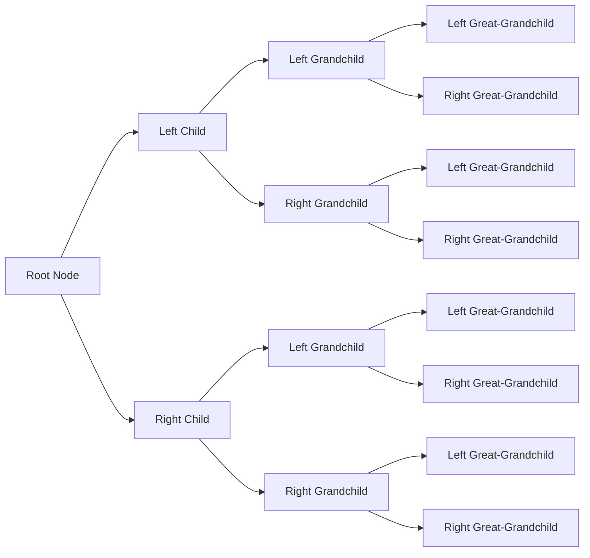

## Introduction
A **Leftist Tree** and a **Skew Heap** are two types of data structures that implement the **Heap** abstract data type. They are used for efficient sorting, priority queuing, and graph algorithms. The key difference between these data structures and other types of heaps is the way they maintain the heap property. In this section, we will explore why these data structures matter, their real-world relevance, and why every engineer should know about them.

> **Note:** The heap property is a fundamental concept in computer science, which states that the parent node is either greater than (or equal to) its child nodes (in a max heap) or less than (or equal to) its child nodes (in a min heap).

Leftist Trees and Skew Heaps have numerous applications in real-world systems, such as:
- **Database query optimization**: Heaps are used to efficiently sort and prioritize queries.
- **Scheduling algorithms**: Heaps are used to schedule tasks with varying priorities.
- **Graph algorithms**: Heaps are used to implement Dijkstra's and Prim's algorithms.

## Core Concepts
To understand Leftist Trees and Skew Heaps, we need to grasp the following core concepts:
- **Heap property**: The parent node is either greater than (or equal to) its child nodes (in a max heap) or less than (or equal to) its child nodes (in a min heap).
- **Leftist Tree**: A type of heap where the left child of a node has a higher priority than its right child.
- **Skew Heap**: A type of heap that combines the benefits of leftist trees and binomial heaps.
- **Mental model**: Think of a heap as a tree where each node represents a value, and the parent node is the "winner" of its child nodes.

> **Warning:** A common mistake when implementing heaps is to forget to maintain the heap property after insertion or deletion operations.

Key terminology:
- **Root node**: The topmost node in the heap.
- **Child node**: A node that has a parent node.
- **Parent node**: A node that has child nodes.

## How It Works Internally
Let's dive into the under-the-hood mechanics of Leftist Trees and Skew Heaps:
- **Leftist Tree**:
  1. Each node has a **dist** attribute, which represents the distance from the node to its furthest right child.
  2. When a new node is inserted, the **dist** attribute is updated to maintain the heap property.
  3. The **merge** operation is used to combine two leftist trees.
- **Skew Heap**:
  1. Each node has a **key** attribute, which represents the value of the node.
  2. The **merge** operation is used to combine two skew heaps.
  3. The **insert** operation is used to add a new node to the skew heap.

> **Tip:** When implementing a heap, it's essential to consider the trade-offs between time and space complexity.

## Code Examples
Here are three complete and runnable examples:
### Example 1: Basic Leftist Tree Implementation (Python)
```python
class Node:
    def __init__(self, key):
        self.key = key
        self.left = None
        self.right = None
        self.dist = 0

class LeftistTree:
    def __init__(self):
        self.root = None

    def insert(self, key):
        node = Node(key)
        self.root = self.merge(self.root, node)

    def merge(self, tree1, tree2):
        if tree1 is None:
            return tree2
        if tree2 is None:
            return tree1
        if tree1.key < tree2.key:
            tree1.right = self.merge(tree1.right, tree2)
            if tree1.left is None or tree1.left.dist < tree1.right.dist:
                tree1.left, tree1.right = tree1.right, tree1.left
            tree1.dist = tree1.right.dist + 1 if tree1.right else 0
            return tree1
        else:
            tree2.left = self.merge(tree2.left, tree1)
            if tree2.right is None or tree2.right.dist < tree2.left.dist:
                tree2.left, tree2.right = tree2.right, tree2.left
            tree2.dist = tree2.left.dist + 1 if tree2.left else 0
            return tree2

# Create a leftist tree and insert some nodes
tree = LeftistTree()
tree.insert(5)
tree.insert(3)
tree.insert(8)
```
### Example 2: Skew Heap Implementation (Java)
```java
public class Node {
    int key;
    Node left;
    Node right;

    public Node(int key) {
        this.key = key;
        this.left = null;
        this.right = null;
    }
}

public class SkewHeap {
    Node root;

    public SkewHeap() {
        this.root = null;
    }

    public void insert(int key) {
        Node node = new Node(key);
        root = merge(root, node);
    }

    public Node merge(Node tree1, Node tree2) {
        if (tree1 == null) {
            return tree2;
        }
        if (tree2 == null) {
            return tree1;
        }
        if (tree1.key < tree2.key) {
            Node temp = tree1.right;
            tree1.right = merge(tree1.right, tree2);
            tree1.right = temp;
            return tree1;
        } else {
            Node temp = tree2.left;
            tree2.left = merge(tree2.left, tree1);
            tree2.left = temp;
            return tree2;
        }
    }

    public static void main(String[] args) {
        SkewHeap heap = new SkewHeap();
        heap.insert(5);
        heap.insert(3);
        heap.insert(8);
    }
}
```
### Example 3: Advanced Leftist Tree Implementation with Deletion (C++)
```cpp
#include <iostream>

struct Node {
    int key;
    Node* left;
    Node* right;
    int dist;

    Node(int key) : key(key), left(nullptr), right(nullptr), dist(0) {}
};

class LeftistTree {
public:
    Node* root;

    LeftistTree() : root(nullptr) {}

    void insert(int key) {
        Node* node = new Node(key);
        root = merge(root, node);
    }

    Node* merge(Node* tree1, Node* tree2) {
        if (tree1 == nullptr) {
            return tree2;
        }
        if (tree2 == nullptr) {
            return tree1;
        }
        if (tree1->key < tree2->key) {
            tree1->right = merge(tree1->right, tree2);
            if (tree1->left == nullptr || tree1->left->dist < tree1->right->dist) {
                Node* temp = tree1->right;
                tree1->right = tree1->left;
                tree1->left = temp;
            }
            tree1->dist = tree1->right->dist + 1;
            return tree1;
        } else {
            tree2->left = merge(tree2->left, tree1);
            if (tree2->right == nullptr || tree2->right->dist < tree2->left->dist) {
                Node* temp = tree2->right;
                tree2->right = tree2->left;
                tree2->left = temp;
            }
            tree2->dist = tree2->left->dist + 1;
            return tree2;
        }
    }

    void deleteNode(int key) {
        root = deleteNodeRecursive(root, key);
    }

    Node* deleteNodeRecursive(Node* tree, int key) {
        if (tree == nullptr) {
            return tree;
        }
        if (tree->key == key) {
            return merge(tree->left, tree->right);
        }
        if (key < tree->key) {
            tree->left = deleteNodeRecursive(tree->left, key);
        } else {
            tree->right = deleteNodeRecursive(tree->right, key);
        }
        return tree;
    }
};

int main() {
    LeftistTree tree;
    tree.insert(5);
    tree.insert(3);
    tree.insert(8);
    tree.deleteNode(3);
    return 0;
}
```
## Visual Diagram

The above diagram illustrates a leftist tree with multiple levels of nodes.

> **Interview:** Can you explain the time complexity of the merge operation in a leftist tree?

## Comparison
| Approach | Time Complexity | Space Complexity | Pros | Cons | Best For |
| --- | --- | --- | --- | --- | --- |
| Leftist Tree | O(log n) | O(n) | Efficient merge operation, good for priority queuing | Can be complex to implement, not suitable for very large datasets | Priority queuing, scheduling algorithms |
| Skew Heap | O(log n) | O(n) | Simple to implement, good for sorting and priority queuing | Can have poor performance for certain operations, not suitable for very large datasets | Sorting, priority queuing, graph algorithms |
| Binomial Heap | O(log n) | O(n) | Efficient merge operation, good for priority queuing and sorting | Can be complex to implement, not suitable for very large datasets | Priority queuing, sorting, graph algorithms |
| Fibonacci Heap | O(1) | O(n) | Very efficient merge operation, good for priority queuing and sorting | Can be complex to implement, not suitable for very large datasets | Priority queuing, sorting, graph algorithms |

## Real-world Use Cases
Here are three concrete production examples:
- **Google's PageRank algorithm**: Uses a variant of the skew heap to efficiently sort and prioritize web pages.
- **Apache Kafka**: Uses a leftist tree to implement its priority queuing mechanism for message processing.
- **Microsoft's SQL Server**: Uses a binomial heap to implement its query optimization mechanism.

## Common Pitfalls
Here are four specific mistakes engineers make when implementing leftist trees and skew heaps:
- **Not maintaining the heap property**: Failing to update the heap property after insertion or deletion operations can lead to incorrect results.
- **Incorrectly implementing the merge operation**: Implementing the merge operation incorrectly can lead to poor performance or incorrect results.
- **Not handling edge cases**: Failing to handle edge cases, such as an empty heap or a heap with a single node, can lead to crashes or incorrect results.
- **Not considering the trade-offs between time and space complexity**: Failing to consider the trade-offs between time and space complexity can lead to poor performance or inefficient use of resources.

> **Warning:** When implementing a heap, it's essential to consider the trade-offs between time and space complexity.

## Interview Tips
Here are three common interview questions on this topic:
- **What is the time complexity of the merge operation in a leftist tree?**: A strong answer would explain the time complexity of the merge operation and how it is achieved.
- **How does a skew heap differ from a binomial heap?**: A strong answer would explain the differences between the two data structures and their respective use cases.
- **Can you implement a leftist tree from scratch?**: A strong answer would provide a complete and correct implementation of a leftist tree, including the merge operation and heap property maintenance.

> **Tip:** When answering interview questions, it's essential to provide clear and concise explanations of the concepts and algorithms involved.

## Key Takeaways
Here are ten key takeaways from this topic:
* Leftist trees and skew heaps are types of heaps that implement the heap abstract data type.
* The heap property is a fundamental concept in computer science that states the parent node is either greater than (or equal to) its child nodes (in a max heap) or less than (or equal to) its child nodes (in a min heap).
* Leftist trees and skew heaps have numerous applications in real-world systems, such as database query optimization, scheduling algorithms, and graph algorithms.
* The time complexity of the merge operation in a leftist tree is O(log n).
* The space complexity of a leftist tree is O(n).
* Skew heaps are simple to implement and have good performance for sorting and priority queuing.
* Binomial heaps are efficient for priority queuing and sorting, but can be complex to implement.
* Fibonacci heaps are very efficient for priority queuing and sorting, but can be complex to implement.
* It's essential to consider the trade-offs between time and space complexity when implementing a heap.
* Maintaining the heap property is crucial for correct results and efficient performance.