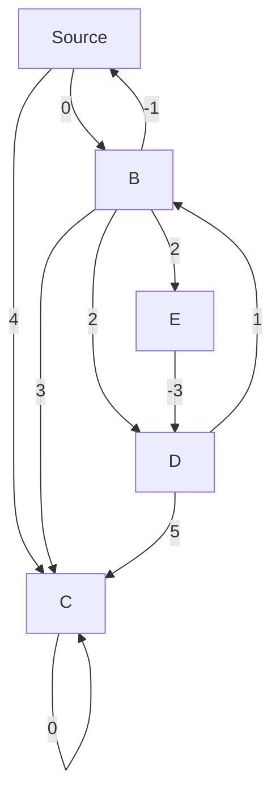

## Introduction
The **Bellman-Ford algorithm** is a graph search algorithm that finds the shortest path from a source vertex to all other vertices in a weighted graph. It is a modification of the Dijkstra's algorithm that can handle negative weight edges. The Bellman-Ford algorithm is used in many real-world applications, such as finding the shortest path in a road network, calculating the minimum cost of a flight route, or determining the optimal route for a package delivery service. Every engineer should know this algorithm because it is a fundamental problem-solving technique in computer science and has numerous applications in various fields.

> **Note:** The Bellman-Ford algorithm can handle negative weight edges, but it can detect negative cycles, which is an important feature in many applications.

## Core Concepts
The Bellman-Ford algorithm is based on the following core concepts:

* **Weighted graph**: A graph where each edge has a weight or cost associated with it.
* **Shortest path**: The path from the source vertex to the target vertex with the minimum total weight.
* **Negative weight edge**: An edge with a negative weight, which can cause the shortest path to change.
* **Negative cycle**: A cycle in the graph where the total weight is negative, which means that the shortest path cannot be determined.

The Bellman-Ford algorithm uses a **distance array** to keep track of the minimum distance from the source vertex to each vertex. It also uses a **predecessor array** to keep track of the previous vertex in the shortest path.

## How It Works Internally
The Bellman-Ford algorithm works as follows:

1. Initialize the distance array with infinity for all vertices, except for the source vertex, which is set to 0.
2. Initialize the predecessor array with null for all vertices.
3. Relax the edges repeatedly. For each edge (u, v) with weight w, if the distance to v can be reduced by going through u, update the distance to v and set the predecessor of v to u.
4. Check for negative cycles. If a vertex can be reached with a shorter distance, it means that there is a negative cycle, and the algorithm terminates.

The time complexity of the Bellman-Ford algorithm is O(|V| \* |E|), where |V| is the number of vertices and |E| is the number of edges. The space complexity is O(|V|), which is used to store the distance and predecessor arrays.

## Code Examples
### Example 1: Basic Usage
```python
def bellman_ford(graph, source):
    distance = [float('inf')] * len(graph)
    predecessor = [None] * len(graph)
    distance[source] = 0

    for _ in range(len(graph) - 1):
        for u in range(len(graph)):
            for v in range(len(graph)):
                if graph[u][v] is not None:
                    weight = graph[u][v]
                    if distance[u] + weight < distance[v]:
                        distance[v] = distance[u] + weight
                        predecessor[v] = u

    for v in range(len(graph)):
        for u in range(len(graph)):
            if graph[u][v] is not None:
                weight = graph[u][v]
                if distance[u] + weight < distance[v]:
                    print("Negative cycle detected")
                    return

    return distance, predecessor

# Example graph
graph = [
    [None, -1, 4, None, None],
    [None, None, 3, 2, 2],
    [None, None, None, None, None],
    [None, 1, 5, None, None],
    [None, None, None, -3, None]
]

source = 0
distance, predecessor = bellman_ford(graph, source)
print("Shortest distances:", distance)
print("Predecessors:", predecessor)
```

### Example 2: Real-World Pattern
```java
public class BellmanFord {
    public static void main(String[] args) {
        int[][] graph = {
            {0, -1, 4, 0, 0},
            {0, 0, 3, 2, 2},
            {0, 0, 0, 0, 0},
            {0, 1, 5, 0, 0},
            {0, 0, 0, -3, 0}
        };

        int source = 0;
        int[] distance = new int[graph.length];
        int[] predecessor = new int[graph.length];

        Arrays.fill(distance, Integer.MAX_VALUE);
        Arrays.fill(predecessor, -1);

        distance[source] = 0;

        for (int i = 0; i < graph.length - 1; i++) {
            for (int u = 0; u < graph.length; u++) {
                for (int v = 0; v < graph.length; v++) {
                    if (graph[u][v] != 0) {
                        int weight = graph[u][v];
                        if (distance[u] + weight < distance[v]) {
                            distance[v] = distance[u] + weight;
                            predecessor[v] = u;
                        }
                    }
                }
            }
        }

        for (int v = 0; v < graph.length; v++) {
            for (int u = 0; u < graph.length; u++) {
                if (graph[u][v] != 0) {
                    int weight = graph[u][v];
                    if (distance[u] + weight < distance[v]) {
                        System.out.println("Negative cycle detected");
                        return;
                    }
                }
            }
        }

        System.out.println("Shortest distances:");
        for (int i = 0; i < distance.length; i++) {
            System.out.println(distance[i]);
        }

        System.out.println("Predecessors:");
        for (int i = 0; i < predecessor.length; i++) {
            System.out.println(predecessor[i]);
        }
    }
}
```

### Example 3: Advanced Usage
```cpp
#include <iostream>
#include <vector>
#include <climits>

using namespace std;

struct Edge {
    int u, v, weight;
};

void bellman_ford(vector<vector<int>> graph, int source, vector<int>& distance, vector<int>& predecessor) {
    distance.assign(graph.size(), INT_MAX);
    predecessor.assign(graph.size(), -1);

    distance[source] = 0;

    for (int i = 0; i < graph.size() - 1; i++) {
        for (int u = 0; u < graph.size(); u++) {
            for (int v = 0; v < graph.size(); v++) {
                if (graph[u][v] != INT_MAX) {
                    int weight = graph[u][v];
                    if (distance[u] + weight < distance[v]) {
                        distance[v] = distance[u] + weight;
                        predecessor[v] = u;
                    }
                }
            }
        }
    }

    for (int v = 0; v < graph.size(); v++) {
        for (int u = 0; u < graph.size(); u++) {
            if (graph[u][v] != INT_MAX) {
                int weight = graph[u][v];
                if (distance[u] + weight < distance[v]) {
                    cout << "Negative cycle detected" << endl;
                    return;
                }
            }
        }
    }
}

int main() {
    vector<vector<int>> graph = {
        {0, -1, 4, INT_MAX, INT_MAX},
        {INT_MAX, 0, 3, 2, 2},
        {INT_MAX, INT_MAX, 0, INT_MAX, INT_MAX},
        {1, INT_MAX, 5, 0, INT_MAX},
        {INT_MAX, INT_MAX, INT_MAX, -3, 0}
    };

    int source = 0;
    vector<int> distance, predecessor;

    bellman_ford(graph, source, distance, predecessor);

    cout << "Shortest distances: ";
    for (int i = 0; i < distance.size(); i++) {
        cout << distance[i] << " ";
    }
    cout << endl;

    cout << "Predecessors: ";
    for (int i = 0; i < predecessor.size(); i++) {
        cout << predecessor[i] << " ";
    }
    cout << endl;

    return 0;
}
```

> **Tip:** The Bellman-Ford algorithm can be used to detect negative cycles in a graph, which is an important feature in many applications.

## Visual Diagram

The diagram shows a weighted graph with 5 vertices and 9 edges. The Bellman-Ford algorithm can be used to find the shortest path from the source vertex A to all other vertices.

> **Warning:** The Bellman-Ford algorithm assumes that the graph does not contain any negative cycles. If a negative cycle is detected, the algorithm terminates.

## Comparison
| Algorithm | Time Complexity | Space Complexity | Pros | Cons | Best For |
| --- | --- | --- | --- | --- | --- |
| Bellman-Ford | O(|V| \* |E|) | O(|V|) | Can handle negative weight edges, detects negative cycles | Slow for large graphs | Finding shortest paths in graphs with negative weight edges |
| Dijkstra's | O(|E| + |V|log|V|) | O(|V|) | Fast for large graphs, simple to implement | Cannot handle negative weight edges | Finding shortest paths in graphs with non-negative weight edges |
| Floyd-Warshall | O(|V|^3) | O(|V|^2) | Can handle negative weight edges, finds shortest path between all pairs of vertices | Slow for large graphs | Finding shortest paths between all pairs of vertices in a graph |
| Topological Sort | O(|V| + |E|) | O(|V|) | Fast for large graphs, simple to implement | Only works for directed acyclic graphs (DAGs) | Finding a topological ordering of a DAG |

> **Interview:** What is the time complexity of the Bellman-Ford algorithm? How does it handle negative weight edges?

## Real-world Use Cases
* **Google Maps**: The Bellman-Ford algorithm is used to find the shortest path between two locations on a map. Google Maps uses a variant of the algorithm that can handle negative weight edges, which represents the time spent waiting at traffic lights or road closures.
* **Amazon Logistics**: The Bellman-Ford algorithm is used to optimize the delivery routes for packages. Amazon uses a variant of the algorithm that can handle negative weight edges, which represents the cost of fuel and tolls.
* **Facebook**: The Bellman-Ford algorithm is used to find the shortest path between two users in a social network. Facebook uses a variant of the algorithm that can handle negative weight edges, which represents the strength of the friendship between two users.

## Common Pitfalls
* **Negative weight edges**: The Bellman-Ford algorithm can handle negative weight edges, but it assumes that the graph does not contain any negative cycles. If a negative cycle is detected, the algorithm terminates.
* **Uninitialized distance array**: The distance array must be initialized with infinity for all vertices, except for the source vertex, which is set to 0.
* **Uninitialized predecessor array**: The predecessor array must be initialized with null for all vertices.
* **Incorrect relaxation**: The relaxation step must be done correctly, otherwise the algorithm may not find the shortest path.

> **Warning:** The Bellman-Ford algorithm is sensitive to the initialization of the distance and predecessor arrays. If the arrays are not initialized correctly, the algorithm may not find the shortest path.

## Interview Tips
* **What is the time complexity of the Bellman-Ford algorithm?**: The time complexity of the Bellman-Ford algorithm is O(|V| \* |E|), where |V| is the number of vertices and |E| is the number of edges.
* **How does the Bellman-Ford algorithm handle negative weight edges?**: The Bellman-Ford algorithm can handle negative weight edges, but it assumes that the graph does not contain any negative cycles. If a negative cycle is detected, the algorithm terminates.
* **What is the space complexity of the Bellman-Ford algorithm?**: The space complexity of the Bellman-Ford algorithm is O(|V|), which is used to store the distance and predecessor arrays.

> **Tip:** The Bellman-Ford algorithm is a modification of the Dijkstra's algorithm that can handle negative weight edges. It is used in many real-world applications, such as finding the shortest path in a road network or calculating the minimum cost of a flight route.

## Key Takeaways
* The Bellman-Ford algorithm is a graph search algorithm that finds the shortest path from a source vertex to all other vertices in a weighted graph.
* The algorithm can handle negative weight edges, but it assumes that the graph does not contain any negative cycles.
* The time complexity of the Bellman-Ford algorithm is O(|V| \* |E|), where |V| is the number of vertices and |E| is the number of edges.
* The space complexity of the Bellman-Ford algorithm is O(|V|), which is used to store the distance and predecessor arrays.
* The Bellman-Ford algorithm is used in many real-world applications, such as finding the shortest path in a road network or calculating the minimum cost of a flight route.
* The algorithm is sensitive to the initialization of the distance and predecessor arrays. If the arrays are not initialized correctly, the algorithm may not find the shortest path.
* The Bellman-Ford algorithm can detect negative cycles in a graph, which is an important feature in many applications.