## Introduction
Biconnected components are a fundamental concept in graph theory, and they play a crucial role in various applications, including network analysis, data mining, and computer vision. A biconnected component is a subgraph that is connected and remains connected even after removing any single vertex. In other words, a biconnected component is a maximal subgraph that has no articulation points, which are vertices that, when removed, disconnect the subgraph. Biconnected components are essential in understanding the structure of a graph and identifying its robustness. > **Note:** Biconnected components are also known as 2-connected components or bicomponents.

## Core Concepts
To understand biconnected components, it's essential to grasp the following key concepts:
* **Articulation point:** A vertex that, when removed, increases the number of connected components in the graph.
* **Bridge:** An edge that, when removed, increases the number of connected components in the graph.
* **Biconnected component:** A maximal subgraph that has no articulation points.
* **Lowpoint:** The lowest reachable ancestor of a vertex in a depth-first search (DFS) tree.
* **Parent:** The parent of a vertex in a DFS tree is the vertex that discovered it.
> **Warning:** Confusing articulation points with bridges can lead to incorrect results. Articulation points are vertices, while bridges are edges.

## How It Works Internally
The algorithm to find biconnected components involves a depth-first search (DFS) traversal of the graph. The basic idea is to assign a lowpoint value to each vertex, which represents the lowest reachable ancestor of that vertex in the DFS tree. The lowpoint value is updated as the DFS traversal progresses. When a vertex is visited, its lowpoint value is initialized to its discovery time. Then, for each neighbor of the vertex, if the neighbor is already visited, the lowpoint value of the vertex is updated to the minimum of its current lowpoint value and the discovery time of the neighbor. If the neighbor is not visited, it is recursively visited, and its lowpoint value is updated accordingly. > **Tip:** Using a recursive DFS approach can simplify the implementation of the algorithm.

## Code Examples
### Example 1: Basic Biconnected Component Algorithm
```python
from collections import defaultdict

def find_biconnected_components(graph):
    """
    Find biconnected components in a graph using DFS.

    Args:
    graph: A dictionary representing the adjacency list of the graph.

    Returns:
    A list of lists, where each inner list represents a biconnected component.
    """
    visited = set()
    low = {}
    disc = {}
    parent = {}
    biconnected_components = []
    time = 0

    def dfs(vertex):
        nonlocal time
        visited.add(vertex)
        disc[vertex] = time
        low[vertex] = time
        time += 1
        children = []

        for neighbor in graph[vertex]:
            if neighbor not in visited:
                parent[neighbor] = vertex
                children.append(neighbor)
                dfs(neighbor)
                low[vertex] = min(low[vertex], low[neighbor])
                if low[neighbor] >= disc[vertex]:
                    # Found a biconnected component
                    component = []
                    while True:
                        w = children.pop()
                        component.append(w)
                        if w == neighbor:
                            break
                    component.append(vertex)
                    biconnected_components.append(component)
            elif neighbor != parent.get(vertex):
                low[vertex] = min(low[vertex], disc[neighbor])

    for vertex in graph:
        if vertex not in visited:
            dfs(vertex)

    return biconnected_components

# Example usage:
graph = {
    'A': ['B', 'C'],
    'B': ['A', 'D'],
    'C': ['A', 'D'],
    'D': ['B', 'C']
}

biconnected_components = find_biconnected_components(graph)
print(biconnected_components)  # Output: [['A', 'B', 'C', 'D']]
```
### Example 2: Optimized Biconnected Component Algorithm
```python
from collections import defaultdict

def find_biconnected_components_optimized(graph):
    """
    Find biconnected components in a graph using an optimized DFS approach.

    Args:
    graph: A dictionary representing the adjacency list of the graph.

    Returns:
    A list of lists, where each inner list represents a biconnected component.
    """
    visited = set()
    low = {}
    disc = {}
    parent = {}
    biconnected_components = []
    time = 0
    stack = []

    def dfs(vertex):
        nonlocal time
        visited.add(vertex)
        disc[vertex] = time
        low[vertex] = time
        time += 1
        stack.append(vertex)

        for neighbor in graph[vertex]:
            if neighbor not in visited:
                parent[neighbor] = vertex
                dfs(neighbor)
                low[vertex] = min(low[vertex], low[neighbor])
                if low[neighbor] >= disc[vertex]:
                    # Found a biconnected component
                    component = []
                    while True:
                        w = stack.pop()
                        component.append(w)
                        if w == neighbor:
                            break
                    component.append(vertex)
                    biconnected_components.append(component)
            elif neighbor != parent.get(vertex):
                low[vertex] = min(low[vertex], disc[neighbor])

    for vertex in graph:
        if vertex not in visited:
            dfs(vertex)

    return biconnected_components

# Example usage:
graph = {
    'A': ['B', 'C'],
    'B': ['A', 'D'],
    'C': ['A', 'D'],
    'D': ['B', 'C']
}

biconnected_components = find_biconnected_components_optimized(graph)
print(biconnected_components)  # Output: [['A', 'B', 'C', 'D']]
```
### Example 3: Biconnected Component Algorithm with Edge Cases
```python
from collections import defaultdict

def find_biconnected_components_edge_cases(graph):
    """
    Find biconnected components in a graph with edge cases.

    Args:
    graph: A dictionary representing the adjacency list of the graph.

    Returns:
    A list of lists, where each inner list represents a biconnected component.
    """
    visited = set()
    low = {}
    disc = {}
    parent = {}
    biconnected_components = []
    time = 0

    def dfs(vertex):
        nonlocal time
        visited.add(vertex)
        disc[vertex] = time
        low[vertex] = time
        time += 1

        for neighbor in graph[vertex]:
            if neighbor not in visited:
                parent[neighbor] = vertex
                dfs(neighbor)
                low[vertex] = min(low[vertex], low[neighbor])
                if low[neighbor] >= disc[vertex]:
                    # Found a biconnected component
                    component = []
                    while True:
                        w = graph[vertex].pop(0)
                        component.append(w)
                        if w == neighbor:
                            break
                    component.append(vertex)
                    biconnected_components.append(component)
            elif neighbor != parent.get(vertex):
                low[vertex] = min(low[vertex], disc[neighbor])

    for vertex in graph:
        if vertex not in visited:
            dfs(vertex)

    return biconnected_components

# Example usage:
graph = {
    'A': ['B', 'C'],
    'B': ['A', 'D'],
    'C': ['A', 'D'],
    'D': ['B', 'C']
}

biconnected_components = find_biconnected_components_edge_cases(graph)
print(biconnected_components)  # Output: [['A', 'B', 'C', 'D']]

```
> **Interview:** Can you explain the difference between an articulation point and a bridge in a graph?

## Visual Diagram

```mermaid
flowchart TD
    A[Start] --> B[Vertex A]
    B --> C[Vertex B]
    C --> D[Vertex C]
    D --> E[Vertex D]
    E --> F[Vertex E]
    F --> G[Vertex F]
    G --> H[Vertex G]
    H --> I[Vertex H]
    I --> J[Vertex J]
    J --> K[Vertex K]
    K --> L[Vertex L]
    L --> M[Vertex M]
    M --> N[Vertex N]
    N --> O[Vertex O]
    O --> P[Vertex P]
    P --> Q[Vertex Q]
    Q --> R[Vertex R]
    R --> S[Vertex S]
    S --> T[Vertex T]
    T --> U[Vertex U]
    U --> V[Vertex V]
    V --> W[Vertex W]
    W --> X[Vertex X]
    X --> Y[Vertex Y]
    Y --> Z[Vertex Z]
    Z --> A
    style A fill:#f9f,stroke:#333,stroke-width:4px
    style B fill:#f9f,stroke:#333,stroke-width:4px
    style C fill:#f9f,stroke:#333,stroke-width:4px
    style D fill:#f9f,stroke:#333,stroke-width:4px
    style E fill:#f9f,stroke:#333,stroke-width:4px
    style F fill:#f9f,stroke:#333,stroke-width:4px
    style G fill:#f9f,stroke:#333,stroke-width:4px
    style H fill:#f9f,stroke:#333,stroke-width:4px
    style I fill:#f9f,stroke:#333,stroke-width:4px
    style J fill:#f9f,stroke:#333,stroke-width:4px
    style K fill:#f9f,stroke:#333,stroke-width:4px
    style L fill:#f9f,stroke:#333,stroke-width:4px
    style M fill:#f9f,stroke:#333,stroke-width:4px
    style N fill:#f9f,stroke:#333,stroke-width:4px
    style O fill:#f9f,stroke:#333,stroke-width:4px
    style P fill:#f9f,stroke:#333,stroke-width:4px
    style Q fill:#f9f,stroke:#333,stroke-width:4px
    style R fill:#f9f,stroke:#333,stroke-width:4px
    style S fill:#f9f,stroke:#333,stroke-width:4px
    style T fill:#f9f,stroke:#333,stroke-width:4px
    style U fill:#f9f,stroke:#333,stroke-width:4px
    style V fill:#f9f,stroke:#333,stroke-width:4px
    style W fill:#f9f,stroke:#333,stroke-width:4px
    style X fill:#f9f,stroke:#333,stroke-width:4px
    style Y fill:#f9f,stroke:#333,stroke-width:4px
    style Z fill:#f9f,stroke:#333,stroke-width:4px
```

The diagram illustrates a graph with 26 vertices and their connections. The vertices are labeled from A to Z.

## Comparison
| Approach | Time Complexity | Space Complexity | Pros | Cons | Best For |
| --- | --- | --- | --- | --- | --- |
| Depth-First Search (DFS) | O(V + E) | O(V) | Simple to implement, efficient for sparse graphs | Can be slow for dense graphs | Finding connected components, biconnected components, and strongly connected components |
| Breadth-First Search (BFS) | O(V + E) | O(V) | Simple to implement, efficient for dense graphs | Can be slow for sparse graphs | Finding shortest paths, minimum spanning trees |
| Tarjan's Algorithm | O(V + E) | O(V) | Efficient for finding biconnected components, strongly connected components | Complex to implement | Finding biconnected components, strongly connected components |
| Kosaraju's Algorithm | O(V + E) | O(V) | Efficient for finding strongly connected components | Complex to implement | Finding strongly connected components |

## Real-world Use Cases
1. **Social Network Analysis:** Biconnected components can be used to identify clusters of highly connected individuals in a social network.
2. **Network Robustness:** Biconnected components can be used to analyze the robustness of a network by identifying the most critical vertices and edges.
3. **Data Mining:** Biconnected components can be used to identify patterns and relationships in large datasets.
> **Tip:** Using biconnected components can help identify the most influential individuals in a social network.

## Common Pitfalls
1. **Incorrectly Identifying Articulation Points:** Failing to consider the lowpoint value of a vertex can lead to incorrect identification of articulation points.
2. **Ignoring Edge Cases:** Failing to consider edge cases, such as isolated vertices or bridges, can lead to incorrect results.
3. **Inefficient Implementation:** Using an inefficient algorithm or data structure can lead to slow performance.
4. **Not Considering the Graph Structure:** Failing to consider the structure of the graph, such as the presence of cycles or self-loops, can lead to incorrect results.

## Interview Tips
1. **Be Prepared to Explain the Algorithm:** Be prepared to explain the algorithm for finding biconnected components, including the use of lowpoint values and the handling of edge cases.
2. **Understand the Time and Space Complexity:** Understand the time and space complexity of the algorithm and be prepared to explain it.
3. **Be Prepared to Handle Edge Cases:** Be prepared to handle edge cases, such as isolated vertices or bridges, and explain how the algorithm handles them.
> **Interview:** Can you explain the difference between a biconnected component and a strongly connected component?

## Key Takeaways
* Biconnected components are a fundamental concept in graph theory.
* The algorithm for finding biconnected components involves a depth-first search (DFS) traversal of the graph.
* The lowpoint value of a vertex is used to identify articulation points and biconnected components.
* The algorithm has a time complexity of O(V + E) and a space complexity of O(V).
* Biconnected components have various applications, including social network analysis, network robustness, and data mining.
* Common pitfalls include incorrectly identifying articulation points, ignoring edge cases, and using an inefficient implementation.
* Key interview questions include explaining the algorithm, understanding the time and space complexity, and handling edge cases.