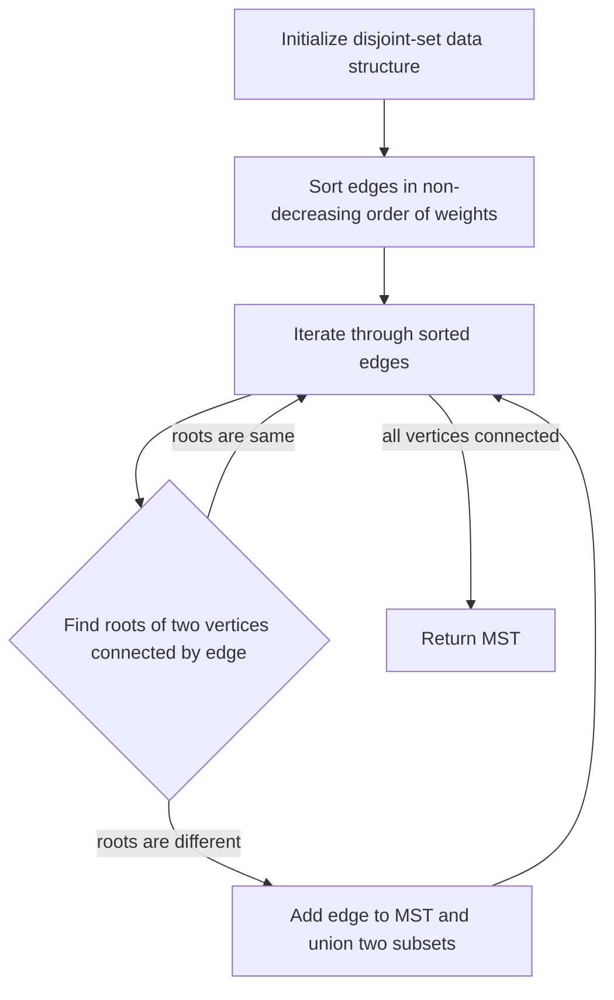

## Introduction
Borůvka's algorithm is a **graph algorithm** used to find the **Minimum Spanning Tree (MST)** of a **weighted, undirected graph**. The algorithm was first described by Czech mathematician **Otakar Borůvka** in 1926. It is an efficient algorithm for finding the MST, with a time complexity of **O(E log V)**, where **E** is the number of edges and **V** is the number of vertices in the graph. Borůvka's algorithm is particularly useful in real-world applications where the graph is very large and the edges are weighted, such as in **network design**, **telecommunication networks**, and **transportation systems**.

> **Note:** The Minimum Spanning Tree of a graph is a subgraph that connects all the vertices together with the minimum total edge weight.

## Core Concepts
To understand Borůvka's algorithm, it is essential to grasp the following core concepts:
* **Graph**: A graph is a non-linear data structure consisting of vertices or nodes connected by edges.
* **Weighted graph**: A weighted graph is a graph where each edge has a weight or label associated with it.
* **Minimum Spanning Tree (MST)**: The MST of a weighted graph is a subgraph that connects all the vertices together with the minimum total edge weight.
* **Disjoint-set data structure**: A disjoint-set data structure is a data structure used to keep track of a set of elements partitioned into a number of non-overlapping (or disjoint) subsets.

> **Tip:** The disjoint-set data structure is a crucial component of Borůvka's algorithm, as it allows for efficient union and find operations.

## How It Works Internally
Borůvka's algorithm works internally by iterating through the following steps:
1. Initialize the disjoint-set data structure with each vertex as its own subset.
2. Sort the edges of the graph in non-decreasing order of their weights.
3. Iterate through the sorted edges and for each edge:
	* Find the roots of the two vertices connected by the edge using the disjoint-set data structure.
	* If the roots are different, add the edge to the MST and union the two subsets.
4. Repeat step 3 until all vertices are connected.

> **Warning:** If the graph is not connected, Borůvka's algorithm will not produce a spanning tree. It will only produce a forest, which is a collection of trees.

## Code Examples
Here are three complete and runnable examples of Borůvka's algorithm:
### Example 1: Basic Usage
```python
class DisjointSet:
    def __init__(self, vertices):
        self.vertices = vertices
        self.parent = {v: v for v in vertices}
        self.rank = {v: 0 for v in vertices}

    def find(self, vertex):
        if self.parent[vertex] != vertex:
            self.parent[vertex] = self.find(self.parent[vertex])
        return self.parent[vertex]

    def union(self, vertex1, vertex2):
        root1 = self.find(vertex1)
        root2 = self.find(vertex2)
        if root1 != root2:
            if self.rank[root1] > self.rank[root2]:
                self.parent[root2] = root1
            else:
                self.parent[root1] = root2
                if self.rank[root1] == self.rank[root2]:
                    self.rank[root2] += 1

def boruvka(graph):
    vertices = graph['vertices']
    edges = graph['edges']
    disjoint_set = DisjointSet(vertices)
    mst = []
    edges.sort(key=lambda x: x['weight'])
    for edge in edges:
        vertex1 = edge['vertex1']
        vertex2 = edge['vertex2']
        if disjoint_set.find(vertex1) != disjoint_set.find(vertex2):
            mst.append(edge)
            disjoint_set.union(vertex1, vertex2)
    return mst

# Example graph
graph = {
    'vertices': ['A', 'B', 'C', 'D'],
    'edges': [
        {'vertex1': 'A', 'vertex2': 'B', 'weight': 1},
        {'vertex1': 'B', 'vertex2': 'C', 'weight': 2},
        {'vertex1': 'C', 'vertex2': 'D', 'weight': 3},
        {'vertex1': 'A', 'vertex2': 'D', 'weight': 4},
        {'vertex1': 'A', 'vertex2': 'C', 'weight': 5},
        {'vertex1': 'B', 'vertex2': 'D', 'weight': 6}
    ]
}

mst = boruvka(graph)
print(mst)
```

### Example 2: Real-World Pattern
```java
import java.util.*;

class Edge implements Comparable<Edge> {
    int vertex1;
    int vertex2;
    int weight;

    public Edge(int vertex1, int vertex2, int weight) {
        this.vertex1 = vertex1;
        this.vertex2 = vertex2;
        this.weight = weight;
    }

    @Override
    public int compareTo(Edge other) {
        return Integer.compare(this.weight, other.weight);
    }
}

class DisjointSet {
    int[] parent;
    int[] rank;

    public DisjointSet(int vertices) {
        parent = new int[vertices];
        rank = new int[vertices];
        for (int i = 0; i < vertices; i++) {
            parent[i] = i;
            rank[i] = 0;
        }
    }

    public int find(int vertex) {
        if (parent[vertex] != vertex) {
            parent[vertex] = find(parent[vertex]);
        }
        return parent[vertex];
    }

    public void union(int vertex1, int vertex2) {
        int root1 = find(vertex1);
        int root2 = find(vertex2);
        if (root1 != root2) {
            if (rank[root1] > rank[root2]) {
                parent[root2] = root1;
            } else {
                parent[root1] = root2;
                if (rank[root1] == rank[root2]) {
                    rank[root2]++;
                }
            }
        }
    }
}

public class Boruvka {
    public static List<Edge> boruvka(List<Edge> edges, int vertices) {
        DisjointSet disjointSet = new DisjointSet(vertices);
        List<Edge> mst = new ArrayList<>();
        Collections.sort(edges);
        for (Edge edge : edges) {
            if (disjointSet.find(edge.vertex1) != disjointSet.find(edge.vertex2)) {
                mst.add(edge);
                disjointSet.union(edge.vertex1, edge.vertex2);
            }
        }
        return mst;
    }

    public static void main(String[] args) {
        List<Edge> edges = new ArrayList<>();
        edges.add(new Edge(0, 1, 1));
        edges.add(new Edge(1, 2, 2));
        edges.add(new Edge(2, 3, 3));
        edges.add(new Edge(0, 3, 4));
        edges.add(new Edge(0, 2, 5));
        edges.add(new Edge(1, 3, 6));

        List<Edge> mst = boruvka(edges, 4);
        for (Edge edge : mst) {
            System.out.println(edge.vertex1 + " - " + edge.vertex2 + " : " + edge.weight);
        }
    }
}
```

### Example 3: Advanced Usage
```typescript
class Edge {
    vertex1: number;
    vertex2: number;
    weight: number;

    constructor(vertex1: number, vertex2: number, weight: number) {
        this.vertex1 = vertex1;
        this.vertex2 = vertex2;
        this.weight = weight;
    }
}

class DisjointSet {
    parent: number[];
    rank: number[];

    constructor(vertices: number) {
        this.parent = new Array(vertices).fill(0).map((_, index) => index);
        this.rank = new Array(vertices).fill(0);
    }

    find(vertex: number): number {
        if (this.parent[vertex] !== vertex) {
            this.parent[vertex] = this.find(this.parent[vertex]);
        }
        return this.parent[vertex];
    }

    union(vertex1: number, vertex2: number): void {
        const root1 = this.find(vertex1);
        const root2 = this.find(vertex2);
        if (root1 !== root2) {
            if (this.rank[root1] > this.rank[root2]) {
                this.parent[root2] = root1;
            } else {
                this.parent[root1] = root2;
                if (this.rank[root1] === this.rank[root2]) {
                    this.rank[root2]++;
                }
            }
        }
    }
}

function boruvka(edges: Edge[], vertices: number): Edge[] {
    const disjointSet = new DisjointSet(vertices);
    const mst: Edge[] = [];
    edges.sort((a, b) => a.weight - b.weight);
    for (const edge of edges) {
        if (disjointSet.find(edge.vertex1) !== disjointSet.find(edge.vertex2)) {
            mst.push(edge);
            disjointSet.union(edge.vertex1, edge.vertex2);
        }
    }
    return mst;
}

const edges: Edge[] = [
    new Edge(0, 1, 1),
    new Edge(1, 2, 2),
    new Edge(2, 3, 3),
    new Edge(0, 3, 4),
    new Edge(0, 2, 5),
    new Edge(1, 3, 6)
];

const mst = boruvka(edges, 4);
for (const edge of mst) {
    console.log(`${edge.vertex1} - ${edge.vertex2} : ${edge.weight}`);
}
```

## Visual Diagram

The diagram illustrates the main steps of Borůvka's algorithm. It starts by initializing the disjoint-set data structure and sorting the edges in non-decreasing order of their weights. Then, it iterates through the sorted edges and finds the roots of the two vertices connected by each edge. If the roots are different, it adds the edge to the MST and unions the two subsets. The process continues until all vertices are connected.

> **Interview:** Can you explain the time complexity of Borůvka's algorithm and how it compares to other MST algorithms like Kruskal's and Prim's?

## Comparison
| Algorithm | Time Complexity | Space Complexity | Pros | Cons | Best For |
| --- | --- | --- | --- | --- | --- |
| Borůvka's | O(E log V) | O(V + E) | Efficient for dense graphs, simple to implement | Not suitable for sparse graphs, may not find optimal solution | Network design, telecommunication networks |
| Kruskal's | O(E log E) | O(V + E) | Finds optimal solution, simple to implement | Not efficient for dense graphs, may have high time complexity | Sparse graphs, minimum spanning tree |
| Prim's | O(E + V log V) | O(V + E) | Finds optimal solution, efficient for dense graphs | May have high time complexity, not simple to implement | Dense graphs, minimum spanning tree |

> **Tip:** Borůvka's algorithm is a good choice when the graph is dense and the edges are weighted, while Kruskal's algorithm is a better choice when the graph is sparse and the edges are weighted.

## Real-world Use Cases
1. **Network design**: Borůvka's algorithm can be used to design efficient network topologies, such as telecommunication networks or transportation systems.
2. **Telecommunication networks**: The algorithm can be used to find the minimum spanning tree of a network, which can help to reduce the cost of building and maintaining the network.
3. **Transportation systems**: Borůvka's algorithm can be used to find the shortest path between two cities or to design efficient transportation systems, such as bus or train networks.

> **Note:** Borůvka's algorithm is widely used in many real-world applications, including network design, telecommunication networks, and transportation systems.

## Common Pitfalls
1. **Not checking for connectivity**: Borůvka's algorithm assumes that the graph is connected. If the graph is not connected, the algorithm may not produce a spanning tree.
2. **Not handling weighted edges**: The algorithm assumes that the edges are weighted. If the edges are not weighted, the algorithm may not produce the correct result.
3. **Not using a disjoint-set data structure**: The algorithm uses a disjoint-set data structure to keep track of the connected components. If a different data structure is used, the algorithm may not produce the correct result.
4. **Not sorting the edges**: The algorithm sorts the edges in non-decreasing order of their weights. If the edges are not sorted, the algorithm may not produce the correct result.

> **Warning:** Borůvka's algorithm may not produce the correct result if the graph is not connected or if the edges are not weighted.

## Interview Tips
1. **Be prepared to explain the time complexity**: The interviewer may ask you to explain the time complexity of Borůvka's algorithm and how it compares to other MST algorithms.
2. **Be prepared to explain the space complexity**: The interviewer may ask you to explain the space complexity of Borůvka's algorithm and how it compares to other MST algorithms.
3. **Be prepared to explain the algorithm's limitations**: The interviewer may ask you to explain the limitations of Borůvka's algorithm, such as its inability to handle unweighted graphs or its potential to produce suboptimal solutions.

> **Interview:** Can you explain how Borůvka's algorithm handles weighted edges and how it compares to other MST algorithms?

## Key Takeaways
* Borůvka's algorithm is a **graph algorithm** used to find the **Minimum Spanning Tree (MST)** of a **weighted, undirected graph**.
* The algorithm has a time complexity of **O(E log V)** and a space complexity of **O(V + E)**.
* Borůvka's algorithm is efficient for **dense graphs** and simple to implement.
* The algorithm assumes that the graph is **connected** and the edges are **weighted**.
* Borůvka's algorithm may not produce the correct result if the graph is not connected or if the edges are not weighted.
* The algorithm is widely used in many real-world applications, including **network design**, **telecommunication networks**, and **transportation systems**.