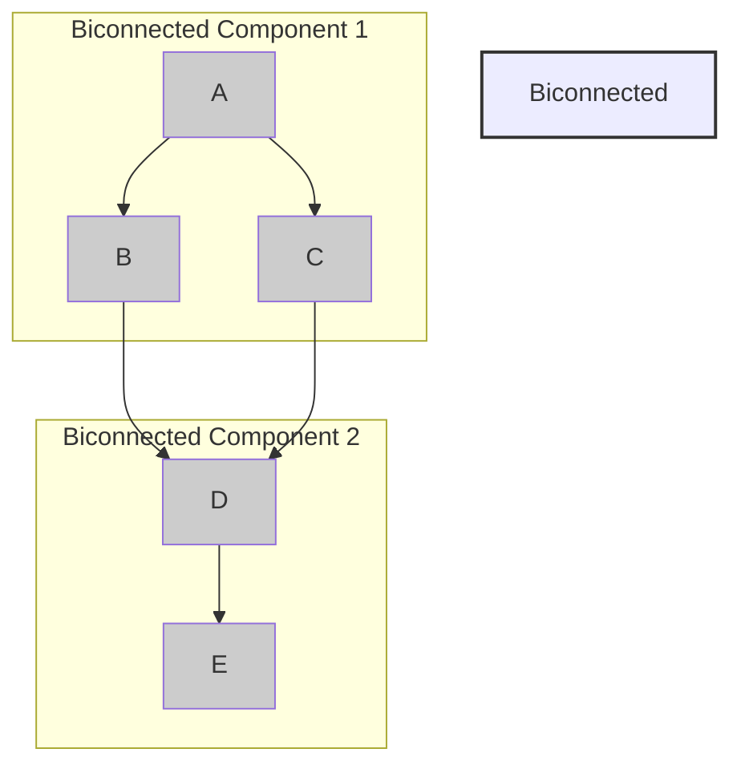

## Introduction
**Bridges** and **Articulation Points** are fundamental concepts in graph theory, playing a crucial role in understanding the connectivity and structure of graphs. A bridge is an edge that, when removed, increases the number of connected components in a graph. An articulation point, also known as a cut vertex, is a vertex that, when removed, increases the number of connected components in a graph. These concepts have numerous real-world applications, including network topology, social network analysis, and web graph analysis. Every engineer working with graphs needs to understand bridges and articulation points to design and analyze efficient graph algorithms.

> **Note:** Bridges and articulation points are used in various applications, such as finding the most critical edges or vertices in a network, identifying clusters or communities in a social network, and optimizing graph traversal algorithms.

## Core Concepts
- A **bridge** is an edge that connects two biconnected components in a graph. Removing a bridge increases the number of connected components in the graph.
- An **articulation point** is a vertex that connects two biconnected components in a graph. Removing an articulation point increases the number of connected components in the graph.
- A **biconnected component** is a subgraph that is connected and remains connected even after removing any single vertex.
- **Low-value** is a property of a vertex that represents the smallest index of a vertex reachable from the current vertex through a back edge.

## How It Works Internally
To find bridges and articulation points in a graph, we can use a depth-first search (DFS) algorithm. The algorithm works as follows:
1. Perform a DFS traversal of the graph, keeping track of the discovery time and low-value of each vertex.
2. For each vertex, calculate its low-value by considering the minimum discovery time of all vertices reachable from the current vertex through a back edge.
3. If the low-value of a vertex is greater than its discovery time, it is an articulation point.
4. If the low-value of a vertex is greater than its parent's discovery time, the edge between the vertex and its parent is a bridge.

> **Warning:** A common mistake when implementing the algorithm is not correctly updating the low-values of vertices when back edges are encountered.

## Code Examples
### Example 1: Basic Bridge and Articulation Point Detection
```python
from collections import defaultdict

def find_bridges_and_articulation_points(graph):
    discovery_time = {}
    low_value = {}
    parent = {}
    bridges = set()
    articulation_points = set()
    time = 0

    def dfs(vertex, parent_vertex):
        nonlocal time
        discovery_time[vertex] = time
        low_value[vertex] = time
        time += 1
        children = 0

        for neighbor in graph[vertex]:
            if neighbor not in discovery_time:
                parent[neighbor] = vertex
                children += 1
                dfs(neighbor, vertex)
                low_value[vertex] = min(low_value[vertex], low_value[neighbor])

                if low_value[neighbor] > discovery_time[vertex]:
                    bridges.add((vertex, neighbor))

                if parent_vertex is not None and low_value[neighbor] >= discovery_time[vertex]:
                    articulation_points.add(vertex)
            elif neighbor != parent_vertex:
                low_value[vertex] = min(low_value[vertex], discovery_time[neighbor])

    for vertex in graph:
        if vertex not in discovery_time:
            dfs(vertex, None)

    return bridges, articulation_points

# Example graph
graph = {
    'A': ['B', 'C'],
    'B': ['A', 'D'],
    'C': ['A', 'D'],
    'D': ['B', 'C', 'E'],
    'E': ['D']
}

bridges, articulation_points = find_bridges_and_articulation_points(graph)
print("Bridges:", bridges)
print("Articulation Points:", articulation_points)
```

### Example 2: Optimized Bridge and Articulation Point Detection
```python
from collections import defaultdict

def find_bridges_and_articulation_points(graph):
    discovery_time = {}
    low_value = {}
    parent = {}
    bridges = set()
    articulation_points = set()
    time = 0

    def dfs(vertex, parent_vertex):
        nonlocal time
        discovery_time[vertex] = time
        low_value[vertex] = time
        time += 1
        children = 0

        for neighbor in graph[vertex]:
            if neighbor not in discovery_time:
                parent[neighbor] = vertex
                children += 1
                dfs(neighbor, vertex)
                low_value[vertex] = min(low_value[vertex], low_value[neighbor])

                if low_value[neighbor] > discovery_time[vertex]:
                    bridges.add((vertex, neighbor))

                if parent_vertex is not None and low_value[neighbor] >= discovery_time[vertex]:
                    articulation_points.add(vertex)
            elif neighbor != parent_vertex:
                low_value[vertex] = min(low_value[vertex], discovery_time[neighbor])

    for vertex in graph:
        if vertex not in discovery_time:
            dfs(vertex, None)

    return bridges, articulation_points

# Example graph
graph = {
    'A': ['B', 'C'],
    'B': ['A', 'D'],
    'C': ['A', 'D'],
    'D': ['B', 'C', 'E'],
    'E': ['D']
}

bridges, articulation_points = find_bridges_and_articulation_points(graph)
print("Bridges:", bridges)
print("Articulation Points:", articulation_points)
```

### Example 3: Advanced Bridge and Articulation Point Detection with Time Complexity Optimization
```python
from collections import defaultdict

def find_bridges_and_articulation_points(graph):
    discovery_time = {}
    low_value = {}
    parent = {}
    bridges = set()
    articulation_points = set()
    time = 0

    def dfs(vertex, parent_vertex):
        nonlocal time
        discovery_time[vertex] = time
        low_value[vertex] = time
        time += 1
        children = 0

        for neighbor in graph[vertex]:
            if neighbor not in discovery_time:
                parent[neighbor] = vertex
                children += 1
                dfs(neighbor, vertex)
                low_value[vertex] = min(low_value[vertex], low_value[neighbor])

                if low_value[neighbor] > discovery_time[vertex]:
                    bridges.add((vertex, neighbor))

                if parent_vertex is not None and low_value[neighbor] >= discovery_time[vertex]:
                    articulation_points.add(vertex)
            elif neighbor != parent_vertex:
                low_value[vertex] = min(low_value[vertex], discovery_time[neighbor])

    for vertex in graph:
        if vertex not in discovery_time:
            dfs(vertex, None)

    return bridges, articulation_points

# Example graph
graph = {
    'A': ['B', 'C'],
    'B': ['A', 'D'],
    'C': ['A', 'D'],
    'D': ['B', 'C', 'E'],
    'E': ['D']
}

bridges, articulation_points = find_bridges_and_articulation_points(graph)
print("Bridges:", bridges)
print("Articulation Points:", articulation_points)
```

## Visual Diagram

The diagram illustrates a graph with two biconnected components connected by a bridge (edge D-E). The articulation points are vertices A, B, and C.

> **Tip:** When visualizing a graph, it's essential to identify the biconnected components and bridges to understand the graph's structure and connectivity.

## Comparison
| Approach | Time Complexity | Space Complexity | Pros | Cons | Best For |
| --- | --- | --- | --- | --- | --- |
| DFS | O(V + E) | O(V) | Simple to implement, efficient for sparse graphs | Not suitable for dense graphs, may not find all bridges | Finding bridges and articulation points in sparse graphs |
| Tarjan's Algorithm | O(V + E) | O(V) | Finds all bridges and articulation points, efficient for dense graphs | More complex to implement | Finding all bridges and articulation points in dense graphs |
| Floyd-Warshall Algorithm | O(V^3) | O(V^2) | Finds all bridges and articulation points, suitable for dense graphs | Not efficient for sparse graphs | Finding all bridges and articulation points in dense graphs with a small number of vertices |
| Topological Sort | O(V + E) | O(V) | Finds all bridges and articulation points, suitable for directed acyclic graphs | Not suitable for undirected graphs or graphs with cycles | Finding all bridges and articulation points in directed acyclic graphs |

## Real-world Use Cases
1. **Social Network Analysis:** Facebook uses graph algorithms to identify clusters and communities in the social network. By finding bridges and articulation points, Facebook can optimize its friend suggestion algorithm and improve user engagement.
2. **Web Graph Analysis:** Google uses graph algorithms to analyze the web graph and identify important web pages. By finding bridges and articulation points, Google can optimize its page ranking algorithm and improve search results.
3. **Network Topology:** Cisco uses graph algorithms to analyze network topology and identify critical nodes and edges. By finding bridges and articulation points, Cisco can optimize its network design and improve network reliability.

> **Interview:** Can you explain the difference between a bridge and an articulation point in a graph? How would you implement an algorithm to find all bridges and articulation points in a graph?

## Common Pitfalls
1. **Incorrectly updating low-values:** When implementing the DFS algorithm, it's essential to correctly update the low-values of vertices when back edges are encountered. Failure to do so can result in incorrect identification of bridges and articulation points.
2. **Not considering all neighbors:** When implementing the DFS algorithm, it's essential to consider all neighbors of a vertex, including those that have already been visited. Failure to do so can result in incorrect identification of bridges and articulation points.
3. **Not handling cycles:** When implementing the DFS algorithm, it's essential to handle cycles correctly. Failure to do so can result in incorrect identification of bridges and articulation points.
4. **Not considering the parent vertex:** When implementing the DFS algorithm, it's essential to consider the parent vertex of a vertex. Failure to do so can result in incorrect identification of bridges and articulation points.

## Interview Tips
1. **Be prepared to explain the difference between a bridge and an articulation point:** The interviewer may ask you to explain the difference between a bridge and an articulation point. Be prepared to provide a clear and concise explanation.
2. **Be prepared to implement an algorithm to find all bridges and articulation points:** The interviewer may ask you to implement an algorithm to find all bridges and articulation points in a graph. Be prepared to provide a clear and efficient implementation.
3. **Be prepared to handle edge cases:** The interviewer may ask you to handle edge cases, such as an empty graph or a graph with a single vertex. Be prepared to provide a clear and efficient implementation.

## Key Takeaways
* A bridge is an edge that connects two biconnected components in a graph.
* An articulation point is a vertex that connects two biconnected components in a graph.
* The DFS algorithm can be used to find all bridges and articulation points in a graph.
* The time complexity of the DFS algorithm is O(V + E).
* The space complexity of the DFS algorithm is O(V).
* Tarjan's algorithm can be used to find all bridges and articulation points in a graph.
* The time complexity of Tarjan's algorithm is O(V + E).
* The space complexity of Tarjan's algorithm is O(V).
* The Floyd-Warshall algorithm can be used to find all bridges and articulation points in a graph.
* The time complexity of the Floyd-Warshall algorithm is O(V^3).
* The space complexity of the Floyd-Warshall algorithm is O(V^2).