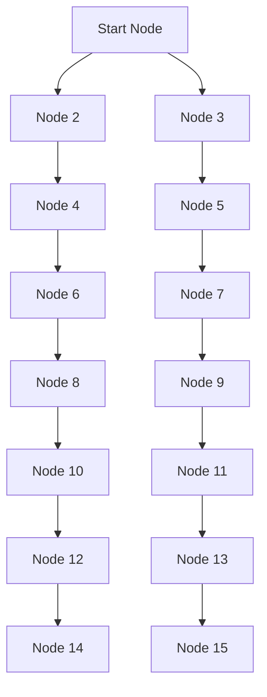

## Introduction
**Depth-First Search (DFS)** and **Breadth-First Search (BFS)** are two fundamental graph traversal algorithms used to search and explore nodes in a graph or tree data structure. These algorithms have numerous applications in computer science, including network topology discovery, web crawling, social network analysis, and more. Every engineer should understand the basics of DFS and BFS, as they are essential building blocks for more complex algorithms and data structures.

In real-world scenarios, DFS and BFS are used in various applications, such as:
- Network topology discovery: DFS and BFS are used to discover and map network devices, such as routers, switches, and servers.
- Web crawling: BFS is used by search engines like Google to crawl and index web pages.
- Social network analysis: DFS and BFS are used to analyze social networks, such as friend suggestions and recommendation systems.

## Core Concepts
- **Graph**: A non-linear data structure consisting of nodes (vertices) and edges that connect them.
- **Node (Vertex)**: A point in the graph that represents a value or entity.
- **Edge**: A connection between two nodes in the graph.
- **Neighbor**: A node that is directly connected to another node via an edge.
- **Path**: A sequence of nodes and edges that connect them.

To understand DFS and BFS, it's essential to have a solid grasp of graph terminology and concepts. A mental model that can help is to think of a graph as a map, where nodes represent locations, and edges represent roads or connections between them.

## How It Works Internally
- **DFS**:
  1. Choose a starting node (also called the root node).
  2. Mark the current node as visited.
  3. Explore the neighbors of the current node that have not been visited yet.
  4. Recursively repeat steps 2-3 for each unvisited neighbor.
  5. Backtrack to the previous node when all neighbors have been visited.

- **BFS**:
  1. Choose a starting node (also called the root node).
  2. Create a queue to hold nodes to be visited.
  3. Enqueue the starting node.
  4. While the queue is not empty:
    - Dequeue a node.
    - Mark the node as visited.
    - Enqueue all unvisited neighbors of the node.
  5. Repeat step 4 until the queue is empty.

> **Note:** The key difference between DFS and BFS is the order in which they visit nodes. DFS explores as far as possible along each branch before backtracking, while BFS explores all nodes at a given depth level before moving to the next level.

## Code Examples
### Example 1: Basic DFS (Recursive)
```python
class Graph:
    def __init__(self):
        self.nodes = {}

    def add_node(self, value):
        self.nodes[value] = []

    def add_edge(self, node1, node2):
        self.nodes[node1].append(node2)

    def dfs(self, start_node):
        visited = set()
        self._dfs_helper(start_node, visited)

    def _dfs_helper(self, node, visited):
        visited.add(node)
        print(node)
        for neighbor in self.nodes[node]:
            if neighbor not in visited:
                self._dfs_helper(neighbor, visited)

# Create a sample graph
graph = Graph()
graph.add_node(1)
graph.add_node(2)
graph.add_node(3)
graph.add_node(4)
graph.add_edge(1, 2)
graph.add_edge(1, 3)
graph.add_edge(2, 4)

# Perform DFS traversal
graph.dfs(1)
```

### Example 2: BFS (Iterative)
```python
from collections import deque

class Graph:
    def __init__(self):
        self.nodes = {}

    def add_node(self, value):
        self.nodes[value] = []

    def add_edge(self, node1, node2):
        self.nodes[node1].append(node2)

    def bfs(self, start_node):
        visited = set()
        queue = deque([start_node])
        visited.add(start_node)

        while queue:
            node = queue.popleft()
            print(node)
            for neighbor in self.nodes[node]:
                if neighbor not in visited:
                    queue.append(neighbor)
                    visited.add(neighbor)

# Create a sample graph
graph = Graph()
graph.add_node(1)
graph.add_node(2)
graph.add_node(3)
graph.add_node(4)
graph.add_edge(1, 2)
graph.add_edge(1, 3)
graph.add_edge(2, 4)

# Perform BFS traversal
graph.bfs(1)
```

### Example 3: Advanced DFS (Iterative)
```python
class Graph:
    def __init__(self):
        self.nodes = {}

    def add_node(self, value):
        self.nodes[value] = []

    def add_edge(self, node1, node2):
        self.nodes[node1].append(node2)

    def dfs_iterative(self, start_node):
        visited = set()
        stack = [start_node]

        while stack:
            node = stack.pop()
            if node not in visited:
                visited.add(node)
                print(node)
                for neighbor in reversed(self.nodes[node]):
                    stack.append(neighbor)

# Create a sample graph
graph = Graph()
graph.add_node(1)
graph.add_node(2)
graph.add_node(3)
graph.add_node(4)
graph.add_edge(1, 2)
graph.add_edge(1, 3)
graph.add_edge(2, 4)

# Perform DFS traversal
graph.dfs_iterative(1)
```

## Visual Diagram

> **Tip:** This diagram illustrates a sample graph with multiple nodes and edges. The DFS traversal would visit nodes in the order A, B, D, F, H, L, N, C, E, G, I, K, M, O, while the BFS traversal would visit nodes in the order A, B, C, D, E, F, G, H, I, J, K, L, M, N, O.

## Comparison
| Approach | Time Complexity | Space Complexity | Pros | Cons | Best For |
| --- | --- | --- | --- | --- | --- |
| DFS (Recursive) | O(V + E) | O(V) | Simple to implement, can be used for searching and traversal | May cause stack overflow for very large graphs | Searching, traversal, and finding connected components |
| DFS (Iterative) | O(V + E) | O(V) | Avoids stack overflow, can be used for searching and traversal | More complex to implement than recursive DFS | Searching, traversal, and finding connected components |
| BFS | O(V + E) | O(V) | Guarantees shortest path to all nodes, can be used for searching and traversal | May require more memory than DFS, can be slower than DFS for very large graphs | Finding shortest paths, network topology discovery, and web crawling |

> **Warning:** The time and space complexity of DFS and BFS can vary depending on the specific implementation and the structure of the graph. It's essential to consider these factors when choosing an algorithm for a particular problem.

## Real-world Use Cases
1. **Google's Web Crawler**: Google uses a BFS-based algorithm to crawl and index web pages. The algorithm starts with a set of seed pages and explores all links from those pages, adding new pages to the index as it goes.
2. **Facebook's Friend Suggestions**: Facebook uses a combination of DFS and BFS to suggest friends to users. The algorithm starts with a user's friends and explores their friends, using DFS to find close connections and BFS to find more distant connections.
3. **Network Topology Discovery**: DFS and BFS are used in network topology discovery to map the structure of a network. The algorithms start with a known node and explore all connected nodes, building a map of the network as they go.

## Common Pitfalls
1. **Infinite Loops**: DFS and BFS can get stuck in infinite loops if the graph contains cycles and the algorithm does not keep track of visited nodes.
2. **Stack Overflow**: Recursive DFS can cause a stack overflow if the graph is very large and the algorithm does not use an iterative approach.
3. **Incorrect Node Ordering**: BFS can produce incorrect results if the node ordering is not correct, such as when using a queue with a fixed size.
4. **Missing Nodes**: DFS and BFS can miss nodes if the graph is not fully connected or if the algorithm does not explore all edges.

> **Interview:** A common interview question is to ask the candidate to implement DFS or BFS from scratch, including handling edge cases such as cycles and disconnected nodes.

## Interview Tips
1. **Be prepared to implement DFS and BFS from scratch**: Make sure you understand the algorithms and can implement them in a programming language of your choice.
2. **Know the time and space complexity**: Be able to explain the time and space complexity of DFS and BFS, including the factors that affect them.
3. **Understand the differences between DFS and BFS**: Be able to explain the differences between DFS and BFS, including the scenarios in which each is more suitable.
4. **Practice, practice, practice**: Practice implementing DFS and BFS on different types of graphs, including those with cycles and disconnected nodes.

## Key Takeaways
* DFS and BFS are fundamental graph traversal algorithms used to search and explore nodes in a graph or tree data structure.
* DFS explores as far as possible along each branch before backtracking, while BFS explores all nodes at a given depth level before moving to the next level.
* The time complexity of DFS and BFS is O(V + E), where V is the number of nodes and E is the number of edges.
* The space complexity of DFS and BFS is O(V), as both algorithms require a data structure to keep track of visited nodes.
* DFS and BFS have numerous applications in computer science, including network topology discovery, web crawling, and social network analysis.
* When choosing between DFS and BFS, consider the structure of the graph and the specific requirements of the problem.
* Be prepared to implement DFS and BFS from scratch, including handling edge cases such as cycles and disconnected nodes.