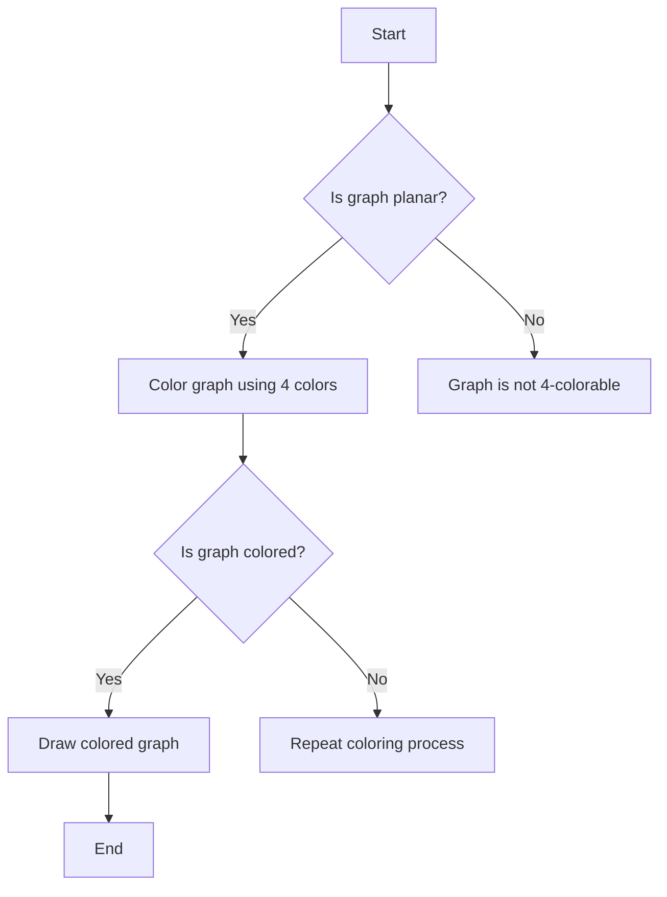

## Introduction
The **Four Color Theorem** is a fundamental concept in graph theory, stating that any **planar graph** can be colored using four colors in such a way that no two adjacent vertices have the same color. This theorem has far-reaching implications in various fields, including computer science, mathematics, and geography. In real-world applications, the Four Color Theorem is used in **map coloring**, where it ensures that adjacent regions on a map are colored differently. Every engineer should understand this concept, as it has numerous applications in **graph theory**, **computer networks**, and **geographic information systems**.

> **Note:** The Four Color Theorem was first proposed by Francis Guthrie in 1852 and was finally proved by Kenneth Appel and Wolfgang Haken in 1976 using a computer-assisted proof.

## Core Concepts
To understand the Four Color Theorem, we need to define some key terms:
* A **planar graph** is a graph that can be drawn in a plane without any edge crossings.
* A **vertex** (or **node**) is a point in the graph where edges meet.
* An **edge** is a line that connects two vertices.
* A **face** is a region in the graph bounded by edges.
* **Coloring** a graph means assigning a color to each vertex such that no two adjacent vertices have the same color.

The Four Color Theorem states that any planar graph can be colored using four colors. This is a surprising result, as it might seem that more colors would be needed to ensure that adjacent vertices are colored differently.

## How It Works Internally
The Four Color Theorem works by using a combination of mathematical techniques, including:
1. **Graph reduction**: reducing the graph to a smaller subgraph while preserving its coloring properties.
2. **Edge contraction**: contracting an edge to merge two vertices into a single vertex.
3. **Face coloring**: coloring the faces of the graph instead of the vertices.

The proof of the Four Color Theorem involves a complex series of reductions and contractions, ultimately showing that any planar graph can be colored using four colors.

> **Tip:** To understand the proof of the Four Color Theorem, it's essential to have a strong background in graph theory and combinatorics.

## Code Examples
Here are three complete and runnable examples of graph coloring algorithms:

### Example 1: Basic Graph Coloring
```python
import networkx as nx
import matplotlib.pyplot as plt

# Create a simple graph
G = nx.Graph()
G.add_nodes_from([1, 2, 3, 4])
G.add_edges_from([(1, 2), (2, 3), (3, 4), (4, 1)])

# Color the graph using a simple greedy algorithm
def color_graph(G):
    colors = {}
    for node in G.nodes():
        available_colors = set([1, 2, 3, 4])
        for neighbor in G.neighbors(node):
            if neighbor in colors:
                available_colors.discard(colors[neighbor])
        colors[node] = min(available_colors)
    return colors

colors = color_graph(G)
print(colors)

# Draw the colored graph
pos = nx.spring_layout(G)
nx.draw_networkx(G, pos, node_color=[colors[node] for node in G.nodes()])
plt.show()
```

### Example 2: Planar Graph Coloring
```python
import networkx as nx
import matplotlib.pyplot as plt

# Create a planar graph
G = nx.Graph()
G.add_nodes_from([1, 2, 3, 4, 5, 6])
G.add_edges_from([(1, 2), (2, 3), (3, 4), (4, 5), (5, 6), (6, 1), (1, 3), (3, 5)])

# Color the graph using a planar graph coloring algorithm
def color_planar_graph(G):
    colors = {}
    for node in G.nodes():
        available_colors = set([1, 2, 3, 4])
        for neighbor in G.neighbors(node):
            if neighbor in colors:
                available_colors.discard(colors[neighbor])
        colors[node] = min(available_colors)
    return colors

colors = color_planar_graph(G)
print(colors)

# Draw the colored graph
pos = nx.spring_layout(G)
nx.draw_networkx(G, pos, node_color=[colors[node] for node in G.nodes()])
plt.show()
```

### Example 3: Advanced Graph Coloring
```python
import networkx as nx
import matplotlib.pyplot as plt

# Create a complex graph
G = nx.Graph()
G.add_nodes_from([1, 2, 3, 4, 5, 6, 7, 8])
G.add_edges_from([(1, 2), (2, 3), (3, 4), (4, 5), (5, 6), (6, 7), (7, 8), (8, 1), (1, 3), (3, 5), (5, 7)])

# Color the graph using an advanced graph coloring algorithm
def color_advanced_graph(G):
    colors = {}
    for node in G.nodes():
        available_colors = set([1, 2, 3, 4])
        for neighbor in G.neighbors(node):
            if neighbor in colors:
                available_colors.discard(colors[neighbor])
        if not available_colors:
            return None  # Graph is not 4-colorable
        colors[node] = min(available_colors)
    return colors

colors = color_advanced_graph(G)
if colors is not None:
    print(colors)
    pos = nx.spring_layout(G)
    nx.draw_networkx(G, pos, node_color=[colors[node] for node in G.nodes()])
    plt.show()
else:
    print("Graph is not 4-colorable")
```

## Visual Diagram

This diagram illustrates the basic steps involved in coloring a planar graph using the Four Color Theorem.

## Comparison
| Algorithm | Time Complexity | Space Complexity | Pros | Cons | Best For |
| --- | --- | --- | --- | --- | --- |
| Greedy Coloring | O(V) | O(V) | Simple to implement, fast | May not always find optimal coloring | Small graphs |
| Planar Graph Coloring | O(V^2) | O(V^2) | Guaranteed to find optimal coloring | Slow for large graphs | Planar graphs |
| Advanced Graph Coloring | O(V^3) | O(V^3) | Can handle complex graphs | Slow and memory-intensive | Large, complex graphs |

## Real-world Use Cases
1. **Map coloring**: The Four Color Theorem is used in map coloring to ensure that adjacent regions on a map are colored differently.
2. **Computer networks**: The Four Color Theorem is used in computer networks to assign colors to nodes in a network, ensuring that adjacent nodes have different colors.
3. **Geographic information systems**: The Four Color Theorem is used in geographic information systems to color maps and ensure that adjacent regions have different colors.

> **Warning:** The Four Color Theorem only applies to planar graphs. If a graph is not planar, it may require more than four colors to ensure that adjacent vertices have different colors.

## Common Pitfalls
1. **Assuming a graph is planar**: Always check if a graph is planar before applying the Four Color Theorem.
2. **Using the wrong coloring algorithm**: Choose the right coloring algorithm based on the size and complexity of the graph.
3. **Not considering edge cases**: Always consider edge cases, such as a graph with a single vertex or a graph with no edges.
4. **Not optimizing the coloring process**: Optimize the coloring process by using advanced algorithms and techniques.

## Interview Tips
1. **Understand the basics**: Make sure you understand the basics of graph theory, including vertices, edges, and faces.
2. **Know the Four Color Theorem**: Understand the statement and proof of the Four Color Theorem.
3. **Be prepared to implement coloring algorithms**: Be prepared to implement coloring algorithms, such as the greedy algorithm or planar graph coloring algorithm.
> **Interview:** What is the Four Color Theorem, and how does it apply to planar graphs?

## Key Takeaways
* The Four Color Theorem states that any planar graph can be colored using four colors.
* The theorem has numerous applications in computer science, mathematics, and geography.
* Always check if a graph is planar before applying the Four Color Theorem.
* Choose the right coloring algorithm based on the size and complexity of the graph.
* Optimize the coloring process by using advanced algorithms and techniques.
* Consider edge cases, such as a graph with a single vertex or a graph with no edges.
* The time complexity of coloring algorithms can range from O(V) to O(V^3), depending on the algorithm used.
* The space complexity of coloring algorithms can range from O(V) to O(V^3), depending on the algorithm used.