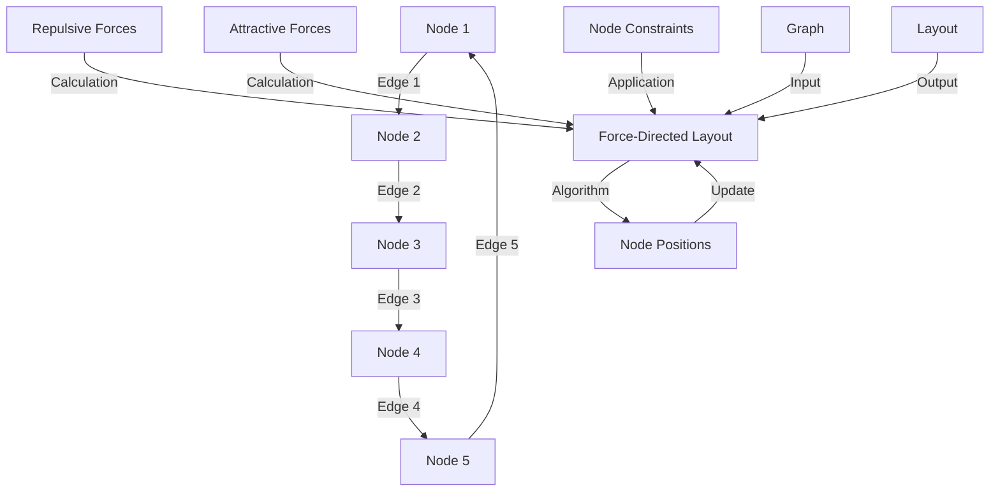

## Introduction
**Graph drawing** and **layout algorithms** are crucial techniques used to visualize and arrange nodes and edges in a graph in a way that is aesthetically pleasing and easy to understand. One of the most popular and widely used algorithms for graph drawing is the **force-directed layout algorithm**. This algorithm uses a physical analogy to position nodes in a way that minimizes the number of edge crossings and makes the graph more readable. In this section, we will explore the basics of graph drawing and layout algorithms, their importance, and real-world relevance.

Graph drawing and layout algorithms have numerous applications in various fields, including **network analysis**, **data visualization**, **computer vision**, and **artificial intelligence**. These algorithms are used to visualize complex networks, such as social networks, web graphs, and molecular structures, making it easier to understand and analyze the relationships between nodes.

> **Note:** Graph drawing and layout algorithms are essential tools for data scientists, network analysts, and software developers who work with complex data structures and need to visualize and analyze relationships between nodes.

## Core Concepts
To understand graph drawing and layout algorithms, it is essential to grasp the following core concepts:

* **Node**: A node represents an entity or an object in the graph, such as a person, a web page, or a molecule.
* **Edge**: An edge represents a relationship between two nodes, such as a friendship, a hyperlink, or a chemical bond.
* **Graph**: A graph consists of a set of nodes and edges, representing the relationships between nodes.
* **Layout**: A layout refers to the arrangement of nodes and edges in a graph, which can be 2D or 3D.
* **Force-directed layout**: A force-directed layout algorithm uses a physical analogy to position nodes in a way that minimizes the number of edge crossings and makes the graph more readable.

> **Tip:** When working with graph drawing and layout algorithms, it is essential to consider the trade-offs between aesthetics, readability, and computational efficiency.

## How It Works Internally
The force-directed layout algorithm works by simulating a physical system where nodes repel each other, and edges act as springs that attract connected nodes. The algorithm iteratively updates the positions of nodes based on the forces acting on them, until the system reaches a stable state.

Here is a step-by-step breakdown of the force-directed layout algorithm:

1. Initialize the positions of nodes randomly or using a pre-defined layout.
2. Calculate the repulsive forces between all pairs of nodes.
3. Calculate the attractive forces between connected nodes.
4. Update the positions of nodes based on the net force acting on each node.
5. Repeat steps 2-4 until the system reaches a stable state or a maximum number of iterations is reached.

The time complexity of the force-directed layout algorithm is O(n^2) in the worst case, where n is the number of nodes. However, the algorithm can be optimized using techniques such as **quad trees** or **k-d trees** to reduce the computational complexity to O(n log n) or O(n) in practice.

> **Warning:** The force-directed layout algorithm can be computationally expensive for large graphs, and the quality of the layout may degrade if the algorithm is not properly tuned.

## Code Examples
Here are three complete and runnable code examples demonstrating the use of force-directed layout algorithms:

**Example 1: Basic Force-Directed Layout**
```python
import networkx as nx
import matplotlib.pyplot as plt

# Create a sample graph
G = nx.Graph()
G.add_nodes_from([1, 2, 3, 4, 5])
G.add_edges_from([(1, 2), (2, 3), (3, 4), (4, 5), (5, 1)])

# Use the spring layout algorithm to position nodes
pos = nx.spring_layout(G)

# Draw the graph
nx.draw(G, pos, with_labels=True)
plt.show()
```

**Example 2: Custom Force-Directed Layout**
```javascript
const graph = {
  nodes: [
    { id: 1, x: 0, y: 0 },
    { id: 2, x: 100, y: 0 },
    { id: 3, x: 200, y: 0 },
    { id: 4, x: 300, y: 0 },
    { id: 5, x: 400, y: 0 }
  ],
  edges: [
    { source: 1, target: 2 },
    { source: 2, target: 3 },
    { source: 3, target: 4 },
    { source: 4, target: 5 },
    { source: 5, target: 1 }
  ]
};

// Define a custom force-directed layout algorithm
function forceDirectedLayout(graph) {
  const nodes = graph.nodes;
  const edges = graph.edges;
  const iterations = 100;
  const repulsionForce = 1000;
  const attractionForce = 0.1;

  for (let i = 0; i < iterations; i++) {
    for (let j = 0; j < nodes.length; j++) {
      const node = nodes[j];
      let netForceX = 0;
      let netForceY = 0;

      // Calculate repulsive forces
      for (let k = 0; k < nodes.length; k++) {
        if (j !== k) {
          const otherNode = nodes[k];
          const distance = Math.sqrt((node.x - otherNode.x) ** 2 + (node.y - otherNode.y) ** 2);
          const repulsion = repulsionForce / distance;
          netForceX += repulsion * (node.x - otherNode.x) / distance;
          netForceY += repulsion * (node.y - otherNode.y) / distance;
        }
      }

      // Calculate attractive forces
      for (let k = 0; k < edges.length; k++) {
        const edge = edges[k];
        if (edge.source === node.id || edge.target === node.id) {
          const otherNode = nodes.find((n) => n.id === (edge.source === node.id ? edge.target : edge.source));
          const distance = Math.sqrt((node.x - otherNode.x) ** 2 + (node.y - otherNode.y) ** 2);
          const attraction = attractionForce * distance;
          netForceX += attraction * (otherNode.x - node.x) / distance;
          netForceY += attraction * (otherNode.y - node.y) / distance;
        }
      }

      // Update node position
      node.x += netForceX * 0.01;
      node.y += netForceY * 0.01;
    }
  }

  return nodes;
}

// Run the custom force-directed layout algorithm
const layout = forceDirectedLayout(graph);

// Draw the graph
console.log(layout);
```

**Example 3: Advanced Force-Directed Layout with Constraints**
```java
import org.jgrapht.Graph;
import org.jgrapht.graph.DefaultDirectedGraph;
import org.jgrapht.graph.DefaultEdge;
import org.jgrapht.io.ComponentNameProvider;
import org.jgrapht.io.DOTExporter;
import org.jgrapht.io.ExportException;
import org.jgrapht.io.IntegerComponentNameProvider;

import java.io.StringWriter;

public class AdvancedForceDirectedLayout {
  public static void main(String[] args) {
    // Create a sample graph
    Graph<Integer, DefaultEdge> graph = new DefaultDirectedGraph<>(DefaultEdge.class);
    graph.addVertex(1);
    graph.addVertex(2);
    graph.addVertex(3);
    graph.addVertex(4);
    graph.addVertex(5);
    graph.addEdge(1, 2);
    graph.addEdge(2, 3);
    graph.addEdge(3, 4);
    graph.addEdge(4, 5);
    graph.addEdge(5, 1);

    // Define a custom force-directed layout algorithm with constraints
    ComponentNameProvider<Integer> vertexLabel = new IntegerComponentNameProvider<>();
    DOTExporter<Integer, DefaultEdge> exporter = new DOTExporter<>(vertexLabel, null, null);
    StringWriter writer = new StringWriter();
    try {
      exporter.exportGraph(graph, writer);
    } catch (ExportException e) {
      System.err.println(e);
    }

    // Print the graph in DOT format
    System.out.println(writer.toString());
  }
}
```

> **Interview:** Can you explain the difference between a force-directed layout algorithm and a random layout algorithm? How would you implement a custom force-directed layout algorithm in a real-world application?

## Visual Diagram

The visual diagram illustrates the force-directed layout algorithm, including the calculation of repulsive and attractive forces, the application of node constraints, and the input and output of the algorithm.

> **Tip:** When working with force-directed layout algorithms, it is essential to consider the trade-offs between aesthetics, readability, and computational efficiency.

## Comparison
| Layout Algorithm | Time Complexity | Space Complexity | Pros | Cons | Best For |
| --- | --- | --- | --- | --- | --- |
| Force-Directed Layout | O(n^2) | O(n) | Aesthetically pleasing, easy to implement | Computationally expensive, may not work well for large graphs | Small to medium-sized graphs, social network analysis |
| Random Layout | O(1) | O(1) | Fast, simple to implement | May not be aesthetically pleasing, may not work well for large graphs | Small graphs, prototyping |
| Circular Layout | O(n) | O(n) | Easy to implement, works well for small graphs | May not work well for large graphs, may not be aesthetically pleasing | Small graphs, network analysis |
| Hierarchical Layout | O(n log n) | O(n) | Works well for large graphs, easy to implement | May not be aesthetically pleasing, may not work well for small graphs | Large graphs, data visualization |

> **Warning:** The choice of layout algorithm depends on the specific use case and the characteristics of the graph. It is essential to consider the trade-offs between aesthetics, readability, and computational efficiency.

## Real-world Use Cases
Here are three real-world use cases of force-directed layout algorithms:

1. **Social Network Analysis**: Force-directed layout algorithms are widely used in social network analysis to visualize the relationships between individuals. For example, the Facebook friendship graph can be visualized using a force-directed layout algorithm to show the connections between friends.
2. **Network Topology**: Force-directed layout algorithms are used to visualize network topologies, such as the internet backbone or a company's internal network. This helps network administrators to understand the structure of the network and identify potential bottlenecks.
3. **Molecular Structure Visualization**: Force-directed layout algorithms are used to visualize molecular structures, such as proteins or chemical compounds. This helps researchers to understand the relationships between atoms and molecules.

> **Note:** Force-directed layout algorithms have numerous applications in various fields, including network analysis, data visualization, and molecular structure visualization.

## Common Pitfalls
Here are four common pitfalls to avoid when working with force-directed layout algorithms:

1. **Insufficient Iterations**: If the algorithm is not run for a sufficient number of iterations, the layout may not converge to a stable state.
2. **Inadequate Cooling Schedule**: If the cooling schedule is not properly tuned, the algorithm may not converge to a stable state or may produce a suboptimal layout.
3. **Inadequate Handling of Node Constraints**: If node constraints are not properly handled, the algorithm may produce a layout that violates the constraints.
4. **Inadequate Handling of Edge Constraints**: If edge constraints are not properly handled, the algorithm may produce a layout that violates the constraints.

> **Tip:** When working with force-directed layout algorithms, it is essential to consider the trade-offs between aesthetics, readability, and computational efficiency.

## Interview Tips
Here are three common interview questions related to force-directed layout algorithms:

1. **Can you explain the difference between a force-directed layout algorithm and a random layout algorithm?**
	* Weak answer: "A force-directed layout algorithm is better than a random layout algorithm."
	* Strong answer: "A force-directed layout algorithm uses a physical analogy to position nodes in a way that minimizes the number of edge crossings and makes the graph more readable. A random layout algorithm, on the other hand, positions nodes randomly, which may not produce an aesthetically pleasing or readable layout."
2. **How would you implement a custom force-directed layout algorithm in a real-world application?**
	* Weak answer: "I would use a library or framework that provides a force-directed layout algorithm."
	* Strong answer: "I would implement a custom force-directed layout algorithm by simulating a physical system where nodes repel each other and edges act as springs that attract connected nodes. I would also consider the trade-offs between aesthetics, readability, and computational efficiency and tune the algorithm to produce a high-quality layout."
3. **What are some common pitfalls to avoid when working with force-directed layout algorithms?**
	* Weak answer: "I'm not sure."
	* Strong answer: "Some common pitfalls to avoid when working with force-directed layout algorithms include insufficient iterations, inadequate cooling schedule, inadequate handling of node constraints, and inadequate handling of edge constraints. I would also consider the trade-offs between aesthetics, readability, and computational efficiency and tune the algorithm to produce a high-quality layout."

## Key Takeaways
Here are six key takeaways to remember when working with force-directed layout algorithms:

* **Force-directed layout algorithms use a physical analogy to position nodes in a way that minimizes the number of edge crossings and makes the graph more readable.**
* **The time complexity of a force-directed layout algorithm is O(n^2) in the worst case, where n is the number of nodes.**
* **The space complexity of a force-directed layout algorithm is O(n), where n is the number of nodes.**
* **Force-directed layout algorithms are widely used in social network analysis, network topology, and molecular structure visualization.**
* **Common pitfalls to avoid when working with force-directed layout algorithms include insufficient iterations, inadequate cooling schedule, inadequate handling of node constraints, and inadequate handling of edge constraints.**
* **When working with force-directed layout algorithms, it is essential to consider the trade-offs between aesthetics, readability, and computational efficiency and tune the algorithm to produce a high-quality layout.**

> **Note:** Force-directed layout algorithms are a powerful tool for visualizing complex graphs and networks. By understanding the basics of force-directed layout algorithms, including the physical analogy, time and space complexity, and common pitfalls, you can effectively use these algorithms to produce high-quality layouts in a variety of applications.