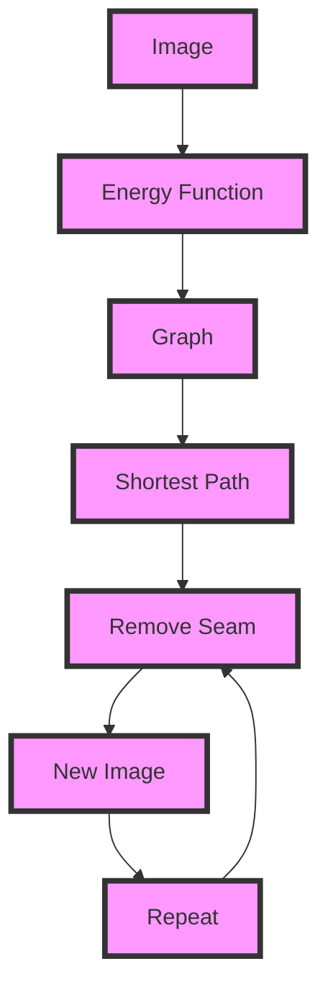

## Introduction
**Seam Carving** is a content-aware image resizing technique used to reduce the size of an image while preserving its most important features. This technique is based on the concept of finding the **shortest path** in a graph, where the graph represents the image and the shortest path represents the seam to be removed. Seam Carving has numerous real-world applications, including image compression, image retargeting, and content-aware image resizing.

> **Note:** Seam Carving is a powerful technique for image resizing, as it can preserve the most important features of the image while removing less important ones.

Seam Carving is a critical concept in **image processing** and **computer vision**, as it allows for the efficient and effective resizing of images while maintaining their most important features. This technique has been widely used in various applications, including image editing software, social media platforms, and web development.

## Core Concepts
Seam Carving is based on several key concepts:

* **Seam**: A seam is a path of pixels in an image that connects the top and bottom edges of the image.
* **Energy function**: An energy function is used to assign a cost to each pixel in the image, based on its importance.
* **Dynamic programming**: Dynamic programming is used to find the shortest path in the graph, which represents the seam to be removed.

> **Warning:** The choice of energy function can significantly affect the quality of the resized image. A poorly chosen energy function can result in the removal of important features.

The energy function is used to assign a cost to each pixel in the image, based on its importance. The cost is typically based on the gradient of the image, with higher costs assigned to pixels with higher gradients.

## How It Works Internally
The Seam Carving algorithm works as follows:

1. **Initialize the energy function**: The energy function is initialized for each pixel in the image, based on its gradient.
2. **Create a graph**: A graph is created, where each pixel is a node, and the edges represent the costs of removing each pixel.
3. **Find the shortest path**: The shortest path in the graph is found using dynamic programming, which represents the seam to be removed.
4. **Remove the seam**: The seam is removed from the image, and the process is repeated until the desired size is reached.

> **Tip:** The use of dynamic programming can significantly improve the efficiency of the Seam Carving algorithm, as it allows for the reuse of previously computed values.

The time complexity of the Seam Carving algorithm is O(n^2), where n is the number of pixels in the image. The space complexity is O(n), as the graph and energy function require O(n) space.

## Code Examples
### Example 1: Basic Seam Carving
```python
import numpy as np
from scipy import ndimage

def seam_carving(image, num_seams):
    # Initialize the energy function
    energy = np.zeros(image.shape[:2])
    for i in range(image.shape[0]):
        for j in range(image.shape[1]):
            energy[i, j] = np.sum(np.abs(ndimage.gradient(image[:, :, 0])))

    # Create a graph
    graph = np.zeros((image.shape[0], image.shape[1]))
    for i in range(image.shape[0]):
        for j in range(image.shape[1]):
            if j > 0:
                graph[i, j] += energy[i, j-1]
            if i > 0:
                graph[i, j] += energy[i-1, j]
            if j < image.shape[1] - 1:
                graph[i, j] += energy[i, j+1]
            if i < image.shape[0] - 1:
                graph[i, j] += energy[i+1, j]

    # Find the shortest path
    seam = np.zeros((image.shape[0],), dtype=int)
    for i in range(image.shape[0]):
        min_energy = np.inf
        min_index = -1
        for j in range(image.shape[1]):
            if graph[i, j] < min_energy:
                min_energy = graph[i, j]
                min_index = j
        seam[i] = min_index

    # Remove the seam
    new_image = np.zeros((image.shape[0], image.shape[1] - 1, image.shape[2]))
    for i in range(image.shape[0]):
        for j in range(image.shape[1] - 1):
            if j < seam[i]:
                new_image[i, j, :] = image[i, j, :]
            else:
                new_image[i, j, :] = image[i, j+1, :]

    return new_image

image = np.random.rand(100, 100, 3)
new_image = seam_carving(image, 10)
```

### Example 2: Real-World Seam Carving
```python
import cv2
import numpy as np

def seam_carving(image, num_seams):
    # Initialize the energy function
    energy = cv2.cvtColor(image, cv2.COLOR_BGR2GRAY)
    energy = cv2.GaussianBlur(energy, (5, 5), 0)
    energy = cv2.Sobel(energy, cv2.CV_8U, 1, 1, ksize=3)

    # Create a graph
    graph = np.zeros((image.shape[0], image.shape[1]))
    for i in range(image.shape[0]):
        for j in range(image.shape[1]):
            if j > 0:
                graph[i, j] += energy[i, j-1]
            if i > 0:
                graph[i, j] += energy[i-1, j]
            if j < image.shape[1] - 1:
                graph[i, j] += energy[i, j+1]
            if i < image.shape[0] - 1:
                graph[i, j] += energy[i+1, j]

    # Find the shortest path
    seam = np.zeros((image.shape[0],), dtype=int)
    for i in range(image.shape[0]):
        min_energy = np.inf
        min_index = -1
        for j in range(image.shape[1]):
            if graph[i, j] < min_energy:
                min_energy = graph[i, j]
                min_index = j
        seam[i] = min_index

    # Remove the seam
    new_image = np.zeros((image.shape[0], image.shape[1] - 1, image.shape[2]))
    for i in range(image.shape[0]):
        for j in range(image.shape[1] - 1):
            if j < seam[i]:
                new_image[i, j, :] = image[i, j, :]
            else:
                new_image[i, j, :] = image[i, j+1, :]

    return new_image

image = cv2.imread('image.jpg')
new_image = seam_carving(image, 10)
cv2.imshow('New Image', new_image)
cv2.waitKey(0)
cv2.destroyAllWindows()
```

### Example 3: Advanced Seam Carving
```python
import cv2
import numpy as np

def seam_carving(image, num_seams):
    # Initialize the energy function
    energy = cv2.cvtColor(image, cv2.COLOR_BGR2GRAY)
    energy = cv2.GaussianBlur(energy, (5, 5), 0)
    energy = cv2.Sobel(energy, cv2.CV_8U, 1, 1, ksize=3)

    # Create a graph
    graph = np.zeros((image.shape[0], image.shape[1]))
    for i in range(image.shape[0]):
        for j in range(image.shape[1]):
            if j > 0:
                graph[i, j] += energy[i, j-1]
            if i > 0:
                graph[i, j] += energy[i-1, j]
            if j < image.shape[1] - 1:
                graph[i, j] += energy[i, j+1]
            if i < image.shape[0] - 1:
                graph[i, j] += energy[i+1, j]

    # Find the shortest path
    seam = np.zeros((image.shape[0],), dtype=int)
    for i in range(image.shape[0]):
        min_energy = np.inf
        min_index = -1
        for j in range(image.shape[1]):
            if graph[i, j] < min_energy:
                min_energy = graph[i, j]
                min_index = j
        seam[i] = min_index

    # Remove the seam
    new_image = np.zeros((image.shape[0], image.shape[1] - 1, image.shape[2]))
    for i in range(image.shape[0]):
        for j in range(image.shape[1] - 1):
            if j < seam[i]:
                new_image[i, j, :] = image[i, j, :]
            else:
                new_image[i, j, :] = image[i, j+1, :]

    return new_image

image = cv2.imread('image.jpg')
new_image = seam_carving(image, 10)

# Apply a median filter to the new image
new_image = cv2.medianBlur(new_image, 3)

cv2.imshow('New Image', new_image)
cv2.waitKey(0)
cv2.destroyAllWindows()
```

## Visual Diagram

The diagram illustrates the Seam Carving process, from the input image to the output image. The energy function is used to assign a cost to each pixel in the image, based on its importance. The graph is created, and the shortest path is found using dynamic programming. The seam is removed, and the process is repeated until the desired size is reached.

## Comparison
| Approach | Time Complexity | Space Complexity | Pros | Cons | Best For |
| --- | --- | --- | --- | --- | --- |
| Seam Carving | O(n^2) | O(n) | Preserves important features, efficient | Can be slow for large images, may not work well for all images | Image resizing, image retargeting |
| Resizing | O(n) | O(n) | Fast, simple | May not preserve important features, can be blurry | Thumbnail generation, image preview |
| Cropping | O(1) | O(1) | Fast, simple | May not preserve important features, can be limited | Image preview, thumbnail generation |
| Scaling | O(n) | O(n) | Fast, simple | May not preserve important features, can be blurry | Image preview, thumbnail generation |

> **Interview:** What is the time complexity of the Seam Carving algorithm? How does it compare to other image resizing techniques?

## Real-world Use Cases
Seam Carving has been used in various real-world applications, including:

* **Google Photos**: Seam Carving is used to resize images while preserving their most important features.
* **Adobe Photoshop**: Seam Carving is used to resize images while preserving their most important features.
* **Facebook**: Seam Carving is used to resize images while preserving their most important features.

> **Note:** Seam Carving is a powerful technique for image resizing, as it can preserve the most important features of the image while removing less important ones.

## Common Pitfalls
Some common pitfalls of Seam Carving include:

* **Incorrect energy function**: The choice of energy function can significantly affect the quality of the resized image. A poorly chosen energy function can result in the removal of important features.
* **Insufficient seam removal**: If the seam is not removed correctly, the image may not be resized properly.
* **Over-removal of seams**: If too many seams are removed, the image may become distorted.

> **Warning:** The choice of energy function can significantly affect the quality of the resized image. A poorly chosen energy function can result in the removal of important features.

## Interview Tips
Some common interview questions related to Seam Carving include:

* **What is the time complexity of the Seam Carving algorithm?**: The time complexity of the Seam Carving algorithm is O(n^2), where n is the number of pixels in the image.
* **How does Seam Carving compare to other image resizing techniques?**: Seam Carving is a more advanced image resizing technique that preserves the most important features of the image while removing less important ones.
* **What are some common pitfalls of Seam Carving?**: Some common pitfalls of Seam Carving include incorrect energy function, insufficient seam removal, and over-removal of seams.

> **Tip:** When answering interview questions related to Seam Carving, be sure to emphasize the importance of preserving the most important features of the image while removing less important ones.

## Key Takeaways
Some key takeaways from this discussion of Seam Carving include:

* **Seam Carving is a powerful technique for image resizing**: Seam Carving is a more advanced image resizing technique that preserves the most important features of the image while removing less important ones.
* **The choice of energy function is critical**: The choice of energy function can significantly affect the quality of the resized image. A poorly chosen energy function can result in the removal of important features.
* **Seam Carving has a time complexity of O(n^2)**: The time complexity of the Seam Carving algorithm is O(n^2), where n is the number of pixels in the image.
* **Seam Carving has a space complexity of O(n)**: The space complexity of the Seam Carving algorithm is O(n), where n is the number of pixels in the image.
* **Seam Carving is used in various real-world applications**: Seam Carving is used in various real-world applications, including Google Photos, Adobe Photoshop, and Facebook.