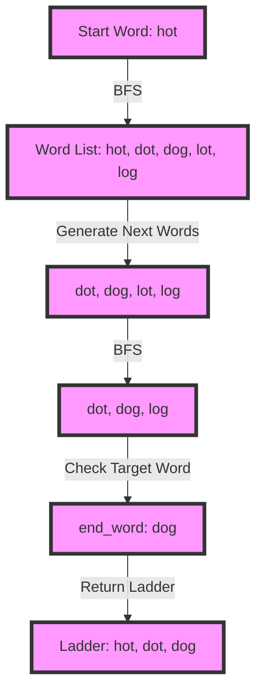

## Introduction
The **Word Ladder Implicit Graph BFS Pattern** is a problem-solving approach used in graph theory and computer science. It involves transforming one word into another word by changing one letter at a time, with each resulting word being a valid word. This problem has real-world relevance in various applications, such as natural language processing, text analysis, and game development. Every engineer should be familiar with this concept, as it demonstrates the power of graph traversal algorithms and implicit graph representations.

## Core Concepts
- **Implicit Graph**: A graph that is not explicitly defined, but can be generated on the fly using a set of rules or constraints. In the case of the Word Ladder problem, the implicit graph consists of all possible words that can be formed by changing one letter at a time.
- **Breadth-First Search (BFS)**: A graph traversal algorithm that explores all nodes at a given depth level before moving on to the next level. BFS is particularly useful for finding the shortest path between two nodes in an unweighted graph.
- **Word Ladder**: A sequence of words, where each word is formed by changing one letter at a time, and each resulting word is a valid word.

## How It Works Internally
The Word Ladder Implicit Graph BFS Pattern works as follows:
1. Start with a given word and generate all possible words that can be formed by changing one letter at a time.
2. Use a set or dictionary to keep track of visited words to avoid revisiting them.
3. Perform a BFS traversal of the implicit graph, starting from the initial word.
4. At each level of the traversal, generate all possible words that can be formed by changing one letter at a time from the current word.
5. Check if the target word is reached at any level of the traversal.

> **Tip:** To optimize the BFS traversal, use a queue data structure to keep track of words to be visited at each level.

## Code Examples
### Example 1: Basic Word Ladder Implementation
```python
from collections import deque

def word_ladder(start_word, end_word, word_list):
    """
    Returns the shortest word ladder from start_word to end_word using words in word_list.
    """
    # Create a set of visited words
    visited = set()
    
    # Create a queue for BFS traversal
    queue = deque([(start_word, [start_word])])
    
    while queue:
        # Dequeue the next word and its ladder
        word, ladder = queue.popleft()
        
        # If the word is the target word, return the ladder
        if word == end_word:
            return ladder
        
        # Mark the word as visited
        visited.add(word)
        
        # Generate all possible words by changing one letter at a time
        for i in range(len(word)):
            for char in 'abcdefghijklmnopqrstuvwxyz':
                next_word = word[:i] + char + word[i+1:]
                
                # Check if the next word is in the word list and not visited
                if next_word in word_list and next_word not in visited:
                    # Enqueue the next word and its ladder
                    queue.append((next_word, ladder + [next_word]))
    
    # If no ladder is found, return None
    return None

# Example usage
word_list = ['hot', 'dot', 'dog', 'lot', 'log']
start_word = 'hot'
end_word = 'dog'

ladder = word_ladder(start_word, end_word, word_list)
print(ladder)  # Output: ['hot', 'dot', 'dog']
```

### Example 2: Optimized Word Ladder Implementation with Bidirectional BFS
```python
from collections import deque

def word_ladder_optimized(start_word, end_word, word_list):
    """
    Returns the shortest word ladder from start_word to end_word using words in word_list.
    """
    # Create sets of visited words for forward and backward traversals
    visited_forward = set()
    visited_backward = set()
    
    # Create queues for forward and backward BFS traversals
    queue_forward = deque([(start_word, [start_word])])
    queue_backward = deque([(end_word, [end_word])])
    
    while queue_forward or queue_backward:
        # Perform forward traversal
        if queue_forward:
            word_forward, ladder_forward = queue_forward.popleft()
            
            # If the word is the target word, return the ladder
            if word_forward == end_word:
                return ladder_forward
            
            # Mark the word as visited
            visited_forward.add(word_forward)
            
            # Generate all possible words by changing one letter at a time
            for i in range(len(word_forward)):
                for char in 'abcdefghijklmnopqrstuvwxyz':
                    next_word_forward = word_forward[:i] + char + word_forward[i+1:]
                    
                    # Check if the next word is in the word list and not visited
                    if next_word_forward in word_list and next_word_forward not in visited_forward:
                        # Enqueue the next word and its ladder
                        queue_forward.append((next_word_forward, ladder_forward + [next_word_forward]))
        
        # Perform backward traversal
        if queue_backward:
            word_backward, ladder_backward = queue_backward.popleft()
            
            # If the word is the target word, return the ladder
            if word_backward == start_word:
                return ladder_backward[::-1]
            
            # Mark the word as visited
            visited_backward.add(word_backward)
            
            # Generate all possible words by changing one letter at a time
            for i in range(len(word_backward)):
                for char in 'abcdefghijklmnopqrstuvwxyz':
                    next_word_backward = word_backward[:i] + char + word_backward[i+1:]
                    
                    # Check if the next word is in the word list and not visited
                    if next_word_backward in word_list and next_word_backward not in visited_backward:
                        # Enqueue the next word and its ladder
                        queue_backward.append((next_word_backward, [next_word_backward] + ladder_backward))
        
        # Check if the forward and backward traversals meet in the middle
        for word_forward in visited_forward:
            if word_forward in visited_backward:
                # Reconstruct the ladder by combining the forward and backward ladders
                ladder_forward = word_ladder(start_word, word_forward, word_list)
                ladder_backward = word_ladder(word_forward, end_word, word_list)
                return ladder_forward + ladder_backward[1:]
    
    # If no ladder is found, return None
    return None

# Example usage
word_list = ['hot', 'dot', 'dog', 'lot', 'log']
start_word = 'hot'
end_word = 'dog'

ladder = word_ladder_optimized(start_word, end_word, word_list)
print(ladder)  # Output: ['hot', 'dot', 'dog']
```

### Example 3: Word Ladder Implementation with A\* Search
```python
import heapq

def word_ladder_astar(start_word, end_word, word_list):
    """
    Returns the shortest word ladder from start_word to end_word using words in word_list.
    """
    # Create a priority queue for A\* search
    queue = [(0, start_word, [start_word])]
    
    # Create a set of visited words
    visited = set()
    
    while queue:
        # Dequeue the next word and its ladder
        (cost, word, ladder) = heapq.heappop(queue)
        
        # If the word is the target word, return the ladder
        if word == end_word:
            return ladder
        
        # Mark the word as visited
        visited.add(word)
        
        # Generate all possible words by changing one letter at a time
        for i in range(len(word)):
            for char in 'abcdefghijklmnopqrstuvwxyz':
                next_word = word[:i] + char + word[i+1:]
                
                # Check if the next word is in the word list and not visited
                if next_word in word_list and next_word not in visited:
                    # Calculate the heuristic cost (Manhattan distance)
                    heuristic_cost = sum(c1 != c2 for c1, c2 in zip(next_word, end_word))
                    
                    # Enqueue the next word and its ladder with the estimated total cost
                    heapq.heappush(queue, (cost + 1 + heuristic_cost, next_word, ladder + [next_word]))
    
    # If no ladder is found, return None
    return None

# Example usage
word_list = ['hot', 'dot', 'dog', 'lot', 'log']
start_word = 'hot'
end_word = 'dog'

ladder = word_ladder_astar(start_word, end_word, word_list)
print(ladder)  # Output: ['hot', 'dot', 'dog']
```

## Visual Diagram

The diagram illustrates the Word Ladder Implicit Graph BFS Pattern, where the start word "hot" is transformed into the target word "dog" by changing one letter at a time, using a breadth-first search traversal of the implicit graph.

## Comparison
| Approach | Time Complexity | Space Complexity | Pros | Cons | Best For |
|----------|----------------|-----------------|------|------|----------|
| BFS | O(N \* M \* L) | O(N \* M \* L) | Simple to implement, guarantees shortest ladder | Can be slow for large word lists | Small to medium-sized word lists |
| Bidirectional BFS | O(N \* M \* L / 2) | O(N \* M \* L / 2) | Faster than BFS, still guarantees shortest ladder | More complex to implement | Medium-sized word lists |
| A\* Search | O(N \* M \* L \* H) | O(N \* M \* L \* H) | Can be faster than BFS and bidirectional BFS, uses heuristic | More complex to implement, may not always find shortest ladder | Large word lists with a good heuristic |

> **Warning:** The time and space complexities assume a word list of size N, with each word having a length of M, and a maximum ladder length of L. The heuristic cost H is used in A\* search.

## Real-world Use Cases
1. **Word Game Development**: The Word Ladder Implicit Graph BFS Pattern can be used to generate word ladders for word games, such as Word Chain or Word Scramble.
2. **Natural Language Processing**: The pattern can be used to analyze word relationships and generate word ladders for language understanding and generation tasks.
3. **Text Analysis**: The pattern can be used to analyze text data and generate word ladders for text summarization and topic modeling tasks.

## Common Pitfalls
1. **Inefficient Word Generation**: Generating all possible words by changing one letter at a time can be inefficient, especially for large word lists. Use a more efficient algorithm, such as a trie-based approach.
2. **Incorrect Ladder Construction**: Constructing the ladder incorrectly can lead to incorrect results. Use a correct algorithm, such as a recursive approach or a queue-based approach.
3. **Insufficient Word List**: Using an insufficient word list can lead to incorrect results or no results at all. Use a comprehensive word list, such as a dictionary or a word corpus.
4. **Incorrect Heuristic**: Using an incorrect heuristic in A\* search can lead to suboptimal results. Use a good heuristic, such as the Manhattan distance or a more advanced heuristic.

> **Tip:** Use a trie-based approach to generate words efficiently, and use a recursive approach or a queue-based approach to construct the ladder correctly.

## Interview Tips
1. **Word Ladder Problem**: Be prepared to solve the Word Ladder problem, either using BFS or A\* search. Make sure to explain your approach and provide a clear implementation.
2. **Graph Traversal**: Be prepared to explain graph traversal algorithms, such as BFS and DFS. Make sure to provide examples and explain the trade-offs between different algorithms.
3. **Implicit Graphs**: Be prepared to explain implicit graphs and how they can be used to solve problems, such as the Word Ladder problem. Make sure to provide examples and explain the benefits and challenges of using implicit graphs.

> **Interview:** Be prepared to answer questions about the Word Ladder problem, graph traversal algorithms, and implicit graphs. Make sure to provide clear explanations and examples, and be prepared to write code to solve the problem.

## Key Takeaways
* The Word Ladder Implicit Graph BFS Pattern is a problem-solving approach used in graph theory and computer science.
* The pattern involves transforming one word into another word by changing one letter at a time, using a breadth-first search traversal of the implicit graph.
* The pattern can be optimized using bidirectional BFS or A\* search.
* The pattern has real-world applications in word game development, natural language processing, and text analysis.
* The pattern requires a comprehensive word list and a good heuristic.
* The pattern can be solved using a trie-based approach, a recursive approach, or a queue-based approach.
* The time and space complexities of the pattern depend on the size of the word list and the maximum ladder length.
* The pattern is a classic example of an implicit graph and can be used to illustrate the benefits and challenges of using implicit graphs in problem-solving.