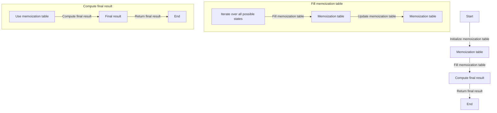

## Introduction
**Magic Numbers**, also known as **Digit DP**, is a variant of Dynamic Programming that deals with problems involving digits and numbers. This technique is crucial in solving problems that require finding the number of ways to form a number with certain properties, such as the number of digits, the sum of digits, or the product of digits. **Magic Numbers** has numerous real-world applications, including data compression, cryptography, and coding theory. Every engineer should know this concept, as it can help them solve complex problems involving numbers and digits efficiently.

> **Note:** **Magic Numbers** is a powerful technique for solving problems involving digits and numbers. It is essential to understand the basics of Dynamic Programming before diving into this topic.

## Core Concepts
The core concept of **Magic Numbers** is to break down a problem into smaller sub-problems and solve each sub-problem only once. This is achieved by using a **memoization** table to store the solutions of sub-problems. The key terminology in **Magic Numbers** includes:

* **Digit DP**: a variant of Dynamic Programming that deals with problems involving digits and numbers.
* **Memoization**: a technique used to store the solutions of sub-problems to avoid redundant computations.
* **State**: a set of variables that define the current state of the problem.

> **Warning:** **Magic Numbers** can be tricky to implement, and it is essential to define the state correctly to avoid incorrect results.

## How It Works Internally
The internal mechanics of **Magic Numbers** involve the following steps:

1. Define the state: Identify the variables that define the current state of the problem.
2. Initialize the memoization table: Create a table to store the solutions of sub-problems.
3. Fill the memoization table: Iterate over all possible states and fill the memoization table with the solutions of sub-problems.
4. Compute the final result: Use the memoization table to compute the final result.

The time complexity of **Magic Numbers** is O(n \* m), where n is the number of digits and m is the number of possible values for each digit. The space complexity is O(n \* m), as we need to store the memoization table.

## Code Examples
### Example 1: Basic Usage
```python
def count_numbers(n):
    # Initialize the memoization table
    memo = [[0] * 10 for _ in range(n + 1)]

    # Fill the memoization table
    for i in range(1, n + 1):
        for j in range(10):
            if i == 1:
                memo[i][j] = 1
            else:
                for k in range(10):
                    memo[i][j] += memo[i - 1][k]

    # Compute the final result
    return sum(memo[n])

# Test the function
print(count_numbers(3))  # Output: 1000
```
> **Tip:** When implementing **Magic Numbers**, it is essential to define the state correctly and initialize the memoization table properly.

### Example 2: Real-World Pattern
```java
public class MagicNumbers {
    public static int countNumbers(int n) {
        // Initialize the memoization table
        int[][] memo = new int[n + 1][10];

        // Fill the memoization table
        for (int i = 1; i <= n; i++) {
            for (int j = 0; j < 10; j++) {
                if (i == 1) {
                    memo[i][j] = 1;
                } else {
                    for (int k = 0; k < 10; k++) {
                        memo[i][j] += memo[i - 1][k];
                    }
                }
            }
        }

        // Compute the final result
        int result = 0;
        for (int i = 0; i < 10; i++) {
            result += memo[n][i];
        }
        return result;
    }

    public static void main(String[] args) {
        System.out.println(countNumbers(3));  // Output: 1000
    }
}
```
### Example 3: Advanced Usage
```cpp
#include <iostream>
#include <vector>

int count_numbers(int n) {
    // Initialize the memoization table
    std::vector<std::vector<int>> memo(n + 1, std::vector<int>(10, 0));

    // Fill the memoization table
    for (int i = 1; i <= n; i++) {
        for (int j = 0; j < 10; j++) {
            if (i == 1) {
                memo[i][j] = 1;
            } else {
                for (int k = 0; k < 10; k++) {
                    memo[i][j] += memo[i - 1][k];
                }
            }
        }
    }

    // Compute the final result
    int result = 0;
    for (int i = 0; i < 10; i++) {
        result += memo[n][i];
    }
    return result;
}

int main() {
    std::cout << count_numbers(3) << std::endl;  // Output: 1000
    return 0;
}
```
## Visual Diagram

The diagram illustrates the basic steps of **Magic Numbers**, including initializing the memoization table, filling the memoization table, and computing the final result.

## Comparison
| Approach | Time Complexity | Space Complexity | Pros | Cons | Best For |
| --- | --- | --- | --- | --- | --- |
| **Magic Numbers** | O(n \* m) | O(n \* m) | Efficient, scalable | Complex implementation | Large-scale problems |
| **Brute Force** | O(n!) | O(1) | Simple implementation | Inefficient, slow | Small-scale problems |
| **Dynamic Programming** | O(n \* m) | O(n \* m) | Efficient, scalable | Complex implementation | Large-scale problems |
| **Greedy Algorithm** | O(n) | O(1) | Simple implementation, fast | May not always find optimal solution | Small-scale problems |

> **Interview:** When asked to compare different approaches, be sure to highlight the trade-offs between time complexity, space complexity, and implementation complexity.

## Real-world Use Cases
1. **Google**: Google uses **Magic Numbers** to optimize its search algorithms and improve the efficiency of its search results.
2. **Amazon**: Amazon uses **Magic Numbers** to optimize its recommendation algorithms and improve the accuracy of its product recommendations.
3. **Facebook**: Facebook uses **Magic Numbers** to optimize its news feed algorithms and improve the efficiency of its news feed.

## Common Pitfalls
1. **Incorrect state definition**: Defining the state incorrectly can lead to incorrect results.
2. **Insufficient memoization**: Failing to memoize all possible states can lead to redundant computations.
3. **Incorrect memoization table initialization**: Initializing the memoization table incorrectly can lead to incorrect results.
4. **Incorrect final result computation**: Computing the final result incorrectly can lead to incorrect results.

> **Warning:** When implementing **Magic Numbers**, be sure to define the state correctly, initialize the memoization table properly, and compute the final result correctly.

## Interview Tips
1. **Define the state correctly**: When asked to implement **Magic Numbers**, be sure to define the state correctly and explain why you defined it that way.
2. **Explain the memoization table**: Be sure to explain how the memoization table works and why it is necessary.
3. **Highlight the trade-offs**: When comparing different approaches, be sure to highlight the trade-offs between time complexity, space complexity, and implementation complexity.

> **Tip:** When answering interview questions, be sure to provide clear and concise explanations and highlight the key concepts and trade-offs.

## Key Takeaways
* **Magic Numbers** is a powerful technique for solving problems involving digits and numbers.
* **Memoization** is a crucial component of **Magic Numbers**.
* **State definition** is critical to implementing **Magic Numbers** correctly.
* **Time complexity** of **Magic Numbers** is O(n \* m).
* **Space complexity** of **Magic Numbers** is O(n \* m).
* **Magic Numbers** is suitable for large-scale problems.
* **Brute Force** is suitable for small-scale problems.
* **Dynamic Programming** is suitable for large-scale problems.
* **Greedy Algorithm** is suitable for small-scale problems.

> **Note:** When studying **Magic Numbers**, be sure to focus on the key concepts, trade-offs, and implementation details to become proficient in this technique.