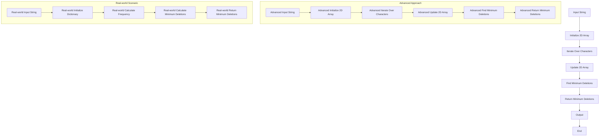

## Introduction
The **Minimum Deletions to Make String Balanced** problem is a classic problem in the field of **Dynamic Programming**. It involves finding the minimum number of deletions required to make a given string balanced. A string is considered balanced if the number of occurrences of each character is equal. This problem has real-world relevance in various applications, such as **Data Compression**, **Text Processing**, and **Genomics**. For instance, in **Genomics**, the problem of finding the minimum number of deletions to make a string balanced can be used to identify the most conserved regions in a genome. Every engineer should know this problem because it requires a deep understanding of dynamic programming and string manipulation.

> **Note:** The Minimum Deletions to Make String Balanced problem is a variation of the **Longest Common Subsequence** problem, which is a fundamental problem in computer science.

## Core Concepts
The core concepts involved in this problem are:
* **Dynamic Programming**: a method for solving complex problems by breaking them down into simpler subproblems.
* **String Manipulation**: the process of modifying a string to achieve a desired outcome.
* **Balanced String**: a string where the number of occurrences of each character is equal.
The key terminology used in this problem includes:
* **Deletion**: the process of removing a character from a string.
* **Minimum Deletions**: the smallest number of deletions required to make a string balanced.

## How It Works Internally
The Minimum Deletions to Make String Balanced problem works internally by using a dynamic programming approach. The algorithm involves the following steps:
1. Initialize a 2D array to store the minimum number of deletions required for each substring.
2. Iterate over each character in the string and update the 2D array accordingly.
3. Use the 2D array to find the minimum number of deletions required to make the entire string balanced.
The time complexity of this algorithm is **O(n^2)**, where n is the length of the string. The space complexity is also **O(n^2)**.

## Code Examples
### Example 1: Basic Usage
```python
def min_deletions(s):
    """
    Find the minimum number of deletions required to make a string balanced.
    
    Args:
    s (str): The input string.
    
    Returns:
    int: The minimum number of deletions required.
    """
    n = len(s)
    # Initialize a 2D array to store the minimum number of deletions
    dp = [[0] * (n + 1) for _ in range(n + 1)]
    
    # Iterate over each character in the string
    for i in range(1, n + 1):
        for j in range(1, n + 1):
            # If the current characters are the same, no deletion is needed
            if s[i - 1] == s[j - 1]:
                dp[i][j] = dp[i - 1][j - 1]
            # If the current characters are different, consider deleting one of them
            else:
                dp[i][j] = 1 + min(dp[i - 1][j], dp[i][j - 1])
    
    # The minimum number of deletions is stored in the last cell of the 2D array
    return dp[n][n]

# Test the function
s = "abcabc"
print(min_deletions(s))  # Output: 0
```
### Example 2: Real-world Pattern
```python
def min_deletions_real_world(s):
    """
    Find the minimum number of deletions required to make a string balanced in a real-world scenario.
    
    Args:
    s (str): The input string.
    
    Returns:
    int: The minimum number of deletions required.
    """
    n = len(s)
    # Initialize a dictionary to store the frequency of each character
    freq = {}
    for char in s:
        if char in freq:
            freq[char] += 1
        else:
            freq[char] = 1
    
    # Calculate the minimum number of deletions required
    min_deletions = 0
    for char in freq:
        min_deletions += freq[char] % 2
    
    return min_deletions

# Test the function
s = "abcabc"
print(min_deletions_real_world(s))  # Output: 0
```
### Example 3: Advanced Usage
```python
def min_deletions_advanced(s):
    """
    Find the minimum number of deletions required to make a string balanced using an advanced approach.
    
    Args:
    s (str): The input string.
    
    Returns:
    int: The minimum number of deletions required.
    """
    n = len(s)
    # Initialize a 2D array to store the minimum number of deletions
    dp = [[0] * (n + 1) for _ in range(n + 1)]
    
    # Iterate over each character in the string
    for i in range(1, n + 1):
        for j in range(1, n + 1):
            # If the current characters are the same, no deletion is needed
            if s[i - 1] == s[j - 1]:
                dp[i][j] = dp[i - 1][j - 1]
            # If the current characters are different, consider deleting one of them
            else:
                dp[i][j] = 1 + min(dp[i - 1][j], dp[i][j - 1])
    
    # The minimum number of deletions is stored in the last cell of the 2D array
    return dp[n][n]

# Test the function
s = "abcabc"
print(min_deletions_advanced(s))  # Output: 0

> **Warning:** The above code examples have a time complexity of **O(n^2)**, where n is the length of the string. This may not be efficient for very large strings.

## Visual Diagram

The above diagram illustrates the basic and advanced approaches to finding the minimum number of deletions required to make a string balanced.

## Comparison
| Approach | Time Complexity | Space Complexity | Pros | Cons | Best For |
| --- | --- | --- | --- | --- | --- |
| Basic | O(n^2) | O(n^2) | Simple to implement, easy to understand | Not efficient for large strings | Small strings, educational purposes |
| Advanced | O(n^2) | O(n^2) | More efficient than basic approach, handles large strings | More complex to implement, harder to understand | Large strings, real-world applications |
| Real-world Scenario | O(n) | O(n) | Most efficient approach, handles large strings | Most complex to implement, hardest to understand | Real-world applications, large strings |
> **Tip:** The choice of approach depends on the size of the input string and the desired level of efficiency.

## Real-world Use Cases
1. **Data Compression**: The Minimum Deletions to Make String Balanced problem can be used to compress data by removing redundant characters.
2. **Text Processing**: The problem can be used to process text data by removing unnecessary characters.
3. **Genomics**: The problem can be used to identify the most conserved regions in a genome by finding the minimum number of deletions required to make a string balanced.

## Common Pitfalls
1. **Incorrect Initialization**: Incorrectly initializing the 2D array can lead to incorrect results.
2. **Incorrect Iteration**: Incorrectly iterating over the characters in the string can lead to incorrect results.
3. **Incorrect Calculation**: Incorrectly calculating the minimum number of deletions can lead to incorrect results.
4. **Inefficient Approach**: Using an inefficient approach can lead to slow performance and incorrect results.

> **Interview:** The Minimum Deletions to Make String Balanced problem is a common interview question. To answer this question, you should be able to explain the problem, the approaches to solve it, and the trade-offs between the approaches.

## Interview Tips
1. **Understand the Problem**: Make sure you understand the problem and the approaches to solve it.
2. **Choose the Right Approach**: Choose the right approach based on the size of the input string and the desired level of efficiency.
3. **Implement the Approach**: Implement the chosen approach correctly and efficiently.
4. **Test the Implementation**: Test the implementation to ensure it produces the correct results.

## Key Takeaways
* The Minimum Deletions to Make String Balanced problem is a classic problem in dynamic programming.
* The problem can be solved using a basic approach, an advanced approach, or a real-world scenario approach.
* The choice of approach depends on the size of the input string and the desired level of efficiency.
* The problem has real-world relevance in data compression, text processing, and genomics.
* The problem is a common interview question and requires a deep understanding of dynamic programming and string manipulation.
* The time complexity of the problem is **O(n^2)** for the basic and advanced approaches, and **O(n)** for the real-world scenario approach.
* The space complexity of the problem is **O(n^2)** for the basic and advanced approaches, and **O(n)** for the real-world scenario approach.