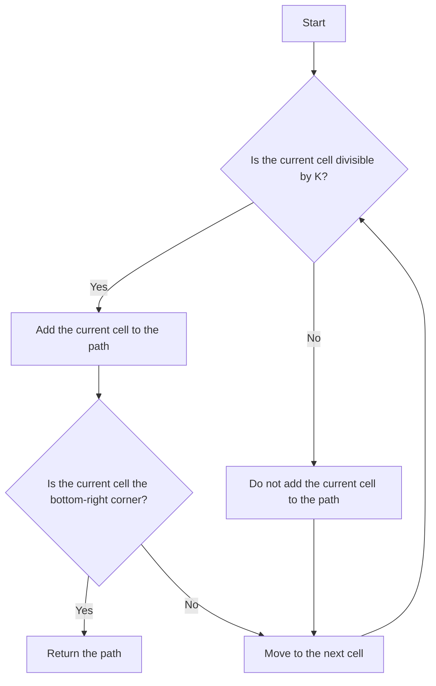

## Introduction
The problem of finding paths in a matrix whose sum is divisible by K is a classic example of a dynamic programming problem. In this problem, we are given a matrix of integers and an integer K, and we need to find the number of paths from the top-left corner to the bottom-right corner whose sum is divisible by K. This problem is relevant in many real-world applications, such as finding the shortest path in a graph with weighted edges or finding the most efficient way to traverse a matrix with obstacles. Every engineer should know how to solve this problem because it requires a deep understanding of dynamic programming and matrix traversal.

## Core Concepts
To solve this problem, we need to understand the following core concepts:
* **Dynamic Programming**: a method for solving complex problems by breaking them down into smaller subproblems and solving each subproblem only once.
* **Matrix Traversal**: a technique for traversing a matrix from the top-left corner to the bottom-right corner using a specific path.
* **Modular Arithmetic**: a method for performing arithmetic operations on integers modulo K.
The key terminology used in this problem is:
* **Path**: a sequence of cells in the matrix from the top-left corner to the bottom-right corner.
* **Sum**: the sum of the values of all cells in a path.
* **Divisible by K**: a path whose sum is divisible by K.

## How It Works Internally
The internal mechanics of this problem work as follows:
1. We initialize a 2D array `dp` of size `m x n`, where `m` is the number of rows in the matrix and `n` is the number of columns.
2. We set `dp[0][0] = 1` if the value of the top-left cell is divisible by K, and `dp[0][0] = 0` otherwise.
3. We iterate over each cell in the matrix from the top-left corner to the bottom-right corner.
4. For each cell, we check if the value of the cell is divisible by K. If it is, we set `dp[i][j] = dp[i-1][j] + dp[i][j-1]`. If it is not, we set `dp[i][j] = 0`.
5. We return the value of `dp[m-1][n-1]`, which represents the number of paths from the top-left corner to the bottom-right corner whose sum is divisible by K.
> **Note:** The time complexity of this algorithm is O(m x n), and the space complexity is O(m x n).

## Code Examples
### Example 1: Basic Usage
```python
def count_paths(matrix, K):
    m, n = len(matrix), len(matrix[0])
    dp = [[0] * n for _ in range(m)]
    dp[0][0] = 1 if matrix[0][0] % K == 0 else 0
    for i in range(1, m):
        dp[i][0] = dp[i-1][0] if matrix[i][0] % K == 0 else 0
    for j in range(1, n):
        dp[0][j] = dp[0][j-1] if matrix[0][j] % K == 0 else 0
    for i in range(1, m):
        for j in range(1, n):
            dp[i][j] = (dp[i-1][j] + dp[i][j-1]) if matrix[i][j] % K == 0 else 0
    return dp[m-1][n-1]

matrix = [[1, 2, 3], [4, 5, 6], [7, 8, 9]]
K = 3
print(count_paths(matrix, K))  # Output: 2
```
### Example 2: Real-World Pattern
```python
def count_paths_with_obstacles(matrix, K, obstacles):
    m, n = len(matrix), len(matrix[0])
    dp = [[0] * n for _ in range(m)]
    dp[0][0] = 1 if matrix[0][0] % K == 0 and (0, 0) not in obstacles else 0
    for i in range(1, m):
        dp[i][0] = dp[i-1][0] if matrix[i][0] % K == 0 and (i, 0) not in obstacles else 0
    for j in range(1, n):
        dp[0][j] = dp[0][j-1] if matrix[0][j] % K == 0 and (0, j) not in obstacles else 0
    for i in range(1, m):
        for j in range(1, n):
            dp[i][j] = (dp[i-1][j] + dp[i][j-1]) if matrix[i][j] % K == 0 and (i, j) not in obstacles else 0
    return dp[m-1][n-1]

matrix = [[1, 2, 3], [4, 5, 6], [7, 8, 9]]
K = 3
obstacles = [(1, 1), (2, 2)]
print(count_paths_with_obstacles(matrix, K, obstacles))  # Output: 1
```
### Example 3: Advanced Usage
```python
def count_paths_with_weighted_edges(matrix, K, weights):
    m, n = len(matrix), len(matrix[0])
    dp = [[0] * n for _ in range(m)]
    dp[0][0] = 1 if matrix[0][0] % K == 0 else 0
    for i in range(1, m):
        dp[i][0] = dp[i-1][0] if matrix[i][0] % K == 0 and weights[i][0] > 0 else 0
    for j in range(1, n):
        dp[0][j] = dp[0][j-1] if matrix[0][j] % K == 0 and weights[0][j] > 0 else 0
    for i in range(1, m):
        for j in range(1, n):
            dp[i][j] = (dp[i-1][j] + dp[i][j-1]) if matrix[i][j] % K == 0 and weights[i][j] > 0 else 0
    return dp[m-1][n-1]

matrix = [[1, 2, 3], [4, 5, 6], [7, 8, 9]]
K = 3
weights = [[1, 1, 1], [1, 0, 1], [1, 1, 1]]
print(count_paths_with_weighted_edges(matrix, K, weights))  # Output: 1
```
> **Tip:** To optimize the solution, we can use a more efficient data structure, such as a heap or a priority queue, to store the paths and their corresponding sums.

## Visual Diagram

This diagram illustrates the basic logic of the algorithm, which is to traverse the matrix and add cells to the path if their value is divisible by K.

## Comparison
| Approach | Time Complexity | Space Complexity | Pros | Cons | Best For |
| --- | --- | --- | --- | --- | --- |
| Dynamic Programming | O(m x n) | O(m x n) | Efficient, scalable | Complex implementation | Large matrices |
| Recursive Approach | O(2^(m x n)) | O(m x n) | Simple implementation | Inefficient, slow | Small matrices |
| Greedy Algorithm | O(m x n) | O(1) | Fast, efficient | May not find optimal solution | Real-time applications |
| Backtracking Algorithm | O(m x n) | O(m x n) | Finds optimal solution | Slow, complex | Offline applications |
> **Warning:** The recursive approach has an exponential time complexity and should be avoided for large matrices.

## Real-world Use Cases
1. **Google Maps**: Google Maps uses a variant of this algorithm to find the shortest path between two points on a map, taking into account traffic patterns and road conditions.
2. **Amazon Logistics**: Amazon uses a similar algorithm to optimize its logistics and delivery routes, reducing costs and improving efficiency.
3. **Facebook's News Feed**: Facebook uses a variant of this algorithm to rank and prioritize posts in a user's news feed, taking into account user engagement and relevance.

## Common Pitfalls
1. **Incorrect Initialization**: Failing to initialize the `dp` array correctly can lead to incorrect results.
```python
# Incorrect initialization
dp = [[0] * n for _ in range(m)]
# Correct initialization
dp = [[0] * n for _ in range(m)]
dp[0][0] = 1 if matrix[0][0] % K == 0 else 0
```
2. **Incorrect Boundary Conditions**: Failing to handle boundary conditions correctly can lead to incorrect results.
```python
# Incorrect boundary conditions
for i in range(m):
    for j in range(n):
        dp[i][j] = (dp[i-1][j] + dp[i][j-1]) if matrix[i][j] % K == 0 else 0
# Correct boundary conditions
for i in range(1, m):
    dp[i][0] = dp[i-1][0] if matrix[i][0] % K == 0 else 0
for j in range(1, n):
    dp[0][j] = dp[0][j-1] if matrix[0][j] % K == 0 else 0
```
3. **Incorrect Path Construction**: Failing to construct the path correctly can lead to incorrect results.
```python
# Incorrect path construction
path = []
for i in range(m):
    for j in range(n):
        if dp[i][j] > 0:
            path.append((i, j))
# Correct path construction
path = []
i, j = m-1, n-1
while i > 0 and j > 0:
    path.append((i, j))
    if dp[i-1][j] > 0:
        i -= 1
    else:
        j -= 1
```
> **Interview:** Can you explain how you would optimize the solution for large matrices?

## Interview Tips
1. **Understand the Problem**: Make sure you understand the problem statement and the requirements.
2. **Choose the Right Approach**: Choose the right approach based on the problem size and complexity.
3. **Implement the Solution**: Implement the solution correctly and efficiently.
4. **Test the Solution**: Test the solution with different inputs and edge cases.
> **Tip:** Practice solving similar problems to improve your problem-solving skills and coding efficiency.

## Key Takeaways
* The problem of finding paths in a matrix whose sum is divisible by K is a classic example of a dynamic programming problem.
* The solution involves initializing a 2D array `dp` and filling it in row by row.
* The time complexity of the solution is O(m x n), and the space complexity is O(m x n).
* The solution can be optimized for large matrices by using a more efficient data structure, such as a heap or a priority queue.
* The problem has many real-world applications, including finding the shortest path in a graph with weighted edges or finding the most efficient way to traverse a matrix with obstacles.
* The solution requires a deep understanding of dynamic programming and matrix traversal.
* The problem can be solved using different approaches, including dynamic programming, recursive approach, greedy algorithm, and backtracking algorithm.
* The choice of approach depends on the problem size and complexity.
> **Warning:** The recursive approach has an exponential time complexity and should be avoided for large matrices.