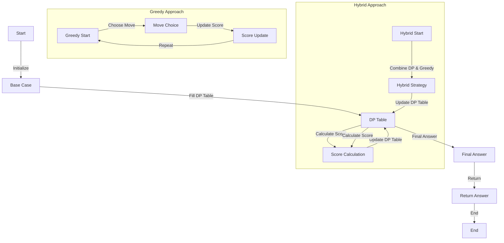

## Introduction
The Stone Game series, including Stone Game VI, VII, and VIII, are classic problems in the realm of Dynamic Programming (DP) and Greedy Mechanics. These problems involve two players taking turns removing stones from a pile, with the goal of maximizing their score. The Stone Game series is significant because it demonstrates the trade-offs between DP and Greedy approaches, showcasing when each is applicable and why. In real-world scenarios, these problems can be applied to game development, resource allocation, and decision-making under uncertainty.

> **Note:** The Stone Game series is often used as a teaching tool to illustrate the differences between DP and Greedy algorithms, highlighting the importance of understanding the problem's structure before choosing an approach.

## Core Concepts
To tackle the Stone Game series, it's essential to grasp the following core concepts:
- **Dynamic Programming (DP):** An algorithmic paradigm that solves complex problems by breaking them down into smaller sub-problems, solving each only once, and storing the solutions to sub-problems to avoid redundant computation.
- **Greedy Mechanics:** An algorithmic strategy that makes the locally optimal choice at each stage with the hope of finding a global optimum solution. In the context of the Stone Game, this often involves choosing the move that maximizes the immediate gain.
- **Game Theory:** The study of strategic decision-making in situations where the outcome depends on the actions of multiple individuals or parties. Game theory provides a framework for analyzing the Stone Game series, predicting the optimal strategies for each player.

## How It Works Internally
The internal mechanics of the Stone Game series can be understood by breaking down the game into smaller components:
1. **Initialization:** The game starts with a pile of stones, and each player has a score of 0.
2. **Player Turn:** At each turn, a player can remove a certain number of stones from the pile, depending on the specific rules of the game (e.g., Stone Game VI allows removing 1 or 2 stones).
3. **Scoring:** After removing stones, the player's score is updated based on the number of stones removed and the specific scoring rules of the game.
4. **Game End:** The game ends when there are no more stones left in the pile, and the player with the highest score wins.

> **Warning:** A common mistake in solving the Stone Game series is to overlook the impact of the game's rules on the optimal strategy. For example, in Stone Game VII, the scoring rule changes, requiring an adjustment in the greedy approach.

## Code Examples
### Example 1: Basic Stone Game VI (DP Approach)
```python
def stoneGameVI(soups, nuts):
    n = len(soups)
    dp = [[0] * n for _ in range(n)]
    
    # Initialize the base case
    for i in range(n):
        dp[i][i] = soups[i] + nuts[i]
    
    # Fill the dp table in a bottom-up manner
    for length in range(2, n + 1):
        for i in range(n - length + 1):
            j = i + length - 1
            dp[i][j] = max(dp[i][j-1] + nuts[j], dp[i+1][j] + soups[i])
    
    # The final answer is stored in dp[0][n-1]
    return dp[0][n-1]

soups = [1, 2, 3]
nuts = [3, 2, 1]
print(stoneGameVI(soups, nuts))
```

### Example 2: Stone Game VII (Greedy Approach)
```java
public class StoneGameVII {
    public int stoneGameVII(int[] stones) {
        int n = stones.length;
        int[][] dp = new int[n][n];
        
        // Calculate the prefix sum for efficient calculation of the score
        int[] prefixSum = new int[n + 1];
        for (int i = 0; i < n; i++) {
            prefixSum[i + 1] = prefixSum[i] + stones[i];
        }
        
        // Fill the dp table using a greedy approach
        for (int length = 2; length <= n; length++) {
            for (int i = 0; i <= n - length; i++) {
                int j = i + length - 1;
                int score = prefixSum[j + 1] - prefixSum[i];
                dp[i][j] = Math.max(dp[i + 1][j], dp[i][j - 1]) + score;
            }
        }
        
        // The final answer is stored in dp[0][n-1]
        return dp[0][n - 1];
    }

    public static void main(String[] args) {
        StoneGameVII game = new StoneGameVII();
        int[] stones = {5, 3, 1, 4, 2};
        System.out.println(game.stoneGameVII(stones));
    }
}
```

### Example 3: Advanced Stone Game VIII (Hybrid Approach)
```typescript
function stoneGameVIII(stones: number[]): number {
    let n = stones.length;
    let dp: number[][] = new Array(n).fill(0).map(() => new Array(n).fill(0));
    
    // Initialize the base case using a greedy approach
    for (let i = 0; i < n; i++) {
        dp[i][i] = stones[i];
    }
    
    // Fill the dp table using a hybrid approach that combines DP and greedy strategies
    for (let length = 2; length <= n; length++) {
        for (let i = 0; i <= n - length; i++) {
            let j = i + length - 1;
            let maxScore = 0;
            for (let k = i; k <= j; k++) {
                let score = stones[k] + (k > i ? dp[i][k - 1] : 0) + (k < j ? dp[k + 1][j] : 0);
                maxScore = Math.max(maxScore, score);
            }
            dp[i][j] = maxScore;
        }
    }
    
    // The final answer is stored in dp[0][n-1]
    return dp[0][n - 1];
}

let stones = [1, 3, 5, 7, 9];
console.log(stoneGameVIII(stones));
```

## Visual Diagram

The visual diagram illustrates the flow of the Stone Game series, including the initialization, base case, DP table filling, score calculation, and final answer. It also highlights the greedy approach and the hybrid approach that combines DP and greedy strategies.

> **Tip:** When solving the Stone Game series, it's essential to visualize the problem and understand the flow of the game. This can help identify the optimal strategy and avoid common pitfalls.

## Comparison
| Approach | Time Complexity | Space Complexity | Pros | Cons | Best For |
| --- | --- | --- | --- | --- | --- |
| DP Approach | O(n^2) | O(n^2) | Optimal solution, handles complex rules | Slow for large inputs, high memory usage | Stone Game VI, complex rules |
| Greedy Approach | O(n) | O(1) | Fast, low memory usage, simple to implement | May not always find the optimal solution, sensitive to initial conditions | Stone Game VII, simple rules |
| Hybrid Approach | O(n^2) | O(n^2) | Combines benefits of DP and greedy approaches, handles complex rules and large inputs | Complex to implement, high memory usage | Stone Game VIII, large inputs and complex rules |

> **Interview:** A common interview question is to ask the candidate to compare and contrast different approaches to solving the Stone Game series. The candidate should be able to discuss the pros and cons of each approach, including time and space complexity, and provide examples of when each approach is best suited.

## Real-world Use Cases
1. **Game Development:** The Stone Game series can be applied to game development, where players need to make strategic decisions to maximize their score.
2. **Resource Allocation:** The Stone Game series can be used to model resource allocation problems, where limited resources need to be allocated to maximize the overall score.
3. **Decision-making under Uncertainty:** The Stone Game series can be applied to decision-making under uncertainty, where the outcome of each decision is uncertain and the goal is to maximize the expected score.

## Common Pitfalls
1. **Overlooking the Impact of Rules:** A common mistake is to overlook the impact of the game's rules on the optimal strategy.
2. **Not Considering the Base Case:** Failing to consider the base case can lead to incorrect solutions.
3. **Not Updating the DP Table Correctly:** Not updating the DP table correctly can lead to incorrect solutions.
4. **Not Handling Edge Cases:** Failing to handle edge cases can lead to incorrect solutions.

> **Warning:** When solving the Stone Game series, it's essential to be aware of common pitfalls and take steps to avoid them.

## Interview Tips
1. **Understand the Problem Statement:** Make sure to understand the problem statement and the rules of the game.
2. **Choose the Right Approach:** Choose the right approach based on the problem statement and the rules of the game.
3. **Explain the Solution:** Explain the solution clearly and concisely, highlighting the key insights and trade-offs.

> **Tip:** When answering interview questions, it's essential to provide a clear and concise explanation of the solution, highlighting the key insights and trade-offs.

## Key Takeaways
* The Stone Game series is a classic problem in the realm of Dynamic Programming and Greedy Mechanics.
* The optimal approach depends on the specific rules of the game and the size of the input.
* The DP approach is optimal but slow for large inputs, while the greedy approach is fast but may not always find the optimal solution.
* The hybrid approach combines the benefits of DP and greedy approaches but is complex to implement.
* The Stone Game series has real-world applications in game development, resource allocation, and decision-making under uncertainty.
* Common pitfalls include overlooking the impact of rules, not considering the base case, not updating the DP table correctly, and not handling edge cases.
* When answering interview questions, it's essential to provide a clear and concise explanation of the solution, highlighting the key insights and trade-offs.