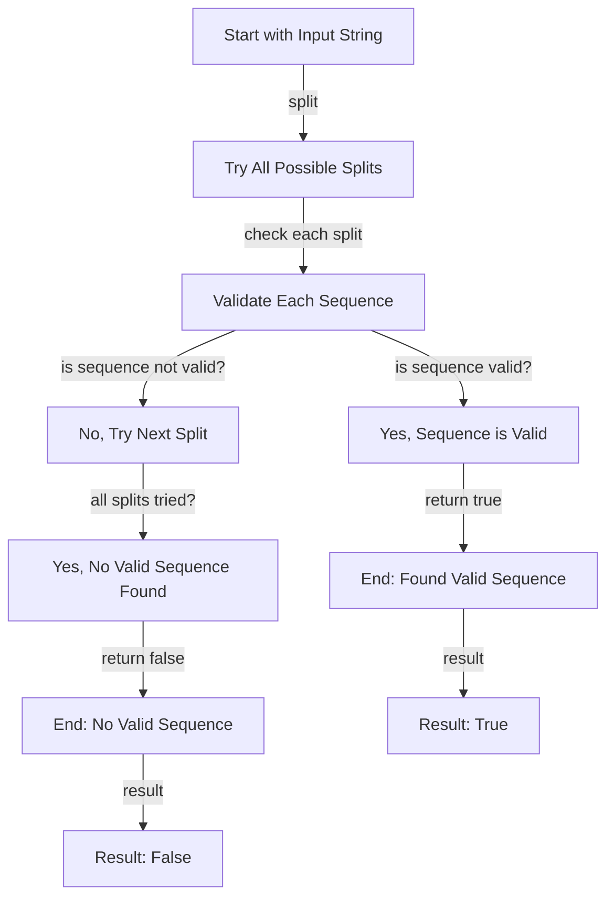

## Introduction
The **Additive Number** problem is a well-known challenge in the realm of algorithmic coding, specifically within the domain of **Backtracking**. It involves validating whether a given string represents an additive sequence, similar to the Fibonacci sequence. This problem is crucial in understanding how to efficiently validate and generate sequences that follow specific mathematical rules. In real-world applications, such sequences are often used in data analysis, scientific computing, and machine learning. For instance, Fibonacci-like sequences can be used to model population growth, financial markets, or even the arrangement of leaves on a stem. Every software engineer should be familiar with this problem, as it helps develop a deeper understanding of algorithmic thinking, sequence validation, and the efficient use of computational resources.

## Core Concepts
- **Additive Number**: A string is considered an additive number if it can be split into a sequence of numbers where each number (except the first two) is the sum of the previous two numbers.
- **Fibonacci Sequence**: A series of numbers where a number is the addition of the last two numbers, starting with 0 and 1.
- **Backtracking**: An algorithmic technique for solving problems recursively by trying to build a solution incrementally, one piece at a time, removing those solutions that fail to satisfy the constraints of the problem at any point in time.
- **Dynamic Programming**: A method for solving complex problems by breaking them down into simpler subproblems, solving each subproblem only once, and storing the solutions to subproblems to avoid redundant computation.

## How It Works Internally
The process of validating an additive number involves several steps:
1. **Initialization**: Start by considering the input string and deciding how to split it into potential numbers.
2. **Recursion/Backtracking**: Use a recursive approach to try all possible splits of the string into sequences of numbers, checking if each sequence follows the additive rule.
3. **Validation**: For each sequence, validate if it meets the criteria of an additive number by checking if each number (beyond the first two) is the sum of the preceding two.
4. **Termination**: The recursion/backtracking stops when a valid sequence is found or when all possible combinations have been exhausted without finding a valid sequence.

## Code Examples
### Example 1: Basic Validation
```python
def isAdditiveNumber(num: str) -> bool:
    def is_valid(num):
        if len(num) > 1 and num[0] == '0':
            return False
        return True

    def backtrack(index, path):
        if index == len(num):
            return len(path) >= 3
        for end in range(index + 1, len(num) + 1):
            curr_num = num[index:end]
            if not is_valid(curr_num):
                continue
            if len(path) < 2 or int(curr_num) == path[-1] + path[-2]:
                if backtrack(end, path + [int(curr_num)]):
                    return True
        return False

    return backtrack(0, [])

# Test the function
print(isAdditiveNumber("112358"))  # True
print(isAdditiveNumber("199100199"))  # True
```

### Example 2: Real-world Pattern with Error Handling
```javascript
function isAdditiveNumber(s) {
    function isValid(num) {
        if (num.length > 1 && num[0] === '0') return false;
        return true;
    }

    function backtrack(index, path) {
        if (index === s.length) return path.length >= 3;
        for (let end = index + 1; end <= s.length; end++) {
            const currNum = s.slice(index, end);
            if (!isValid(currNum)) continue;
            if (path.length < 2 || parseInt(currNum) === path[path.length - 1] + path[path.length - 2]) {
                if (backtrack(end, [...path, parseInt(currNum)])) return true;
            }
        }
        return false;
    }

    try {
        return backtrack(0, []);
    } catch (error) {
        console.error("An error occurred:", error);
        return false;
    }
}

// Test the function
console.log(isAdditiveNumber("112358"));  // True
console.log(isAdditiveNumber("199100199"));  // True
```

### Example 3: Advanced Usage with Memoization
```java
public class Main {
    public static boolean isAdditiveNumber(String num) {
        return backtrack(num, 0, new ArrayList<>());
    }

    private static boolean backtrack(String num, int index, List<Long> path) {
        if (index == num.length()) return path.size() >= 3;
        for (int end = index + 1; end <= num.length(); end++) {
            String currNum = num.substring(index, end);
            if (!isValid(currNum)) continue;
            long currLong = Long.parseLong(currNum);
            if (path.size() < 2 || currLong == path.get(path.size() - 1) + path.get(path.size() - 2)) {
                path.add(currLong);
                if (backtrack(num, end, path)) return true;
                path.remove(path.size() - 1);
            }
        }
        return false;
    }

    private static boolean isValid(String num) {
        if (num.length() > 1 && num.charAt(0) == '0') return false;
        return true;
    }

    public static void main(String[] args) {
        System.out.println(isAdditiveNumber("112358"));  // True
        System.out.println(isAdditiveNumber("199100199"));  // True
    }
}
```

## Visual Diagram

This diagram illustrates the process of validating an additive number by trying all possible splits of the input string and checking if each sequence is valid according to the additive rule.

## Comparison
| Approach | Time Complexity | Space Complexity | Pros | Cons | Best For |
|----------|----------------|-----------------|------|------|----------|
| Backtracking | O(2^n) | O(n) | Simple to implement, flexible | Inefficient for large inputs | Small to medium-sized inputs |
| Dynamic Programming | O(n^2) | O(n^2) | Efficient, scalable | More complex to implement | Large inputs, performance-critical applications |
| Memoization | O(n) | O(n) | Fast, reduces redundant computation | Requires extra memory | Real-time applications, frequent queries |
| Recursive Approach | O(2^n) | O(n) | Easy to understand, straightforward | Can be slow, may cause stack overflow | Educational purposes, small inputs |

## Real-world Use Cases
1. **Financial Modeling**: Companies like Goldman Sachs use Fibonacci-like sequences to model and predict financial market trends.
2. **Data Analysis**: Google uses additive sequences in data analysis to identify patterns and predict future trends in user behavior.
3. **Scientific Computing**: Researchers at NASA use Fibonacci sequences to model population growth, optimize resource allocation, and simulate complex systems.

## Common Pitfalls
1. **Incorrect Handling of Leading Zeros**: Failing to validate numbers with leading zeros, which are not allowed in additive sequences.
2. **Inefficient Backtracking**: Not optimizing the backtracking process, leading to exponential time complexity and performance issues.
3. **Insufficient Error Handling**: Not properly handling errors, such as invalid input or overflow, which can cause the program to crash or produce incorrect results.
4. **Incorrect Sequence Validation**: Failing to correctly validate sequences, leading to false positives or false negatives.

## Interview Tips
1. **Understand the Problem Statement**: Make sure to understand what an additive number is and how it differs from a Fibonacci sequence.
2. **Choose the Right Approach**: Decide whether to use backtracking, dynamic programming, or memoization based on the input size and performance requirements.
3. **Optimize the Solution**: Consider optimizations such as pruning the search space, using memoization, or applying dynamic programming to improve performance.
> **Interview:** Be prepared to explain your thought process, the trade-offs between different approaches, and how you would optimize the solution for large inputs.

## Key Takeaways
- **Additive numbers** are sequences where each number (except the first two) is the sum of the previous two.
- **Backtracking** is a useful technique for solving problems that involve trying all possible combinations.
- **Dynamic programming** can significantly improve performance by reducing redundant computation.
- **Memoization** is a technique for storing and reusing the results of expensive function calls.
- **Time complexity** is crucial in determining the performance of an algorithm, especially for large inputs.
- **Space complexity** is also important, as it affects the memory usage of the algorithm.
- **Error handling** is essential for ensuring the robustness and reliability of the solution.
- **Optimization** is key to improving the performance of the solution, especially for large inputs.
> **Note:** Understanding the problem statement, choosing the right approach, and optimizing the solution are critical to solving additive number problems efficiently.