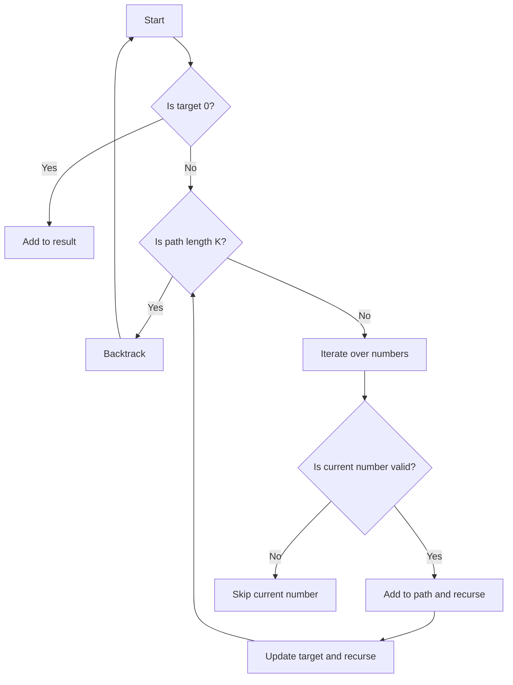

## Introduction
The Combination Sum III problem, also known as the K numbers summing to N problem, is a classic problem in the field of algorithms and data structures. It involves finding all combinations of K numbers that sum up to a given target number N. This problem has numerous real-world applications, such as **resource allocation**, **financial portfolio optimization**, and **logistics planning**. Every engineer needs to know this problem because it is a fundamental problem in computer science and is often used as a building block for more complex problems.

## Core Concepts
The Combination Sum III problem can be defined as follows:
- **Combination**: a selection of K numbers from a given set of numbers.
- **Sum**: the total value of the selected numbers.
- **Target**: the target sum that the selected numbers should add up to.
- **K**: the number of numbers to select.
- **N**: the target sum.

A key concept in this problem is the use of **backtracking**, which is a technique used to find all possible solutions to a problem by exploring all possible branches of a solution tree.

## How It Works Internally
The internal mechanics of the Combination Sum III problem involve the following steps:
1. Initialize an empty list to store the result.
2. Define a recursive function that takes the current combination, the current sum, and the remaining numbers as input.
3. In the recursive function, iterate over the remaining numbers and check if the current number can be added to the current combination without exceeding the target sum.
4. If the current number can be added, recursively call the function with the updated combination and sum.
5. If the current combination has K numbers and the sum equals the target, add the combination to the result list.
6. Backtrack by removing the last added number from the combination and trying the next number.

The time complexity of this algorithm is O(N^(K-1)), where N is the maximum number and K is the number of numbers to select. The space complexity is O(K), which is the maximum depth of the recursion tree.

> **Note:** The time complexity of this algorithm can be optimized by using a more efficient data structure, such as a **hash table**, to store the intermediate results.

## Code Examples
### Example 1: Basic Usage
```python
def combination_sum3(k, n):
    def backtrack(start, path, target):
        if len(path) == k:
            if target == 0:
                result.append(path)
            return
        for i in range(start, 10):
            if target - i >= 0:
                backtrack(i + 1, path + [i], target - i)

    result = []
    backtrack(1, [], n)
    return result

print(combination_sum3(3, 10))
```
This example demonstrates the basic usage of the Combination Sum III problem. It uses a recursive function to find all combinations of 3 numbers that sum up to 10.

### Example 2: Real-World Pattern
```python
def combination_sum3(k, n):
    def backtrack(start, path, target):
        if len(path) == k:
            if target == 0:
                result.append(path)
            return
        for i in range(start, min(target + 1, 10)):
            if target - i >= 0:
                backtrack(i + 1, path + [i], target - i)

    result = []
    backtrack(1, [], n)
    return result

print(combination_sum3(3, 10))
```
This example demonstrates a real-world pattern of the Combination Sum III problem. It uses a recursive function to find all combinations of 3 numbers that sum up to 10, with the constraint that the numbers should be between 1 and 9.

### Example 3: Advanced Usage
```python
def combination_sum3(k, n):
    def backtrack(start, path, target):
        if len(path) == k:
            if target == 0:
                result.append(path)
            return
        for i in range(start, min(target + 1, 10)):
            if target - i >= 0:
                if i not in path:  # avoid duplicates
                    backtrack(i + 1, path + [i], target - i)

    result = []
    backtrack(1, [], n)
    return result

print(combination_sum3(3, 10))
```
This example demonstrates an advanced usage of the Combination Sum III problem. It uses a recursive function to find all combinations of 3 numbers that sum up to 10, with the constraint that the numbers should be between 1 and 9 and should not contain duplicates.

## Visual Diagram

This diagram illustrates the flow of the Combination Sum III problem. It shows the recursive function calls and the conditions that determine the next step.

> **Tip:** Using a visual diagram can help to understand the problem and the solution better.

## Comparison
| Approach | Time Complexity | Space Complexity | Pros | Cons | Best For |
|----------|----------------|-----------------|------|------|----------|
| Recursive | O(N^(K-1)) | O(K) | Easy to implement | Inefficient for large N | Small N and K |
| Dynamic Programming | O(N*K) | O(N*K) | Efficient for large N | Hard to implement | Large N and K |
| Hash Table | O(N*K) | O(N*K) | Fast lookup and insertion | Limited to small N | Small N and K |
| Backtracking | O(N^(K-1)) | O(K) | Easy to implement | Inefficient for large N | Small N and K |

## Real-world Use Cases
1. **Resource Allocation**: A company has a limited budget and needs to allocate it among different projects. The Combination Sum III problem can be used to find all possible combinations of projects that can be funded within the budget.
2. **Financial Portfolio Optimization**: An investor wants to optimize their portfolio by selecting a combination of stocks that will yield the highest return. The Combination Sum III problem can be used to find all possible combinations of stocks that meet the investor's criteria.
3. **Logistics Planning**: A logistics company needs to plan the delivery of goods to different locations. The Combination Sum III problem can be used to find all possible combinations of routes that will minimize the delivery time and cost.

> **Warning:** The Combination Sum III problem can be computationally expensive for large N and K. It is essential to optimize the solution using efficient data structures and algorithms.

## Common Pitfalls
1. **Inefficient Algorithm**: Using a recursive function without optimizing it can lead to a time complexity of O(N^(K-1)), which can be inefficient for large N and K.
2. **Incorrect Base Case**: Not handling the base case correctly can lead to incorrect results. For example, not checking if the target is 0 can lead to incorrect combinations.
3. **Duplicate Combinations**: Not avoiding duplicate combinations can lead to incorrect results. For example, not checking if a number is already in the path can lead to duplicate combinations.
4. **Incorrect Iteration**: Not iterating over the numbers correctly can lead to incorrect results. For example, not starting the iteration from the correct number can lead to incorrect combinations.

## Interview Tips
1. **Understand the Problem**: Make sure to understand the problem statement and the constraints.
2. **Choose the Right Approach**: Choose the right approach based on the constraints and the requirements.
3. **Optimize the Solution**: Optimize the solution using efficient data structures and algorithms.
4. **Handle Edge Cases**: Handle edge cases correctly, such as when the target is 0 or when the path length is K.

> **Interview:** Can you explain the time and space complexity of the Combination Sum III problem? How would you optimize the solution for large N and K?

## Key Takeaways
* The Combination Sum III problem is a classic problem in computer science that involves finding all combinations of K numbers that sum up to a given target number N.
* The problem can be solved using a recursive function with a time complexity of O(N^(K-1)) and a space complexity of O(K).
* The solution can be optimized using efficient data structures and algorithms, such as dynamic programming or hash tables.
* The problem has numerous real-world applications, such as resource allocation, financial portfolio optimization, and logistics planning.
* The problem can be used to find all possible combinations of numbers that meet certain criteria, such as a target sum or a maximum number of combinations.
* The solution should handle edge cases correctly, such as when the target is 0 or when the path length is K.
* The solution should avoid duplicate combinations and incorrect iterations.
* The problem can be solved using a visual diagram to illustrate the flow of the solution.