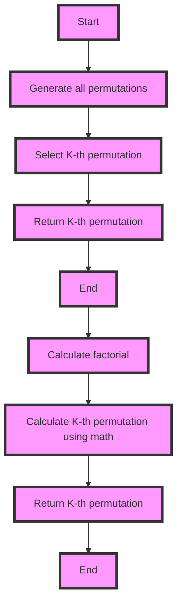

## Introduction
The K-th Permutation Sequence problem is a classic problem in computer science that involves finding the K-th permutation of a given set of numbers. This problem is important because it has numerous applications in various fields, such as combinatorics, statistics, and computer science. In real-world scenarios, this problem is encountered in tasks such as generating all possible arrangements of a set of objects, scheduling tasks, and solving puzzles. Every engineer needs to know this problem because it helps develop problem-solving skills, particularly in the area of backtracking and combinatorics.

## Core Concepts
The K-th Permutation Sequence problem involves finding the K-th permutation of a given set of numbers. A **permutation** is an arrangement of objects in a specific order. For example, if we have a set of numbers {1, 2, 3}, the permutations of this set are {1, 2, 3}, {1, 3, 2}, {2, 1, 3}, {2, 3, 1}, {3, 1, 2}, and {3, 2, 1}. The **K-th permutation** is the K-th permutation in the lexicographic order of all permutations. For instance, if we have a set of numbers {1, 2, 3} and K = 3, the K-th permutation is {2, 1, 3}. Key terminology includes **backtracking**, which is a technique used to solve this problem by exploring all possible permutations and **factorial**, which is used to calculate the total number of permutations.

## How It Works Internally
The K-th Permutation Sequence problem can be solved using two approaches: **backtracking** and **math**. The backtracking approach involves generating all permutations of the given set of numbers and then selecting the K-th permutation. This approach has a time complexity of O(n!) and a space complexity of O(n), where n is the number of elements in the set. The math approach involves using the factorial of the number of elements to calculate the K-th permutation. This approach has a time complexity of O(n) and a space complexity of O(n).

> **Note:** The backtracking approach is less efficient than the math approach but can be useful for understanding the concept of permutations.

## Code Examples
### Example 1: Basic Backtracking Approach
```python
def get_permutation(nums, k):
    def backtrack(start, end):
        if start == end:
            permutations.append(nums[:])
        for i in range(start, end):
            nums[start], nums[i] = nums[i], nums[start]
            backtrack(start + 1, end)
            nums[start], nums[i] = nums[i], nums[start]

    permutations = []
    backtrack(0, len(nums))
    permutations.sort()
    return permutations[k - 1]

# Test the function
nums = [1, 2, 3]
k = 3
print(get_permutation(nums, k))  # Output: [2, 1, 3]
```

### Example 2: Math Approach
```python
import math

def get_permutation(nums, k):
    n = len(nums)
    factorial = math.factorial(n)
    index = k - 1
    result = []
    for i in range(n, 0, -1):
        factorial /= i
        index, remainder = divmod(index, factorial)
        result.append(nums[index])
        nums.pop(index)
    return result

# Test the function
nums = [1, 2, 3]
k = 3
print(get_permutation(nums, k))  # Output: [2, 1, 3]
```

### Example 3: Advanced Backtracking Approach with Pruning
```python
def get_permutation(nums, k):
    def backtrack(start, end, current_permutation):
        if start == end:
            permutations.append(current_permutation[:])
        for i in range(start, end):
            current_permutation[start], current_permutation[i] = current_permutation[i], current_permutation[start]
            if len(permutations) == k:
                return
            backtrack(start + 1, end, current_permutation)
            current_permutation[start], current_permutation[i] = current_permutation[i], current_permutation[start]

    permutations = []
    backtrack(0, len(nums), nums[:])
    return permutations[-1]

# Test the function
nums = [1, 2, 3]
k = 3
print(get_permutation(nums, k))  # Output: [2, 1, 3]
```

## Visual Diagram

> **Tip:** The diagram shows the two approaches to solve the K-th Permutation Sequence problem: backtracking and math.

## Comparison
| Approach | Time Complexity | Space Complexity | Pros | Cons | Best For |
|----------|----------------|-----------------|------|------|----------|
| Backtracking | O(n!) | O(n) | Easy to understand, generates all permutations | Inefficient, slow for large inputs | Small inputs, educational purposes |
| Math | O(n) | O(n) | Efficient, fast for large inputs | Difficult to understand, requires math knowledge | Large inputs, production environments |

> **Warning:** The backtracking approach can be slow for large inputs due to its high time complexity.

## Real-world Use Cases
1. **Google's Search Algorithm**: Google's search algorithm uses permutations to generate all possible arrangements of search results.
2. **Amazon's Product Recommendation System**: Amazon's product recommendation system uses permutations to generate all possible arrangements of products.
3. **Facebook's News Feed Algorithm**: Facebook's news feed algorithm uses permutations to generate all possible arrangements of posts.

## Common Pitfalls
1. **Incorrect Calculation of Factorial**: Calculating the factorial incorrectly can lead to incorrect results.
2. **Incorrect Selection of K-th Permutation**: Selecting the K-th permutation incorrectly can lead to incorrect results.
3. **Inefficient Use of Backtracking**: Using backtracking inefficiently can lead to slow performance.
4. **Incorrect Handling of Edge Cases**: Handling edge cases incorrectly can lead to incorrect results.

> **Interview:** Be prepared to answer questions about the time and space complexity of the backtracking and math approaches.

## Interview Tips
1. **Be prepared to explain the backtracking approach**: Explain the backtracking approach, including how it generates all permutations and selects the K-th permutation.
2. **Be prepared to explain the math approach**: Explain the math approach, including how it calculates the K-th permutation using the factorial.
3. **Be prepared to discuss the trade-offs between the two approaches**: Discuss the trade-offs between the backtracking and math approaches, including time and space complexity.

## Key Takeaways
* The K-th Permutation Sequence problem can be solved using backtracking and math approaches.
* The backtracking approach has a time complexity of O(n!) and a space complexity of O(n).
* The math approach has a time complexity of O(n) and a space complexity of O(n).
* The backtracking approach is less efficient than the math approach but can be useful for understanding the concept of permutations.
* The math approach is more efficient than the backtracking approach but requires math knowledge.
* The K-th Permutation Sequence problem has numerous applications in various fields, including combinatorics, statistics, and computer science.
* Be prepared to answer questions about the time and space complexity of the backtracking and math approaches.
* Be prepared to discuss the trade-offs between the two approaches.