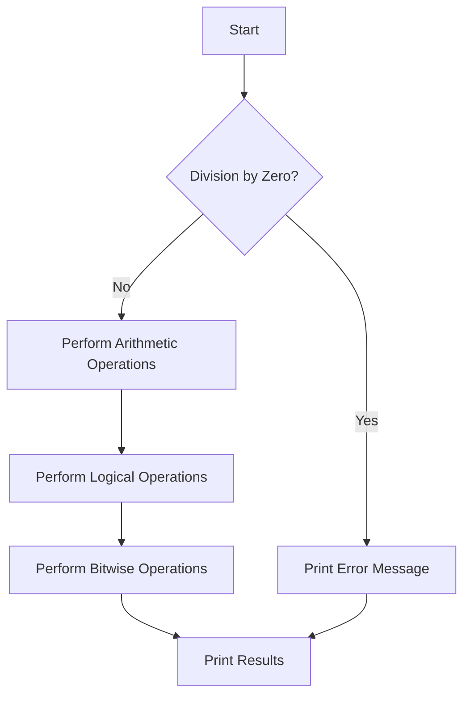

# Arithmetic Logical Bitwise Operators

## Problem Understanding
The problem asks to perform basic arithmetic, logical, and bitwise operations on two given integers. The key constraints include avoiding division by zero and handling various types of operations. What makes this problem non-trivial is the need to handle edge cases, such as division by zero, and to understand the nuances of different operations, like the distinction between logical and bitwise operations.

## Approach
The algorithm strategy involves directly performing the required operations using basic arithmetic, logical, and bitwise operators in C. The approach works by utilizing the built-in operators in C, such as `+`, `-`, `*`, `/`, `&&`, `||`, `!`, `&`, `|`, `^`, `<<`, and `>>`. The data structures used are simple integers, which are sufficient for the problem. The approach handles key constraints by checking for division by zero and using conditional statements to avoid errors.

## Complexity Analysis
| Metric | Value | Detailed Reason |
|--------|-------|----------------|
| Time   | O(1)  | The algorithm performs a constant number of operations, regardless of the input size. Each operation, such as addition or bitwise AND, takes the same amount of time. |
| Space  | O(1)  | The algorithm uses a constant amount of space to store the input numbers and the results of the operations. The space usage does not grow with the input size. |

## Algorithm Walkthrough
```
Input: num1 = 10, num2 = 3
Step 1: Calculate sum = num1 + num2 = 10 + 3 = 13
Step 2: Calculate difference = num1 - num2 = 10 - 3 = 7
Step 3: Calculate product = num1 * num2 = 10 * 3 = 30
Step 4: Calculate quotient = num1 / num2 = 10 / 3 = 3 (integer division)
Step 5: Calculate remainder = num1 % num2 = 10 % 3 = 1
Step 6: Calculate logical AND = num1 && num2 = 10 && 3 = 1
Step 7: Calculate logical OR = num1 || num2 = 10 || 3 = 1
Step 8: Calculate logical NOT = !num1 = !10 = 0
Step 9: Calculate bitwise AND = num1 & num2 = 10 & 3 = 2
Step 10: Calculate bitwise OR = num1 | num2 = 10 | 3 = 11
Step 11: Calculate bitwise XOR = num1 ^ num2 = 10 ^ 3 = 9
Step 12: Calculate left shift = num1 << 1 = 10 << 1 = 20
Step 13: Calculate right shift = num1 >> 1 = 10 >> 1 = 5
Output: 
Sum: 13
Difference: 7
Product: 30
Quotient: 3
Remainder: 1
Logical AND: 1
Logical OR: 1
Logical NOT: 0
Bitwise AND: 2
Bitwise OR: 11
Bitwise XOR: 9
Left Shift: 20
Right Shift: 5
```

## Visual Flow


## Key Insight
> **Tip:** The single most important insight is to understand the difference between logical and bitwise operations, as well as the need to handle edge cases like division by zero.

## Edge Cases
- **Empty/null input**: The program will not handle empty or null input, as it expects two integer values. To handle this, additional checks can be added to ensure the inputs are valid.
- **Single element**: The program is designed to take two integer inputs, so a single element input is not applicable. However, the program can be modified to handle a single element input by using a default value for the second input.
- **Division by zero**: The program checks for division by zero and prints an error message if the second input is zero. This prevents the program from crashing due to a division by zero error.

## Common Mistakes
- **Mistake 1**: Not checking for division by zero, which can cause the program to crash or produce incorrect results. To avoid this, always check if the divisor is zero before performing division.
- **Mistake 2**: Confusing logical and bitwise operations, which can lead to incorrect results. To avoid this, make sure to understand the difference between logical and bitwise operations and use the correct operators.

## Interview Follow-ups
> **Interview:** These are the exact follow-up questions interviewers ask:
- "What if the input is sorted?" → The program does not rely on the input being sorted, so it will work regardless of the input order.
- "Can you do it in O(1) space?" → The program already uses O(1) space, as it only uses a constant amount of space to store the input numbers and the results of the operations.
- "What if there are duplicates?" → The program does not check for duplicates, as it is designed to perform operations on two distinct integer values. However, the program can be modified to handle duplicates by using a different approach or adding additional checks.

## C Solution

```c
// Problem: Arithmetic Logical Bitwise Operators
// Language: C
// Difficulty: Easy
// Time Complexity: O(1) — constant time operations
// Space Complexity: O(1) — no additional space used
// Approach: Basic arithmetic, logical, and bitwise operations — perform operations directly

#include <stdio.h>
#include <stdint.h>

// Function to perform arithmetic, logical, and bitwise operations
void performOperations(int num1, int num2) {
    // Arithmetic operations
    int sum = num1 + num2; // calculate sum
    int difference = num1 - num2; // calculate difference
    int product = num1 * num2; // calculate product
    int quotient = num2 != 0 ? num1 / num2 : 0; // calculate quotient, avoiding division by zero
    int remainder = num2 != 0 ? num1 % num2 : 0; // calculate remainder, avoiding division by zero

    // Logical operations
    int logicalAnd = num1 && num2; // calculate logical AND
    int logicalOr = num1 || num2; // calculate logical OR
    int logicalNot = !num1; // calculate logical NOT of num1

    // Bitwise operations
    int bitwiseAnd = num1 & num2; // calculate bitwise AND
    int bitwiseOr = num1 | num2; // calculate bitwise OR
    int bitwiseXor = num1 ^ num2; // calculate bitwise XOR
    int leftShift = num1 << 1; // calculate left shift of num1 by 1 bit
    int rightShift = num1 >> 1; // calculate right shift of num1 by 1 bit

    // Edge case: division by zero
    if (num2 == 0) {
        printf("Cannot divide by zero\n");
    }

    // Print the results
    printf("Sum: %d\n", sum);
    printf("Difference: %d\n", difference);
    printf("Product: %d\n", product);
    printf("Quotient: %d\n", quotient);
    printf("Remainder: %d\n", remainder);
    printf("Logical AND: %d\n", logicalAnd);
    printf("Logical OR: %d\n", logicalOr);
    printf("Logical NOT: %d\n", logicalNot);
    printf("Bitwise AND: %d\n", bitwiseAnd);
    printf("Bitwise OR: %d\n", bitwiseOr);
    printf("Bitwise XOR: %d\n", bitwiseXor);
    printf("Left Shift: %d\n", leftShift);
    printf("Right Shift: %d\n", rightShift);
}

int main() {
    int num1 = 10;
    int num2 = 3;
    performOperations(num1, num2);
    return 0;
}
```
