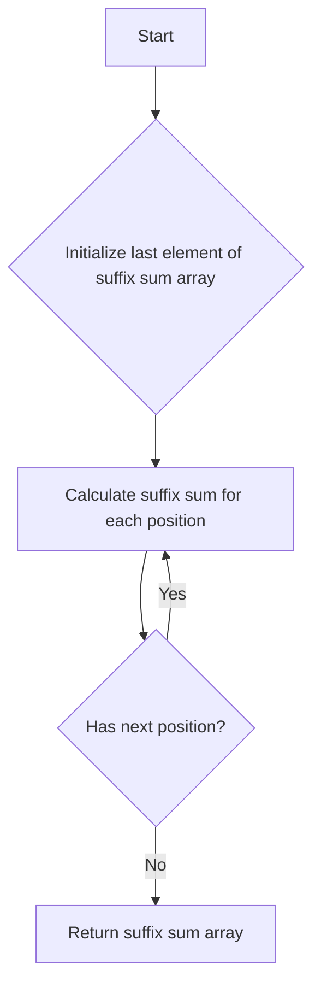

# Calculate Suffix Sum of Array

## Problem Understanding
The problem asks us to calculate the suffix sum of an array, which is the sum of all elements to the right of each position. The key constraint is that we need to calculate the suffix sum for each position in the array. This problem is non-trivial because a naive approach would involve iterating through the array for each position, resulting in a time complexity of O(n^2). However, we can optimize this by using a single pass through the array and accumulating the sum from right to left.

## Approach
The algorithm strategy is to use iterative accumulation, where we start from the rightmost element and accumulate the sum as we move left. The intuition behind this approach is that the suffix sum at each position is the sum of the current element and the suffix sum of the next position. We use a dynamic programming approach to store the suffix sum at each position in an output array. The time complexity is O(n) because we only need to make a single pass through the array, and the space complexity is O(n) because we need to store the suffix sum for each position.

## Complexity Analysis
| Metric | Value | Detailed Reason |
|--------|-------|----------------|
| Time   | O(n)  | We make a single pass through the array, where n is the number of elements in the array. The loop iterates from the second last element to the first element, resulting in n-1 iterations. However, since we drop constants in Big O notation, the time complexity is O(n). |
| Space  | O(n)  | We need to store the suffix sum for each position in the array, resulting in a space complexity of O(n). The output array has the same size as the input array. |

## Algorithm Walkthrough
```
Input: [1, 2, 3, 4, 5]
Step 1: Initialize the last element of the suffix sum array: suffixSum[4] = 5
Step 2: Calculate the suffix sum for the second last position: suffixSum[3] = suffixSum[4] + 4 = 5 + 4 = 9
Step 3: Calculate the suffix sum for the third last position: suffixSum[2] = suffixSum[3] + 3 = 9 + 3 = 12
Step 4: Calculate the suffix sum for the fourth last position: suffixSum[1] = suffixSum[2] + 2 = 12 + 2 = 14
Step 5: Calculate the suffix sum for the first position: suffixSum[0] = suffixSum[1] + 1 = 14 + 1 = 15
Output: [15, 14, 12, 9, 5]
```

## Visual Flow


## Key Insight
> **Tip:** The key insight is to start from the rightmost element and accumulate the sum as we move left, allowing us to calculate the suffix sum for each position in a single pass through the array.

## Edge Cases
- **Empty/null input**: If the input array is empty, the function returns NULL. This is because there are no elements to calculate the suffix sum for.
- **Single element**: If the input array has only one element, the function returns an array with the same single element. This is because the suffix sum of a single element is the element itself.
- **Array with negative numbers**: If the input array contains negative numbers, the function still calculates the suffix sum correctly. This is because the suffix sum is calculated by adding the current element to the suffix sum of the next position, regardless of whether the numbers are positive or negative.

## Common Mistakes
- **Mistake 1**: Not initializing the last element of the suffix sum array correctly. To avoid this, make sure to set the last element of the suffix sum array to the last element of the input array.
- **Mistake 2**: Not iterating through the array in the correct order. To avoid this, make sure to start from the second last element and iterate backwards to the first element.

## Interview Follow-ups
> **Interview:** These are the exact follow-up questions interviewers ask:
- "What if the input is sorted?" → The algorithm still works correctly, with a time complexity of O(n) and a space complexity of O(n).
- "Can you do it in O(1) space?" → No, because we need to store the suffix sum for each position in the array, resulting in a space complexity of O(n).
- "What if there are duplicates?" → The algorithm still works correctly, because the suffix sum is calculated by adding the current element to the suffix sum of the next position, regardless of whether the numbers are duplicates or not.

## C Solution

```c
// Problem: Calculate Suffix Sum of Array
// Language: C
// Difficulty: Easy
// Time Complexity: O(n) — single pass through array
// Space Complexity: O(n) — output array stores at most n elements
// Approach: Iterative accumulation — for each position, sum all elements to its right

#include <stdio.h>
#include <stdlib.h>

// Function to calculate suffix sum of an array
int* calculateSuffixSum(int* nums, int numsSize, int* returnSize) {
    // Edge case: empty input → return NULL
    if (numsSize == 0) {
        *returnSize = 0;
        return NULL;
    }

    // Allocate memory for the output array
    int* suffixSum = (int*)malloc(numsSize * sizeof(int));
    
    // Initialize the last element of the suffix sum array
    suffixSum[numsSize - 1] = nums[numsSize - 1]; // last element is the sum of itself

    // Calculate the suffix sum for each position
    for (int i = numsSize - 2; i >= 0; i--) {
        // For each position, sum all elements to its right
        suffixSum[i] = suffixSum[i + 1] + nums[i]; // accumulate the sum
    }

    // Set the return size
    *returnSize = numsSize;

    return suffixSum;
}

int main() {
    int nums[] = {1, 2, 3, 4, 5};
    int numsSize = sizeof(nums) / sizeof(nums[0]);
    int returnSize;

    int* suffixSum = calculateSuffixSum(nums, numsSize, &returnSize);

    // Print the suffix sum array
    for (int i = 0; i < returnSize; i++) {
        printf("%d ", suffixSum[i]); // print each element
    }

    printf("\n");

    // Free the allocated memory
    free(suffixSum);

    return 0;
}
```
