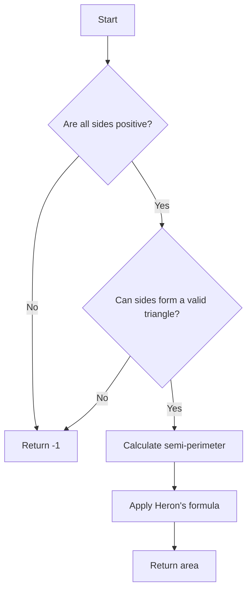

# Calculate the Area of a Triangle

## Problem Understanding
The problem is asking to calculate the area of a triangle given the lengths of its sides. The key constraints are that all sides must have positive lengths and the sum of any two sides must be greater than the third side, which is a fundamental property of valid triangles. What makes this problem non-trivial is the need to handle invalid input (e.g., negative side lengths or sides that cannot form a triangle) and to apply a mathematical formula (Heron's formula) to calculate the area, which involves calculating the semi-perimeter first.

## Approach
The algorithm strategy is to use Heron's formula, which calculates the area of a triangle when all three sides are known. The intuition behind this approach is that Heron's formula provides a direct method for computing the area based on the side lengths, eliminating the need for more complex geometric calculations. This approach works because it first checks for invalid input (negative side lengths or invalid triangle), then calculates the semi-perimeter, and finally applies Heron's formula. The data structure used is minimal, mainly involving basic arithmetic operations and a square root calculation, making it straightforward and efficient. The approach handles key constraints by explicitly checking for them at the beginning of the calculation.

## Complexity Analysis
| Metric | Value | Detailed Reason |
|--------|-------|----------------|
| Time   | O(1)  | The algorithm performs a constant number of operations regardless of the input size. It checks the input, calculates the semi-perimeter, and then applies Heron's formula, all of which take constant time. |
| Space  | O(1)  | The algorithm uses a constant amount of space to store the input values and the calculated semi-perimeter and area, regardless of the input size. |

## Algorithm Walkthrough
```
Input: a = 3.0, b = 4.0, c = 5.0
Step 1: Check if all sides have positive lengths
         - a > 0: True
         - b > 0: True
         - c > 0: True
Step 2: Check if the sides can form a valid triangle
         - a + b > c: 3 + 4 > 5: True
         - a + c > b: 3 + 5 > 4: True
         - b + c > a: 4 + 5 > 3: True
Step 3: Calculate the semi-perimeter
         - semiPerimeter = (a + b + c) / 2 = (3 + 4 + 5) / 2 = 6
Step 4: Calculate the area using Heron's formula
         - area = sqrt(semiPerimeter * (semiPerimeter - a) * (semiPerimeter - b) * (semiPerimeter - c))
         - area = sqrt(6 * (6 - 3) * (6 - 4) * (6 - 5))
         - area = sqrt(6 * 3 * 2 * 1) = sqrt(36) = 6
Output: area = 6.0
```

## Visual Flow


## Key Insight
> **Tip:** The key to solving this problem efficiently is recognizing the applicability of Heron's formula for calculating the area of a triangle when all sides are known, and ensuring that the input sides can indeed form a valid triangle.

## Edge Cases
- **Empty/null input**: This case is implicitly handled by the requirement that all sides must be positive numbers. If any side is not provided or is null, the function would not be applicable or would fail due to invalid input.
- **Single element**: This problem does not apply to a single element, as a triangle by definition has three sides.
- **Zero or negative side lengths**: The function explicitly checks for these cases and returns -1 to indicate an invalid triangle.

## Common Mistakes
- **Mistake 1: Not checking for invalid input**: Failing to verify that all sides are positive and can form a valid triangle can lead to incorrect results or errors in calculation.
- **Mistake 2: Incorrect application of Heron's formula**: Misinterpreting or miscalculating the semi-perimeter or the area using Heron's formula can result in an incorrect area calculation.

## Interview Follow-ups
> **Interview:** 
- "What if the input is sorted?" → The sorting of the input sides does not affect the calculation of the area using Heron's formula, as the formula depends on the lengths of the sides, not their order.
- "Can you do it in O(1) space?" → Yes, the algorithm already achieves O(1) space complexity by only using a constant amount of space to store the input and calculated values.
- "What if there are duplicates?" → In the context of calculating the area of a triangle, duplicates would refer to two or more sides having the same length. This scenario is handled by Heron's formula, which calculates the area based on the lengths of the sides, regardless of whether some sides are equal.

## C Solution

```c
// Problem: Calculate the Area of a Triangle
// Language: C
// Difficulty: Easy
// Time Complexity: O(1) — constant time calculation
// Space Complexity: O(1) — no additional space needed
// Approach: Heron's formula — calculate semi-perimeter and then area

#include <stdio.h>
#include <math.h>

/**
 * Calculate the area of a triangle given the lengths of its sides.
 *
 * @param a length of side a
 * @param b length of side b
 * @param c length of side c
 * @return the area of the triangle
 */
double calculateTriangleArea(double a, double b, double c) {
    // Check if all sides have positive lengths
    if (a <= 0 || b <= 0 || c <= 0) {
        // Edge case: invalid side lengths → return -1
        return -1;
    }

    // Check if the sides can form a valid triangle (sum of any two sides > third side)
    if (a + b <= c || a + c <= b || b + c <= a) {
        // Edge case: invalid triangle → return -1
        return -1;
    }

    // Calculate the semi-perimeter
    double semiPerimeter = (a + b + c) / 2; // calculate semi-perimeter for Heron's formula

    // Calculate the area using Heron's formula
    double area = sqrt(semiPerimeter * (semiPerimeter - a) * (semiPerimeter - b) * (semiPerimeter - c)); // calculate area

    return area;
}

int main() {
    double a = 3.0;
    double b = 4.0;
    double c = 5.0;

    double area = calculateTriangleArea(a, b, c);

    if (area != -1) {
        printf("The area of the triangle is: %.2f\n", area);
    } else {
        printf("Invalid triangle\n");
    }

    return 0;
}
```
