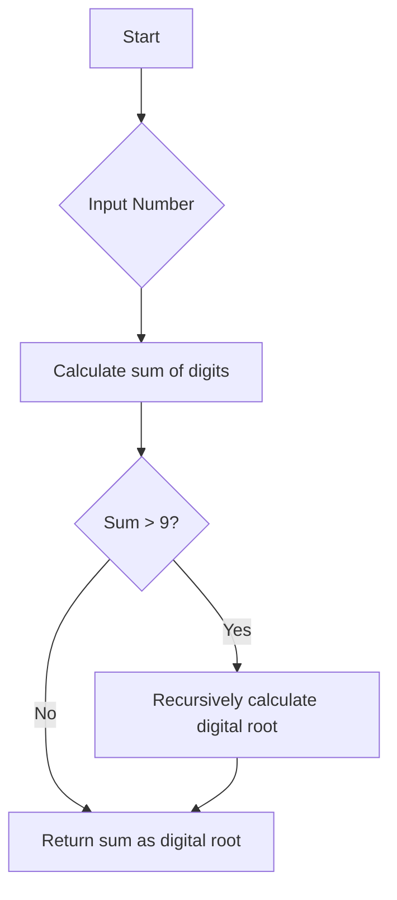

# Calculate the Digital Root of a Number

## Problem Understanding
The problem asks to calculate the digital root of a given number, which is the value obtained by recursively summing the digits of a number until only a single digit remains. The key constraint is that the digital root should be a single digit. This problem is non-trivial because a naive approach of simply summing the digits once would not work for all numbers, as the sum itself could be a multi-digit number. The problem requires a recursive or iterative approach to handle such cases.

## Approach
The algorithm strategy used is a recursive sum of digits, where the digits of the input number are repeatedly summed until a single digit is obtained. This approach works because the digital root is defined as the value obtained by recursively summing the digits of a number until only a single digit remains. The algorithm uses a while loop to calculate the sum of digits of the input number and then recursively calls itself if the sum is greater than 9. The data structure used is a simple integer variable to store the sum of digits, which is sufficient because the problem only requires a single value to be returned.

## Complexity Analysis
| Metric | Value | Detailed Reason |
|--------|-------|----------------|
| Time   | O(log n) | The algorithm iterates over each digit of the input number once, and in the worst case, it may need to recursively call itself for each digit. Since the number of digits in a number is proportional to the logarithm of the number, the time complexity is O(log n). |
| Space  | O(1) | The algorithm uses a constant amount of space to store the sum of digits and the input number, so the space complexity is O(1). |

## Algorithm Walkthrough
```
Input: 16
Step 1: Calculate the sum of digits of 16: 1 + 6 = 7
Step 2: Since the sum (7) is a single digit, return 7
Output: 7

Input: 942
Step 1: Calculate the sum of digits of 942: 9 + 4 + 2 = 15
Step 2: Since the sum (15) is greater than 9, recursively calculate its digital root
Step 3: Calculate the sum of digits of 15: 1 + 5 = 6
Step 4: Since the sum (6) is a single digit, return 6
Output: 6
```
This walkthrough demonstrates how the algorithm handles different inputs and calculates the digital root.

## Visual Flow

This flowchart illustrates the decision flow of the algorithm, showing how it handles different cases and recursively calculates the digital root.

## Key Insight
> **Tip:** The key to solving this problem is to recognize that the digital root is defined as the value obtained by recursively summing the digits of a number until only a single digit remains, and to implement this recursive sum using a simple while loop and recursive function calls.

## Edge Cases
- **Empty/null input**: In C, an empty or null input is not a valid number, so this case is not applicable. However, if the input is 0, the algorithm correctly returns 0 as the digital root.
- **Single element**: If the input is a single digit, the algorithm correctly returns the same digit as the digital root.
- **Negative number**: The algorithm does not handle negative numbers explicitly, but it can be modified to do so by taking the absolute value of the input number before calculating the digital root.

## Common Mistakes
- **Mistake 1**: Not handling the case where the sum of digits is greater than 9. To avoid this, use a recursive function call to calculate the digital root of the sum.
- **Mistake 2**: Not using a while loop to calculate the sum of digits. To avoid this, use a while loop to iterate over each digit of the input number.

## Interview Follow-ups
> **Interview:** These are the exact follow-up questions interviewers ask:
- "What if the input is sorted?" → This question is not applicable to this problem, as the input is a single number, not a list of numbers.
- "Can you do it in O(1) space?" → No, because the algorithm needs to store the sum of digits, which requires O(1) space, but the recursive function calls require additional space on the call stack.
- "What if there are duplicates?" → This question is not applicable to this problem, as the input is a single number, not a list of numbers.

## C Solution

```c
// Problem: Calculate the Digital Root of a Number
// Language: C
// Difficulty: Easy
// Time Complexity: O(log n) — number of digits in n
// Space Complexity: O(1) — constant space
// Approach: Recursive sum of digits — repeatedly sum digits until single digit

#include <stdio.h>

int digitalRoot(int n) {
    // Edge case: 0 → return 0
    if (n == 0) return 0;
    
    // Calculate the sum of digits of n
    int sum = 0;
    while (n > 0) {
        // Get the last digit of n
        int digit = n % 10;
        
        // Add the digit to the sum
        sum += digit;
        
        // Remove the last digit from n
        n /= 10;
    }
    
    // If sum is greater than 9, recursively calculate its digital root
    if (sum > 9) {
        return digitalRoot(sum);
    } else {
        return sum;
    }
}

int main() {
    int n;
    printf("Enter a number: ");
    scanf("%d", &n);
    
    int result = digitalRoot(n);
    printf("Digital root of %d is %d\n", n, result);
    
    return 0;
}
```
