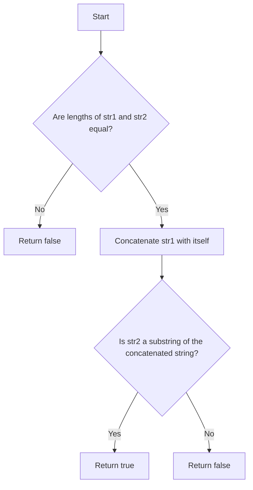

# Check if Strings are Rotations of Each Other

## Problem Understanding
The problem asks to determine if two given strings are rotations of each other. This means that one string can be obtained by rotating the characters of the other string. The key constraint is that the two strings must have the same length to be considered rotations of each other. A naive approach would be to compare all possible rotations of one string with the other, but this would be inefficient. The problem becomes non-trivial because a simple comparison of substrings is not sufficient, and the rotation aspect must be taken into account.

## Approach
The algorithm strategy is to concatenate one of the strings with itself and then check if the other string is a substring of the concatenated string. This approach works because if a string is a rotation of another, it must be a substring of the other string's concatenation with itself. The intuition behind this is that by concatenating a string with itself, all possible rotations of the string are included in the concatenated string. The `strstr` function in C is used to search for the substring, and the `strcpy` and `strcat` functions are used to concatenate the strings.

## Complexity Analysis
| Metric | Value | Detailed Reason |
|--------|-------|----------------|
| Time   | O(n)  | The time complexity is O(n) because the `strlen`, `strcpy`, `strcat`, and `strstr` functions all have a time complexity of O(n), where n is the length of the string. The `strstr` function has to potentially scan the entire concatenated string, which has a length of 2n. |
| Space  | O(n)  | The space complexity is O(n) because a new string is created to store the concatenated string, which has a length of 2n. |

## Algorithm Walkthrough
```
Input: str1 = "abcde", str2 = "cdeab"
Step 1: Check if the lengths of str1 and str2 are equal. If not, return false.
Step 2: Concatenate str1 with itself to get "abcdeabcde".
Step 3: Check if str2 is a substring of the concatenated string.
Step 4: Since "cdeab" is found in "abcdeabcde", return true.
Output: true
```

## Visual Flow


## Key Insight
> **Tip:** The key insight is that a string is a rotation of another if and only if it is a substring of the other string's concatenation with itself.

## Edge Cases
- **Empty strings**: If both strings are empty, they are considered rotations of each other because an empty string can be obtained by rotating another empty string.
- **Single character strings**: If both strings have a single character, they are rotations of each other if and only if the characters are the same.
- **Strings of different lengths**: If the strings have different lengths, they cannot be rotations of each other because a rotation of a string must have the same length as the original string.

## Common Mistakes
- **Mistake 1**: Not checking if the lengths of the strings are equal before checking for rotation. This can lead to incorrect results because a string cannot be a rotation of another string with a different length.
- **Mistake 2**: Using an inefficient algorithm to check for rotation, such as comparing all possible rotations of one string with the other. This can lead to a high time complexity and inefficient code.

## Interview Follow-ups
> **Interview:** These are the exact follow-up questions interviewers ask:
- "What if the input is sorted?" → This problem does not involve sorting, so it does not apply.
- "Can you do it in O(1) space?" → No, because we need to create a new string to store the concatenated string, which requires O(n) space.
- "What if there are duplicates?" → The algorithm works correctly even if there are duplicate characters in the strings, because it checks for a substring match in the concatenated string.

## C Solution

```c
// Problem: Check if Strings are Rotations of Each Other
// Language: C
// Difficulty: Easy
// Time Complexity: O(n) — concatenating one string and searching in the other
// Space Complexity: O(n) — storing the concatenated string
// Approach: Concatenation and substring search — checking if one string is a substring of the other's concatenation

#include <stdio.h>
#include <string.h>
#include <stdbool.h>

bool areRotations(char* str1, char* str2) {
    // Edge case: if strings are not of the same length, they cannot be rotations of each other
    if (strlen(str1) != strlen(str2)) {
        return false;  // lengths do not match
    }

    // Concatenate the first string with itself to handle rotations
    char concatenatedStr[2 * strlen(str1) + 1];
    strcpy(concatenatedStr, str1);
    strcat(concatenatedStr, str1);

    // Check if str2 is a substring of the concatenated string
    char* found = strstr(concatenatedStr, str2);
    if (found != NULL) {
        return true;  // str2 is a rotation of str1
    }

    return false;  // str2 is not a rotation of str1
}

int main() {
    char str1[] = "abcde";
    char str2[] = "cdeab";
    printf("%s and %s are %srotations of each other\n", str1, str2, areRotations(str1, str2) ? "" : "not ");

    char str3[] = "abcde";
    char str4[] = "cdeabx";
    printf("%s and %s are %srotations of each other\n", str3, str4, areRotations(str3, str4) ? "" : "not ");

    return 0;
}
```
