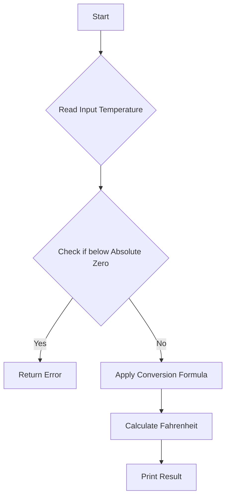

# Convert Celsius to Fahrenheit

## Problem Understanding
The problem is asking to convert a given temperature from Celsius to Fahrenheit. The key constraint is that the input temperature should be within the valid range, i.e., not below absolute zero (-273.15°C). The problem becomes non-trivial when considering edge cases, such as handling temperatures below absolute zero or non-numeric input values. A naive approach might simply apply the conversion formula without considering these edge cases, which could lead to incorrect or undefined results.

## Approach
The algorithm strategy is to apply a simple arithmetic formula to convert the input temperature from Celsius to Fahrenheit. The formula is (°C × 9/5) + 32 = °F. This approach works because it is a direct mathematical conversion between the two temperature scales. The function uses a `double` data type to handle decimal temperatures and returns an error value if the input temperature is below absolute zero. The approach handles key constraints by checking for valid input temperatures and applying the conversion formula accordingly.

## Complexity Analysis
| Metric | Value | Detailed Reason |
|--------|-------|----------------|
| Time   | O(1)  | The conversion formula is applied in constant time, regardless of the input temperature. The function performs a fixed number of operations, including a single arithmetic calculation and a conditional check. |
| Space  | O(1)  | The function uses a fixed amount of space to store the input temperature, the converted temperature, and a few temporary variables. The space usage does not grow with the input size, making it constant. |

## Algorithm Walkthrough
```
Input: 30°C
Step 1: Read input temperature (celsius = 30)
Step 2: Check if input temperature is below absolute zero (celsius >= -273.15)
Step 3: Apply conversion formula (fahrenheit = (celsius * 9 / 5) + 32)
Step 4: Calculate fahrenheit (fahrenheit = (30 * 9 / 5) + 32 = 86)
Output: 30°C is equal to 86°F
```
This example demonstrates the conversion of a temperature from Celsius to Fahrenheit using the provided function.

## Visual Flow

This flowchart shows the decision flow and data transformation of the algorithm, from reading the input temperature to printing the converted result.

## Key Insight
> **Tip:** The key insight is to apply the conversion formula directly, while also considering edge cases such as temperatures below absolute zero to ensure accurate and valid results.

## Edge Cases
- **Empty/null input**: If the input is empty or null, the function will not be able to read the temperature, and the program will likely crash or produce undefined behavior. To handle this, input validation should be added to check for empty or null input before attempting to read the temperature.
- **Single element**: If the input is a single temperature value, the function will convert it correctly. However, if the input is not a valid number, the function may produce incorrect results or crash. Input validation should be added to check for valid numeric input.
- **Temperature below absolute zero**: If the input temperature is below absolute zero (-273.15°C), the function will return an error value, indicating that the input temperature is invalid. This edge case is handled by the function's conditional check.

## Common Mistakes
- **Mistake 1: Not checking for valid input temperatures**: Failing to check if the input temperature is below absolute zero can result in incorrect or undefined results. To avoid this, add a conditional check to handle temperatures below absolute zero.
- **Mistake 2: Using incorrect data types**: Using integer data types to store decimal temperatures can result in precision loss and incorrect results. To avoid this, use `double` or `float` data types to store decimal temperatures.

## Interview Follow-ups
> **Interview:** These are the exact follow-up questions interviewers ask:
- "What if the input is sorted?" → The input being sorted does not affect the conversion formula, as it is applied individually to each temperature value.
- "Can you do it in O(1) space?" → Yes, the function already uses O(1) space, as it only uses a fixed amount of space to store the input temperature and the converted temperature.
- "What if there are duplicates?" → The presence of duplicate temperatures does not affect the conversion formula, as each temperature value is converted individually. However, the function may be optimized to handle duplicate temperatures by storing the converted values in a cache or dictionary to avoid redundant calculations.

## C Solution

```c
// Problem: Convert Celsius to Fahrenheit
// Language: C
// Difficulty: Easy
// Time Complexity: O(1) — constant time conversion
// Space Complexity: O(1) — no additional space used
// Approach: Simple arithmetic formula — apply conversion formula to input temperature

#include <stdio.h>

// Function to convert Celsius to Fahrenheit
double celsiusToFahrenheit(double celsius) {
    // Check if input is within valid temperature range (absolute zero to absolute boiling point of water)
    if (celsius < -273.15) {
        printf("Edge case: temperature below absolute zero\n");
        return -1; // Return error value for invalid input
    }
    // Apply conversion formula: (°C × 9/5) + 32 = °F
    double fahrenheit = (celsius * 9 / 5) + 32; // Calculate Fahrenheit equivalent
    return fahrenheit; // Return converted temperature
}

int main() {
    double celsius;
    printf("Enter temperature in Celsius: ");
    scanf("%lf", &celsius); // Read input temperature
    double fahrenheit = celsiusToFahrenheit(celsius); // Convert to Fahrenheit
    if (fahrenheit != -1) { // Check if conversion was successful
        printf("%.2f°C is equal to %.2f°F\n", celsius, fahrenheit); // Print result
    }
    return 0;
}
```
