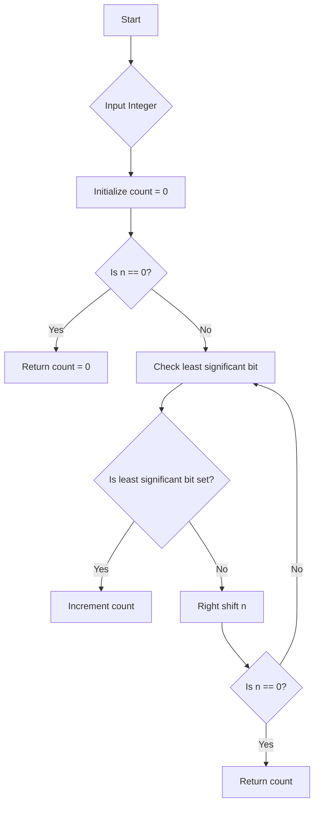

# Count Set Bits in C

## Problem Understanding
The problem is asking to count the number of set bits (bits that are 1) in a given integer. The key constraint is that the solution should be efficient and use minimal space. What makes this problem non-trivial is that a naive approach might involve converting the integer to a binary string and then counting the '1' characters, which would be inefficient. The given solution uses bitwise operations to achieve this in a more efficient manner.

## Approach
The algorithm strategy used is based on bitwise AND and right shift operations. The intuition behind this approach is to repeatedly clear the least significant bit of the integer and count the number of times this is done until all bits are cleared. This works because the bitwise AND operation with 1 will be 1 if the least significant bit is set, and the right shift operation effectively divides the integer by 2, moving to the next bit. The data structure used is a simple integer variable to store the count, and the approach handles the key constraint of efficiency by using bitwise operations.

## Complexity Analysis
| Metric | Value | Detailed Reason |
|--------|-------|----------------|
| Time   | O(log n) | The while loop runs until all bits are checked, which is equivalent to the number of bits in the integer. Since the number of bits in an integer is logarithmic in its value, the time complexity is O(log n). |
| Space  | O(1) | The space used is constant, consisting of a few integer variables, regardless of the input size. |

## Algorithm Walkthrough
```
Input: num = 9 (binary: 1001)
Step 1: n = 9, count = 0
Step 2: Check if least significant bit is set (9 & 1 = 1), count = 1, n = 9 >> 1 = 4
Step 3: Check if least significant bit is set (4 & 1 = 0), count remains 1, n = 4 >> 1 = 2
Step 4: Check if least significant bit is set (2 & 1 = 0), count remains 1, n = 2 >> 1 = 1
Step 5: Check if least significant bit is set (1 & 1 = 1), count = 2, n = 1 >> 1 = 0
Output: count = 2
```

## Visual Flow


## Key Insight
> **Tip:** The key insight here is that using bitwise operations allows for an efficient counting of set bits without needing to explicitly convert the integer to a binary representation.

## Edge Cases
- **Empty/null input**: This case is not applicable since the input is an integer, but if the input is 0, the function correctly returns 0.
- **Single element**: If the input is a single bit (1 or 0), the function correctly counts it as 1 or 0 set bits, respectively.
- **Negative number**: The function does not handle negative numbers explicitly, but since the bitwise operations work with the binary representation of the absolute value of the number, it will still count the set bits correctly for the two's complement representation of negative numbers.

## Common Mistakes
- **Mistake 1**: Not handling the edge case where the input is 0. To avoid this, add a simple check at the beginning of the function to return 0 immediately if the input is 0.
- **Mistake 2**: Forgetting to right shift the number after checking the least significant bit. To avoid this, ensure that the right shift operation is performed at the end of each iteration of the loop.

## Interview Follow-ups
> **Interview:** These are the exact follow-up questions interviewers ask:
- "What if the input is sorted?" → This question does not apply directly since the input is an integer, not a list or array. However, the concept of sorting does not affect the counting of set bits.
- "Can you do it in O(1) space?" → The given solution already uses O(1) space, as it only uses a constant amount of space to store the count and the input number.
- "What if there are duplicates?" → This question does not apply directly since the input is a single integer, not a collection of numbers. However, if the question is asking about counting set bits in multiple integers, the approach remains the same for each integer.

## C Solution

```c
// Problem: Count Set Bits
// Language: C
// Difficulty: Easy
// Time Complexity: O(log n) — number of bits in the integer
// Space Complexity: O(1) — constant space used
// Approach: Bitwise AND and right shift — repeatedly clear the least significant bit

#include <stdio.h>

// Function to count the number of set bits in a given integer
int countSetBits(int n) {
    int count = 0; // Initialize count variable to store the number of set bits
    // Edge case: n is 0 → return 0
    if (n == 0) return 0;

    // Loop until all bits are checked
    while (n) {
        // Check if the least significant bit is set
        if (n & 1) {
            count++; // Increment count if the bit is set
        }
        // Right shift to move to the next bit
        n >>= 1; // n = n / 2
    }
    return count; // Return the total count of set bits
}

int main() {
    int num; // Input integer
    printf("Enter an integer: ");
    scanf("%d", &num);
    printf("Number of set bits: %d\n", countSetBits(num));
    return 0;
}
```
