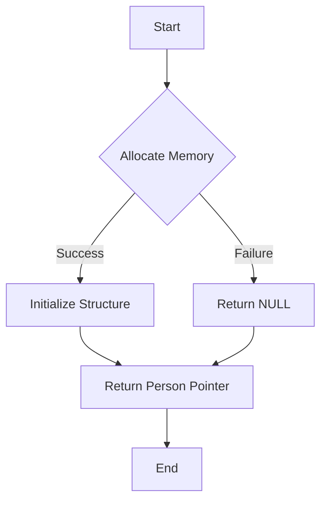

# Create and Initialize a Basic Structure

## Problem Understanding
The problem asks to create and initialize a basic structure in C, which involves defining a simple structure and implementing a function to allocate memory for it and initialize its fields. The key constraint is to handle memory allocation failures and ensure proper memory deallocation. This problem is non-trivial because it requires understanding of memory management in C, including allocation, deallocation, and error handling. The naive approach of simply defining the structure and assigning values without considering memory allocation and deallocation would lead to memory leaks and potential crashes.

## Approach
The algorithm strategy involves defining a `Person` structure with fields for `id`, `name`, and `age`, and implementing a `createPerson` function to allocate memory for this structure and initialize its fields. The function uses `malloc` to allocate memory and checks for allocation failures. It then uses `strcpy` to copy the `name` into the structure and assigns the `id` and `age` values directly. This approach works because it properly handles memory allocation and deallocation, ensuring that the program does not crash or leak memory. The `createPerson` function returns a pointer to the allocated `Person` structure, allowing the caller to access and manipulate the structure.

## Complexity Analysis
| Metric | Value | Detailed Reason |
|--------|-------|----------------|
| Time   | O(1)  | The time complexity is constant because the `createPerson` function performs a fixed number of operations, including memory allocation, field assignments, and error checking, regardless of the input values. |
| Space  | O(1)  | The space complexity is constant because the `createPerson` function allocates a fixed amount of memory for the `Person` structure, regardless of the input values. |

## Algorithm Walkthrough
```
Input: id = 1, name = "John Doe", age = 30
Step 1: Allocate memory for the Person structure using malloc
        person = (Person*) malloc(sizeof(Person))
Step 2: Check if memory allocation was successful
        if (person == NULL) { return NULL; }
Step 3: Initialize the Person structure
        person->id = 1
        strcpy(person->name, "John Doe")
        person->age = 30
Step 4: Return the pointer to the allocated Person structure
        return person
Output: person = { id = 1, name = "John Doe", age = 30 }
```
This walkthrough demonstrates the step-by-step process of creating and initializing a `Person` structure using the `createPerson` function.

## Visual Flow

This flowchart illustrates the decision flow of the `createPerson` function, including memory allocation, structure initialization, and error handling.

## Key Insight
> **Tip:** Always check the return value of `malloc` to handle memory allocation failures and ensure proper error handling.

## Edge Cases
- **Empty/null input**: If the input `name` is `NULL` or an empty string, the `strcpy` function will not crash, but the resulting `Person` structure will have an empty `name` field.
- **Single element**: If the input `id` or `age` is a single element, the `createPerson` function will still work correctly, as it only assigns the values to the corresponding fields.
- **Memory allocation failure**: If the `malloc` function fails to allocate memory, the `createPerson` function will return `NULL`, indicating an error.

## Common Mistakes
- **Mistake 1**: Forgetting to check the return value of `malloc` for memory allocation failures → Always check the return value of `malloc` and handle errors accordingly.
- **Mistake 2**: Not freeing the allocated memory after use → Always use `free` to deallocate memory when it is no longer needed to prevent memory leaks.

## Interview Follow-ups
> **Interview:** These are the exact follow-up questions interviewers ask:
- "What if the input is sorted?" → This question is not relevant to the `createPerson` function, as it only initializes a single `Person` structure.
- "Can you do it in O(1) space?" → The `createPerson` function already has a space complexity of O(1), as it only allocates a fixed amount of memory for the `Person` structure.
- "What if there are duplicates?" → This question is not relevant to the `createPerson` function, as it only creates a single `Person` structure and does not store or manage multiple structures.

## C Solution

```c
// Problem: Create and Initialize a Basic Structure
// Language: C
// Difficulty: Easy
// Time Complexity: O(1) — constant time to initialize the structure
// Space Complexity: O(1) — constant space to store the structure
// Approach: Basic structure initialization — define and initialize a simple structure

#include <stdio.h>
#include <stdlib.h>

// Define a basic structure
typedef struct {
    int id;  // Unique identifier
    char name[100];  // Name of the person
    int age;  // Age of the person
} Person;

// Function to create and initialize a new Person structure
Person* createPerson(int id, const char* name, int age) {
    // Allocate memory for the new Person structure
    Person* person = (Person*) malloc(sizeof(Person));
    
    // Check if the memory allocation was successful
    if (person == NULL) {
        // Edge case: Memory allocation failed → return NULL
        return NULL;
    }
    
    // Initialize the Person structure
    person->id = id;  // Set the unique identifier
    strcpy(person->name, name);  // Copy the name into the structure
    person->age = age;  // Set the age
    
    return person;
}

int main() {
    // Create and initialize a new Person structure
    Person* person = createPerson(1, "John Doe", 30);
    
    // Check if the Person structure was created successfully
    if (person != NULL) {
        // Print the details of the Person structure
        printf("ID: %d\n", person->id);
        printf("Name: %s\n", person->name);
        printf("Age: %d\n", person->age);
        
        // Free the allocated memory
        free(person);
    } else {
        // Edge case: Memory allocation failed → print an error message
        printf("Error: Memory allocation failed.\n");
    }
    
    return 0;
}
```
