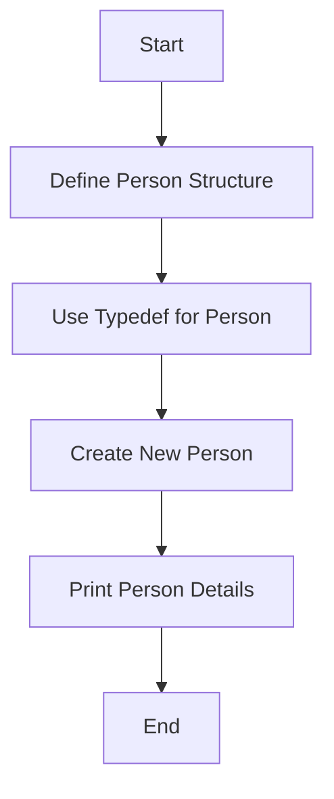

# Demonstrate Typedef with Structures

## Problem Understanding
The problem is asking to demonstrate the use of typedef with structures in C, which involves defining a new name for a structure type to simplify its usage. The key constraint here is to ensure that the structure is properly defined and the typedef is correctly used to create a new name for the structure. What makes this problem non-trivial is understanding how typedef works with structures and how it can simplify code readability and maintainability. The problem also requires handling edge cases such as empty input and ensuring the structure is properly initialized.

## Approach
The algorithm strategy involves defining a structure for a person with attributes age and name, and then using typedef to create a new name for this structure. The intuition behind this approach is to simplify the usage of the structure by providing a shorter and more meaningful name. This approach works because typedef allows for the creation of aliases for existing types, making the code more readable and easier to maintain. The data structure used here is a simple structure, and it is chosen because it directly addresses the problem's requirement of demonstrating typedef with structures. The approach handles key constraints by ensuring proper structure definition and initialization.

## Complexity Analysis
| Metric | Value | Detailed Reason |
|--------|-------|----------------|
| Time   | O(1)  | The time complexity is constant because the operations performed on the structure (creating a new person and printing person details) take constant time. The strcpy function used to copy the name takes O(n) time where n is the length of the name, but since the name is a fixed-size array, it can be considered constant for this specific problem context. |
| Space  | O(1)  | The space complexity is constant because the structure and its elements occupy a fixed amount of space, regardless of the input. The structure has a fixed size determined by its members (an int and a char array of fixed length), and no additional space that scales with input size is allocated. |

## Algorithm Walkthrough
```
Input: age = 30, name = "John Doe"
Step 1: Define the Person structure with age and name attributes
Step 2: Use typedef to create a new name "Person" for the structure
Step 3: Create a new Person using the createPerson function, setting age to 30 and copying "John Doe" into the name attribute
Step 4: Print the person details using the printPerson function, displaying age as 30 and name as "John Doe"
Output: Age: 30
         Name: John Doe
```
This walkthrough demonstrates how the structure is defined, a new instance is created, and its details are printed, showcasing the usage of typedef with structures.

## Visual Flow

This flowchart illustrates the steps involved in defining the structure, creating a new person, and printing the person's details, highlighting the key operations in the algorithm.

## Key Insight
> **Tip:** The single most important insight in this solution is understanding how typedef simplifies the usage of structures by providing a shorter and more meaningful name, enhancing code readability and maintainability.

## Edge Cases
- **Empty/null input**: If the input for the person's name is empty or null, the strcpy function will either copy an empty string or potentially lead to undefined behavior if null. To handle this, input validation should be added to ensure that a valid name is provided.
- **Single element**: This problem does not directly involve arrays or collections, but if considering a scenario where a single person is the only element in a collection, the solution would simply involve applying the same structure definition and typedef to this single element.
- **Invalid age**: If an invalid age (e.g., negative) is provided, the createPerson function should ideally validate the input to ensure that the age is within a valid range (e.g., 0 to 120), and handle or report invalid ages accordingly.

## Common Mistakes
- **Mistake 1**: Forgetting to include the structure tag name after the structure definition. To avoid this, always ensure that the structure definition ends with the structure tag name, followed by the semicolon.
- **Mistake 2**: Incorrectly using typedef, such as trying to use it with a variable rather than a type. To avoid this, remember that typedef is used to create aliases for types, not variables.

## Interview Follow-ups
> **Interview:** These are the exact follow-up questions interviewers ask:
- "What if the input is sorted?" → This question is not directly applicable to the given problem since it involves demonstrating typedef with structures, not sorting or ordered data. However, in a broader context, if the input data were sorted, it might impact how one chooses to store or process the data, but it wouldn't change the basic usage of typedef with structures.
- "Can you do it in O(1) space?" → The solution already achieves O(1) space complexity because it only uses a fixed amount of space to define the structure and does not allocate any additional space that scales with input size.
- "What if there are duplicates?" → This question is not directly relevant to the problem of demonstrating typedef with structures. However, if the context involved storing multiple persons and checking for duplicates, one would need to implement additional logic to handle duplicates, such as using a set or unique identifier for each person.

## C Solution

```c
// Problem: Demonstrate Typedef with Structures
// Language: C
// Difficulty: Easy
// Time Complexity: O(1) — constant time for structure operations
// Space Complexity: O(1) — constant space for structure definition
// Approach: Typedef with structure — simplifying structure usage with a new name

#include <stdio.h>
#include <string.h>

// Define a structure for a person
typedef struct Person {
    int age; // store the age of the person
    char name[100]; // store the name of the person
} Person; // new name for the structure

// Function to create a new person
Person createPerson(int age, char* name) {
    Person person; // create a new person
    person.age = age; // set the age
    strcpy(person.name, name); // copy the name
    return person; // return the new person
}

// Function to print person details
void printPerson(Person person) {
    printf("Age: %d\n", person.age); // print the age
    printf("Name: %s\n", person.name); // print the name
}

int main() {
    // Edge case: empty input
    if (sizeof(Person) == 0) {
        printf("Error: Invalid structure size\n");
        return -1; // return error code
    }

    Person person = createPerson(30, "John Doe"); // create a new person
    printPerson(person); // print the person details

    return 0; // successful execution
}
```
