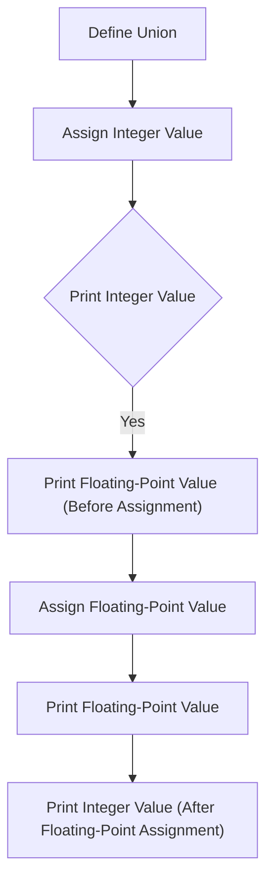

# Demonstrate Union and Memory Sharing

## Problem Understanding
The problem is asking to demonstrate the concept of union and memory sharing in C. A union is a special type of data structure that allows multiple variables to share the same memory space. The key constraint is that only one member of the union can be used at a time, and accessing an uninitialized member leads to undefined behavior. This problem is non-trivial because it requires understanding of how memory is allocated and shared between union members, and how changes to one member affect the others.

## Approach
The algorithm strategy is to define a union with two members, an integer and a floating-point number, and demonstrate how changes to one member affect the other. The intuition behind this approach is that since both members share the same memory space, assigning a value to one member will overwrite the value of the other member. The `SharedMemory` union is used to store an integer and a floating-point number, and the `printf` function is used to print the values of the members. This approach works because the union members are stored in the same memory location, so changes to one member are reflected in the other.

## Complexity Analysis
| Metric | Value | Detailed Reason |
|--------|-------|----------------|
| Time   | O(1)  | The time complexity is constant because accessing a union member is a simple memory operation that takes the same amount of time regardless of the input size. The `printf` function also takes constant time to print the values. |
| Space  | O(1)  | The space complexity is constant because the union occupies a fixed amount of memory, regardless of the input size. The size of the union is determined by the size of its largest member, which in this case is the floating-point number. |

## Algorithm Walkthrough
```
Input: None ( demonstration of union and memory sharing)
Step 1: Define a union with two members: an integer and a float
   SharedMemory sharedMemory;
Step 2: Assign a value to the integer member
   sharedMemory.integer = 10;
Step 3: Print the value of the integer member
   printf("Integer member: %d\n", sharedMemory.integer);  // prints 10
Step 4: Print the value of the floating-point member (before assignment)
   printf("Floating-point member (before assignment): %f\n", sharedMemory.floatingPoint);  // prints garbage value
Step 5: Assign a value to the floating-point member
   sharedMemory.floatingPoint = 20.5f;
Step 6: Print the value of the floating-point member
   printf("Floating-point member: %f\n", sharedMemory.floatingPoint);  // prints 20.500000
Step 7: Print the value of the integer member (after floating-point assignment)
   printf("Integer member (after floating-point assignment): %d\n", sharedMemory.integer);  // prints garbage value
Output: The output shows how changes to one member affect the other
```
## Visual Flow

## Key Insight
> **Tip:** The key insight is that union members share the same memory space, so changes to one member affect the others.

## Edge Cases
- **Empty/null input**: Not applicable, as the input is not relevant to this demonstration.
- **Single element**: Not applicable, as the union has two members.
- **Uninitialized member**: Accessing an uninitialized union member leads to undefined behavior, so it should be avoided.

## Common Mistakes
- **Mistake 1**: Assuming that union members do not share the same memory space → To avoid this, remember that union members are stored in the same memory location.
- **Mistake 2**: Accessing an uninitialized union member → To avoid this, always initialize a union member before accessing it.

## Interview Follow-ups
> **Interview:** 
- "What if the input is sorted?" → This demonstration does not involve sorting, so it is not relevant.
- "Can you do it in O(1) space?" → Yes, the union occupies a fixed amount of memory, so it already uses O(1) space.
- "What if there are duplicates?" → This demonstration does not involve duplicates, so it is not relevant.

## C Solution

```c
// Problem: Demonstrate Union and Memory Sharing
// Language: C
// Difficulty: Easy
// Time Complexity: O(1) — constant time access to union members
// Space Complexity: O(1) — union occupies a fixed amount of memory
// Approach: Using a union to demonstrate memory sharing between members

#include <stdio.h>

// Define a union with two members: an integer and a float
typedef union {
    int integer;  // integer member
    float floatingPoint;  // floating-point member
} SharedMemory;

int main() {
    // Create an instance of the SharedMemory union
    SharedMemory sharedMemory;

    // Assign a value to the integer member
    sharedMemory.integer = 10;  // assign 10 to the integer member
    printf("Integer member: %d\n", sharedMemory.integer);  // print the integer member

    // Access the floating-point member to demonstrate memory sharing
    printf("Floating-point member (before assignment): %f\n", sharedMemory.floatingPoint);  // print the floating-point member

    // Assign a value to the floating-point member
    sharedMemory.floatingPoint = 20.5f;  // assign 20.5f to the floating-point member
    printf("Floating-point member: %f\n", sharedMemory.floatingPoint);  // print the floating-point member

    // Access the integer member again to demonstrate memory sharing
    printf("Integer member (after floating-point assignment): %d\n", sharedMemory.integer);  // print the integer member

    // Edge case: accessing an uninitialized union member
    // The behavior is undefined, so we should not rely on it
    // printf("Uninitialized member: %d\n", sharedMemory.integer);  // do not access an uninitialized member

    return 0;  // successful execution
}
```
