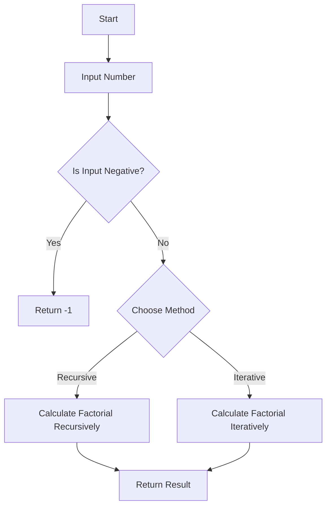

# Factorial Recursive and Iterative

## Problem Understanding
The problem asks for the calculation of the factorial of a given number using both recursive and iterative methods in the C programming language. A key constraint is that the input number should be non-negative, as factorial is not defined for negative numbers. The problem becomes non-trivial because naive approaches might not handle edge cases properly, such as negative inputs or large numbers that could cause integer overflow. Additionally, the choice between recursive and iterative methods involves considering the trade-offs between time and space complexity.

## Approach
The algorithm strategy involves two separate functions: one for calculating the factorial recursively and another for doing it iteratively. The recursive approach uses the mathematical definition of factorial, where n! = n * (n-1)!, with base cases for n = 0 or n = 1. The iterative method uses a loop to multiply all numbers from 1 to n. Both approaches handle the key constraint of non-negative inputs by returning an error value for negative inputs. The recursive function uses the call stack as its primary data structure, while the iterative function uses a simple loop variable, making the iterative method more space-efficient for large inputs.

## Complexity Analysis
| Metric | Value | Detailed Reason |
|--------|-------|----------------|
| Time   | O(n)  | Both the recursive and iterative methods have a time complexity of O(n) because they perform a constant amount of work for each number from 1 to n. In the recursive case, each function call performs a constant amount of work before making another recursive call, leading to n levels of recursion. In the iterative case, the loop runs from 1 to n, performing a constant amount of work in each iteration. |
| Space  | O(n)  | The recursive method has a space complexity of O(n) due to the recursive call stack, which can grow up to n levels deep for the input n. The iterative method has a space complexity of O(1) because it only uses a constant amount of space to store the result and the loop variable, regardless of the input size n. |

## Algorithm Walkthrough
```
Input: 5
Step 1 (Recursive): factorialRecursive(5) calls factorialRecursive(4)
Step 2 (Recursive): factorialRecursive(4) calls factorialRecursive(3)
Step 3 (Recursive): factorialRecursive(3) calls factorialRecursive(2)
Step 4 (Recursive): factorialRecursive(2) calls factorialRecursive(1)
Step 5 (Recursive): factorialRecursive(1) returns 1 (base case)
Step 6 (Recursive): factorialRecursive(2) returns 2 * 1 = 2
Step 7 (Recursive): factorialRecursive(3) returns 3 * 2 = 6
Step 8 (Recursive): factorialRecursive(4) returns 4 * 6 = 24
Step 9 (Recursive): factorialRecursive(5) returns 5 * 24 = 120

Input: 5
Step 1 (Iterative): result = 1, i = 1
Step 2 (Iterative): result = 1 * 1 = 1, i = 2
Step 3 (Iterative): result = 1 * 2 = 2, i = 3
Step 4 (Iterative): result = 2 * 3 = 6, i = 4
Step 5 (Iterative): result = 6 * 4 = 24, i = 5
Step 6 (Iterative): result = 24 * 5 = 120, i = 6 (loop ends)
Output (Both): 120
```

## Visual Flow


## Key Insight
> **Tip:** The key to efficiently calculating factorials lies in choosing the right method based on the input size and available resources, considering that recursive methods can be intuitive but may lead to stack overflow for large inputs, while iterative methods are generally more space-efficient.

## Edge Cases
- **Empty/null input**: This scenario is not directly applicable since the input is expected to be an integer. However, if the input is not provided or is null, the program would not run as expected and might crash or produce undefined behavior.
- **Single element**: For an input of 0 or 1, both the recursive and iterative methods correctly return 1, as these are the base cases for the factorial function.
- **Negative input**: Both methods correctly handle negative inputs by returning -1, as factorial is not defined for negative numbers.

## Common Mistakes
- **Mistake 1**: Not handling the base case correctly in the recursive method. To avoid this, ensure that the base case (n = 0 or n = 1) is explicitly handled to return 1.
- **Mistake 2**: Not checking for negative inputs. To avoid this, always include a check at the beginning of both the recursive and iterative functions to return an error value (-1 in this case) for negative inputs.

## Interview Follow-ups
> **Interview:** These are the exact follow-up questions interviewers ask:
- "What if the input is sorted?" → This question does not apply directly to the factorial problem since the input is a single number, not a list or array. However, if the question is about the efficiency of calculating factorials for a range of numbers, sorting the input does not affect the calculation of factorials.
- "Can you do it in O(1) space?" → No, achieving O(1) space complexity is not possible with the recursive method due to the recursive call stack. However, the iterative method already achieves O(1) space complexity because it only uses a constant amount of space.
- "What if there are duplicates?" → This question does not apply to the factorial problem as it is defined for a single non-negative integer. If the question is about handling duplicate inputs in a different context, it would depend on the specific requirements of that context.

## C Solution

```c
// Problem: Factorial Recursive and Iterative
// Language: C
// Difficulty: Easy
// Time Complexity: O(n) — recursive function calls and iterative loop
// Space Complexity: O(n) — recursive call stack and iterative variables
// Approach: Recursive and iterative methods — calculate factorial using both methods

#include <stdio.h>
#include <stdlib.h>

// Function to calculate factorial recursively
long long factorialRecursive(int n) {
    // Base case: factorial of 0 or 1 is 1
    if (n == 0 || n == 1) return 1; 
    // Recursive case: n! = n * (n-1)!
    else if (n > 1) return n * factorialRecursive(n-1); 
    // Edge case: negative input → return -1
    else return -1; 
}

// Function to calculate factorial iteratively
long long factorialIterative(int n) {
    long long result = 1; // Initialize result to 1
    // Edge case: negative input → return -1
    if (n < 0) return -1; 
    // Iterate from 1 to n to calculate factorial
    for (int i = 1; i <= n; i++) { 
        result *= i; // Update result in each iteration
    }
    return result; // Return the final result
}

int main() {
    int num; // Input number
    printf("Enter a number: "); 
    scanf("%d", &num); // Get user input

    long long recursiveResult = factorialRecursive(num); // Calculate factorial recursively
    long long iterativeResult = factorialIterative(num); // Calculate factorial iteratively

    // Print the results
    printf("Factorial (Recursive): %lld\n", recursiveResult); 
    printf("Factorial (Iterative): %lld\n", iterativeResult);

    return 0; // Successful execution
}
```
