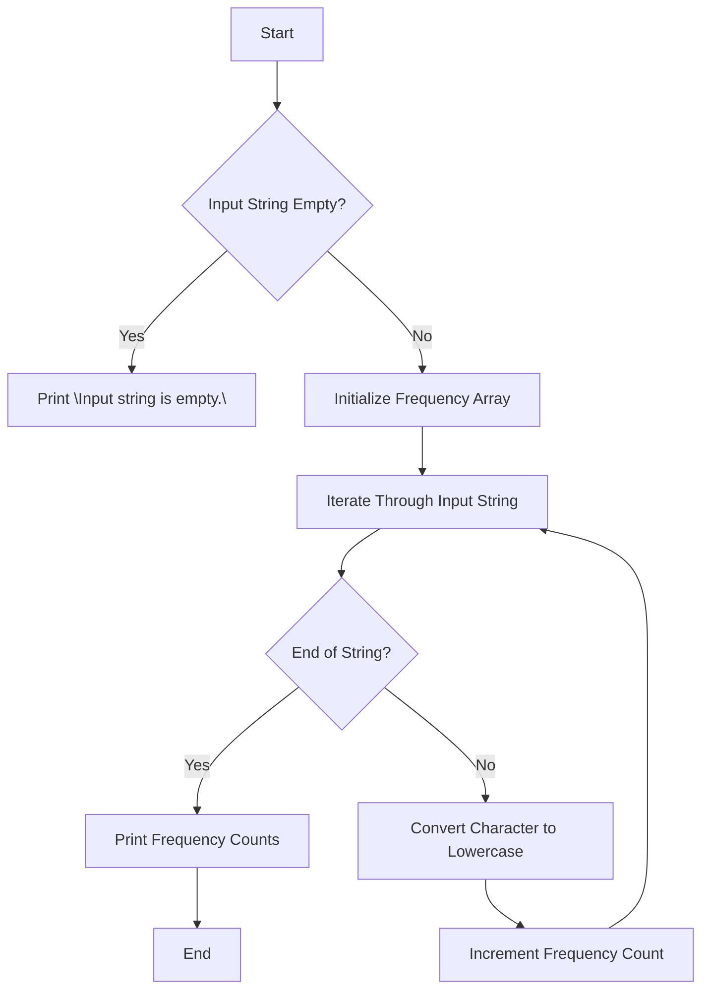

# Find Frequency of Characters in a String

## Problem Understanding
The problem asks us to find the frequency of each character in a given string. The key constraint is that we need to handle all possible ASCII characters, which means we have to consider 256 unique characters. This problem is non-trivial because a naive approach might involve sorting the string first and then counting the frequency of each character, which would result in a time complexity of O(n log n) due to the sorting step. However, we can solve this problem more efficiently by using a frequency array to count the occurrences of each character in a single pass.

## Approach
Our algorithm strategy is to use an iterative frequency counting approach. We initialize a frequency array of size 256 to store the count of each ASCII character. We then iterate through the input string, and for each character, we increment its corresponding frequency count in the array. To ensure uniform counting, we convert each character to lowercase before incrementing its frequency count. This approach works because it allows us to count the frequency of each character in a single pass through the string. We use a frequency array to store the counts, which has a constant size of 256, assuming ASCII characters.

## Complexity Analysis
| Metric | Value | Detailed Reason |
|--------|-------|----------------|
| Time   | O(n)  | We make a single pass through the input string to count the frequency of each character, where n is the length of the string. The subsequent pass to print the frequency counts is also O(n), but since n is the length of the string and the frequency array has a constant size, the overall time complexity remains O(n). |
| Space  | O(1)  | We use a frequency array of size 256 to store the count of each ASCII character. Since this size is constant and does not grow with the input size, the space complexity is O(1). |

## Algorithm Walkthrough
```
Input: "Hello, World!"
Step 1: Initialize frequency array with all counts set to 0.
Step 2: Iterate through the input string:
    - For 'H', convert to lowercase 'h' and increment frequency count for 'h' (now 1).
    - For 'e', convert to lowercase 'e' and increment frequency count for 'e' (now 1).
    - For 'l', convert to lowercase 'l' and increment frequency count for 'l' (now 1).
    - For 'l', convert to lowercase 'l' and increment frequency count for 'l' (now 2).
    - For 'o', convert to lowercase 'o' and increment frequency count for 'o' (now 1).
    - For ',', increment frequency count for ',' (now 1).
    - For ' ', increment frequency count for ' ' (now 1).
    - For 'W', convert to lowercase 'w' and increment frequency count for 'w' (now 1).
    - For 'o', convert to lowercase 'o' and increment frequency count for 'o' (now 2).
    - For 'r', convert to lowercase 'r' and increment frequency count for 'r' (now 1).
    - For 'l', convert to lowercase 'l' and increment frequency count for 'l' (now 3).
    - For 'd', convert to lowercase 'd' and increment frequency count for 'd' (now 1).
    - For '!', increment frequency count for '!' (now 1).
Step 3: Print frequency counts for characters with non-zero counts:
    - 'h' has a frequency of 1.
    - 'e' has a frequency of 1.
    - 'l' has a frequency of 3.
    - 'o' has a frequency of 2.
    - ',' has a frequency of 1.
    - ' ' has a frequency of 1.
    - 'w' has a frequency of 1.
    - 'r' has a frequency of 1.
    - 'd' has a frequency of 1.
    - '!' has a frequency of 1.
Output: Frequency counts for each character in the input string.
```

## Visual Flow


## Key Insight
> **Tip:** The key insight to solving this problem efficiently is to use a frequency array to count the occurrences of each character in a single pass through the input string, taking advantage of the constant size of the ASCII character set.

## Edge Cases
- **Empty/null input**: If the input string is empty or null, the function prints "Input string is empty." and returns without attempting to count frequencies.
- **Single element**: If the input string contains only one character, the function correctly counts the frequency of that character as 1 and prints the result.
- **String with only spaces**: If the input string contains only spaces, the function correctly counts the frequency of the space character and prints the result.

## Common Mistakes
- **Mistake 1**: Forgetting to initialize the frequency array with all counts set to 0, which would result in incorrect frequency counts.
- **Mistake 2**: Not converting characters to lowercase before incrementing their frequency counts, which would treat uppercase and lowercase characters as distinct.

## Interview Follow-ups
> **Interview:** These are the exact follow-up questions interviewers ask:
- "What if the input is sorted?" → The algorithm's time complexity remains O(n) because we still need to iterate through the entire string to count the frequencies.
- "Can you do it in O(1) space?" → No, because we need to use a frequency array of size 256 to store the counts of ASCII characters, which requires O(1) space.
- "What if there are duplicates?" → The algorithm correctly handles duplicates by incrementing the frequency count for each character as it appears in the input string.

## C Solution

```c
// Problem: Find Frequency of Characters in a String
// Language: C
// Difficulty: Easy
// Time Complexity: O(n) — single pass through string to count frequencies
// Space Complexity: O(1) — assuming ASCII characters, frequency array size is constant
// Approach: Iterative frequency counting — for each character, increment its corresponding frequency count

#include <stdio.h>
#include <string.h>
#include <ctype.h>

// Function to find frequency of characters in a string
void findFrequency(char *str) {
    // Edge case: empty input → return
    if (str == NULL || strlen(str) == 0) {
        printf("Input string is empty.\n");
        return;
    }

    int frequency[256] = {0}; // Initialize frequency array for ASCII characters
    int length = strlen(str);

    // Count frequency of each character in the string
    for (int i = 0; i < length; i++) {
        // Convert character to lowercase for uniform counting
        char lowerCaseChar = tolower(str[i]);
        // Increment frequency count for the character
        frequency[lowerCaseChar]++;
    }

    // Print frequency of each character
    for (int i = 0; i < 256; i++) {
        // Check if character has a non-zero frequency count
        if (frequency[i] > 0) {
            printf("Character '%c' has a frequency of %d.\n", i, frequency[i]);
        }
    }
}

int main() {
    char str[] = "Hello, World!";
    findFrequency(str);
    return 0;
}
```
